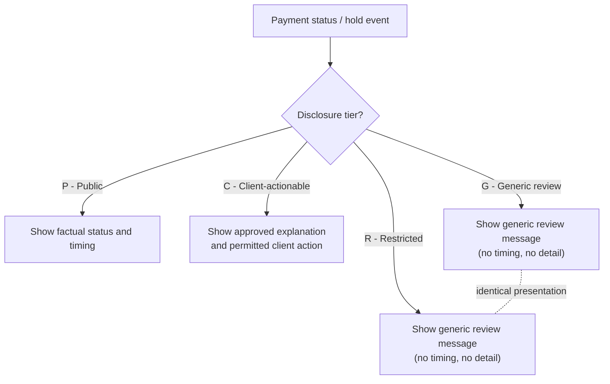

## Why this policy exists

POL-FCC-014 is the single controlling policy for *what may ever be
communicated to a client* about the status of a payment, a hold placed on
that payment, or an exception affecting it — across every client-facing
channel at Crestline National Bank (CNB). It is not a UX style guide; it is a
financial-crimes compliance control. Its purpose is to prevent three
categories of harm:

1. **Disclosure that would reveal the existence of a Suspicious Activity
   Report (SAR)** or otherwise tip off a client to a fraud, AML, sanctions,
   or legal-process review.
2. **Disclosure that aids fraud or sanctions evasion** by differentiating,
   in any visible way, a sensitive review from a routine one.
3. **Misleading status language** — representations such as "Completed" or
   "Sent" that are not yet true of the underlying payment-rail event.

Version 3.2 is owned by Financial Crimes Compliance (FCC): Catherine Doyle
(EVP, Chief BSA/AML Officer) and co-owner Michael Tran (SVP, OFAC/Sanctions
Officer), with Jordan Ellis (VP, FCC Policy & Advisory) as policy contact. It
was approved by the Enterprise Policy Committee on 2026-02-12, is effective
2026-03-01, and is classified **INTERNAL – CONFIDENTIAL**. See
[Financial Crimes Compliance](../teams/financial-crimes-compliance.md) for
the owning team.

## Scope

The standard governs **every client-facing channel and artifact**, with no
carve-out for internal tooling that renders to a client:

- Crestline Business Online (web and mobile) — see
  [CBO Wire Center](../systems/cbo-wire-center.md), the primary wire-status
  surface this policy constrains.
- APIs and host-to-host status files.
- Notifications (email, SMS, push, in-app) — see the
  [ENS Notification API & TRS Event Catalog](../interfaces/ens-notification-api-trs-catalog.md),
  whose templates must be DRC-approved and must never carry a prohibited term
  or Restricted-tier hold detail.
- Commercial Service Center scripts.
- Relationship manager communications.
- Downloadable reports.
- Any content shared with a third party at the client's own request (Section
  5.4).

Any new or changed client-facing predictive/statistical statement is also in
scope and is constrained jointly with ADR-PAY-026's decision on analytics
serving — see [TDIP Insights API](../interfaces/tdip-insights-api.md) for the
one sanctioned serving layer such statements must come from.

## Regulatory and legal basis

This table is the controlling basis for every rule in the standard; each row
maps a source authority to the specific communication constraint it drives.

| Source | Relevance |
|---|---|
| 31 U.S.C. 5318(g)(2); 31 CFR 1020.320(e) | Confidentiality of Suspicious Activity Reports — no disclosure of a SAR or of information that would reveal its existence |
| 31 CFR Part 501 (incl. 501.603, 501.604) | OFAC blocking and reject reporting; sanctions outcomes communicated only per the Sanctions Operations Procedure |
| UCC Article 4A; Regulation J (12 CFR 210, Subpart B) | Acceptance, settlement finality and completion of funds transfers |
| FFIEC "Authentication and Access to Financial Institution Services and Systems" (2021) | Risk-based authentication for high-risk actions |
| Section 5 of the FTC Act (UDAP) | Representations to clients must not be unfair or deceptive |
| CNB Fair Representation Standard (FRS-02) | Accuracy of client-facing estimates and status language |

The SAR-confidentiality basis (row 1) and the OFAC basis (row 2) are what
make the disclosure-tier and prohibited-terms controls below non-negotiable
rather than discretionary UX choices; the UCC 4A/Reg J and FRS-02 basis (rows
3 and 6) are what gate the status-terminology table in Section 5.2 on
specific, auditable rail events rather than internal processing milestones.

## Disclosure tiers (Section 4)

The standard's central mechanism is a four-tier model that determines what a
client may ever see for a given payment, hold, or exception event:

| Tier | Name | Client may see | Examples |
|---|---|---|---|
| P | Public status | Factual processing status and timing | Scheduled for next business day (after cutoff) |
| C | Client-actionable | Approved explanation and permitted client action | Possible duplicate; limit exceeded; funds pending |
| G | Generic review | Generic "being reviewed" message only | Operations manual review |
| R | Restricted | Generic "being reviewed" message only — identical to tier G | Fraud, account takeover, sanctions, AML, legal holds |

The defining invariant is that **tier R is deliberately indistinguishable
from tier G** in every client-facing presentation — label, icon, color,
copy, actions, and absence of timing information must all match, so a
client cannot infer from UI behavior alone that a payment is under a
fraud, sanctions, AML, or legal-hold review rather than a routine
operations review (Section 5.1(2)). The full HRC-to-tier mapping that this
policy's Appendix A defines is cross-referenced and merged with the Hold
Management Service's hold-reason taxonomy in
[Hold Reason Taxonomy (HRC) and Disclosure Tiers](../concepts/hold-reason-taxonomy-disclosure-tiers.md).

*Disclosure-tier routing: tiers G and R intentionally render as the same indistinguishable client message.*

## Requirements (Section 5)

### 5.1 Holds

1. Restricted (R) reasons, hold codes, scores, list names, match details,
   analyst notes, or queue names must never be displayed, transmitted, or
   implied in any client-facing channel.
2. **Indistinguishability**: tier R and tier G holds must be presented
   identically — same label, icon, color, copy, actions, and absence of
   timing information — so a client cannot infer the nature of a review from
   the presentation.
3. No estimated release time, likelihood of release, or "next steps" timing
   may be shown for tier G or R holds (CTRL-PAY-040).
4. Client actions on holds are permitted only where Appendix A allows, using
   step-up authentication of an entitled user.
5. Callback verification (HRC-02) cannot be satisfied by any confirmation
   inside the channel that initiated the payment (CTRL-PAY-018). The channel
   may display that a callback is pending and allow the client to request a
   callback.
6. Sanctions blocks/rejects are communicated only by Sanctions Operations per
   procedure; channels show only the tier G/R presentation.

These hold rules are the ones constraining
[ADR-PAY-021](../decisions/adr-pay-021.md)'s decision that hold reason codes,
descriptions, scores, and analyst notes must stay inside the financial-crimes
trust boundary (HMS/PRSP) and never reach PPH v2, channels, or data
platforms — Section 5.1(1) is the client-communication-layer expression of
the same confidentiality boundary ADR-PAY-021 enforces at the system-interface
layer. See [Hold Management Service](../systems/hold-management-service.md)
for the system that originates hold state and HRC codes.

### 5.2 Status terminology

Status words are gated on concrete, auditable payment-rail events — never on
internal processing milestones such as release or network transmission
alone:

| Term | Permitted only when | Not permitted |
|---|---|---|
| Sent / In transit | Released and transmitted to the payment network | Before network transmission |
| Delivered to beneficiary's bank (domestic) | Fedwire acceptance received (pacs.002 with OMAD) | At release or transmission |
| Completed / Settled | Domestic: Fedwire acceptance received. International: gpi ACCC received from the beneficiary bank | On release, transmission, Swift network ACK or ACSP statuses |
| Credited to beneficiary | gpi ACCC received | Domestic Fedwire (beneficiary credit is not reported); any non-ACCC status |
| Tracking unavailable beyond [bank] | Last gpi status ACSP/G001 | Showing "in transit" with estimates after G001 |
| Returned + reason | Return received; ISO reason from returning bank may be shown (e.g., AC04 Account closed) | Returns initiated by CNB for financial-crimes reasons (show "Returned" only) |

This table is the controlling rule against which
[Settlement, Release, and "Completed" Semantics](../concepts/settlement-release-completed-semantics.md)
and the resulting open complaint
[CMP-2026-1189](../incidents/cmp-2026-1189.md) must be evaluated: CBO's
historical practice of mapping the label "Completed" onto the undifferentiated
`PROCESSED` status (covering PPH's `RELEASED`, `SENT_TO_NETWORK`, and
`NETWORK_ACCEPTED` internal states alike) does not satisfy this gate, because
none of those states is Fedwire acceptance or gpi ACCC. Any channel deriving
"Completed"/"Settled" from a v1 PPH status feed that collapses these states
into one value cannot comply with Section 5.2 without an upstream signal that
distinguishes network acceptance and gpi ACCC specifically.

### 5.3 International (gpi) data

For the client's own payments, channels may display agent names, countries,
timestamps, and deducted charges reported via SWIFT gpi. Where tracking ends
at a non-gpi agent, the presentation must state that tracking is unavailable
beyond that point.

### 5.4 Sharing with third parties

Status shared with a beneficiary or other third party at the client's
request is limited to: amount, currency, value date, status milestones, and
a reference (`cboRef` or UETR). It must exclude account numbers, fees, the
originator's internal references, and any hold information. Links must
expire within 7 days, must be enabled by a client administrator, and require
InfoSec (SEC-STD-22) and Privacy approval of the design.

### 5.5 Predictive and insight statements

Client-facing insights (for example, typical completion times or estimated
delivery) must:

- use only the requesting client's own data, or aggregated cohorts meeting
  DUS-07 Section 5;
- be registered with Model Risk Management where MRM-POL-02 applies;
- carry a DRC-approved disclaimer;
- never be shown for payments in tier G or R hold.

This is the policy-of-record constraint that any TDIP-served insight design
must satisfy: [TDIP Insights API](../interfaces/tdip-insights-api.md) is the
only sanctioned serving layer for such statements per ADR-PAY-026, but
serving through TDIP does not by itself satisfy Section 5.5 — a design must
still confirm cohort-aggregation thresholds against DUS-07, MRM
classification where applicable, a DRC-approved disclaimer, and suppression
for any payment currently in a tier G or R hold.

## Approvals (Section 6)

New or changed client-facing status, hold, or exception experiences require
FCC Policy & Advisory review **before build commitment** and Disclosure
Review Committee (DRC) approval of final copy. Exceptions require Chief
BSA/AML Officer approval. This approval gate applies equally to CBO Wire
Center UI changes, new or modified ENS notification templates, and any new
TDIP-served client insight.

## Appendix A — Hold code mapping

Appendix A is the authoritative, binding mapping from internal Hold/Review
Codes (HRC) to disclosure tier, approved copy key, and permitted client
action. A channel or service must not derive hold presentation from any
other source.

| HRC | Mnemonic | Tier | Copy key | Client action permitted |
|---|---|---|---|---|
| HRC-01 | DUP_SUSPECT | C | COPY-HOLD-DUP-01 | Yes — digital attestation (confirm / cancel) with step-up auth (CTRL-PAY-031) |
| HRC-02 | CALLBACK_REQUIRED | C | COPY-HOLD-CB-01 | No in-channel confirmation. Client may request callback; verification only via callback to contact on file (CTRL-PAY-018) |
| HRC-03 | LIMIT_EXCEEDED | C | COPY-HOLD-LIM-01 | Client admin secondary approval or RM limit request |
| HRC-04 | CUTOFF_WAREHOUSED | P | COPY-STAT-WH-01 | None needed (informational) |
| HRC-05 | FUNDS_PENDING | C | COPY-HOLD-FUND-01 | Fund account; auto-retry until 5:30 p.m. ET |
| HRC-06 | REPAIR_REQUIRED | C | COPY-HOLD-RPR-01 | Cancel and resubmit with corrected beneficiary data (no in-place edit) |
| HRC-07 | FRAUD_MODEL_HIGH | R | COPY-HOLD-GEN-01 | None |
| HRC-08 | ATO_SUSPECT | R | COPY-HOLD-GEN-01 | None |
| HRC-09 | SANCTIONS_REVIEW | R | COPY-HOLD-GEN-01 | None |
| HRC-10 | AML_REVIEW | R | COPY-HOLD-GEN-01 | None |
| HRC-11 | LEGAL_HOLD | R | COPY-HOLD-GEN-01 | None |
| HRC-12 | OPS_MANUAL_REVIEW | G | COPY-HOLD-GEN-01 | None |

HRC-07 through HRC-11 (all tier R) and HRC-12 (tier G) share the identical
copy key `COPY-HOLD-GEN-01` with no client action — this is Appendix A's
concrete expression of the Section 5.1(2) indistinguishability rule: five
distinct financial-crimes review reasons render identically to one routine
operational review reason. Full mnemonic descriptions, hold-volume shares,
and median time-to-disposition figures are internal, Restricted-classified
detail owned by the Hold Management Service's design document and are
documented alongside this mapping (but never surfaced to clients) in
[Hold Reason Taxonomy (HRC) and Disclosure Tiers](../concepts/hold-reason-taxonomy-disclosure-tiers.md).

## Appendix B — Approved copy library (excerpt)

Only copy drawn from this DRC-approved library (or future additions approved
through the same Section 6 process) may be surfaced to clients for hold and
exception states.

| Copy key | Approved text |
|---|---|
| COPY-HOLD-GEN-01 | "This wire is being reviewed. No action is needed from you at this time. For questions, contact Treasury Support." |
| COPY-HOLD-DUP-01 | "This wire appears similar to another recent wire. Please confirm whether you intend to send both." |
| COPY-HOLD-CB-01 | "We will contact an authorized person at your company to verify this wire. You can request a call back." |
| COPY-HOLD-LIM-01 | "This wire exceeds a limit on your account. An administrator can approve it or contact your relationship manager." |
| COPY-HOLD-FUND-01 | "This wire is waiting for available funds. It will be retried until 5:30 p.m. ET." |
| COPY-HOLD-RPR-01 | "Additional beneficiary information is required. Please cancel and resubmit this wire with complete details." |
| COPY-STAT-WH-01 | "This wire is scheduled for the next business day." |

## Appendix C — Prohibited terms in client-facing copy

The standard maintains an explicit denylist of words that must never appear
in client-facing copy, regardless of channel, tier, or context, with one
narrow carve-out:

> fraud; suspicious; sanctions; OFAC; watch list; screening hit; AML;
> compliance review; investigation; flagged; security alert; risk score; law
> enforcement; blocked (except Sanctions Operations correspondence).

## What this policy constrains

POL-FCC-014 is a binding design constraint — not reference material — on
three concrete implementation surfaces, each of which must be checked
against it before build commitment:

- **[CBO Wire Center](../systems/cbo-wire-center.md)** — the Crestline
  Business Online module that renders wire status, hold state, and
  exceptions to clients. Any status label CBO shows (e.g., "Completed",
  "Sent", "Delivered") must satisfy the Section 5.2 terminology gate, and any
  hold UI must satisfy the Section 5.1 indistinguishability rule and
  Appendix A action mapping. CBO's current reliance on the legacy v1 PPH
  status API's undifferentiated `PROCESSED` value is the root cause of a
  known compliance gap; see
  [Settlement, Release, and "Completed" Semantics](../concepts/settlement-release-completed-semantics.md).
- **[ENS Notification API & TRS Event Catalog](../interfaces/ens-notification-api-trs-catalog.md)**
  templates — every TRS wire/ACH notification template (email, SMS, push,
  in-app) must pass Disclosure Review Committee review under this policy's
  Section 6 approval gate before onboarding, must draw hold copy only from
  Appendix B, and must never embed an Appendix C prohibited term or
  Restricted-tier hold detail.
- **[TDIP Insights API](../interfaces/tdip-insights-api.md)** and any other
  TDIP-served insight design — every client-facing predictive or statistical
  statement must independently satisfy Section 5.5 (client-data or
  DUS-07-compliant cohort, MRM-POL-02 classification where applicable,
  DRC-approved disclaimer, and suppression during tier G/R holds), in
  addition to ADR-PAY-026's requirement that it be computed and served only
  through TDIP.

## Related documents and governance

| Related document | Relevance |
|---|---|
| PRSP-HMS-3.4 | Hold Management Service design and HRC taxonomy that this policy's disclosure tiers and Appendix A are applied to |
| DUS-07 | Data-use and aggregation-threshold constraints referenced by Section 5.5 |
| MRM-POL-02 | Model Risk Management classification referenced by Section 5.5 |
| SEC-STD-22 | InfoSec design approval required for third-party sharing links under Section 5.4 |
| CTRL-PAY-018 / -031 / -040 | Controls for callback verification, step-up digital attestation, and the ban on release-time estimates for tier G/R holds, respectively |

New or changed client-facing status, hold, or exception experiences require
FCC Policy & Advisory review before build commitment and DRC approval of
final copy (Section 6); any deviation from this standard requires Chief
BSA/AML Officer approval as an exception, not an engineering judgment call.
