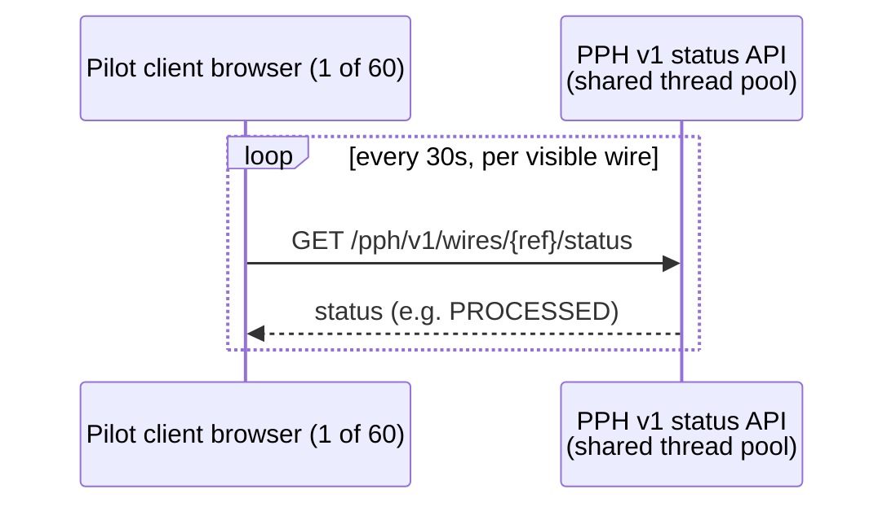

## Summary

CBO-3120 ("Wire Status Lite") was a 2024 pilot inside Crestline Business
Online (CBO) Wire Center that gave 60 pilot clients auto-refreshing wire
status in the browser. It ran from January to May 2024, targeted the
**PPH v1 synchronous status API** (`GET /pph/v1/wires/{ref}/status`) as its
only data source, and was shut down after it caused a production incident.
Per the Jira "WT-discovery" export (2026-10-05), the epic's current status is
**Closed (Won't Do)**, linked as "is caused by INC-2024-1182" and "documented
in PIR-2024-07." It is the direct ancestor of
[ADR-PAY-019](../decisions/adr-pay-019.md) and the
[CBO Status Projection Service](../systems/cbo-status-projection-service.md)
(SPS): the pilot's failure is the reason those two things exist.

| | |
|---|---|
| Epic | CBO-3120 |
| Owner | Tom Becker (EM, CBO Wire Center) |
| Pilot window | January–May 2024 |
| Pilot cohort | 60 CBO clients |
| Target system | SYS-PPH v1 status API (`GET /pph/v1/wires/{ref}/status`) |
| Points | 55 |
| Labels | `wire-center`, `pilot` |
| Final status | Closed (Won't Do), 2024-07-19 |
| Blocked by / caused by | [INC-2024-1182](../incidents/inc-2024-1182.md) |
| Documented in | [PIR-2024-07](../incidents/pir-2024-07.md) |

## Mechanism

Wire Status Lite's design was intentionally simple and entirely
client-driven: for every wire visible in a client's CBO session, the browser
polled the PPH v1 status endpoint on a fixed 30-second interval, with no
caching, no server-side throttle, and no client-side backoff under latency or
error conditions. PPH v1 is a shared, synchronous API also used by the
production wire-release path and other consumers (IVR, CRM), so pilot
polling traffic landed on the same thread pool as production traffic rather
than on an isolated or read-replica path.

This fixed-interval, no-backoff polling loop, multiplied across 60 clients
and however many wires each had open, is the mechanism that later combined
with month-end production load to exhaust PPH's thread pool (see
[Incident and termination](#incident-and-termination)).

## Status semantics exposed during the pilot

Because the pilot surfaced raw PPH v1 status values directly to clients, it
also became the first place client-facing confusion about wire status
terminology was observed and measured. The post-implementation review found:

- **37% of surveyed pilot users believed "Processed" meant the beneficiary
  had received the funds** — the `PROCESSED` value actually collapses several
  distinct internal lifecycle states (release, network transmission, network
  acknowledgment, end-of-day accounting close) into one label.
- Users valued three specific facts most: confirmation the wire had left
  CNB, the Fed reference (IMAD) for the beneficiary, and when international
  wires were actually credited.
- Users asked Treasury Support why wires were held, and Treasury Support
  could not answer without Financial Crimes Compliance (FCC) guidance — the
  pilot exposed hold status without a compliance-reviewed explanation path.

## Incident and termination

On **2024-05-31** (a month-end processing day), combined pilot polling
traffic and the normal, heavier month-end volume of production wire-release
status refreshes drove roughly **85 TPS** against the shared PPH v1 status
API. The API's thread pool saturated, and production wire-release processing
was delayed enterprise-wide for **47 minutes** while the backlog drained.
This is **[INC-2024-1182](../incidents/inc-2024-1182.md)**.

Quantified impact, per the post-implementation review ([PIR-2024-07](../incidents/pir-2024-07.md)):

| Measure | Value |
|---|---|
| Wires delayed | 1,240 |
| Wires released after the 6:00 p.m. ET Fedwire customer cutoff (value next day) | 312 |
| Clients compensated (interest claims) | 14 clients, $41,800 |
| Regulatory notification | Not required (no data exposure) |

The PIR identified three root causes, all attributable to the pilot's design
rather than to PPH itself:

1. **Polling architecture against a shared synchronous API with no
   client-side backoff** — fixed 30-second polling per visible wire did not
   slow down as the API degraded, so it added load exactly when the API
   needed less.
2. **No capacity test at month-end volumes** — the pilot was never validated
   against the higher wire-release traffic profile seen at month-end before
   being exposed to production.
3. **Status semantics were not validated with Compliance or Legal before
   exposure** — the client-facing confusion about "Processed" (above) was
   shipped without FCC or Legal review.

As a direct result, the pilot was **terminated** and the CBO-3120 epic was
**closed "Won't Do"** rather than resumed or patched. It was not re-launched
after the immediate rate-limit fix, because the PIR treated the unresolved
status-terminology and compliance gap as a blocking concern, not just the
thread-pool exhaustion.

## Outcomes and legacy

CBO-3120's termination produced a four-item action plan in PIR-2024-07,
three of which became durable architectural artifacts beyond the pilot
itself:

| Action | Owner | Outcome |
|---|---|---|
| Rate-limit PPH v1 status API to 20 TPS shared | PPH | Done 2024-06 — immediate guardrail |
| Adopt event-driven status pattern | Enterprise Architecture | Done 2024-06 — became [ADR-PAY-019](../decisions/adr-pay-019.md) |
| Build a reusable status projection service in CBO | CBO Platform | Delivered for ACH in 2025 as [CBO Status Projection Service](../systems/cbo-status-projection-service.md) (CBO-3815) |
| Validate client-facing status terminology with FCC and Legal before any future tracking feature | CBO Product | Open — carried forward, still unresolved as of the 2026-10-05 Jira export |

- **[ADR-PAY-019](../decisions/adr-pay-019.md)** forbids channel teams from
  polling PPH for status and instead requires consuming PPH lifecycle events
  into a channel-owned read model, with synchronous PPH calls permitted only
  as a throttled, user-initiated refresh. This decision exists because of
  CBO-3120's failure mode.
- **[CBO Status Projection Service](../systems/cbo-status-projection-service.md)**
  (SPS) is the reusable, event-driven replacement pattern the PIR called for:
  a Kafka consumer materializing a Postgres read model, served to channel
  BFFs over `/cbo/sps/v1`. It was first delivered for ACH (CBO-3815, 2025,
  consumed by the ACH Payment Tracker CBO-3790), not for wires. As of the
  2026-10-05 Jira export, Wire Center itself still has not adopted SPS and
  continues to read status synchronously from PPH v1 under ADR-PAY-019's
  throttled-refresh exception; migrating Wire Center off PPH v1 entirely is
  tracked separately as the unscheduled epic CBO-4471 ("Migrate Wire Center
  from PPH v1 to PPH v2 APIs"), ahead of the PPH v1 sunset on 2027-03-31.
- The fourth action — validating client-facing status terminology with FCC
  and Legal — remained open past the PIR and was still open as of the
  2026-10-05 Jira export. CBO later renamed the PPH v1 status value
  `PROCESSED` to the client label "Completed" (CBO-4402, R26.1, 2026-02)
  based on usability testing alone, without the FCC/Legal review this action
  called for. That gap is cited as a contributing factor in the later client
  complaint CMP-2026-1189, where an international wire shown "Completed" was
  subsequently returned/rejected by the beneficiary bank.

## Relationships

- **[INC-2024-1182](../incidents/inc-2024-1182.md)** — the production
  incident CBO-3120's polling design caused; both the Jira export and the
  PIR record this as the direct cause of the pilot's closure.
- **[PIR-2024-07](../incidents/pir-2024-07.md)** — the post-implementation
  review that documents the pilot's impact, root causes, and action plan,
  and formally closes out both the pilot and the incident.
- **[ADR-PAY-019](../decisions/adr-pay-019.md)** — the architecture decision
  (accepted 2024-06-11) produced from this PIR's "adopt event-driven status
  pattern" action; it prohibits the polling pattern CBO-3120 used, across all
  channels integrating with PPH.
- **[CBO Status Projection Service](../systems/cbo-status-projection-service.md)**
  — the reusable event-driven status pattern built in response to this
  pilot's failure, delivered for ACH and not yet extended to wires.

## Sources

- Jira export "WT-discovery" (2026-10-05): CBO-3120 epic record (Closed,
  Won't Do, 2024-Q2, 55 pts, Tom Becker) and the linked-records table noting
  INC-2024-1182 as "PPH v1 thread-pool exhaustion caused by Wire Status Lite
  polling (month-end)."
- PIR-2024-07 "Post-Implementation Review: Wire Status Lite Pilot and
  Incident INC-2024-1182" (v1.1, Final, 2024-07-15): summary, impact table,
  client-understanding findings, root causes, and actions.
