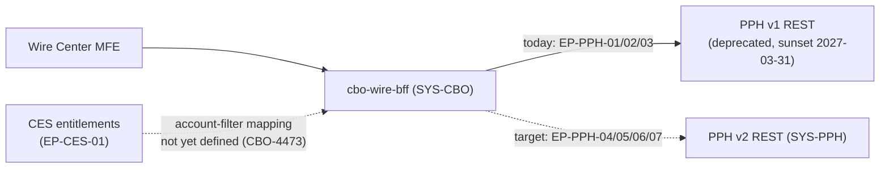
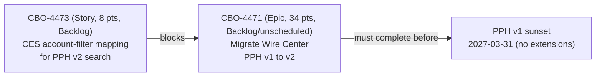

## Overview

**CBO-4471** ("Migrate Wire Center from PPH v1 to PPH v2 APIs") is an **Epic**
in the CBO Jira project, owned by **Tom Becker** (Engineering Manager, CBO
Wire Center squad), sized at **34 story points**, and currently **Backlog
(unscheduled)** — as of the 2026-10-05 Jira export it had not been placed
into either the PI 26.4 or the draft PI 27.1 program increment. It targets
two systems directly:

- **SYS-CBO** — specifically `cbo-wire-bff`, the backend-for-frontend behind
  [Crestline Business Online (CBO) Wire Center](../interfaces/pph-v1-wire-status-api.md),
  which is the component that must stop calling PPH v1 and start calling
  PPH v2.
- **SYS-PPH** — PRISM Payments Hub, the system whose v2 REST surface
  (`/pph/v2/payments...`, EP-PPH-04..07) becomes `cbo-wire-bff`'s new
  integration target in place of the deprecated v1 surface
  (`/pph/v1/wires...`, EP-PPH-01..03).

The epic is explicitly **blocked by CBO-4473** ("CES: account-filter mapping
for PPH v2 search (clientId + entitled accounts)," Story, 8 points, Backlog,
owner Arjun Mehta, CBO Platform & Entitlements) and carries a hard **deadline
of 2027-03-31**, the date [PPH v1 is sunset](../interfaces/pph-v1-wire-status-api.md)
with **no extensions** (confirmed by the Payments Architecture Review Board,
ARB, on 2026-09-08). Work on this epic is tracked jointly with
[PPH-2190: v1 Sunset Migration](pph-2190-v1-sunset-migration.md), the
cross-consumer epic (owner Kevin O'Brien, Payments Hub Engineering) that
governs the sunset schedule for *all* PPH v1 consumers, not just Wire
Center.

| Field | Value |
|---|---|
| Key | CBO-4471 |
| Type | Epic |
| Status | Backlog (unscheduled) |
| Points | 34 |
| Owner / assignee | Tom Becker (EM, CBO Wire Center squad) |
| Target systems | SYS-CBO (`cbo-wire-bff`), SYS-PPH |
| Blocked by | CBO-4473 (CES account-filter mapping, 8 pts, Backlog, owner Arjun Mehta) |
| Deadline | 2027-03-31 (PPH v1 sunset, no extensions per ARB 2026-09-08) |
| Tracked jointly with | PPH-2190 (PPH v1 sunset — consumer migration tracking) |
| Links (per Jira export) | "blocks nothing; depends on CES account-filter mapping (CBO-4473); tracked in PPH-2190" |
| Labels | `wire-center`, `tech-debt` |
| Last updated (export snapshot) | 2026-08-30 |

Source: [Jira export WT-discovery, 2026-10-05](repo://sources/estate/jira-export-wt-discovery-2026-10-05.md#L37-L38)
(issue list row) and
[issue detail](repo://sources/estate/jira-export-wt-discovery-2026-10-05.md#L107-L113).

## Scope

Per the epic description, the work is to **"replace `/pph/v1` calls in
`cbo-wire-bff` with `/pph/v2`."** The 34-point estimate, per owner Tom
Becker's 2026-08-30 ticket comment, assumes **reuse of the existing
list/detail UI** and **excludes any new tracking features** — this is a
like-for-like protocol migration, not a scope to add new capability (such as
milestone tracking, gpi visibility, or settlement timestamps) on top of the
version switch. CBO-4473 must land first.

[Epic comment, sizing assumptions](repo://sources/estate/jira-export-wt-discovery-2026-10-05.md#L111-L113)

`cbo-wire-bff` today calls three deprecated v1 endpoints that this epic must
replace with their v2 equivalents:

| Capability | v1 endpoint (today) | v2 endpoint (target) | Notable behavioral delta |
|---|---|---|---|
| Submit wire | `POST /pph/v1/wires` (EP-PPH-03) | `POST /pph/v2/payments` (EP-PPH-07) | v2 **requires** an `Idempotency-Key` header; v1 had no idempotency mechanism |
| List / search wires | `GET /pph/v1/wires?clientId&fromDate&toDate` (EP-PPH-02) | `GET /pph/v2/payments?clientId&rail&state&from&to&cursor` (EP-PPH-05) | v2 search has **no account-level filter** (same gap as v1) and **no beneficiary-name filter** (PPH-2251, backlog) |
| Single-wire status | `GET /pph/v1/wires/{wireRef}/status` (EP-PPH-01) | `GET /pph/v2/payments/{paymentId}` (EP-PPH-04) + optional `/history` (EP-PPH-06) | v2's `lifecycleState` replaces v1's coarse `status`; the v1 `PROCESSED` collapse (`RELEASED`/`SENT_TO_NETWORK`/`NETWORK_ACCEPTED`/`COMPLETED`) is resolved into distinct states |

See [PPH v1 Wire Status API](../interfaces/pph-v1-wire-status-api.md) and
[PPH v2 Payments API](../interfaces/pph-v2-payments-api.md) for full endpoint
documentation.

*Current-state (solid) versus target-state (dashed) call paths for `cbo-wire-bff`; the CES account-filter mapping that blocks the v2 path is unresolved.*

## Blocking dependency: CBO-4473 (CES account-filter mapping)

CBO-4471 cannot start because PPH v2 search (EP-PPH-05) and PPH v1 list
(EP-PPH-02) have **different filtering contracts**, and no mapping yet
exists to make v2's search behave like v1's for Wire Center's purposes:

| | PPH v1 list (EP-PPH-02) | PPH v2 search (EP-PPH-05) |
|---|---|---|
| Server-side account filter | None (max 500 rows, no cursor) | Filters by `clientId` only — not by account |
| How account-level entitlement filtering happens today | `cbo-wire-bff` filters client-side using [CES](../interfaces/ces-entitlements-api.md) entitlements (delivered as CBO-4302) | Not yet defined |

`cbo-wire-bff` currently fetches the full client wire list from v1 and then
filters it in-process to the calling user's entitled accounts, using
entitlement data from **EP-CES-01** (`GET /ces/v2/users/{id}/entitlements`).
Because v2 search is also `clientId`-scoped only (not account-scoped), this
client-side filtering pattern will still be needed after migration — but
**CBO-4473** is the undelivered story that defines how CES's per-user,
per-account entitlement data maps onto a `clientId`-scoped v2 search so that
account-level filtering continues to work correctly once `cbo-wire-bff` is
calling v2. Until CBO-4473 is designed and delivered, CBO-4471 has no
concrete starting point, which is why it remains in Backlog (unscheduled)
against a fixed, no-extensions sunset date.

[CBO-4473 issue detail](repo://sources/estate/jira-export-wt-discovery-2026-10-05.md#L38)

*Dependency chain from the CES account-filter mapping story to the fixed PPH v1 sunset date.*

## Relationship to PPH-2190 (cross-consumer sunset tracking)

[PPH-2190](pph-2190-v1-sunset-migration.md) is the PPH-project epic (owner
Kevin O'Brien, Payments Hub Engineering) that tracks migration status across
**all** PPH v1 consumers ahead of the 2027-03-31 sunset:

| v1 consumer | Owner | Migration status |
|---|---|---|
| IVR wire status | Contact Center Tech | Migrated (2026-05) |
| Service Center CRM | CRM Engineering | In progress (target 2026-12) |
| Wire Room console | Payment Operations Tech | Migrated to Investigations Workbench (2025) |
| `cbo-wire-bff` (Wire Center) | CBO Wire Center squad | **Not started** — tracked as CBO-4471 |

`cbo-wire-bff` is the **only remaining major v1 consumer that has not
started** migrating, as of the 2026-08-20 Wire Center architecture review and
the 2026-09-22 PPH-2190 status update. PPH-2190's owner Kevin O'Brien has
sent three reminders to the CBO Wire Center team (most recently 2026-09-22)
chasing the unstarted migration, reflecting that CBO-4471's unscheduled
status is a live escalation concern for Payments Hub Engineering, not a
dormant backlog item.

[PPH-2190 issue detail](repo://sources/estate/jira-export-wt-discovery-2026-10-05.md#L137-L141)

The driver behind the fixed 2027-03-31 date is technical, not purely
contractual: the **PPH v1 adapter is not supported on the vendor's Volaris
9.6 platform upgrade**, scheduled for April 2027. The ARB confirmed on
2026-09-08 that no extension beyond 2027-03-31 will be granted.

## Why this migration matters beyond protocol hygiene

Several open issues in the Wire Center backlog are directly tied to
limitations of PPH v1 that migrating to v2 would resolve or materially
improve, which is part of why CBO-4471 is tracked as `tech-debt` rather than
a purely mechanical API swap:

- **The `PROCESSED` status collapse.** PPH v1's `status` field collapses four
  distinct v2 `lifecycleState` values (`RELEASED`, `SENT_TO_NETWORK`,
  `NETWORK_ACCEPTED`, `COMPLETED`) into a single `PROCESSED` value. A 2024
  survey (from the Wire Status Lite pilot, CBO-3120) found 37% of users
  believed "Processed" meant the beneficiary had received funds, which is not
  guaranteed. CBO-4402 (Done, R26.1) relabeled the client-facing text from
  "Processed" to "Completed," but did not resolve the underlying ambiguity —
  it remains in effect until Wire Center reads `lifecycleState` from v2
  instead of `status` from v1.
- **CBO-4419 / CMP-2026-1189.** An open bug (Tom Becker, Backlog) records a
  client complaint in which an international wire was shown "Completed" and
  was later rejected by the beneficiary bank (ISO return reason `AC04`); the
  client had already released goods in reliance on that status. This is a
  live instance of the v1 status-fidelity gap that migration to v2's
  `lifecycleState` (and, if PPH-2207 ships, a future settlement object) is
  expected to help address — though PPH-2207 itself remains backlog with no
  sponsor, so v2 alone does not fully close this gap.
- **FCT-2004 (`holdReasonDesc` leak risk).** PPH v1's `holdReasonDesc` field
  syncs free-text Hold Management Service (HMS) content — which can include
  fraud/AML hold-reason-code mnemonics and analyst notes — directly to v1
  consumers; CBO-4388 (in progress) has begun surfacing this field as a
  client-visible tooltip. PPH v2's `hold` object exposes presence (`isHeld`)
  and `holdId` only, never a reason, per
  [ADR-PAY-021](../decisions/adr-pay-021.md). The PPH-2190 ticket thread
  notes that the v1 sunset "may make \[FCT-2004\] moot" once `cbo-wire-bff`
  completes this migration, since `holdReasonDesc` has no v2 equivalent and
  is retired along with v1.
- **Richer identifiers.** v2's `identifiers` object adds `omad` (Federal
  Reserve acceptance reference) and `uetr` (rail-agnostic correlation id,
  minted at `RELEASED` per [ADR-PAY-023](../decisions/adr-pay-023.md)),
  neither of which exists in v1. Any future Wire Center capability that needs
  to correlate with Swift gpi tracking data or confirm Federal Reserve
  acceptance depends on this migration to even become possible.

None of these downstream improvements are in CBO-4471's own 34-point scope —
the epic's sizing assumes reuse of existing UI and explicitly excludes new
tracking features — but they are the business reasons the migration is
tracked as a priority item rather than pure housekeeping, and several (the
`PROCESSED` collapse, `holdReasonDesc`) will only be resolved once this epic
ships.

## Risks of continued delay

Because CBO-4471 is unscheduled and blocked, and the sunset date is fixed
and non-negotiable, the practical risk window narrows as 2027-03-31
approaches:

- **Hard deadline, no fallback.** PPH v1 will not be supported once PPH
  upgrades to Volaris 9.6 (April 2027); there is no documented contingency
  for `cbo-wire-bff` continuing to call v1 past the sunset date.
- **Escalation already underway.** PPH-2190's owner has sent three reminders
  to the CBO Wire Center team as of 2026-09-22, and the epic has not yet been
  placed in a program increment (PI 26.4 or the PI 27.1 draft) as of the
  2026-08-30/2026-10-05 export snapshot — the schedule gap between an
  unscheduled 34-point epic and a fixed external deadline is the central
  project risk.
- **Blocking dependency is itself unscheduled.** CBO-4473 (8 points) is also
  in Backlog with no committed date; since CBO-4471 cannot start without it,
  any further delay in prioritizing CBO-4473 directly compresses the time
  available to deliver the larger migration before sunset.
- **Compounding risk items.** FCT-2004 (open security risk) and CBO-4419 /
  CMP-2026-1189 (open client complaint, regulatory review pending) both
  involve PPH v1 behavior that persists for as long as `cbo-wire-bff` remains
  on v1 — every month of delay in CBO-4471 is a month these issues remain
  live rather than resolved by the migration.

## Current status and next steps

As of the 2026-10-05 Jira export snapshot:

- CBO-4471 is **Backlog (unscheduled)**, not yet placed in PI 26.4 or the
  draft PI 27.1 plan.
- CBO-4473 (the blocking CES story) is also **Backlog**, unscheduled.
- No work has started on either ticket.
- PPH-2190 (the parent sunset-tracking epic) is **In Progress**, with
  `cbo-wire-bff` flagged as the sole "not started" consumer among the four
  tracked v1 integrations.

The critical path to closing this epic before 2027-03-31 is: (1) prioritize
and deliver CBO-4473's CES account-filter mapping, (2) schedule CBO-4471 into
a program increment with enough runway before the sunset date, and (3)
execute the endpoint-by-endpoint v1-to-v2 swap described in
[Scope](#scope) above, reusing existing list/detail UI per the epic's sizing
assumption.

## Related pages

- [PPH v1 Wire Status API](../interfaces/pph-v1-wire-status-api.md) — the
  deprecated API surface this epic migrates away from, including the
  `PROCESSED` collapse and the `holdReasonDesc` / FCT-2004 risk.
- [PPH v2 Payments API](../interfaces/pph-v2-payments-api.md) — the target
  API surface, including `lifecycleState`, the richer `identifiers` object,
  and the open PPH-2207 / PPH-2251 backlog gaps.
- [CES Entitlements API (EP-CES-01)](../interfaces/ces-entitlements-api.md) —
  the entitlements endpoint whose account-filtering semantics CBO-4473 must
  map onto PPH v2 search before this epic can start.
- [PPH-2190: v1 Sunset Migration](pph-2190-v1-sunset-migration.md) — the
  cross-consumer epic this migration is tracked jointly with.
