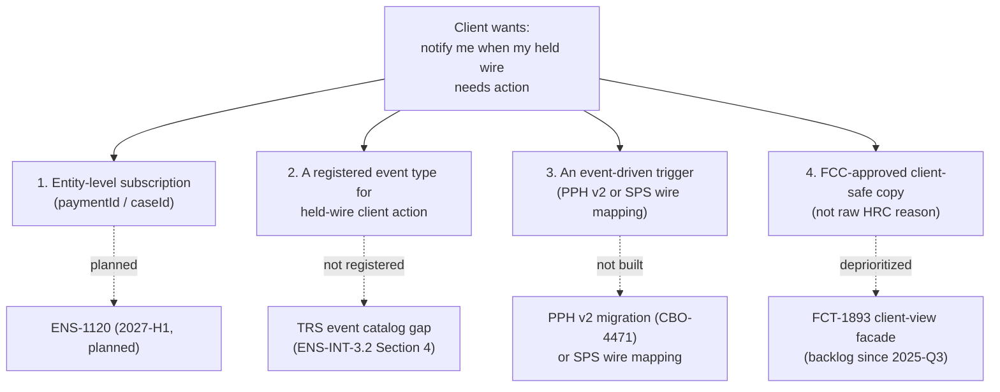

## Overview

**ENS-1120** ("Entity-level subscriptions (subscribe to a specific `paymentId` /
`caseId`)") is a **Planned** initiative on the Enterprise Notification Service
(ENS) roadmap, targeted for **2027-H1**, owned by **Melissa Grant** (EM, Enterprise
Notification Service). It would add a subscription granularity that ENS does not
have today: the ability for a user (or producer, on a user's behalf) to subscribe
to notifications about **one specific entity** — a single payment (`paymentId`) or
case (`caseId`) — rather than only to a whole event type filtered by `accountId`
and amount thresholds.

As of the most recent snapshots in the estate, ENS-1120 exists as a single
backlog-tracked initiative line with no linked child epics or stories, no
design document, and no committed sprint — it is a roadmap target, not a
scoped or in-flight deliverable.

| Field | Value |
|---|---|
| Key | ENS-1120 |
| Type | Initiative |
| Status | Planned |
| Target | 2027-H1 |
| Owner | Melissa Grant (EM, Enterprise Notification Service) |
| Labels | `subscriptions` |
| Last updated (Jira export snapshot) | 2026-07-30 |

Sources: [ENS-INT-3.2 §3, Subscription model](repo://sources/estate/ens-int-3.2-enterprise-notification-service-integration-guide.md#L49-L51),
[Jira export WT-discovery, issue list](repo://sources/estate/jira-export-wt-discovery-2026-10-05.md#L64).

## The gap it addresses

ENS's current subscription model, documented in
[ENS-INT-3.2](../interfaces/ens-notification-api-trs-catalog.md), is scoped **per
user, per event type**, with only two optional filters: `accountId` and an amount
threshold. Subscriptions are created via `POST /ens/v3/subscriptions` (EP-ENS-02),
whose request shape is `eventType` + `accountId` filter — there is no field for
an individual entity identifier. ENS explicitly does not support subscribing to
one specific payment or case; a subscription to `TRS.WIRE.RELEASED` on an account
matches *every* wire released on that account, not a single wire the subscriber
cares about.

<!-- openwiki: mermaid parse failed and this diagram was converted to a text fence so it does not break rendering. Fix the diagram source and restore the mermaid fence. Parser error: Heuristic: an unescaped angle bracket inside a label breaks rendering; rephrase the label. -->
```text
flowchart LR
    subgraph Today["Today: event-type + accountId/threshold"]
        U1["User subscribes"] --> S1["eventType = TRS.WIRE.RELEASED\naccountId = X\namount > $10,000"]
        S1 --> M1["Matches every qualifying\nwire on account X"]
    end
    subgraph Planned["ENS-1120 (2027-H1, planned)"]
        U2["User subscribes"] --> S2["eventType = TRS.WIRE.*\npaymentId = PPH260924-001"]
        S2 --> M2["Matches only that\none payment"]
    end
```
*Current ENS subscriptions resolve against an event type plus coarse account/threshold filters; ENS-1120 would add a filter on a single entity identifier.*

Until ENS-1120 ships, a producer that needs to notify a specific, narrowly
targeted recipient about one entity — rather than everyone whose coarse
subscription happens to match — must use the documented workaround,
**"producer-resolved recipients"**: the producer system itself maintains the
recipient list and calls `POST /ens/v3/notifications` (EP-ENS-01) directly for a
named user, bypassing ENS subscription matching entirely. This pattern already
underlies all three live `TRS.WIRE.*` notifications produced by `cbo-wire-bff`
today (see [ENS Notification API & TRS Event Catalog](../interfaces/ens-notification-api-trs-catalog.md)).

## Motivating use case: held-wire client action

The concrete gap most often cited alongside ENS-1120 in the estate is **client
notification of action required on a held wire**. The Treasury (TRS) event
catalog in ENS-INT-3.2 §4 states, verbatim, that **no event type is registered
for client action required on held wires** — alongside wire network acceptance,
gpi beneficiary credit (`ACCC`), wire returns, and other gpi milestones. A
client whose wire is held (PPH status `HELD`, CBO label "Pending Review") today
has no way to be notified that the bank needs a specific action from them (for
example, a duplicate-suspect attestation under `CTRL-PAY-031`); the only
client-facing indication is the static "This wire is being reviewed." label in
[Wire Center](../interfaces/pph-v1-wire-status-api.md).

Entity-level subscriptions are a natural fit for this use case because a
"client action required" notification is inherently about **one specific held
payment or hold case**, not a whole account — a client does not want a
subscription that fires for every held wire on their accounts, only for the
one awaiting their response. This is why ENS-1120's scope statement names both
`paymentId` and `caseId` as subscribable entities, and why the Hold Management
Service documentation calls out ENS-1120 as the closest current roadmap item
to a hold-notification capability (see
[Hold Management Service hold API — failure modes](../interfaces/hms-hold-api.md)).

## What ENS-1120 does — and does not — solve

ENS-1120, as scoped, is a **subscription-granularity** change to the ENS
platform. It does not by itself close the held-wire notification gap, because
two independent preconditions are unmet and are out of ENS-1120's stated
scope:

1. **No event type exists to subscribe to.** ENS-1120 would let a client
   subscribe to a specific `paymentId`, but there is still no registered TRS
   event type for "client action required on a held wire" (or for wire network
   acceptance, gpi `ACCC`, or wire returns). Registering such an event type is
   a separate ENS onboarding exercise — ServiceNow catalog submission, payload
   schema definition, Disclosure Review Committee (DRC) template approval, ENS
   configuration, and producer UAT — carrying its own ~6-week SLA, independent
   of whether entity-level subscriptions exist.
2. **No producer-side data source or event-driven path exists to trigger it.**
   [Wire Center](../interfaces/pph-v1-wire-status-api.md) derives all client-facing
   status from coarse PPH v1 status values and has no hold-reason data; per
   [ADR-PAY-019](../decisions/adr-pay-019.md), any *new* status capability must be
   event-driven (not polling), which for a held-wire notification would require
   either a PPH v2 migration ([CBO-4471](cbo-4471-pph-v1-to-v2-migration.md)),
   a wire-capable mapping module for the Status Projection Service plus a
   consumer ACL on `pay.wire.lifecycle.v2`, or both — none of which exist today.
3. **The confidentiality boundary is a separate, unrelated control.**
   [ADR-PAY-021](../decisions/adr-pay-021.md) restricts hold reason codes,
   descriptions, scores, and analyst notes to Financial Crimes Technology (FCT)
   systems; `risk.hold.events.v1` (EV-HMS-01) is restricted to FCT and Payment
   Operations tooling and channel applications are not authorized consumers,
   regardless of subscription granularity. Entity-level subscriptions would let
   a client subscribe to *"notify me about hold HC-12345,"* but ENS still could
   not render that notification with the hold's actual reason without a
   compliant, FCC-approved client-facing facade — the deprioritized **FCT-1893**
   ("Client-Safe Hold Status Facade," backlog since 2025-Q3) — supplying a
   disclosure tier and pre-approved copy instead of raw hold detail. ENS-1120,
   as scoped, is a general payment-events subscription initiative; it is not a
   channel-authorized path into `risk.hold.events.v1`.


*A compliant "action required on this held wire" notification needs all four pieces; ENS-1120 supplies only the first, and none of the four has a committed delivery date as of the 2026-10-05 Jira snapshot.*

## Status, scope, and open questions

- **Scope is a one-line backlog entry.** The Jira export carries ENS-1120 only
  as an initiative-level summary ("Entity-level subscriptions (subscribe to a
  specific `paymentId` / `caseId`)"); unlike other 2027 roadmap items in the
  same export (e.g. GTSI-0107's phased discovery/build target), it has no
  stated sub-phases, acceptance criteria, or linked stories as of the
  2026-10-05 snapshot.
- **Timeline overlaps the PPH v1 sunset.** ENS-1120's 2027-H1 target overlaps
  the **2027-03-31** mandatory PPH v1 sunset (no extensions, per the 2026-09-08
  ARB decision). Any Wire Center feature that would consume a future
  entity-level subscription for held-wire notifications would most naturally
  be built against PPH v2 and event-driven plumbing that does not exist yet,
  making the realistic sequencing for a held-wire notification feature later
  than ENS-1120's own target even if ENS-1120 ships on schedule.
- **No confirmed product sponsor for the downstream use case.** Both pieces
  that would need to pair with ENS-1120 to deliver client-facing held-wire
  notifications — a new TRS event type for held-wire client action, and the
  FCT-1893 client-safe facade — are currently unsponsored or deprioritized
  (FCT-1893 explicitly "deprioritized 2025-Q3 ... revisit when a client-facing
  hold experience is funded"). ENS-1120 therefore does not, by itself, imply a
  committed plan to deliver held-wire client notifications even once it ships.
- **Related but independent roadmap item:** GTSI-0107 (gpi Tracker Real-Time
  Service), also planned for 2027, targets real-time gpi tracking data rather
  than ENS subscription mechanics; the two initiatives are not linked in the
  estate and would need to be composed deliberately (a gpi milestone event
  plus an entity-level subscription) to produce a client-facing gpi
  notification.

## Related pages

- [ENS Notification API & TRS Event Catalog](../interfaces/ens-notification-api-trs-catalog.md) — the current subscription model, APIs, and TRS event catalog ENS-1120 would extend.
- [HMS Hold API & Hold Events](../interfaces/hms-hold-api.md) — documents why entity-level subscriptions alone would not create a channel-authorized path to hold detail.
- [ADR-PAY-021: Hold Reason Confidentiality](../decisions/adr-pay-021.md) — the confidentiality boundary that any future held-wire notification content must still respect.
- [ADR-PAY-019: Event-Driven Channel Status (No Polling)](../decisions/adr-pay-019.md) — the event-driven requirement a held-wire notification trigger would have to satisfy.
- [CBO-4471: Migrate Wire Center from PPH v1 to PPH v2 APIs](cbo-4471-pph-v1-to-v2-migration.md) — the producer-side migration whose timeline overlaps ENS-1120's 2027-H1 target.
