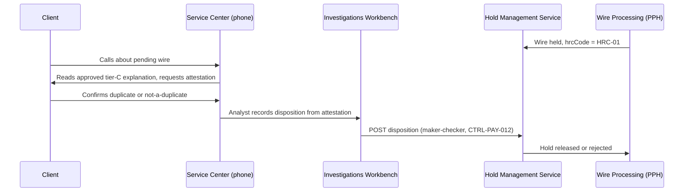

## What this epic was

FCT-1951, *"Duplicate-suspect client attestation pilot (via Service Center
phone)"*, is a Financial Crimes Technology (FCT) epic (18 points, owned by
Grace Mensah) tracked against the 2026-04 target and closed **Done** on
2026-06-10. It tested whether a client's own confirmation — captured by a
human agent over the phone rather than by an automated digital channel —
could safely and more quickly resolve **HRC-01 (`DUP_SUSPECT`)** holds, the
Hold Management Service's (HMS) "possible duplicate of a recent wire"
reason code. See
[Hold Reason Taxonomy (HRC) and Disclosure Tiers](../concepts/hold-reason-taxonomy-disclosure-tiers.md)
for the full HRC-01..HRC-12 taxonomy and
[POL-FCC-014](../policies/pol-fcc-014.md) for the disclosure-tier rules that
constrain any client-facing hold communication.

HRC-01 is a tier **C** ("client-actionable") hold under POL-FCC-014 — the
client may be told an approved explanation ("possible duplicate") and
offered a permitted action — and it is HMS's single largest hold reason by
volume, accounting for roughly 22% of all holds
(repo://sources/estate/prsp-hms-3.4-hold-management-service-design-and-reason-taxonomy-restricted.md#L46).
Before this pilot, resolving any hold required a human analyst disposition
inside the Investigations Workbench (IWB) via `POST
/prsp/hms/v1/holds/{holdId}/disposition`, gated by the `HOLD_RELEASER` role
and maker-checker control CTRL-PAY-012
(repo://sources/estate/prsp-hms-3.4-hold-management-service-design-and-reason-taxonomy-restricted.md#L85-L94) —
there was, and still is, no generalized client-facing interface into HMS
(repo://sources/estate/prsp-hms-3.4-hold-management-service-design-and-reason-taxonomy-restricted.md#L88).
FCT-1951 piloted a narrow exception to that pattern: letting the client's
own voice confirmation to a Commercial Service Center agent stand in for
part of the disposition decision on HRC-01 holds specifically.

## How the pilot worked

The pilot ran entirely through the **Service Center phone channel**, not a
self-service digital surface. A client called in about a wire held for
possible duplication; a Service Center agent read back the approved,
tier-C explanation and captured the client's attestation that the payment
either was or was not an intentional duplicate, and that confirmation fed
the hold disposition. No new client-facing API or UI was built as part of
the pilot — the "attestation" being validated was the business process and
risk control of accepting client confirmation at all for this hold reason,
not a particular piece of software.

Phone-based attestation flow validated by the FCT-1951 pilot: the client's
confirmation is captured by a human Service Center agent and still passed
through the existing IWB maker-checker disposition path — no new HMS
interface was introduced.

## Outcome: 82% resolved within 30 minutes

The pilot's headline result was that **82% of HRC-01 holds were resolved
within 30 minutes** once client confirmation was accepted as part of the
disposition, a sharp improvement over the pre-pilot median time-to-
disposition for HRC-01 of about 47 minutes
(repo://sources/estate/prsp-hms-3.4-hold-management-service-design-and-reason-taxonomy-restricted.md#L70).
On the strength of that result, FCT Risk approved extending attestation-based
resolution to HRC-01 specifically, subject to step-up authentication of the
confirming user
(repo://sources/estate/jira-export-wt-discovery-2026-10-05.md#L159-L163).

## Control change: CTRL-PAY-031

The pilot's durable artifact is an update to **CTRL-PAY-031**, effective
2026-06. The control now reads:

> Duplicate-suspect holds (HRC-01) may be resolved by client attestation
> through a digital channel, subject to step-up authentication of an
> entitled user. Attestation for amounts above $5,000,000 still requires
> Wire Room release. Applies to HRC-01 only.
> (repo://sources/estate/prsp-hms-3.4-hold-management-service-design-and-reason-taxonomy-restricted.md#L96)

Three constraints in that wording matter operationally:

- **Scope is HRC-01 only.** CTRL-PAY-031 does not authorize attestation-based
  resolution for any other hold reason — not HRC-02 `CALLBACK_REQUIRED` (which
  remains governed by the separate out-of-band callback control CTRL-PAY-018
  and explicitly cannot be satisfied by a confirmation received through the
  channel that initiated the payment), and not any tier-G or tier-R code.
- **Step-up authentication is required** of the entitled user giving the
  attestation, regardless of channel.
- **A dollar threshold survives attestation.** Even a validly authenticated
  client attestation on an HRC-01 hold **does not bypass Wire Room release
  for amounts above $5,000,000** — those holds still require the existing
  Wire Room disposition path through IWB and CTRL-PAY-012 maker-checker,
  on top of (not instead of) any attestation captured from the client.

## The gap: no digital-channel implementation exists

CTRL-PAY-031's revised text authorizes attestation "through a digital
channel," but the pilot itself only ever exercised the **phone** channel via
the Service Center, and no digital attestation path has been built. The
epic's closing comment is explicit: *"Digital attestation allowed for HRC-01
only, with step-up auth; amounts > $5M still need Wire Room release. No
digital path exists yet."*
(repo://sources/estate/jira-export-wt-discovery-2026-10-05.md#L163). Consistent
with that, the HMS design document records that HMS exposes no
client-facing endpoints at all beyond the legacy read-only PPH v1 sync, and
that "a client attestation endpoint does not exist"
(repo://sources/estate/prsp-hms-3.4-hold-management-service-design-and-reason-taxonomy-restricted.md#L80-L88).

This leaves CNB in a state where the **control permits** digital-channel
attestation for HRC-01 but the **systems do not yet provide** one:

- `GET /prsp/hms/v1/holds` and `POST /prsp/hms/v1/holds/{holdId}/disposition`
  remain restricted to the Investigations Workbench
  (repo://sources/estate/prsp-hms-3.4-hold-management-service-design-and-reason-taxonomy-restricted.md#L82-L85).
- The separate proposal **FCT-1893** ("Client-Safe Hold Status Facade", `GET
  /prsp/hms/v1/holds/{holdId}/client-view`, 21 points), which would have
  given a channel application a safe way to show a client a hold's
  disclosure tier, approved copy key and permitted action, was deprioritized
  in 2025-Q3 for lack of a funded channel consumer and remains in the
  backlog, unrelated to and not resolved by FCT-1951
  (repo://sources/estate/jira-export-wt-discovery-2026-10-05.md#L143-L157).
- `risk.hold.events.v1`, the event topic that could in principle drive a
  channel-side attestation UI, remains restricted to FCT and Payment
  Operations tooling and channel applications are not authorized consumers
  (repo://sources/estate/prsp-hms-3.4-hold-management-service-design-and-reason-taxonomy-restricted.md#L78).

Any future work to build an actual digital (self-service) attestation
surface for HRC-01 would need at minimum a new HMS interface (something in
the shape of the never-built FCT-1893 facade, extended to accept a client
disposition input rather than only return read status), step-up
authentication wired to an entitled-user check, and a hard stop routing any
attestation on an amount above $5,000,000 to the existing Wire Room
release path rather than auto-releasing it.

## Relationships

- [Hold Reason Taxonomy (HRC) and Disclosure Tiers](../concepts/hold-reason-taxonomy-disclosure-tiers.md) —
  documents HRC-01's tier-C disclosure rules and the permitted
  confirm/cancel client action that CTRL-PAY-031 governs, alongside the
  other eleven HRC codes.
- [POL-FCC-014](../policies/pol-fcc-014.md) — the governing communication
  standard that limits what any Service Center script or future digital
  surface may ever say to a client about an HRC-01 hold, independent of
  whether attestation is captured by phone or digitally.
- [Hold Management Service](../systems/hold-management-service.md) — the
  system of record for holds, hold lifecycle and the `HOLD_RELEASER` /
  maker-checker disposition path that every attestation, phone or digital,
  still ultimately flows through.
