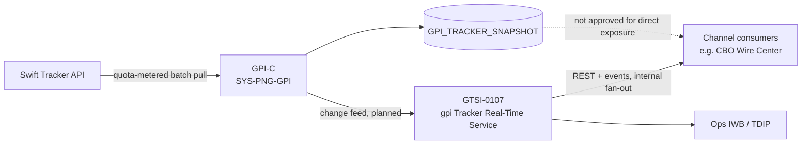

## Overview

**GTSI-0107, "gpi Tracker Real-Time Service" (GTRS)**, is a Jira **Initiative** (status **Planned**,
owner Elena Vasquez) to build a **change-feed-based internal REST + event API** layered over the
Swift gpi Tracker, so that internal consumers — eventually including channel systems such as
Crestline Business Online (CBO) — can obtain gpi status updates without each one issuing its own
quota-metered call to the Swift Tracker API. It is owned by **Global Transaction Services
Integration (GTSI)**, the team assembled under the 2026-09 cross-border network integration
realignment, and is described internally as **the main path forward for international wire
tracking** in CBO. GTRS is **not funded for 2026**; discovery is targeted for **2027-Q2** and
build for **2027-Q3/Q4**, both subject to the 2027 portfolio review.

GTRS did not originate as a greenfield idea. It is the carried-forward recommendation from
[PNG-1544](../decisions/png-1544.md), the March 2026 decision by Payment Networks Engineering
(PNE) declining to double the Swift gpi Tracker batch-pull frequency from 4 hours to 2 hours. That
decision's design addendum concluded that no batch-frequency change could address the real
demand — client-facing, per-payment gpi status visibility — without a fundamentally different
access pattern, because per-payment lookups driven from channels were projected at roughly 1.9
million Swift Tracker API calls per month against a 250,000-calls/month contract (see
[gpi Tracker Batch Feed](../interfaces/gpi-tracker-batch-feed.md)). The addendum's recommendation
— a change-feed-based internal service with internal fan-out — was logged as GTSI-0107.

## Why "change-feed-based"

The core design constraint GTRS must satisfy is the one PNG-1544 established: **no consumer, and
no channel-triggered action, may translate into a direct, per-payment call to the Swift Tracker
API**. The Swift Tracker API contract is capped at 250,000 calls/month, renewal due 2027-01-31
(tracked separately as GTSI-0115), and that quota is already shared between the existing 4-hourly
batch pulls performed by the Swift Alliance & gpi Connector (GPI-C, `SYS-PNG-GPI`) and
Operations' ad-hoc manual lookups. A client-facing "check my wire status" feature calling Swift
directly, even once per click, does not scale within that contract at CBO's wire volumes.

GTRS is therefore scoped as a service that consumes gpi updates from a **change feed** — sourced
ultimately from the same quota-metered Tracker polling GPI-C already performs — and **fans those
updates out internally** to any number of consumers via REST reads and/or published events,
without multiplying the number of calls made to Swift. This mirrors the bank's general
event-driven status posture: [ADR-PAY-019](../decisions/adr-pay-019.md) similarly requires that
channel payment-status integrations be event-driven rather than built on polling, and the Payments
ARB has reaffirmed the **Status Projection Service (SPS)** pattern — Kafka consumer into a
channel-owned read model, exemplified by the ACH consumer built for
[CBO-3790](cbo-3790-ach-payment-tracker.md) — as the reference approach for any client-facing
payment status feature. GTRS's change-feed design is the gpi-specific instance of that same
pattern, differing because its upstream source is the Swift Tracker API/GPI-C rather than an
internal PPH lifecycle topic.

## Current status: blocked

GTRS is **blocked by lack of funding and 2026 sponsorship**. It carries no committed budget or
delivery slot in 2026; the 2026-09 organizational memo realigning cross-border network ownership
to GTSI states plainly that the initiative "is not funded for 2026" and that discovery is only
"planned for 2027-Q2 subject to the 2027 portfolio review." No team has yet been staffed to begin
design work, and the Jira issue (updated 2026-09-15) records only an intent from the initiative
owner to "scope after KT [knowledge transfer]" and gather early channel requirements.

Separately, and more immediately, the **Payments Architecture Review Board (ARB) has not
approved any interim, direct exposure of `GPI_TRACKER_SNAPSHOT`** as a stopgap ahead of GTRS. At
its 2026-09-08 session, the ARB discussed GTSI-0107 under its own agenda item, noted client
demand for the capability, and recommended that GTSI engage channel teams early — but explicitly
recorded that **"interim exposure of GPI_TRACKER_SNAPSHOT directly to channels is not
approved,"** and that even a read-only service with quota isolation built for that purpose "would
require ARB review" in its own right. In other words, there is **no sanctioned shortcut**: a team
cannot bypass the GTRS initiative by reading the batch snapshot table directly, nor by shipping an
unreviewed quota-isolated facade, even on an interim basis. This reaffirms the same constraint
already documented against the batch feed (see
[gpi Tracker Batch Feed](../interfaces/gpi-tracker-batch-feed.md)).

Practically, this means the underlying client need — visibility into international (gpi) wire
status inside CBO — stays unresolved until GTRS is funded and delivered, or until some other
ARB-approved mechanism is proposed and separately reviewed.

## Upstream demand driving the initiative

GTRS exists to resolve a cluster of unmet needs tracked in the CBO Wire Center and adjacent
backlogs, visible in the 2026-10-05 wire-tracking discovery export:

- **CBO-4480** ("International wire status visibility (gpi) for clients", Spike, To Do, backlog) —
  the originating client-facing gap: gpi status today is visible only to Payment Operations in the
  Investigations Workbench (IWB), with no channel-facing view at all.
- **CBO-4419** (Bug, Open) — a client complaint where an international wire displayed "Completed"
  in CBO and was then returned/rejected by the beneficiary bank the next day (RJCT AC04), tied to
  regulatory complaint CMP-2026-1189. This illustrates the cost of relying on stale, non-authoritative
  status (the 4-hourly `GPI_TRACKER_SNAPSHOT` batch) for a client-facing label, and is one of the
  concrete arguments for a change-feed-based service with fresher, event-driven updates.
- **CBO-4471** ("Migrate Wire Center from PPH v1 to PPH v2 APIs", Epic, unscheduled backlog) — a
  prerequisite thread: outbound wires only carry the canonical [UETR](../decisions/adr-pay-023.md)
  correlation id needed to join CBO payment records to gpi Tracker data once the Wire Center moves
  off PPH v1 onto v2, since v1 consumers never receive UETR.

GTSI-0107 is the roadmap item meant to eventually close CBO-4480 and give CBO wires the same kind
of event-driven, milestone-based status experience that CBO-3790 already delivered for ACH
payments — but only once funded, scoped, and built.

## Ownership and organizational context

GTSI-0107 moved to **Global Transaction Services Integration (GTSI)** as part of the **2026-09
cross-border network integration realignment** (effective 2026-10-01), announced by the Office of
the CIO, Payments & Treasury Technology. Before the realignment, gpi-related work — including the
Swift Alliance Gateway, the gpi Connector (`SYS-PNG-GPI`), and the gpi Tracker integration — sat
with Payment Networks Engineering (PNE) under Raj Malhotra. The memo explicitly assigns GTSI (and
business sponsor Laura Kim) ownership of "the international wire tracking roadmap, including any
client-facing gpi capability," which GTSI-0107 is the lead initiative for. PNE's role is now
limited to secondary on-call support for `SYS-PNG-GPI` until knowledge transfer completes
(**GTSI-0112**, target 2026-12-15); new gpi-related requests should be raised against Jira project
**GTSI**, not PNG.

GTSI additionally owns the adjacent **GTSI-0115** item, the Swift gpi Tracker API contract renewal
(quota 250,000 calls/month, due 2027-01-31) — the same quota ceiling that makes GTRS's
change-feed design necessary rather than optional.

## Relationship to other systems and patterns

- **Upstream source**: the Swift gpi Tracker, as currently polled 4-hourly by the Swift Alliance &
  gpi Connector (GPI-C) into `GPI_TRACKER_SNAPSHOT`. GTRS does not replace this batch pull; it is
  expected to consume from a feed derived from the same quota-metered Tracker access, not to add a
  second, independent path to Swift.
- **Reference architecture**: the Status Projection Service (SPS) pattern used for ACH
  ([CBO-3790](cbo-3790-ach-payment-tracker.md)) — Kafka-style consumer into a read model, exposed
  via a versioned read API — which the Payments ARB has reaffirmed as the template for any
  client-facing payment status feature, gpi included.
- **Governing principle**: [ADR-PAY-019](../decisions/adr-pay-019.md) (event-driven channel status,
  no PPH/Tracker polling from channels) and the broader quota/architecture rationale captured in
  [PNG-1544](../decisions/png-1544.md).
- **Not an approved substitute**: direct channel reads of `GPI_TRACKER_SNAPSHOT`, or any
  unreviewed read-only facade over it, are explicitly not an ARB-approved way to get gpi data to
  channels ahead of GTRS.

## Related pages

- [PNG-1544: gpi Batch Frequency Increase Declined](../decisions/png-1544.md) — the decision whose
  addendum first recommended the change-feed-based service that became GTSI-0107.
- [gpi Tracker Batch Feed](../interfaces/gpi-tracker-batch-feed.md) — the existing 4-hourly batch
  integration and Swift Tracker API quota constraints that shape GTRS's design and that the ARB
  has ruled out exposing directly to channels.
- [CBO-3790: ACH Payment Tracker](cbo-3790-ach-payment-tracker.md) — the Status Projection Service
  pattern the ARB has reaffirmed as the reference model GTRS is expected to follow for gpi.
- [ADR-PAY-019](../decisions/adr-pay-019.md) — the architectural decision requiring event-driven,
  non-polling channel status integrations.
