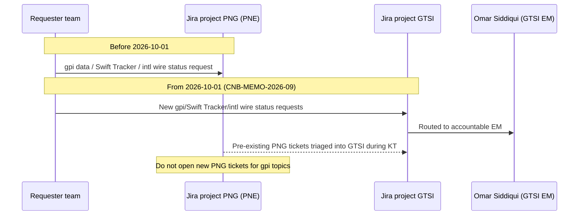

## Summary

GTSI-0112 is the Jira epic (project **GTSI**, owner Omar Siddiqui, status "In Progress", target **2026-12-15**) that executes the engineering knowledge transfer mandated by **CNB-MEMO-2026-09** ("Realignment of Cross-Border Network Integration"). The memo, issued 2026-09-02 by Gregory Hall (MD, CIO Payments & Treasury Technology) and effective 2026-10-01, moves ownership of cross-border network integration capabilities from **Payment Networks Engineering (PNE)**, led by Raj Malhotra, to **Global Transaction Services Integration (GTSI)**, led by Elena Vasquez. GTSI-0112 is the vehicle for the operational hand-off itself: documentation, on-call readiness, and people transfer, as distinct from any new feature roadmap work GTSI subsequently takes on.

## What is moving and what is not

Per CNB-MEMO-2026-09 Section 1, three capabilities move from PNE to GTSI effective 2026-10-01:

| Capability | From | To | Accountable |
|---|---|---|---|
| Swift Alliance Gateway, gpi Connector (**SYS-PNG-GPI**), and gpi Tracker integration | PNE (Raj Malhotra) | GTSI (Elena Vasquez) | Omar Siddiqui (EM); Hannah Lindqvist (Tech Lead) |
| Swift API gateway (Microgateway), SwiftNet PKI service accounts | PNE | GTSI | Hannah Lindqvist |
| International wire tracking roadmap (including any client-facing gpi capability) | PNE | GTSI | Elena Vasquez; business sponsor Laura Kim |

What explicitly does **not** move, per the same memo:

- The **Fedwire Funds Connector (SYS-PNG-FFC)**, including the `net.fedwire.ack.v1` and `net.fedwire.inbound.v1` Kafka topics, stays with PNE under Raj Malhotra (EM Brian Walsh).
- Raj Malhotra additionally gains ownership of the **FedNow** and **RTP** connectors from 2026-11-01, so PNE's remit is realigned toward domestic instant/wire rails at the same time GTSI absorbs cross-border/Swift scope.

This is a people- and ownership-realignment, not a rewrite: the underlying system (SYS-PNG-GPI) and its design (see [Swift gpi Connector](../systems/swift-gpi-connector.md)) are unchanged by the transfer itself.

## People changes

- **Tomasz Nowak** (Senior Engineer, gpi Connector; prior document owner of the gpi sections of PNG-TDD-6.0) transfers from PNE to GTSI and now reports to Omar Siddiqui. He is the primary technical knowledge source being transferred.
- **PNE on-call remains secondary support** for SYS-PNG-GPI until **2026-12-15**, the date knowledge transfer under GTSI-0112 is targeted to complete. Until then, incident response for SYS-PNG-GPI has a dual-team dependency: GTSI as new primary owner, PNE as secondary/fallback.
- GTSI's existing engineering contacts (per the PTT organization directory) are Elena Vasquez (Director), Omar Siddiqui (EM), and Hannah Lindqvist (Tech Lead); GTSI's prior scope included the CHIPS connector and nostro reconciliation integration, so SYS-PNG-GPI and the Swift API gateway are additive responsibilities layered onto that existing cross-border integration remit. See [GTSI](../teams/gtsi.md) and [Payment Networks Engineering](../teams/payment-networks-engineering.md).

## Systems and credentials in scope

- **SYS-PNG-GPI** (Swift Alliance & gpi Connector): connects to the Swift Tracker via the Swift API through the **Swift Microgateway**, using **SwiftNet PKI** credentials bound to the GPI-C service account, and performs a batch pull every 4 hours (00:00/04:00/08:00/12:00/16:00/20:00 ET) of changed outbound UETRs from the last 30 days, upserting into the Oracle table `GPI_TRACKER_SNAPSHOT`. Full design detail is covered in [Swift gpi Connector](../systems/swift-gpi-connector.md) and in PNG-TDD-6.0.
- **Swift API gateway (Microgateway)** and the **SwiftNet PKI service accounts** themselves are a separate moving capability (owned post-transfer by Hannah Lindqvist) because they are shared plumbing: any other Swift-dependent integration (not only gpi) authenticates through this gateway and these credentials, so GTSI inherits both the gpi-specific connector and the underlying Swift connectivity/credential layer.
- Consumers of the gpi snapshot data - Payment Operations' Investigations Workbench (IWB) and the TDIP nightly `gpi_tracker_events` load - are unaffected by the ownership change; GTSI becomes the upstream owner those consumers depend on.

## Engagement model during and after transfer

*Request routing for gpi/Swift Tracker/international wire status work shifts from Jira project PNG to Jira project GTSI effective 2026-10-01, with legacy PNG tickets triaged by GTSI during the knowledge-transfer window.*

From 2026-10-01, all new requests for gpi data, Swift Tracker usage, or international wire status capabilities must be raised in **Jira project GTSI**, directed to Omar Siddiqui, rather than project PNG. Requests already logged against PNG are triaged by GTSI during the knowledge-transfer period; new PNG tickets for gpi topics should not be opened. The PTT Organization & Ownership Directory (CNB-ORG-PTT-2026-06) is expected to reflect these ownership changes in its Q4 2026 refresh; until then, the memo takes precedence over the directory's existing PNE/GTSI listings for SYS-PNG-GPI.

## Downstream and related initiatives

GTSI-0112 is a precondition for, and is referenced by, two roadmap items that fall out of the same realignment:

- **GTSI-0107 - gpi Tracker Real-Time Service (GTRS)**: a planned change-feed-based internal API over the Swift gpi Tracker, intended to replace ad-hoc/batch access patterns. It is explicitly **not funded for 2026**; discovery is planned for 2027-Q2, subject to the 2027 portfolio review. CNB-MEMO-2026-09 directs teams with near-term gpi needs to engage GTSI early so requirements can inform that discovery, rather than waiting for GTRS to land. Jira also shows a prior, declined attempt at a stopgap in this space: **PNG-1544** (increase gpi Tracker batch frequency from 4h to 2h) was marked "Won't Do" in March 2026 because projected Tracker API usage would exceed the contracted quota; it is recorded in PNG-TDD-6.0 Addendum A and is superseded by GTSI-0107.
- **GTSI-0115 - Swift gpi Tracker API contract renewal**: GTSI is responsible for the contract renewal due **2027-01-31**, covering a quota of 250,000 calls/month. As of the PNG-TDD-6.0 technical design, current usage was already ~61% of that quota from batch pulls plus Ops ad-hoc lookups; an unbuilt client-facing per-payment lookup pattern was estimated at ~1.9 million calls/month, roughly 7x over contract. This quota constraint is a hard design input for any future real-time or client-facing gpi capability GTSI takes on (including GTRS) and is a key piece of operational context the knowledge transfer must carry over.
- A related but separate demand signal is **CBO-4480** ("International wire status visibility (gpi) for clients"), a CBO Wire Center spike (status To Do, backlog) that already identifies the need for a client-facing gpi API; its original contact was PNE (Raj Malhotra) before the realignment, and under the new model such requests route to GTSI per the engagement-model change above. GTSI-0112 does not itself deliver this capability - CNB-MEMO-2026-09 is explicit that the snapshot table must not be exposed directly to channels and that any client-facing capability needs a dedicated service with its own SLA, entitlements, and quota management - but successful knowledge transfer is what lets GTSI evaluate and scope it.

## Risks and operational considerations

- **Dual on-call dependency window**: between 2026-10-01 and 2026-12-15, SYS-PNG-GPI incident response spans two teams (GTSI primary, PNE secondary). Any slippage in the 2026-12-15 target extends this dependency and the associated coordination overhead.
- **Tracker API quota is a hard external constraint**, not an internal capacity limit: it is contractually capped at 250,000 calls/month, already ~61% utilized, and renews 2027-01-31 under GTSI-0115. Knowledge transfer must include this constraint explicitly, since PNE's own attempt to shorten the batch cadence (PNG-1544) was rejected for exactly this reason.
- **Single-threaded tacit knowledge**: Tomasz Nowak is named as the sole gpi-specific senior engineer transferring, and is also the named gpi-section owner of the PNE technical design (PNG-TDD-6.0). Completion of GTSI-0112 by 2026-12-15 is the condition under which PNE on-call support can be safely withdrawn; until GTSI builds redundant depth, bus-factor risk on gpi operational knowledge is concentrated in this transfer.
- **Directory lag**: the authoritative org/ownership reference (CNB-ORG-PTT-2026-06) still shows SYS-PNG-GPI under PNE as of its 2026-06-15 publication and is not due to refresh until Q4 2026; teams consulting that directory before the refresh should treat CNB-MEMO-2026-09 as the current source of truth for SYS-PNG-GPI, Swift API gateway, and SwiftNet PKI ownership.

## Related pages

- [Swift gpi Connector](../systems/swift-gpi-connector.md) - system design, data model, and gpi Tracker integration mechanics (SYS-PNG-GPI).
- [GTSI](../teams/gtsi.md) - receiving team, its existing cross-border scope, and roadmap items (GTSI-0107, GTSI-0115).
- [Payment Networks Engineering](../teams/payment-networks-engineering.md) - originating team, remaining scope (Fedwire Funds Connector, FedNow, RTP).
