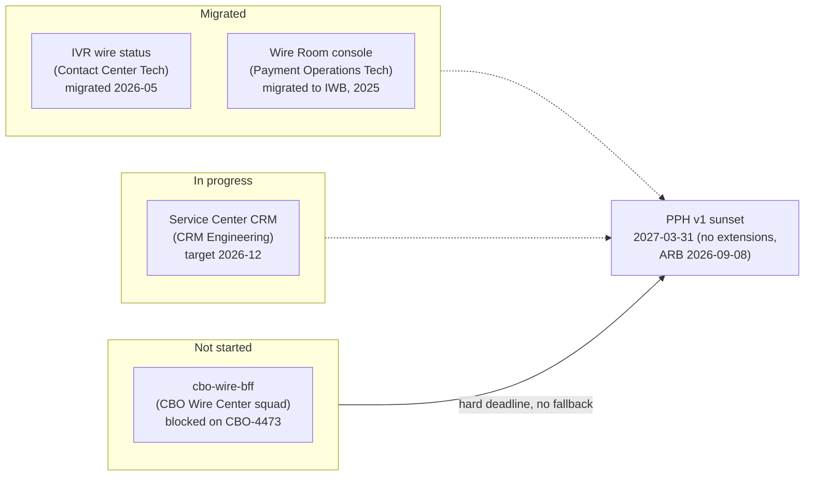

## Overview

**PPH-2190** ("PPH v1 API sunset - consumer migration tracking") is an
**Epic** in the PPH Jira project, owned by **Kevin O'Brien** (Engineering
Manager, Payments Hub Engineering), currently **In Progress**, with no story
points of its own — it is a coordination/tracking epic over the migration
work owned by each consuming team, not a unit of engineering delivery in
itself. Its target is the hard sunset date of **2027-03-31**.

The epic exists because [PRISM Payments Hub (PPH) v1](../interfaces/pph-v1-wire-status-api.md)
(`EP-PPH-01/02/03`, the synchronous wire status, list, and submission REST
endpoints) is being retired in favor of
[PPH v2](../interfaces/pph-v2-payments-api.md) (`EP-PPH-04..07`) and the
`pay.wire.lifecycle.v2` Kafka topic. The sunset has a firm technical driver,
not merely a policy preference: **the v1 adapter is not supported on the
vendor's Volaris 9.6 platform upgrade**, scheduled for April 2027. The
Payments Architecture Review Board (ARB) confirmed on **2026-09-08** that
**no extension** beyond 2027-03-31 will be granted to any consumer, which is
why this epic tracks migration readiness across every v1 consumer rather than
leaving each team to self-schedule against a soft deadline.

| Field | Value |
|---|---|
| Key | PPH-2190 |
| Type | Epic |
| Status | In Progress |
| Owner / assignee | Kevin O'Brien (EM, Payments Hub Engineering) |
| Target / sunset date | 2027-03-31 (no extensions, ARB 2026-09-08) |
| Points | - (tracking epic; no estimate) |
| Labels | `api-lifecycle` |
| Last updated (export snapshot) | 2026-09-22 |
| Published deprecation notice | [PPH-API-CAT-2026.3](repo://sources/estate/pph-api-cat-2026.3-prism-payments-hub-api-and-event-catalog.md#L24-L35), published 2026-09-10 |

Source: [Jira export WT-discovery, 2026-10-05](repo://sources/estate/jira-export-wt-discovery-2026-10-05.md#L53) (issue
list row) and [issue detail](repo://sources/estate/jira-export-wt-discovery-2026-10-05.md#L137-L141).

## Consumer migration status

Four systems were identified as PPH v1 consumers and are tracked individually
under this epic. As of the 2026-09-22 PPH-2190 status update (consistent with
the 2026-09-10 PPH-API-CAT-2026.3 catalog publication), the status is:

| v1 consumer | Owner | Migration status | Notes |
|---|---|---|---|
| IVR wire status | Contact Center Tech | **Migrated** (2026-05) | - |
| Service Center CRM | CRM Engineering | **In progress** (target 2026-12) | - |
| `cbo-wire-bff` (CBO Wire Center) | CBO Wire Center squad | **Not started** | Tracked as [CBO-4471](cbo-4471-pph-v1-to-v2-migration.md) (34 pts, unscheduled); blocked on [CBO-4473](cbo-4471-pph-v1-to-v2-migration.md#blocking-dependency-cbo-4473-ces-account-filter-mapping) (CES account-filter mapping) |
| Wire Room console | Payment Operations Tech | **Migrated to IWB** (2025) | Moved to the Investigations Workbench rather than migrating to PPH v2 directly |

Sources: [PPH-API-CAT-2026.3 §1, consumer table](repo://sources/estate/pph-api-cat-2026.3-prism-payments-hub-api-and-event-catalog.md#L30-L35);
[PPH-2190 issue detail](repo://sources/estate/jira-export-wt-discovery-2026-10-05.md#L137-L141).

*All four tracked v1 consumers face the same fixed sunset date; `cbo-wire-bff` is the only one with no migration work underway.*

`cbo-wire-bff` is the **sole remaining consumer that has not started**
migrating, as of both the 2026-08-20 Wire Center architecture review and this
2026-09-22 PPH-2190 update. Epic owner Kevin O'Brien has sent **three
reminders** to the CBO Wire Center team (most recently 2026-09-22) chasing
the unstarted work — this is an active escalation from Payments Hub
Engineering, not a passive backlog line item. Full detail on that
consumer's migration — scope, blocking dependency, endpoint-by-endpoint
mapping, and risk — is tracked separately in
[CBO-4471: Migrate Wire Center from PPH v1 to PPH v2 APIs](cbo-4471-pph-v1-to-v2-migration.md).

## Per-consumer notes

- **IVR wire status (migrated, 2026-05)** and **Service Center CRM (in
  progress, target 2026-12)** are both owned outside CBO (Contact Center
  Tech and CRM Engineering respectively). Neither has a detailed Jira
  record in the available export beyond the summary row in the PPH-2190
  consumer table and the PPH-API-CAT-2026.3 catalog; both are ahead of
  `cbo-wire-bff` in migration sequence.
- **Wire Room console (migrated to IWB, 2025)** did not migrate to PPH v2
  directly. Instead, Payment Operations Tech moved the console onto the
  Investigations Workbench (IWB), which already carries operational wire
  and gpi visibility for Ops users — a different resolution path from the
  other three consumers, which move (or are moving) to calling PPH v2
  itself.
- **`cbo-wire-bff` (not started)** is the only consumer blocked on an
  external dependency before work can even begin: [CBO-4473](cbo-4471-pph-v1-to-v2-migration.md#blocking-dependency-cbo-4473-ces-account-filter-mapping)
  must first define how [CES](../interfaces/ces-entitlements-api.md)
  per-account entitlement data maps onto PPH v2 search, which is
  `clientId`-scoped only (same limitation as v1 list, but without
  Wire Center's existing client-side filtering logic yet ported). CBO-4473
  itself is unscheduled Backlog, so the blocking dependency compounds the
  schedule risk against the fixed sunset date.

## Why the deadline is non-negotiable

Two independent facts anchor the 2027-03-31 date rather than leaving it as a
target that could slip:

1. **Platform support.** The PPH v1 adapter does not run on Volaris 9.6, the
   vendor platform version PPH is upgrading to in April 2027. There is no
   documented fallback for continuing to serve v1 traffic after that
   upgrade.
2. **ARB ruling.** The Payments Architecture Review Board explicitly
   confirmed on 2026-09-08 that **no extensions** will be granted beyond
   2027-03-31, foreclosing the usual escalation path of petitioning for more
   time.

This is also reinforced architecturally by
[ADR-PAY-019](../decisions/adr-pay-019.md) (Event-Driven Channel Status, No
Polling), which the ARB reaffirmed in the same 2026-09-08 session as the
governing pattern for client-facing status of any payment type — meaning
consumers migrating off v1 are expected to move toward event-driven status
(`pay.wire.lifecycle.v2` plus a channel read model, the Status Projection
Service pattern from [CBO-3790](cbo-3790-ach-payment-tracker.md)) rather than
simply swapping synchronous v1 calls for synchronous v2 calls wherever
possible.

## Related risks carried by delay

Two open issues specific to `cbo-wire-bff`'s continued dependence on v1 give
the "not started" status operational weight beyond API-version hygiene:

- **FCT-2004** — an open security risk (Daniel Kowalski, FCT security
  review) that PPH v1's `holdReasonDesc` field leaks Hold Management Service
  (HMS) free-text, including HRC mnemonics and analyst notes, to any v1
  consumer that renders it; `holdReasonDesc` has no v2 equivalent, so this
  risk is retired only once `cbo-wire-bff` completes migration (the ticket
  thread notes the v1 sunset "may make this moot"). See
  [PPH v1 Wire Status API](../interfaces/pph-v1-wire-status-api.md#fct-2004-holdreasondesc-leaks-hms-free-text).
- **CBO-4419 / CMP-2026-1189** — an open client complaint in which an
  international wire shown as "Completed" (v1's collapsed `PROCESSED`
  status) was subsequently rejected by the beneficiary bank. The ambiguity
  stems from v1's four-state `PROCESSED` collapse, which is resolved by
  v2's distinct `lifecycleState` values — another reason migration timing
  matters beyond the hard deadline itself.

## Related pages

- [CBO-4471: Migrate Wire Center from PPH v1 to PPH v2 APIs](cbo-4471-pph-v1-to-v2-migration.md) —
  the detailed, in-depth tracking page for the one "not started" consumer,
  including its blocking dependency, endpoint mapping, and risk analysis.
- [PPH v1 Wire Status API (deprecated)](../interfaces/pph-v1-wire-status-api.md) —
  the API surface being retired, including the `PROCESSED` collapse and the
  `holdReasonDesc` / FCT-2004 risk.
- [ADR-PAY-019: Event-Driven Channel Status (No Polling)](../decisions/adr-pay-019.md) —
  the architecture decision reaffirmed alongside this sunset, governing how
  consumers should obtain status after moving off v1.
