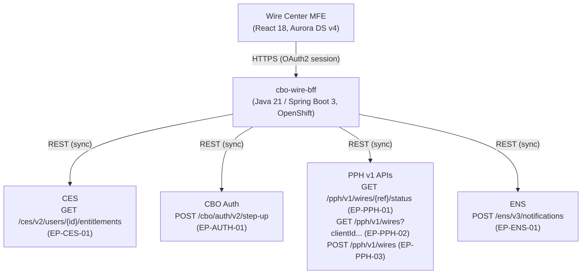

## Overview

The **Wire Center** module is the wire-transfer capability of Crestline
Business Online (CBO), CNB's commercial digital banking portal (web and
mobile) for Treasury Management clients. It provides domestic (Fedwire) and
international (Swift) wire initiation, templates, dual approval, release with
step-up authentication, a wire activity list, wire detail, CSV export, and
confirmation PDF download.

This page documents **current-state architecture only**, as captured in
`CBO-ARCH-WC-4.1` (v4.1, Approved, last reviewed 2026-08-20; owner Lucas
Ferreira, Tech Lead - CBO Wire Center). It is the baseline that later gap
analyses and migration work are measured against - in particular
[CBO-4471: PPH v1 to v2 migration](../projects/cbo-4471-pph-v1-to-v2-migration.md),
[ADR-PAY-019](../decisions/adr-pay-019.md), and
[PIR-2024-07](../incidents/pir-2024-07.md).

### Usage (trailing 90 days to 2026-07-31)

| Metric | Value |
|---|---|
| Client companies with Wire Center entitlement | 9,800 |
| Active users (90-day) | 41,000 |
| Wires initiated via CBO per business day | 11,600 avg (9,900 domestic / 1,700 international); month-end peak ~19,000 |
| Wire Center page views per month | 1.4 million |
| 'Refresh status' clicks per month | 310,000 |
| Share of CNB outgoing wires originated in CBO | ~67% (remainder: host-to-host files, Swift for Corporates, branch, Ops) |

## What Wire Center does NOT support today

This is the explicit current-state baseline for gap analysis - these are
capabilities Wire Center does **not** provide, even though related services
exist elsewhere in the estate:

- **No milestone tracking.** There is no rail-agnostic timeline of a wire's
  progress (e.g., submitted -> released -> network-acknowledged -> settled).
  The `<cbo-journey-timeline>` Aurora DS v4 component already exists (built
  for the ACH Payment Tracker, CBO-3802) and is called out as a reusable
  asset, but it is not wired into Wire Center today.
- **No gpi / international tracking status.** Swift gpi status is visible
  only to Payment Operations, inside the Investigations Workbench (per a
  spike, CBO-4480); Wire Center clients cannot see it.
- **No hold explanations.** Held wires display only the generic label
  "Pending Review" with the fixed text "This wire is being reviewed." PPH v1's
  `holdReasonDesc` field is not surfaced to clients.
- **No client actions on held wires.** Clients cannot cancel, amend, or
  otherwise act on a wire once it is held; there is no held-wire workflow
  exposed in the UI.

These four gaps, together with the constraints in
[Constraints and known limitations](#constraints-and-known-limitations) below,
define the scope boundary that any new Wire Center status or tracking feature
must design against.

## Logical architecture

Per CBO-ARCH-WC-4.1 §2, the module is a single-page MFE talking to a
dedicated BFF, which in turn makes synchronous REST calls to four backend
systems: CES (entitlements), CBO Auth (step-up), PPH v1 (wire submission,
list, status), and ENS (notifications).

*Wire Center's current-state logical architecture (CBO-ARCH-WC-4.1 §2): MFE -> BFF, with the BFF fanning out synchronously to CES, CBO Auth, PPH v1, and ENS.*

**Not used by Wire Center today:** the CBO Status Projection Service (SPS -
ACH only), the `pay.wire.lifecycle.v2` event topic, PPH v2 APIs, gpi data,
HMS APIs, and the TDIP Insights API. Any future status capability that needs
these must be built new, not assumed to already be wired in.

See [Wire Lifecycle State Model](../concepts/wire-lifecycle-state-model.md)
for how the PPH v2 states that Wire Center does *not* consume today relate to
the coarser v1 `status` values it does, and
[PPH v1 Wire Status API](../interfaces/pph-v1-wire-status-api.md) for the full
v1 surface documentation.

## Integration inventory

The following table is reproduced verbatim from CBO-ARCH-WC-4.1 §2.1 (with
the ENS row, which continues onto document page 2 in the source):

| Consumer | Endpoint / interface | Purpose | Version | Notes |
|---|---|---|---|---|
| cbo-wire-bff | POST /pph/v1/wires (EP-PPH-03) | Submit approved wire | v1 | Returns pphId; stored with cboRef |
| cbo-wire-bff | GET /pph/v1/wires?clientId... (EP-PPH-02) | Activity list | v1 | Max 500 rows; filters applied client-side (CBO-4302) |
| cbo-wire-bff | GET /pph/v1/wires/{ref}/status (EP-PPH-01) | Wire detail status | v1 | Cached 60 s; refresh throttled 1/60 s per wire |
| cbo-wire-bff | GET /ces/v2/users/{id}/entitlements (EP-CES-01) | Authorization | v2 | Account-level filtering of results |
| cbo-wire-bff | POST /cbo/auth/v2/step-up (EP-AUTH-01) | Step-up on release | v2 | Push or OTP; reusable for other high-risk actions |
| cbo-wire-bff | POST /ens/v3/notifications (EP-ENS-01) | Wire notifications | v3 | Produces TRS.WIRE.* events (see [Notifications](#notifications-produced)) |

All three PPH integrations are against the deprecated v1 surface; see
[CBO-4471](../projects/cbo-4471-pph-v1-to-v2-migration.md) for the migration
that must replace them before PPH v1's 2027-03-31 sunset.

## Status model and client-facing labels

Wire Center derives its displayed status from the PPH v1 `status` value.
Statuses prior to submission (Draft, Pending Approval, Approved) are
CBO-owned and never reach PPH. The label **"Completed"** replaced "Processed"
in release R26.1 (CBO-4402) after client feedback that "Processed" was
unclear - a relabel that changed the words shown but not the underlying
ambiguity of the PPH v1 `PROCESSED` value itself (see
[Wire Lifecycle State Model](../concepts/wire-lifecycle-state-model.md) for
what that value actually collapses).

| PPH v1 status | CBO label | Visual | Since |
|---|---|---|---|
| (CBO) DRAFT / PENDING_APPROVAL / APPROVED | Draft / Pending Approval / Approved | grey | R21 |
| RECEIVED | Submitted | blue | R21 |
| PENDING | In Process | blue | R21 |
| HELD | Pending Review | amber | R22 |
| PROCESSED | Completed | green check | R26.1 (was "Processed") |
| REJECTED | Rejected | red | R21 |
| CANCELLED | Cancelled | grey | R21 |
| RETURNED | Returned | red | R23 |

Hold reasons are not displayed today: held wires show "Pending Review" with
the standard text "This wire is being reviewed," regardless of the
underlying `holdReasonDesc` content PPH v1 returns.

## Identifiers stored by Wire Center

| Identifier | Example | Source | Stored in CBO? |
|---|---|---|---|
| cboRef | CBW-20260924-004812 | CBO | Yes (primary key) |
| pphId | PPH26092400481233 | PPH v1 POST response | Yes |
| IMAD (Fedwire input reference) | 20260924QMGFT015000123 | PPH v1 `fedRef` | Displayed only (CBO-4355); not persisted |
| OMAD (Fed output reference) | - | Not available in v1 | No |
| UETR (end-to-end tracking id) | - | Not available in v1 | No |

`cboRef` is CBO's own primary key for a wire record; `pphId` is the
downstream PPH identifier returned on submission and stored alongside it so
later status lookups can be correlated back to the originating CBO record.
Because OMAD and UETR are not available from the PPH v1 surface at all, Wire
Center cannot persist or display either today - a direct dependency on the
PPH v2 migration for any future feature that needs them.

## Notifications produced

| Event type | Trigger | Template | Channels |
|---|---|---|---|
| TRS.WIRE.APPROVAL_REQUIRED | Wire awaiting approver | TPL-WIRE-APR-01 | email, push, in-app |
| TRS.WIRE.RELEASED | PPH v1 status transitions to PROCESSED | TPL-WIRE-REL-02 | email, push, in-app, SMS (opt-in) |
| TRS.WIRE.REJECTED | PPH v1 status REJECTED | TPL-WIRE-REJ-01 | email, push, in-app |

All three events are produced by `cbo-wire-bff` via `POST
/ens/v3/notifications` (EP-ENS-01), using the ENS producer library from
`cbo-commons` 3.x, which provides templated sends with masking helpers.
Because `TRS.WIRE.RELEASED` fires on the PPH v1 `PROCESSED` transition, it
inherits that status's ambiguity: the notification tells a client a wire
"released," but - like the "Completed" label - cannot distinguish release
from network acceptance or end-of-day accounting close.

## Security and entitlements

- Entitlement types in use: `WIRE_VIEW`, `WIRE_INITIATE`, `WIRE_APPROVE`,
  `WIRE_RELEASE`, `WIRE_TEMPLATE_ADMIN` (CES).
- Release requires step-up authentication (EP-AUTH-01) and
  client-configured dual approval above client-defined thresholds.
- External sharing of client transaction data (links or documents shared
  with non-users) is **not supported**; any such capability requires an
  InfoSec design review under SEC-STD-22 (Digital Channel External Sharing &
  Step-Up Standard) and a Privacy Impact Assessment.
- Search/activity-list results are filtered to the user's entitled accounts
  in the BFF (client-side filtering against CES entitlement data, CBO-4302),
  not server-side in PPH v1.

## Constraints and known limitations

1. **No status polling.** Per [ADR-PAY-019](../decisions/adr-pay-019.md)
   (adopted following [PIR-2024-07](../incidents/pir-2024-07.md) /
   INC-2024-1182), Wire Center must not poll PPH for status; only
   user-initiated refresh is permitted, throttled to 1 call per 60 seconds
   per wire against EP-PPH-01. Any new status capability must be
   event-driven, not an extension of synchronous polling.
2. **PPH v1 sunset 2027-03-31.** Migration to PPH v2 is tracked as
   [CBO-4471](../projects/cbo-4471-pph-v1-to-v2-migration.md) (34 points,
   unscheduled as of the architecture review) and is blocked on CBO-4473
   (CES account-filter mapping for PPH v2 search).
3. **No international tracking.** Swift gpi status is visible only to
   Payment Operations in the Investigations Workbench (per spike CBO-4480);
   it has no path to Wire Center clients today.
4. **Activity-list limits.** The PPH v1 list endpoint (EP-PPH-02) returns a
   maximum of 500 rows with no cursor, and has no server-side
   beneficiary-name search; `cbo-wire-bff` applies filters client-side after
   retrieval.
5. **Status Projection Service is ACH-only.** The CBO Status Projection
   Service (SPS, CBO-3815) - a Kafka consumer materializing a Postgres read
   model, exposed via `/cbo/sps/v1` - is configured for ACH only. Extending
   it to wires would require a new mapping module and a consumer ACL onto
   the `pay.wire.lifecycle.v2` topic; neither exists for Wire Center today.

## Reusable assets

These components exist elsewhere in the estate and are explicitly flagged in
CBO-ARCH-WC-4.1 as candidates for extending Wire Center, rather than as
things Wire Center currently uses:

| Asset | Origin | Reuse notes |
|---|---|---|
| `<cbo-journey-timeline>` component (Aurora DS v4) | CBO-3802 (ACH Payment Tracker) | Rail-agnostic milestone timeline including terminal/error styling |
| Status Projection Service (SPS) | CBO-3815 | Kafka consumer -> Postgres read model -> `/cbo/sps/v1`; add payment types by config + mapping module |
| Step-up authentication | CBO Auth v2 | Already used for wire release; reusable for other high-risk client actions |
| ENS producer library | cbo-commons 3.x | Templated sends with masking helpers |

## Related pages

- [Wire Lifecycle State Model](../concepts/wire-lifecycle-state-model.md) - the full PPH v2 state machine behind the coarse v1 `status` values Wire Center displays.
- [ADR-PAY-019](../decisions/adr-pay-019.md) - the no-polling decision governing how Wire Center may call PPH for status.
- [PIR-2024-07](../incidents/pir-2024-07.md) - the post-implementation review behind ADR-PAY-019 and the still-open FCC/Legal terminology validation action.
- [PPH v1 Wire Status API](../interfaces/pph-v1-wire-status-api.md) - full documentation of EP-PPH-01/02/03, including the `PROCESSED` collapse and the `holdReasonDesc` leak risk (FCT-2004).
- [CBO-4471: PPH v1 to v2 migration](../projects/cbo-4471-pph-v1-to-v2-migration.md) - the unscheduled epic to move `cbo-wire-bff` off PPH v1 before the 2027-03-31 sunset.
- [PRISM Payments Hub](../systems/prism-payments-hub.md) - the upstream payments-processing system Wire Center depends on for submission, listing, and status.
