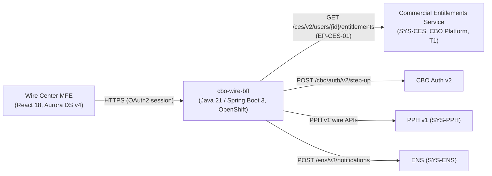
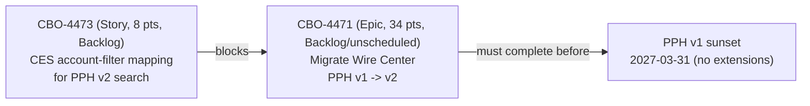

## Overview

The **Commercial Entitlements Service (CES)**, registered as **SYS-CES** in the Payments & Treasury
Technology (PTT) system ownership register, is the authorization and entitlements system of record
for commercial banking users: which users and clients are entitled to which accounts, and which
entitlement types (actions) they may exercise against them. It is consumed synchronously, at request
time, by `cbo-wire-bff` — the backend-for-frontend behind the Crestline Business Online (CBO)
**Wire Center** module — to gate wire actions and to filter wire search/activity results down to the
accounts a given user is entitled to see. CES is rated **Tier 1 (T1, 24x7 critical)**, the same
criticality tier as the Wire Center module itself (`SYS-CBO`) and PRISM Payments Hub (`SYS-PPH`),
reflecting that a CES outage or degradation blocks wire authorization and release across Wire Center
rather than merely degrading a non-critical feature.

CES is also the specific, named blocking dependency for **CBO-4471**, the epic to migrate Wire
Center off the deprecated PPH v1 APIs onto PPH v2 ahead of the 2027-03-31 PPH v1 sunset: see
[CBO-4473 and the migration block](#cbo-4473-the-blocking-dependency-for-the-pph-v2-migration) below
and [CBO-4471: PPH v1→v2 Migration](../projects/cbo-4471-pph-v1-to-v2-migration.md).

## Ownership

| Aspect | Value |
|---|---|
| System ID | SYS-CES |
| Owning team | CBO Platform (a.k.a. "CBO Platform & Entitlements") |
| Technical owner | Nadia Haddad (Engineering Manager, CBO Platform) |
| Tech lead for CES (and SPS) | Arjun Mehta |
| Business owner | Marcus Chen (Director, Digital Treasury Product; Product Owner, CBO Wire Center and Payments & Transfers) |
| Support tier | T1 (24x7 critical) |
| Jira / Slack | Jira CBO (Platform) / `#cbo-platform` |
| Planning factor (CBO Platform & Entitlements team) | 1 point ≈ 6.5 hrs; ~30 points/sprint; intake via Jira CBO (Platform), 2-week triage; ~70% committed as of PI 27.1 |

CES sits in the **CBO Platform** team alongside the **CBO Status Projection Service (SPS)**
(`SYS-CBO-SPS`), which the same tech lead, Arjun Mehta, also owns; the two systems are organizationally
adjacent but functionally distinct — SPS is a Kafka-consumer-backed read model for ACH payment status
projection, while CES is the entitlements/authorization system. CES's business owner, Marcus Chen, is
also the business owner of the Wire Center module itself, reflecting that entitlements for Wire Center
are treated as a Treasury Management product concern, not a purely platform-internal one.

## Role in Wire Center

CES is exposed to `cbo-wire-bff` through a single documented synchronous endpoint,
**EP-CES-01**, `GET /ces/v2/users/{id}/entitlements` — see
[CES Entitlements API (EP-CES-01)](../interfaces/ces-entitlements-api.md) for the endpoint-level
detail. In the Wire Center architecture, this call sits alongside `cbo-wire-bff`'s other standard
per-request dependencies: PPH v1 wire APIs, `POST /cbo/auth/v2/step-up` (step-up authentication on
release), and `POST /ens/v3/notifications` (notifications).

CES serves two distinct purposes for Wire Center, both evaluated at request time rather than cached or
batched by the caller:

1. **Authorization.** `cbo-wire-bff` checks the entitlements CES returns against the entitlement types
   currently in use for Wire Center: `WIRE_VIEW`, `WIRE_INITIATE`, `WIRE_APPROVE`, `WIRE_RELEASE`, and
   `WIRE_TEMPLATE_ADMIN`. Wire release additionally requires step-up authentication and
   client-configured dual approval above client-defined thresholds; these controls are independent of,
   and composed with, the CES entitlement check rather than substitutes for it.
2. **Account-level filtering of results.** Per the Wire Center architecture document, "search results
   are filtered to the user's entitled accounts in the BFF" — filtering by entitled account is
   `cbo-wire-bff`'s responsibility, performed using entitlement data obtained from CES, not a
   capability of the upstream PPH wire-list API itself. Today this combines with a known PPH v1
   limitation: the activity-list endpoint returns up to 500 rows for a client with no server-side
   account filter, so `cbo-wire-bff` fetches by `clientId` from PPH v1 and then applies the
   CES-driven, entitled-account filter client-side (delivered as CBO-4302, R26.3).

## Downstream consumption: `client_hierarchy`

Beyond its synchronous role in Wire Center, CES is one of two upstream sources — together with the
Client Information File (CIF) — feeding the Treasury Data & Insights Platform's `client_hierarchy`
dataset (Confidential - Client; owned jointly by Marcus Chen and Carlos Mendes), which links clients to
accounts for entitlement-aware analytics. This path is **batch and daily**, in contrast to EP-CES-01's
synchronous, per-request role in Wire Center: a CES entitlement change (e.g., a new account granted to
a client's Wire Center relationship) takes effect in Wire Center the next time `cbo-wire-bff` calls
EP-CES-01, but only reaches `client_hierarchy`-derived analytics after the next daily batch refresh.
See [client_hierarchy Dataset](../datasets/client-hierarchy.md) for the dataset-side detail.

## CBO-4473: the blocking dependency for the PPH v2 migration

CES is the named, specific blocking dependency for **CBO-4471** ("Migrate Wire Center from PPH v1 to
PPH v2 APIs," Epic, 34 points, Backlog/unscheduled, owner Tom Becker), which must complete before the
PPH v1 sunset on 2027-03-31 (a hard deadline with no extensions, confirmed by the Payments Architecture
Review Board on 2026-09-08). The blocking item is **CBO-4473** — "CES: account-filter mapping for PPH
v2 search (clientId + entitled accounts)" (Story, 8 points, Backlog, owner Arjun Mehta, CBO Platform &
Entitlements).

The dependency exists because PPH v1 and PPH v2 search have different filtering contracts:

| | PPH v1 list (EP-PPH-02) | PPH v2 search (EP-PPH-05) |
|---|---|---|
| Path | `GET /pph/v1/wires?clientId...` | `GET /pph/v2/payments?clientId&rail&state&from&to&cursor` |
| Server-side account filter | None (max 500 rows, no cursor) | Filters by `clientId` only — not by account |
| How account-level entitlement filtering happens | `cbo-wire-bff` filters client-side using CES entitlements (CBO-4302) | Not yet defined |

Because PPH v2 search, like v1, carries no account-level filter parameter, `cbo-wire-bff` will still
need to apply CES-driven, entitled-account filtering itself after migrating — CBO-4473 is the
as-yet-undelivered story that defines how CES's per-user, per-account entitlement data maps onto a
`clientId`-scoped v2 search so that account filtering continues to work correctly post-migration.
Until CBO-4473 is designed and delivered, CBO-4471 has no concrete starting point and remains in
Backlog (unscheduled), which is why CES's account-filter mapping — not PPH v2 itself — is the critical
path for the entire migration.

As of the 2026-10-05 Jira export, both CBO-4473 and CBO-4471 are unscheduled Backlog items with no
committed delivery date, while PPH-2190 (the cross-consumer PPH v1 sunset tracking epic, owner Kevin
O'Brien) flags `cbo-wire-bff` as the only major PPH v1 consumer that has not started migrating — making
CES's unscheduled account-filter story a live escalation concern for Payments Hub Engineering, not a
dormant backlog item. See
[CBO-4471: PPH v1→v2 Migration](../projects/cbo-4471-pph-v1-to-v2-migration.md) for the full migration
project writeup, including the `PROCESSED`-collapse and `holdReasonDesc` issues that migration is also
expected to help resolve.

## Invariants and operational notes

- **Account-level filtering is a `cbo-wire-bff` responsibility, not a CES responsibility.** CES
  supplies per-user entitlement data; it is `cbo-wire-bff` that applies the filter to search/activity
  results. Any future redesign of CES's response contract (e.g., CBO-4473's mapping) must preserve this
  division of responsibility or explicitly renegotiate it with the CBO Wire Center squad.
- **No documented response schema.** The reviewed architecture and backlog sources describe CES's
  Wire Center-facing endpoint only by path, version, and the two behaviors above (authorization,
  account-level filtering); they do not define a field-level response schema (flat list vs. grouped by
  account vs. paginated). Integration work should confirm the current contract directly with CES/CBO
  Platform rather than assume a shape.
- **T1 blast radius.** As a Tier 1 system, CES degradation has an immediate effect on Wire Center:
  both the authorization checks gating initiate/approve/release/template-admin actions and the
  account-level filtering of every activity-list and search result depend on this dependency
  responding correctly on the request path.
- **Entitlement types documented are Wire Center-specific.** The five entitlement types in active use
  (`WIRE_VIEW`, `WIRE_INITIATE`, `WIRE_APPROVE`, `WIRE_RELEASE`, `WIRE_TEMPLATE_ADMIN`) are the ones
  named in the Wire Center architecture document; the reviewed sources do not describe entitlement
  types for other CES consumers, and this page should not be read as an exhaustive CES entitlement
  taxonomy.
- **CES checks and step-up authentication are independent controls.** Wire release requires both a
  passing CES entitlement check and step-up authentication (plus client-configured dual approval above
  threshold); none of these three controls substitutes for another.

## Related pages

- [CES Entitlements API (EP-CES-01)](../interfaces/ces-entitlements-api.md) — endpoint-level detail
  for `GET /ces/v2/users/{id}/entitlements`, including call pattern, response-schema gaps, and the
  CBO-4473 dependency chain.
- [CBO-4471: PPH v1→v2 Migration](../projects/cbo-4471-pph-v1-to-v2-migration.md) — the migration
  project CES's account-filter mapping blocks.
- [client_hierarchy Dataset](../datasets/client-hierarchy.md) — the batch/analytics consumer of CES
  entitlement data.
