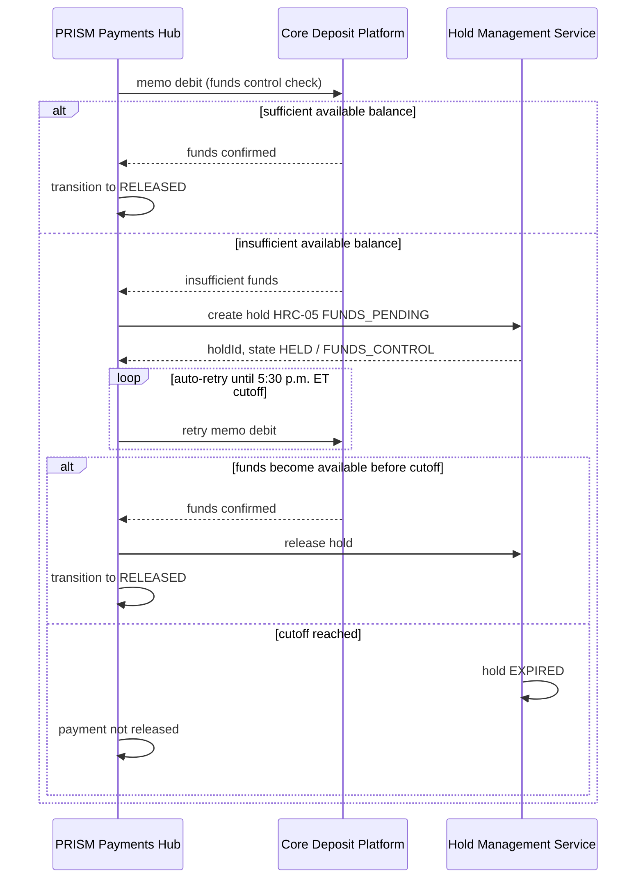

## Overview

The Core Deposit Platform (**SYS-CDP**) is Crestline National Bank's system
of record for deposit accounts (demand deposit accounts / DDAs). It is
registered as a Tier 1 (24x7 critical) system in the Payments & Treasury
Technology (PTT) system ownership register, placing it on the same
criticality tier as the core payment-processing systems — PRISM Payments Hub
(PPH) and the Fedwire and Swift/gpi network gateways — even though CDP itself
sits in the Deposits Technology organization, outside PTT.

CDP has two documented system-level responsibilities in the current estate:

1. **Funds control for outbound wires.** PPH performs a memo debit against
   CDP as part of wire processing; insufficient available balance causes a
   payment hold (hold reason code **HRC-05**, `FUNDS_PENDING`).
2. **Source of the `dda_txn_history` dataset.** CDP's on-us deposit account
   transaction history is fed daily into the Treasury Data & Insights
   Platform (TDIP), where it is the single most restrictively classified
   dataset in the payments domain catalog.

Account-level deposit activity is classified **Restricted - Client
Confidential** under [DUS-07](../policies/dus-07.md), CNB's Data Use & Client
Confidentiality Standard — a narrower and more sensitive category than the
**Confidential - Client** tier applied to wire-payment datasets such as
`pay_wire_txn_hist`.

## Ownership and engagement

| Attribute | Value |
|---|---|
| System ID | `SYS-CDP` |
| Owning team | Deposits Technology |
| Technical owner | Not individually named in the PTT directory (recorded only as "Deposits Tech") |
| Business owner | Mark Sullivan |
| Support tier | T1 (24x7 critical) |

(Source: [CNB-ORG-PTT-2026-06 Organization, System Ownership & Engagement Directory](../../sources/estate/cnb-org-ptt-2026-06-ptt-organization-system-ownership-engagement-directory.md), §4.)

Unlike the other engineering teams in the PTT directory (CBO Wire Center,
Payments Hub Engineering, Payment Networks Engineering, Financial Crimes
Technology, Enterprise Notification Platform, TDIP), **Deposits Technology is
not listed among PTT's own engineering teams** in §3 of the directory; it
appears only as the owning team of `SYS-CDP` in the system register and,
separately, as the **Deposits Data Ownership** partner function (accountable:
Mark Sullivan) in §3.1, described there specifically as responsible for
"Core Deposit Platform datasets (Restricted)." This indicates CDP is
organizationally a partner/adjacent system to PTT rather than a
PTT-engineered one, which is consistent with the directory giving it no named
technical owner, EM, or Jira/Slack channel — unlike every other T1 system in
the register. Cross-team dependency requests involving CDP therefore route
through [Deposits Data Ownership](../teams/deposits-data-ownership.md) /
Mark Sullivan rather than through a PTT engineering intake route.

## Funds control and the HRC-05 hold

PRISM Payments Hub (PPH), CNB's wire orchestration platform, calls CDP as
step 4 of its 7-stage processing pipeline (intake → validation & enrichment →
screening → **funds control** → release → network → close). PPH performs a
memo debit against CDP to confirm available balance before releasing a wire.

*PPH's funds-control retry loop against CDP, driving the HRC-05 hold lifecycle until the 5:30 p.m. ET same-day domestic cutoff.*

Key facts about this flow:

- PPH's internal lifecycle has a dedicated state, **`FUNDS_CONTROL`**
  ("Awaiting available balance"), shown to v1 API consumers only as the
  coarser `PENDING` status.
- The Hold Management Service (HMS), part of the Payment Risk & Screening
  Platform (PRSP), is the system of record for the hold itself: it assigns
  reason code **HRC-05** (`FUNDS_PENDING`, mnemonic tier **C** —
  client-actionable), which accounts for roughly 14% of all payment holds.
  PPH retries the CDP funds check automatically until the CBO same-day
  domestic wire cutoff of **5:30 p.m. ET**; per the HMS hold lifecycle, HRC-05
  (like HRC-01 and HRC-02) auto-cancels (`EXPIRED`) if funds are not
  confirmed before the client response window closes.
- The client-facing copy for HRC-05 (`COPY-HOLD-FUND-01`) is: *"This wire is
  waiting for available funds. It will be retried until 5:30 p.m. ET."* The
  permitted client action is simply to fund the account; CDP and PPH do not
  expose a client-facing attestation or override for this hold type.
- CDP is not itself part of the PRSP/HMS codebase; it is only the external
  balance source that PPH's funds-control stage checks. HMS owns the hold
  record, reason taxonomy, and disposition controls documented in
  PRSP-HMS-3.4.

## Incoming wire posting and notifications

CDP is also the system that posts incoming wires to deposit accounts: it is
recorded as the producer of the **`TRS.WIRE.INCOMING_POSTED`** event
("Incoming wire posted to DDA") in the Enterprise Notification Service (ENS)
Treasury event catalog, templated as `TPL-WIRE-IN-03` ("Incoming wire
received") and live in production. This is the only ENS event type in the
Treasury catalog produced directly by CDP rather than by CBO or CBO SPS; all
other live Treasury events describe outbound wire or ACH state changes
originating in the payments channel/hub stack.

## The `dda_txn_history` dataset

CDP is the source system for **`dda_txn_history`**, cataloged in TDIP's
payments domain:

| Attribute | Value |
|---|---|
| Dataset | `dda_txn_history` |
| Source | Core Deposit Platform (`SYS-CDP`) |
| Refresh | Daily |
| History retained | 7 years |
| Classification | **Restricted - Client Confidential** |
| Data owner / steward | Mark Sullivan / Deposits Data Engineering |

(Source: [TDIP-CAT-2026.2 Data Catalog Extract](../../sources/estate/tdip-cat-2026.2-treasury-data-and-insights-platform-data-catalog-extract.md), §2.)

`dda_txn_history` is the only Restricted-tier dataset among the six
payments-domain datasets in the TDIP catalog; the others (`pay_wire_txn_hist`,
`gpi_tracker_events`, `client_hierarchy`) are Confidential - Client or
(`cbo_wire_events`) Internal. Its daily refresh is also the slowest cadence in
the catalog alongside `client_hierarchy`, compared to hourly or nightly feeds
for the wire datasets.

Downstream, `dda_txn_history` joins with `pay_wire_txn_hist` (incoming wires
to CNB accounts) to build the **`beneficiary_behavior_profile`** feature
table (grain: on-us beneficiary account x day), which is itself Restricted -
Client Confidential and whose sole registered permitted purpose is supplying
mule-risk behavioral features (`bene_median_hours_to_outflow`,
`bene_outflow_ratio_24h`, `bene_new_counterparties_30d`) to the Financial
Crimes Technology model **M-FCT-0034** under MRM-POL-02. No other feature
table or Insights API endpoint in the current TDIP catalog reads from
`dda_txn_history`; it has no documented path into any client-facing dashboard
or analytic surface.

Because `dda_txn_history` is Restricted, DUS-07's purpose-limitation rule
("feature tables inherit the permitted purpose of their most restrictive
input") applies transitively: any new feature table or Insights API use built
on CDP-sourced data would inherit the Restricted tier and the narrow
permitted purpose approved for deposit-account data, not a lower, averaged
classification. See [`dda_txn_history` dataset](../datasets/dda-txn-history.md)
for the full lineage and governance analysis.

## Access governance

Access to CDP-sourced data in TDIP is governed through Collibra, the
platform's access-governance tool. Because `dda_txn_history` and anything
derived from it carry the Restricted classification, requests additionally
require Privacy Office approval via the Collibra Data Access Request (DAR)
process, published with a **15-business-day** SLA — longer than the standard
TDIP intake lead time for Confidential or Internal datasets. Any proposed new
client-facing or product use of CDP-sourced data would additionally require a
Privacy Impact Assessment (~4 weeks) and, per DUS-07 §7, uses of
financial-crimes-purpose data outside FCC purposes are generally not
approved.

## What this page does not cover

The reviewed estate documents CDP only as an external dependency of PPH
(funds control, incoming-wire posting) and as the source system for
`dda_txn_history`; they do not describe CDP's own internal architecture,
account data model, posting engine, or the specific protocol/API PPH uses for
the memo debit call. Those details should be treated as open questions for
Deposits Technology / Mark Sullivan rather than inferred from the
Payments-side documentation reviewed here.

## Related pages

- [`dda_txn_history` dataset](../datasets/dda-txn-history.md)
- [Deposits Data Ownership team](../teams/deposits-data-ownership.md)
- [DUS-07 Data Use & Client Confidentiality Standard](../policies/dus-07.md)
