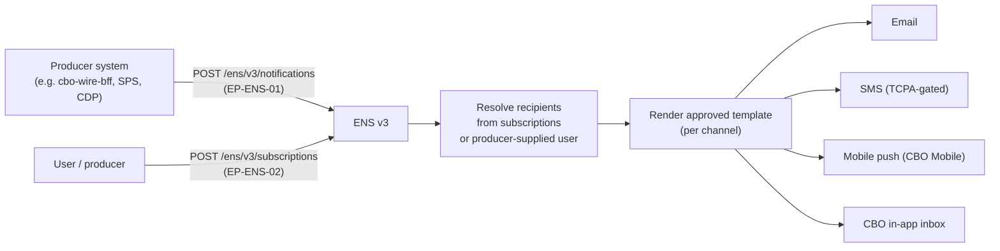
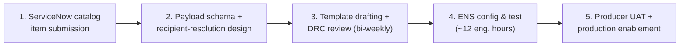

## Overview

The **Enterprise Notification Service** (ENS, system ID `SYS-ENS`) is Crestline National
Bank's shared platform for sending transactional notifications across **email, SMS, mobile
push** (CBO Mobile), and the **CBO in-app inbox**. It is a multi-tenant, cross-domain
service: any producer system across the bank — not just Treasury/Payments — registers an
**event type**, and ENS resolves recipients from **subscriptions**, renders an approved
**template**, and delivers per the recipient's channel preferences. Within the Treasury
(TRS) domain relevant to wire and ACH tracking, the current producers are the CBO Wire
Center backend (`cbo-wire-bff`), the CBO Status Projection Service (SPS), and CDP (incoming
wire posting). See [ENS Notification API & TRS Event Catalog](../interfaces/ens-notification-api-trs-catalog.md)
for the full API contract and event table.

ENS is owned by **Melissa Grant** (EM, Enterprise Notification Service), approved by
**Sanjay Iyer** (Director, Enterprise Notification Platform). The governing reference is
**ENS-INT-3.2** ("Enterprise Notification Service - Integration Guide & Treasury Event
Catalog"), version 3.2, published 2026-07-30, classified INTERNAL – CONFIDENTIAL.

*Producers emit registered events; ENS resolves recipients, renders approved templates, and fans out across channels.*

## Responsibilities and platform limits

ENS's responsibility is strictly: accept a registered event, resolve who should see it, and
deliver an approved rendering of it per channel preference. It does not own payment,
account, or case state — producers remain the system of record for the underlying business
event, and ENS is a downstream delivery layer only.

| Capability | Value |
|---|---|
| Throughput | 300 msgs/s sustained, 1,200 msgs/s burst (platform-wide); Treasury (TRS) domain quota capped at 120 msgs/s |
| Delivery latency (p95, push/in-app) | 4 s |
| SMS | Requires a TCPA consent flag on the CBO user profile; 160-character template limit |
| Masking | Account numbers masked to last 4 digits; no Restricted-tier data in any payload or template |

The TRS domain quota (120 of 300–1,200 msgs/s) means Treasury producers share a bounded
slice of platform capacity; a new high-volume TRS event type is constrained by this quota,
not just by onboarding lead time. The masking and Restricted-data prohibition are the same
confidentiality boundary enforced across CNB's client-communication surfaces — see
[POL-FCC-014](../policies/pol-fcc-014.md) for the controlling policy on what may ever reach
a client-facing channel.

## Event onboarding process

Registering a new event type (for any producer, any domain) is a fixed five-step process
with a published **6-week SLA** from complete submission to production:

1. **Submit** the ServiceNow catalog item "ENS Event Onboarding" (catalog owner: Paul
   Henderson).
2. **Define** the payload schema and recipient-resolution logic (subscription filters).
3. **Draft templates** per channel and submit them to the **Disclosure Review Committee
   (DRC)**, which reviews bi-weekly.
4. **ENS configuration and test** — approximately 12 ENS engineering hours per event type.
5. **Producer integration testing** in UAT, followed by production enablement.

*Fixed five-step onboarding pipeline; the published SLA is 6 weeks end to end, including DRC review.*

Two operational constraints bound this pipeline:

- **DRC cadence is a hard gate.** Because the Disclosure Review Committee meets only
  bi-weekly, any template requiring a second review cycle adds roughly two weeks beyond the
  nominal SLA — a single missed or rejected DRC slot can materially extend time to
  production regardless of how fast ENS engineering and the producer move.
- **Year-end change freeze.** Requests submitted after **2026-11-20** are scheduled after
  the year-end change freeze, meaning any current TRS catalog gap (see below) that is not
  already in onboarding by that date cannot close before the freeze lifts.

Templates covering financial-crimes-related states must use FCC-approved copy per
[POL-FCC-014](../policies/pol-fcc-014.md) Appendix B, and status wording in any template
must follow the producer's own approved status terminology (for Wire Center, CBO's
client-facing labels, not raw PPH v1 status values) rather than ENS inventing its own
phrasing. Templates and links must never expose transaction data outside an authenticated
session.

## Subscription model and its limits

Subscriptions are created **per user, per event type**, with two optional filters:
`accountId` and an amount threshold. This is the entire granularity ENS supports today —
there is no field for an individual entity identifier such as a specific `paymentId` or
`caseId`. A subscription to, for example, `TRS.WIRE.RELEASED` on an account matches *every*
qualifying wire on that account; it cannot be scoped to one wire a user is specifically
tracking.

Because of this limit, producers that need to reach a specific, pre-resolved recipient for
a single transactional event (rather than everyone whose coarse subscription happens to
match) use a documented workaround — the **"producer-resolved recipients"** pattern: the
producer itself maintains the recipient list and calls `POST /ens/v3/notifications`
directly for a named user, bypassing ENS subscription matching entirely. This pattern
underlies all of Wire Center's live `TRS.WIRE.*` notifications today.

Entity-level subscriptions (subscribing to one `paymentId` or `caseId` directly) are
planned under **[ENS-1120](../projects/ens-1120-entity-level-subscriptions.md)**, targeted
**2027-H1**, owned by Melissa Grant. As of the latest estate snapshot, ENS-1120 is a
one-line roadmap entry with no linked design, sub-phases, or committed sprint — closing the
subscription-granularity gap alone would not be sufficient to deliver a client-facing
held-wire notification, since a registered event type and an event-driven trigger would
still be required; see that page for the full gap analysis.

## Treasury (TRS) event catalog and gaps relevant to wire tracking

ENS's Treasury event catalog (full table and current producers in
[ENS Notification API & TRS Event Catalog](../interfaces/ens-notification-api-trs-catalog.md))
covers six live event types — four wire (`TRS.WIRE.APPROVAL_REQUIRED`,
`TRS.WIRE.RELEASED`, `TRS.WIRE.REJECTED`, `TRS.WIRE.INCOMING_POSTED`) and two ACH
(`TRS.ACH.STATUS_CHANGED`, `TRS.ACH.RETURN_RECEIVED`). ENS-INT-3.2 states, verbatim, that
**no event types are registered for wire network acceptance, beneficiary credit (gpi
`ACCC`), wire returns, gpi milestones, or client action required on held wires.**

These gaps are a consequence of what producers can currently feed ENS, not an ENS platform
limitation: Wire Center consumes only the coarse PPH v1 status set and has no UETR, OMAD, or
gpi milestone data to put in an event payload even if the event type existed; gpi status is
visible only to Payment Operations tooling and is not wired into any CBO or ENS flow; and
held wires carry no hold-reason or client-action data in Wire Center today. Closing any of
these catalog gaps therefore requires producer-side plumbing — a PPH v2 migration, a
wire-capable Status Projection Service mapping module, or both — in addition to the
standard ENS onboarding pipeline described above; see the interface page for the detailed
gap-to-architecture mapping.

## APIs

| ID | Endpoint | Purpose |
|---|---|---|
| EP-ENS-01 | `POST /ens/v3/notifications` | Send an event (must be a registered event type with an approved template) |
| EP-ENS-02 | `POST /ens/v3/subscriptions` | Create a subscription (`eventType` + `accountId` filter) |
| EP-ENS-03 | `GET /ens/v3/event-types?domain=TRS` | Read the TRS event-type catalog |

Full request/response shapes, the TRS producer-by-producer breakdown, and a sequence
diagram of Wire Center's notification flow are documented in
[ENS Notification API & TRS Event Catalog](../interfaces/ens-notification-api-trs-catalog.md).

## Related pages

- [ENS Notification API & TRS Event Catalog](../interfaces/ens-notification-api-trs-catalog.md) — API contracts, full TRS event table, and the catalog-gap-to-architecture analysis.
- [ENS-1120: Entity-Level Subscriptions](../projects/ens-1120-entity-level-subscriptions.md) — planned subscription-model work and why it alone does not close the held-wire notification gap.
- [POL-FCC-014](../policies/pol-fcc-014.md) — controlling policy on disclosure tiers, status terminology, and FCC-approved copy that constrains ENS templates.
