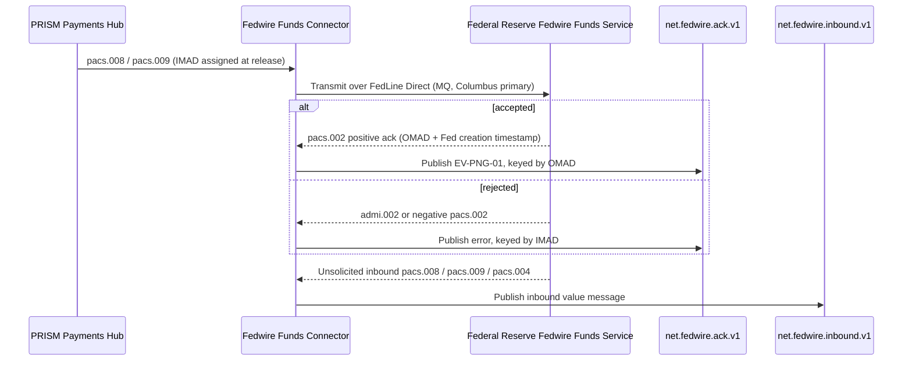
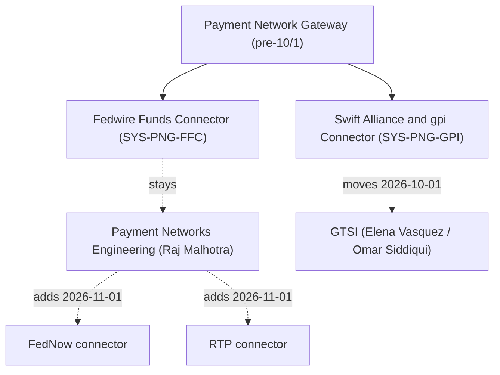

## Overview

The **Fedwire Funds Connector (FFC, SYS-PNG-FFC)** is the Fedwire-facing module of the
**Payment Network Gateway (PNG)**. It owns Crestline National Bank's (CNB) connectivity to the
Federal Reserve's Fedwire Funds Service: building and transmitting outbound ISO 20022 value
messages, receiving and publishing inbound value messages, and turning the Fed's acknowledgments
into the `net.fedwire.ack.v1` and `net.fedwire.inbound.v1` Kafka topics that downstream systems
consume. FFC is built, owned, and operated by **Payment Networks Engineering (PNE)**, under
Director Raj Malhotra, with Chen Wei as the Fedwire technical owner and Brian Walsh as engineering
manager; PNE's on-call (T1) and `#payment-networks` provide support. See
[Payment Networks Engineering](../teams/payment-networks-engineering.md) for the team's full
ownership map.

PNG has a sibling module, the **Swift Alliance & gpi Connector (GPI-C, SYS-PNG-GPI)**, which
handles the international/Swift CBPR+ rail. FFC and GPI-C were historically documented and operated
together as the two halves of PNG, but — as described below — they diverged organizationally on
2026-10-01. FFC's only consumer today is **PRISM Payments Hub (PPH)**, which orchestrates the full
wire lifecycle and hands PPH-built value messages to FFC for transmission at the `RELEASED` stage.
See [Fedwire Funds Service](../concepts/fedwire-funds-service.md) for the rail itself and PPH's
lifecycle position relative to it.

## Connectivity and message formats

FFC reaches the Federal Reserve over **FedLine Direct**, using dual MQ channels: Columbus as the
primary site and Charlotte as contingency. FedLine Advantage serves as a separate business-
continuity path, independent of the primary MQ channels.

Since the Federal Reserve's **single-day ISO 20022 cutover on 2025-07-14** (which retired the
legacy FAIM message format outright, with no coexistence period), FFC exchanges only ISO 20022
message types with the Fed:

| Direction | Message types |
|---|---|
| Outbound (CNB → Fed) | `pacs.008` (customer credit transfer), `pacs.009` (FI transfer), `pacs.004` (return), `camt.056` (return request), `camt.110` (investigation) |
| Inbound (Fed → CNB) | `pacs.008` / `pacs.009` / `pacs.004` (published to `net.fedwire.inbound.v1`), `pacs.002` positive and negative acknowledgments, `admi.002` technical/business errors |

FFC does not originate payment content itself — PPH builds the outbound `pacs.008`/`pacs.009` at
release, assigning the sender-side **IMAD** (Input Message Accountability Data) at that point — FFC
is the transmission and acknowledgment-handling boundary between PPH and the Fed. See
[ISO 20022 Payment Messages](../concepts/iso20022-payment-messages.md) for the message family in
general and [IMAD and OMAD](../concepts/imad-omad.md) for the identifier pair FFC's acknowledgment
path produces.

## Acknowledgment handling

For every accepted outbound value message, the Federal Reserve returns a **`pacs.002`** carrying
the Fed-assigned **OMAD** (Output Message Accountability Data) and a Fed creation timestamp. FFC
publishes this acknowledgment to **`net.fedwire.ack.v1`** (catalog event **EV-PNG-01**). Errors —
`admi.002` technical/business rejects, or a negative `pacs.002` — are published on the same topic
but keyed by the original **IMAD**, since a rejected message carries no OMAD.

Acceptance by the Fedwire Funds Service is **final and irrevocable settlement** between the sending
and receiving banks under Regulation J (and UCC Article 4A). The Federal Reserve does **not**
report, and the `pacs.002` does **not** imply, that the receiving bank has credited the
beneficiary's account — that confirmation, if it ever surfaces to Crestline, comes from the
receiving bank's own channels, not from Fedwire. This distinction is the reason PPH models its
`NETWORK_ACCEPTED` lifecycle state as an interbank-settlement signal rather than a payment-complete
signal; see
[Settlement/Release/Completed semantics](../concepts/settlement-release-completed-semantics.md).

Observed acknowledgment latency and reject volume (Q3-2025, PNE-reported):

| Metric | Value |
|---|---|
| Median Fed acknowledgment latency (send to `pacs.002`) | 4.2 s |
| Median PPH `RELEASED` to Fed acceptance (incl. queueing) | 6 min |
| Fed technical/business rejects (`admi.002` / negative `pacs.002`) | 0.07% of messages |

### Control flow: outbound release through acknowledgment

This shows FFC's two core jobs: transmitting PPH-built outbound value messages and translating the
Fed's acknowledgment (or rejection) into `net.fedwire.ack.v1`, alongside its independent job of
republishing unsolicited inbound Fed traffic onto `net.fedwire.inbound.v1`.

## Topics and access control

FFC produces exactly two Kafka topics, and PNE owns the Kafka ACLs for both — any new consumer,
inside or outside PNE, requires an explicit ACL grant from PNE:

| Topic | Producer | Content | Authorized consumer(s) | ACL owner |
|---|---|---|---|---|
| `net.fedwire.ack.v1` | FFC | Fed acknowledgments: positive `pacs.002` (OMAD + Fed timestamp) and errors (`admi.002`, negative `pacs.002`, keyed by IMAD) | PPH | PNE |
| `net.fedwire.inbound.v1` | FFC | Inbound value messages: `pacs.008`, `pacs.009`, `pacs.004` | PPH | PNE |

PPH is the only authorized consumer of either topic today. Both topics are described in full,
including their currently-parked backlog consumers (a PPH v2 settlement object and a TDIP
ingestion), in [Fedwire Network ACK Topics](../interfaces/fedwire-network-ack-topics.md).

## Operations

- **Monitoring**: Splunk dashboards `PNG-FFC-*`.
- **Change windows**: Saturday 22:00–02:00 ET, shared with the rest of PNG.
- **Business continuity**: FedLine Advantage stands by as the contingency path behind the primary
  FedLine Direct MQ channels (Columbus primary / Charlotte contingency).

## The 2026-10-01 cross-border network re-org: what moved, what did not

Effective **2026-10-01**, the Office of the CIO (Payments & Treasury Technology) consolidated
cross-border network capabilities under Global Transaction Services Integration (GTSI), per
**CNB-MEMO-2026-09**. This re-org moved several PNG-adjacent capabilities out of PNE, but FFC was
explicitly carved out and **did not move**:

| Capability | From | To | Moved? |
|---|---|---|---|
| Swift Alliance Gateway, gpi Connector (SYS-PNG-GPI), gpi Tracker integration | PNE (Raj Malhotra) | GTSI (Elena Vasquez; Omar Siddiqui EM, Hannah Lindqvist Tech Lead) | Yes |
| Swift API gateway (Microgateway), SwiftNet PKI service accounts | PNE | GTSI (Hannah Lindqvist) | Yes |
| International wire tracking roadmap (incl. client-facing gpi capability) | PNE | GTSI (Elena Vasquez; sponsor Laura Kim) | Yes |
| **Fedwire Funds Connector (SYS-PNG-FFC)**, incl. `net.fedwire.ack.v1` and `net.fedwire.inbound.v1` | — | — | **No — remains with PNE** under Raj Malhotra (Brian Walsh, EM) |

Because FFC is a purely domestic-rail module with no Swift/gpi dependency, it was unaffected by the
GTSI consolidation, which targeted only the Swift/CBPR+ and gpi Tracker surfaces of PNG (now
SYS-PNG-GPI, operated independently of FFC under GTSI). The memo also records that:

- Tomasz Nowak (Senior Engineer, gpi Connector) transferred to GTSI, reporting to Omar Siddiqui;
  FFC's engineering staffing was not affected.
- PNE on-call remains **secondary** support for SYS-PNG-GPI only until 2026-12-15, when knowledge
  transfer (GTSI-0112) completes — this transitional arrangement does not touch FFC, for which PNE
  remains primary and sole support throughout.
- Separately, **Raj Malhotra (PNE) assumes ownership of the FedNow and RTP connectors from
  2026-11-01** — an expansion of PNE's domestic real-time-rail scope that sits alongside, but is
  organizationally and technically distinct from, FFC's existing Fedwire-only responsibility as of
  this writing.
- New requests for gpi data, Swift Tracker usage, or international wire status capabilities must be
  raised in Jira project **GTSI**, not PNG; requests already logged against PNG for Fedwire-specific
  work are unaffected and remain PNE's to triage.

What this shows: the two former PNG modules split across teams on 2026-10-01, while PNE's domestic
real-time-rail footprint actually grows a month later with FedNow and RTP.

## Relationships and invariants

- **PPH is FFC's only upstream and downstream counterpart.** PPH builds outbound value messages and
  assigns IMAD at release; FFC transmits them and is the sole source of OMAD and the Fed's own
  acceptance timestamp, which exist nowhere else in the estate outside `net.fedwire.ack.v1` and
  PPH's own v2 `identifiers.omad` field once consumed.
- **FFC never confirms beneficiary credit.** Its acknowledgment path terminates at interbank
  settlement; any claim that a wire has reached the beneficiary must come from a source other than
  FFC or the Fed.
- **PNE is the single ACL owner for both FFC topics**, independent of any other team's involvement
  in PNG generally; a consumer gap (e.g., TDIP not yet ingesting `net.fedwire.ack.v1`) is a PNE ACL
  and sponsorship question, not an FFC capability gap — FFC already publishes the data.
- **FFC is organizationally decoupled from GPI-C** since 2026-10-01: changes to Swift/gpi tracking
  capability, ownership, or roadmap at GTSI have no bearing on FFC's connectivity, message formats,
  or topic contracts, and vice versa.

## Related pages

- [IMAD and OMAD](../concepts/imad-omad.md) — the identifier model FFC's acknowledgment handling
  produces.
- [Fedwire Network ACK Topics](../interfaces/fedwire-network-ack-topics.md) — full topic reference
  for `net.fedwire.ack.v1` and `net.fedwire.inbound.v1`, including consumers and backlog gaps.
- [Fedwire Funds Service](../concepts/fedwire-funds-service.md) — the Federal Reserve rail FFC
  connects to, including operating hours, cutoffs, and settlement semantics.
- [Payment Networks Engineering](../teams/payment-networks-engineering.md) — the owning team and its
  post-re-org scope, including the FedNow/RTP connector additions.
