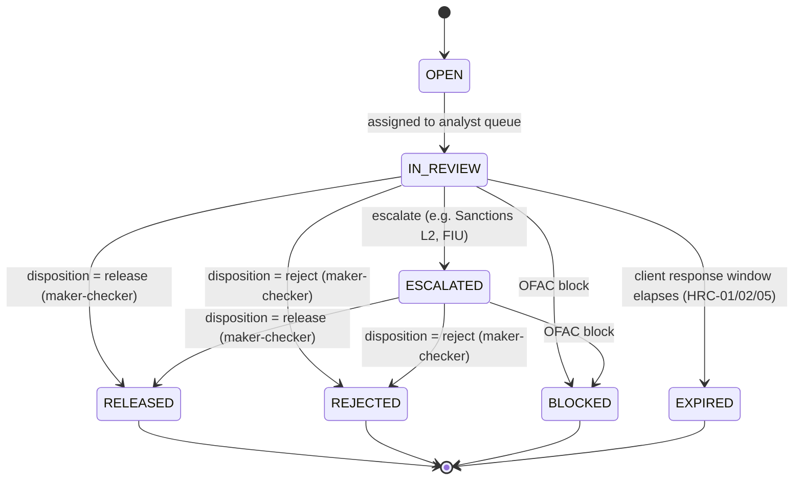
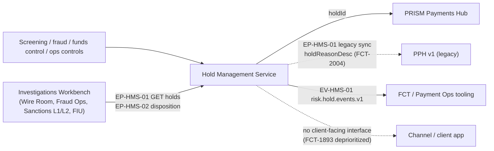

## Overview

The Hold Management Service (HMS) is the system of record for holds placed
on outbound payments. It is part of the **Payment Risk & Screening Platform
(PRSP)**, alongside **Sentinel Fraud Scoring** (a vendor fraud model, MRM ID
`M-FCT-0021`) and **SanctionScreen** (OFAC and other sanctions-list
screening). HMS is owned by Financial Crimes Technology (FCT); its design of
record is `PRSP-HMS-3.4` ("Hold Management Service: Design & Hold Reason
Taxonomy"), classified **RESTRICTED - FINANCIAL CRIMES**, document owners
Daniel Kowalski (Tech Lead) and Grace Mensah (EM), approved by Victor Petrov
(Director, FCT) and reviewed by FCC Policy & Advisory.

HMS's responsibilities are narrow and specific:

- Hold **creation**: when screening, fraud, funds-control or operational
  controls flag an outbound payment, HMS creates a hold record and returns a
  `holdId` to [PRISM Payments Hub (PPH)](prism-payments-hub.md), which
  transitions the payment to its `HELD` state.
- Hold **classification**: every hold is assigned one of twelve Hold Reason
  Codes (HRC-01 through HRC-12) and one of four disclosure tiers (P/C/G/R)
  defined by [POL-FCC-014](../policies/pol-fcc-014.md).
- Hold **casework and disposition**: HMS work queues are surfaced to Payment
  Operations and the Financial Intelligence Unit (FIU) through the
  Investigations Workbench (IWB), which is the sole channel through which a
  hold is released, rejected, or escalated.
- Hold **confidentiality**: HMS is the boundary that keeps restricted
  investigative detail (HRC mnemonics, fraud scores, sanctions-match
  confidence, analyst notes) out of client-facing systems, as mandated by
  [ADR-PAY-021](../decisions/adr-pay-021.md).

This page documents **RESTRICTED - FINANCIAL CRIMES** sourced material from
`PRSP-HMS-3.4` faithfully, including hold mnemonics, descriptions, tiers and
queue-routing detail that the source standard itself classifies Restricted.
None of the mnemonic/description/tier content below is client-facing copy;
see [Hold Reason Taxonomy (HRC) and Disclosure Tiers](../concepts/hold-reason-taxonomy-disclosure-tiers.md)
for the merged view with POL-FCC-014's approved copy keys and permitted
client actions.

## Hold lifecycle

| State | Description |
|---|---|
| `OPEN` | Hold created; payment held in PPH state `HELD` |
| `IN_REVIEW` | Assigned to an analyst (Wire Room, Fraud Ops, Sanctions L1/L2, FIU) |
| `ESCALATED` | Escalated (e.g., to Sanctions L2, FIU) |
| `RELEASED` | Disposition = release (maker-checker); PPH resumes processing |
| `REJECTED` | Disposition = reject; PPH cancels the payment |
| `BLOCKED` | OFAC blocking; funds moved to a blocked account; reported to OFAC within 10 business days (31 CFR 501.603) |
| `EXPIRED` | Auto-cancel after the client response window elapses (applies to HRC-01/02/05) |

*A hold always starts `OPEN` and ends in exactly one of `RELEASED`,
`REJECTED`, `BLOCKED`, or `EXPIRED`. Disposition transitions out of
`IN_REVIEW`/`ESCALATED` are gated by maker-checker under `CTRL-PAY-012`.*

Overall volume is roughly 410 holds per business day, about 2.6% of outbound
wires. Reported median time-to-disposition: HRC-01 ≈ 47 min; HRC-02 ≈ 2 h 10
min; HRC-07 ≈ 1 h 35 min; HRC-09 ≈ 3 h 20 min; HRC-10 1-5 business days. None
of these durations may ever be surfaced to a client for tier G or R holds
(`CTRL-PAY-040`, below).

## Hold reason taxonomy and disclosure tiers

Disclosure tiers are defined by [POL-FCC-014](../policies/pol-fcc-014.md): **P**
= public status, **C** = client-actionable, **G** = generic review, **R** =
restricted. This table reproduces `PRSP-HMS-3.4` §3 faithfully, because
accurate internal use of this taxonomy (routing, casework, control design)
depends on the exact mnemonics, descriptions and tiers as specified in the
restricted source, not a sanitized paraphrase:

| Code | Mnemonic | Description | Tier | Share of holds |
|---|---|---|---|---|
| HRC-01 | DUP_SUSPECT | Possible duplicate of a recent wire (same beneficiary/amount/date window) | C | 22% |
| HRC-02 | CALLBACK_REQUIRED | Out-of-band callback verification for new/changed beneficiary above threshold | C | 18% |
| HRC-03 | LIMIT_EXCEEDED | Client daily / per-transaction limit exceeded | C | 9% |
| HRC-04 | CUTOFF_WAREHOUSED | Received after Fedwire customer cutoff (6:00 p.m. ET) or future-dated | P | 6% |
| HRC-05 | FUNDS_PENDING | Insufficient available balance at funds control | C | 14% |
| HRC-06 | REPAIR_REQUIRED | Message repair (e.g., structured postal address, invalid routing/BIC) | C | 11% (forecast ~16% after Nov-2026 address enforcement) |
| HRC-07 | FRAUD_MODEL_HIGH | Sentinel fraud score above threshold | R | 8% |
| HRC-08 | ATO_SUSPECT | Session / device anomalies indicating possible account takeover | R | 1% |
| HRC-09 | SANCTIONS_REVIEW | SanctionScreen potential match pending L1/L2 review | R | 7% |
| HRC-10 | AML_REVIEW | Unusual activity review by FIU | R | 2% |
| HRC-11 | LEGAL_HOLD | Legal process / law enforcement request | R | <0.5% |
| HRC-12 | OPS_MANUAL_REVIEW | Large-value or exception manual review by Wire Room | G | 1.5% |

**Tiers G and R may never be shown to a customer as anything other than an
identical, generic "being reviewed" message.** Per `PRSP-HMS-3.4` and
POL-FCC-014 §5.1(1)-(2), this means HRC-07 (FRAUD_MODEL_HIGH), HRC-08
(ATO_SUSPECT), HRC-09 (SANCTIONS_REVIEW), HRC-10 (AML_REVIEW), and HRC-11
(LEGAL_HOLD) — tier R — must be presented **indistinguishably** from HRC-12
(OPS_MANUAL_REVIEW) — tier G: same label, icon, color, copy, actions, and
absence of timing information, so that a client cannot infer the nature of a
review from how it is presented. Only tiers P and C may ever carry
code-specific client language, and even then only through an
FCC-pre-approved copy key, never the raw mnemonic or description above. See
[Hold Reason Taxonomy (HRC) and Disclosure Tiers](../concepts/hold-reason-taxonomy-disclosure-tiers.md)
for the full copy-key and permitted-action mapping per code.

## Data handling

- Hold **`description`** and **`analystNotes`** are classified Restricted.
  Descriptions are generated from rule templates and typically embed the HRC
  mnemonic plus investigative context, for example: `FRAUD_MODEL_HIGH sc=9xx
  L1 queue`, `SANCTIONS_REVIEW name match 0.91 L2`, or `Possible duplicate of
  PPH260924...`. These strings are internal casework inputs, never a source
  for client-facing copy.
- **The 2019 HMS-to-PPH v1 `holdReasonDesc` sync predates ADR-PAY-021 and
  remains active.** Since 2019, HMS has synchronized its free-text hold
  `description` into legacy PPH v1's `holdReasonDesc` field for backward
  compatibility with the Wire Room console. This sync was already in place
  when [ADR-PAY-021](../decisions/adr-pay-021.md) (2025-04-08) established
  that hold reason codes, descriptions, scores and analyst notes must never
  be exposed to PPH v2, channels, or data platforms; it is retained as a
  documented, time-boxed exception for PPH v1 only and is **not** extended to
  v2. It remains active until the PPH v1 sunset (2027-03-31, no extensions
  per the 2026-09-08 ARB decision). The leakage risk this sync represents is
  tracked as open risk **FCT-2004** — PPH v1's `holdReasonDesc` may expose
  HRC mnemonics and analyst notes to whatever downstream system consumes PPH
  v1 (for example, the CBO Wire Center's `WC_HOLD_TOOLTIP` tooltip, tracked
  separately as CBO-4388). Remediation options under consideration are
  stopping the sync or redacting at the API gateway; the v1 sunset may moot
  the issue by retiring the field entirely.
- The event topic `risk.hold.events.v1` is restricted to FCT and Payment
  Operations tooling. **Channel applications are not authorized consumers**
  of this topic, regardless of hold tier.

## Interfaces

| ID | Interface | Callers | Notes |
|---|---|---|---|
| `EP-HMS-01` | `GET /prsp/hms/v1/holds?paymentId=` | IWB; PPH (legacy sync) | Returns `hrcCode`, `category`, `description`, `analystNotes`, `slaDueTs` |
| `EP-HMS-02` | `POST /prsp/hms/v1/holds/{holdId}/disposition` | IWB only | Role `HOLD_RELEASER`; maker-checker (`CTRL-PAY-012`) |
| `EV-HMS-01` | `risk.hold.events.v1` | FCT / Ops tooling | Restricted |

There is currently **no client-facing interface** into HMS. Proposal
**FCT-1893** ("Client-Safe Hold Status Facade", 21 points, deprioritized
2025-Q3) would add `GET /prsp/hms/v1/holds/{holdId}/client-view`, returning
only disclosure tier, an approved copy key, and permitted client actions — it
has not been built. A client attestation endpoint does not exist either; the
only client self-service resolution path in production is the narrow
HRC-01-only digital-attestation flow under `CTRL-PAY-031` (below). Full
interface detail, authorized-caller lists, and failure modes are documented
on [HMS Hold API & Hold Events](../interfaces/hms-hold-api.md).

*HMS creates and classifies holds, is worked exclusively through IWB, and has
no production interface reachable by a channel or end client, aside from the
tracked PPH v1 `holdReasonDesc` leak (FCT-2004).*

## Controls

These four controls are reproduced verbatim from `PRSP-HMS-3.4` §6, because
their exact wording determines what engineering and operations may and may
not build around hold disposition and disclosure:

| Control | Requirement |
|---|---|
| `CTRL-PAY-012` | Release/reject dispositions require maker-checker by users with `HOLD_RELEASER` role. |
| `CTRL-PAY-018` | Callback verification (HRC-02) must be completed by phone to a contact on file obtained independently of the payment instruction or the requesting session. Confirmations received through the channel that initiated the payment do not satisfy this control. |
| `CTRL-PAY-031` | (Updated 2026-06 following pilot FCT-1951) Duplicate-suspect holds (HRC-01) may be resolved by client attestation through a digital channel, subject to step-up authentication of an entitled user. Attestation for amounts above $5,000,000 still requires Wire Room release. Applies to HRC-01 only. |
| `CTRL-PAY-040` | No client-facing estimate of release time may be provided for holds in tiers G or R. |

`CTRL-PAY-012` is enforced at `EP-HMS-02` and is the only path by which a
hold leaves `IN_REVIEW`/`ESCALATED`. `CTRL-PAY-018` and `CTRL-PAY-031` are
the two controls that gate the only client-resolvable hold types (HRC-02 and
HRC-01 respectively); `CTRL-PAY-031` is explicitly scoped to HRC-01 and does
not generalize to any other HRC code. `CTRL-PAY-040` applies regardless of
whether a future client-facing facade (FCT-1893 or a successor) is ever
built — internally tracked median disposition times must never become a
client-visible estimate for tier G or R holds.

## Sanctions-specific handling

Where a payment is blocked or rejected for sanctions reasons, Sanctions
Operations — not any channel — notifies the client in writing per the
Sanctions Operations Procedure, and reports the action to OFAC (blocked
payments under 31 CFR 501.603; rejected payments under 31 CFR 501.604).
**Channels must not communicate screening outcomes** under any
circumstance; this is strictly tighter than the general tier-based
disclosure model that applies to other hold types, because even an
FCT-1893-style facade would not be a permitted channel for a sanctions
block/reject notification.

## Relationships

- **[PRISM Payments Hub](prism-payments-hub.md)** is the payment system of
  record that transitions a payment to `HELD` when HMS creates a hold, and
  resumes/cancels it on `RELEASED`/`REJECTED` disposition. PPH v2 and
  payment lifecycle events see only hold presence and `holdId`
  ([ADR-PAY-021](../decisions/adr-pay-021.md)); PPH v1 additionally carries
  the legacy `holdReasonDesc` sync described above.
- **[ADR-PAY-021](../decisions/adr-pay-021.md)** is the architecture decision
  that formalizes HMS as the financial-crimes trust boundary for hold detail,
  with the 2019 PPH v1 sync as its one documented, time-boxed exception.
- **[POL-FCC-014](../policies/pol-fcc-014.md)** owns the disclosure-tier
  definitions and client-communication rules that this page's taxonomy table
  is classified against.
- **[Hold Reason Taxonomy (HRC) and Disclosure Tiers](../concepts/hold-reason-taxonomy-disclosure-tiers.md)**
  merges this page's HRC table with POL-FCC-014's approved copy keys and
  permitted client actions, for anyone designing or reviewing a held-wire
  customer experience.
- **[HMS Hold API & Hold Events](../interfaces/hms-hold-api.md)** documents
  `EP-HMS-01`, `EP-HMS-02`, and `EV-HMS-01` in full, including authorized
  callers and known gaps (FCT-2004, FCT-1893).
- **[CMP-2026-1189](../incidents/cmp-2026-1189.md)** is a related but
  distinct status-semantics incident (a wire shown "Completed" before a
  terminal gpi outcome) that illustrates the same class of harm — misleading
  or premature client-facing payment status — that POL-FCC-014's disclosure
  rules for HMS holds are designed to prevent, even though it does not
  involve a hold directly.
