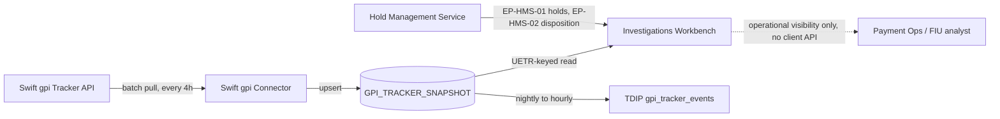

## Overview

The **Investigations Workbench (IWB, SYS-IWB)** is the internal case-management and
status tool used by **Payment Operations** (Wire Room, Wire Investigations) and the
**Financial Intelligence Unit (FIU)** to work payment holds and track international wire
progress. It is owned by Payment Operations Tech (business owner Luis Ramirez, Wire
Investigations; T2 support tier). IWB replaced the legacy Wire Room console in 2025 and
is now the system of record, for Operations purposes, of two things that are not visible
anywhere else in the estate:

- **Hold queues and disposition**, sourced from the
  [Hold Management Service](hold-management-service.md) (HMS) in the Payment Risk &
  Screening Platform (PRSP).
- **Swift gpi tracking status** for international wires, sourced from the gpi Tracker
  snapshot populated by the [Swift gpi Connector](swift-gpi-connector.md) (GPI-C).

No client-facing channel exposes gpi status or hold reasons today. [CBO Wire
Center](cbo-wire-center.md), the commercial portal, explicitly does not provide
international tracking, hold explanations, or client actions on held wires; a client
asking "why is my wire pending" or "has my international wire arrived" can only be
answered by an Ops analyst looking at IWB. This makes IWB a single point of visibility
with real operational consequences: Treasury Support and relationship managers depend on
Ops analysts relaying IWB data by phone or case notes, because IWB itself is not a
client channel and has no external-facing API.

## Responsibilities

- Present the **HMS hold queue** so analysts can see, triage, and act on held outbound
  payments (Wire Room, Fraud Ops, Sanctions L1/L2, FIU queues).
- Let entitled analysts record a hold **disposition** (release or reject) under
  maker-checker control.
- Present **Swift gpi status** for outbound international wires - the ordered agent
  route, per-agent deducted charges, confirmed credited amount, and terminal outcome -
  for payments where no other system has this detail.
- Serve as the system Payment Operations and the FIU use to explain, investigate, and
  resolve payment exceptions (duplicates, callbacks, sanctions reviews, AML reviews,
  legal holds) that are invisible to clients and to most other internal tooling.

## Upstream data sources

### Hold queues (HMS)

IWB is the primary caller of the [Hold Management Service](hold-management-service.md)
API surface:

| Interface | Purpose | Notes |
|---|---|---|
| `GET /prsp/hms/v1/holds?paymentId=` (EP-HMS-01) | Fetch hold detail for a payment | Returns `hrcCode`, `category`, `description`, `analystNotes`, `slaDueTs`. Also called by PPH for its legacy v1 `holdReasonDesc` sync. |
| `POST /prsp/hms/v1/holds/{holdId}/disposition` (EP-HMS-02) | Record release/reject | IWB-only; requires role `HOLD_RELEASER`; enforces maker-checker (`CTRL-PAY-012`) |
| `risk.hold.events.v1` (EV-HMS-01) | Hold lifecycle events | Restricted to FCT and Payment Operations tooling; channel applications are not authorized consumers |

Because IWB is a Financial Crimes Technology-adjacent consumer, it sees the **full,
unredacted** hold reason taxonomy (HRC-01 through HRC-12), including Restricted-tier
(`R`) reasons such as `FRAUD_MODEL_HIGH`, `ATO_SUSPECT`, `SANCTIONS_REVIEW`,
`AML_REVIEW`, and `LEGAL_HOLD`, plus free-text `description` and `analystNotes` -
content that `POL-FCC-014` prohibits from ever appearing in a client-facing channel.
This is the key reason IWB cannot simply be pointed to by a client channel without a
dedicated, policy-reviewed facade: the HMS proposal for such a facade
(`FCT-1893`, Client-Safe Hold Status Facade) remains deprioritized and does not exist.

### gpi tracking status (GPI-C)

IWB is one of exactly two consumers of the gpi Tracker snapshot populated by the
[Swift gpi Connector](swift-gpi-connector.md):

- GPI-C pulls changed outbound-UETR transactions from the Swift Tracker API via the
  Swift Microgateway on a **4-hour batch cadence** (00:00, 04:00, 08:00, 12:00, 16:00,
  20:00 ET) and upserts them into the Oracle table `GPI_TRACKER_SNAPSHOT`.
- IWB reads this snapshot (keyed by UETR) to display route (ordered agent BICs, names,
  countries, received/forwarded timestamps), deducted charges per agent, confirmed
  credited amount and timestamp (on `ACCC`), and the current gpi status/reason
  (`ACSP`/G000-G004, `ACCC`, or `RJCT` + ISO reason).
- The only other consumer is the TDIP nightly `gpi_tracker_events` load (moving to
  hourly per `TDA-2188`). **There is no internal API** for gpi status; the snapshot
  table itself must not be exposed directly to any channel.

Because gpi status flows to IWB purely through this batch snapshot, IWB's view of an
international wire's progress can lag the Swift network by up to the 4-hour batch
window (or longer if a batch run fails); a 2026-03 request to shorten the batch cadence
to 2 hours (`PNG-1544`) was declined because the resulting Tracker API call volume would
threaten the contracted 250,000-calls/month Swift Tracker quota. A change-feed-based
"gpi Tracker Real-Time Service" (`GTSI-0107`) is a future initiative, not funded for
2026, now owned by Global Transaction Services Integration (GTSI) after the 2026-10-01
cross-border realignment moved gpi Connector ownership from Payment Networks
Engineering to GTSI.

## Lifecycle: why IWB is the only place to see this

Three constraints converge to make IWB the sole visibility point for international wire
status and hold detail:

1. **No internal gpi API exists.** GPI-C writes only to the `GPI_TRACKER_SNAPSHOT`
   table; there is no service boundary another system could call without building one,
   and the Swift Tracker API quota rules out naive per-payment, real-time lookups from
   client channels (estimated client-channel demand of ~1.9M calls/month would exceed
   the 250k/month contract by roughly 7x).
2. **PPH v1 does not carry the identifiers gpi needs.** The deprecated PPH v1 API
   (`GET /pph/v1/wires/{ref}/status`) that CBO Wire Center still uses exposes only the
   Fedwire IMAD; OMAD and UETR are "not available in v1." PPH v2 (`GET
   /pph/v2/payments/{paymentId}`) does carry `uetr`, but Wire Center has not migrated
   (tracked as `CBO-4471`, unscheduled, ahead of the v1 sunset on 2027-03-31).
3. **Policy forbids surfacing most hold detail to clients.** `POL-FCC-014` requires
   Restricted (`R`) and Generic (`G`) tier holds to be presented identically to clients
   as a single "being reviewed" message with no timing estimate, and explicitly bans
   terms like "fraud," "sanctions," "AML," or "investigation" in any client-facing copy.
   Only the IWB/HMS-internal view shows the real `hrcCode`, `description`, and
   `analystNotes`.

A prior attempt to give clients real-time wire status directly from PPH - the 2024 "Wire
Status Lite" pilot (`CBO-3120`) - was terminated after it drove ~85 TPS of polling
against the shared PPH v1 status API and delayed wire releases for 47 minutes
(`INC-2024-1182`); the resulting architecture decision (`ADR-PAY-019`) requires new
status capabilities to be event-driven rather than polled, which further raises the bar
for any future client-facing alternative to IWB.

## Access boundaries and known gaps

- **No client-facing interface or API.** IWB is an internal tool only; it has no
  entitlement model for external users and was never designed for one.
- **A discovery spike exists but is not built.** `CBO-4480` ("International wire status
  visibility (gpi) for clients") is a backlog spike, not an implementation; as of
  2026-10 it notes that gpi status "lives only in Ops IWB" and that any API option would
  require engaging the gpi Connector's owning team (now GTSI, not PNE, per the
  2026-10-01 realignment).
- **Hold reason tooltips in CBO are a partial, separate mitigation**, not an extension
  of IWB. CBO Wire Center's in-progress `CBO-4388` surfaces the legacy PPH v1
  `holdReasonDesc` field (synced from HMS) directly in a client tooltip, truncated at
  120 characters - this is a known data-leakage risk (`FCT-2004`, open) because
  `holdReasonDesc` content is not curated for external display, unlike the
  FCC-reviewed, tier-based IWB/HMS data model.
- **Known data gaps even for Ops.** IWB's gpi view reflects only what GPI-C has polled
  in the last 4-hour batch; a wire's international route beyond a non-gpi (`G001`)
  intermediary is simply unavailable, in IWB as everywhere else, because gpi tracking
  stops at the last gpi-participating agent.

## Related systems

- [Hold Management Service](hold-management-service.md) - system of record for hold
  lifecycle, reason taxonomy, and disposition controls that IWB reads and writes.
- [Swift gpi Connector](swift-gpi-connector.md) - populates the `GPI_TRACKER_SNAPSHOT`
  table that is IWB's only source of international wire tracking data.
- [CBO Wire Center](cbo-wire-center.md) - the client-facing wire channel that
  structurally cannot show what IWB shows, and is the source of the recurring demand
  (`CBO-4480`, `CBO-4388`) to close that gap.
- [Payment Operations](../teams/payment-operations.md) - the team (Wire Room, Wire
  Investigations, FIU) that uses IWB as its primary working tool.
