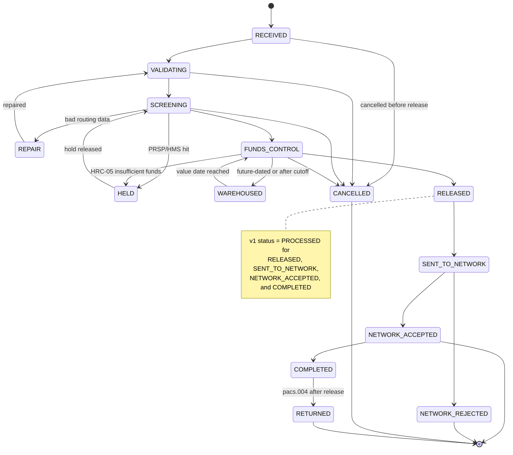

## Overview

**PRISM Payments Hub (PPH)**, catalog id **SYS-PPH**, is Crestline National
Bank's wire orchestration platform for every outgoing, incoming, and
book-transfer payment across all channels and rails: Fedwire Funds, Swift
CBPR+, and internal book transfer. It is built on the vendor **Volaris
Payment Platform 9.4** and runs on-premises in an **active-active**
configuration across the Columbus and Charlotte data centers
(PPH-SYS-OVW-9.2 s1).

PPH sits at the center of CNB's payments estate: it receives instructions
from every channel (Crestline Business Online, host-to-host files, Swift for
Corporates MT101/pain.001, branch, and the Ops desk), validates and enriches
them, coordinates sanctions/fraud screening and holds with the **Payment Risk
& Screening Platform (PRSP)** and its **Hold Management Service (HMS)** (see
[Hold Management Service](hold-management-service.md)), performs funds
control against the **Core Deposit Platform (CDP)**, and routes accepted
payments to the **Payment Network Gateway** (Fedwire Funds Connector or Swift
Alliance/gpi Connector) (PPH-SYS-OVW-9.2 s1).

Average Q2-2026 daily volume: ~14,200 outgoing domestic (Fedwire) wires,
~2,900 outgoing international (Swift CBPR+) wires, ~18,500 incoming wires
across all rails, and ~6,300 book transfers, with CBO contributing ~67% of
outgoing volume. The availability target is **99.95% during Fedwire
operating hours** (PPH-SYS-OVW-9.2 s1).

## Processing stages

PPH moves a payment through seven stages (PPH-SYS-OVW-9.2 s2):

1. **Intake** — a channel submits an instruction via the v1 or v2 API, a
   file, or Swift.
2. **Validation & enrichment** — format and routing checks (ABA/BIC), ISO
   20022 mapping, and structured address checks (mandatory for Swift CBPR+
   and Fedwire from **November 2026**).
3. **Screening** — a synchronous call to PRSP (SanctionScreen + Sentinel). A
   hit creates an HMS hold and the payment enters `HELD`.
4. **Funds control** — a memo debit against CDP; insufficient funds create
   `HRC-05` holds that auto-retry until 5:30 p.m. ET.
5. **Release** — a UETR is assigned (all outbound wires, since
   [ADR-PAY-023](../decisions/adr-pay-023.md)) and the outbound message is
   built (`pacs.008` / `pacs.009`).
6. **Network** — the message is sent to the Fedwire Funds Connector or Swift
   Alliance/gpi Connector; the network acknowledgment updates lifecycle
   state.
7. **Close** — accounting close (`COMPLETED`); a later return (`pacs.004`)
   transitions the payment to `RETURNED`.

## Canonical v2 lifecycle states and the v1 status collapse

PPH's v2 API and events expose a ten-state canonical lifecycle. The legacy
v1 status API exposes only a seven-value coarse `status` field that collapses
several distinct v2 states together — most importantly, **`PROCESSED`
collapses `RELEASED`, `SENT_TO_NETWORK`, `NETWORK_ACCEPTED`, and
`COMPLETED` into one value**, so a v1 consumer cannot distinguish a wire that
has merely been released for transmission from one the network has
acknowledged or one that has closed in accounting (PPH-SYS-OVW-9.2 s3; see
also [Wire Lifecycle State Model](../concepts/wire-lifecycle-state-model.md)
for the consequences of relying on this collapsed value).

*The v2 canonical wire lifecycle (states and principal transitions), with the v1 `PROCESSED` collapse annotated at the states it conflates.*

| v2 state | Meaning | Typical duration | v1 status shown |
|---|---|---|---|
| `RECEIVED` | Instruction accepted by PPH | < 1 s | `RECEIVED` |
| `VALIDATING` | Format/routing/enrichment | 1-5 s | `PENDING` |
| `SCREENING` | PRSP screening in progress | 1-20 s | `PENDING` |
| `HELD` | One or more HMS holds open | minutes-days | `HELD` |
| `REPAIR` | Wire Room repair queue | minutes-hours | `PENDING` |
| `FUNDS_CONTROL` | Awaiting available balance | seconds-hours | `PENDING` |
| `WAREHOUSED` | Future-dated or after cutoff | until value date | `PENDING` |
| `RELEASED` | Released for transmission, UETR assigned | seconds | `PROCESSED` |
| `SENT_TO_NETWORK` | Message delivered to network gateway | seconds-minutes | `PROCESSED` |
| `NETWORK_ACCEPTED` | Network acknowledgment received (rail-specific, see below) | - | `PROCESSED` |
| `NETWORK_REJECTED` | Network rejected (`admi.002` / `pacs.002 RJCT` / NAK) | - | `REJECTED` |
| `COMPLETED` | Internal accounting close | end of day | `PROCESSED` |
| `CANCELLED` | Cancelled before release | - | `CANCELLED` |
| `RETURNED` | Funds returned (`pacs.004`) after release | hours-days | `RETURNED` |

(PPH-SYS-OVW-9.2 s3)

## Rail-specific meaning of `NETWORK_ACCEPTED`

The `NETWORK_ACCEPTED` state means something materially different depending
on rail, and neither case confirms beneficiary credit (PPH-SYS-OVW-9.2 s4):

| Rail | Acknowledgment source | Business meaning | Finality |
|---|---|---|---|
| Fedwire Funds | Federal Reserve `pacs.002` positive acknowledgment carrying OMAD, via `net.fedwire.ack.v1` | Payment order accepted and settled by the Federal Reserve; funds credited to the receiving bank's master account | Final and irrevocable interbank settlement (Regulation J / UCC Article 4A). Does **not** confirm credit to the beneficiary's account. |
| Swift CBPR+ | SwiftNet delivery acknowledgment (ACK) for `pacs.008` | Message accepted by the Swift network for delivery to the next agent | No settlement implication. Settlement occurs through correspondent (nostro/vostro) accounts; beneficiary credit is known only from a gpi `ACCC` event, if available. |

The v2 `stateHistory` timestamp recorded for `NETWORK_ACCEPTED` is **the time
PPH processed the acknowledgment**, not the Federal Reserve's creation
timestamp inside the `pacs.002` message. The authoritative Fed timestamp and
OMAD are carried separately on `net.fedwire.ack.v1` (tracked as PPH-2207).
A proposed v2 settlement object that would surface `fedSettlementTs` and a
rail-aware `settlementStatus` directly is PPH-2207, currently backlog with no
product sponsor (PPH-API-CAT-2026.3 s3, s6).

## Identifiers

| Identifier | Assigned by | Scope | Available in |
|---|---|---|---|
| `pphId` | PPH | Internal payment key | v1, v2, events |
| `cboRef` | CBO | Channel reference | v2 `identifiers.cboRef` (channel = CBO only) |
| IMAD | PPH (Fedwire sender) | Fedwire input message | v1 `fedRef`; v2 `identifiers.imad` |
| OMAD | Federal Reserve | Fedwire output message (acceptance) | v2 `identifiers.omad`; `net.fedwire.ack.v1` |
| UETR | PPH, at release | End-to-end tracking id (Swift gpi; also carried on Fedwire `pacs.008`) | v2 `identifiers.uetr`; v2 lifecycle events |
| `EndToEndId` | Originator / PPH | Client reference passed through | v2 |

(PPH-SYS-OVW-9.2 s5)

UETR is the only rail-agnostic, externally meaningful correlation id: since
[ADR-PAY-023](../decisions/adr-pay-023.md), PPH mints a UETR at the
**RELEASE** stage for every outbound wire regardless of rail, and it is
available only through the v2 API and v2 events — the v1 API and its status
model carry no UETR field at all, a gap that is permanent for v1.

## Integration with Hold Management (PRSP-HMS)

When screening or funds control raises a hold, the [Hold Management
Service](hold-management-service.md) returns a `holdId` and PPH transitions
the payment to `HELD`. Since a 2019 integration, PPH also synchronizes the
HMS hold *description* into the legacy v1 field `holdReasonDesc` for
backward compatibility with the Wire Room console; this free-text content is
not curated for external display. The v2 API intentionally exposes only
`hold.isHeld` and `hold.holdId`, per
[ADR-PAY-021](../decisions/adr-pay-021.md) — hold reasons are also not
published on PPH's Kafka topics (PPH-SYS-OVW-9.2 s6; PPH-API-CAT-2026.3 s2,
s4).

## Cutoffs and operating windows

| Item | Value |
|---|---|
| Fedwire operating day | 9:00 p.m. ET (prior calendar day) to 7:00 p.m. ET |
| Fedwire third-party customer transfer cutoff | 6:00 p.m. ET (later items warehoused, `HRC-04`) |
| CBO same-day wire cutoff (domestic) | 5:30 p.m. ET |
| International cutoffs (by currency) | EUR 2:00 p.m. ET; GBP 1:00 p.m. ET; MXN 3:00 p.m. ET; JPY prior day |

(PPH-SYS-OVW-9.2 s7)

## APIs and events

PPH exposes two generations of REST API plus a Kafka lifecycle topic,
cataloged in PPH-API-CAT-2026.3:

- **v1 (deprecated)** — [PPH v1 Wire Status API](../interfaces/pph-v1-wire-status-api.md):
  `EP-PPH-01` `GET /pph/v1/wires/{wireRef}/status` (20 TPS shared across all
  v1 consumers), `EP-PPH-02` `GET /pph/v1/wires?clientId&fromDate&toDate`
  (max 500 rows, no cursor), `EP-PPH-03` `POST /pph/v1/wires`. The v1
  `status` field takes one of `RECEIVED | PENDING | HELD | PROCESSED |
  REJECTED | CANCELLED | RETURNED`; `fedRef` carries IMAD only (null for
  Swift wires) — OMAD and UETR are not available in v1 at all.
- **v2 (GA 2025-10)** — [PPH v2 Payments API](../interfaces/pph-v2-payments-api.md):
  `EP-PPH-04` `GET /pph/v2/payments/{paymentId}` (150 TPS) returns
  `lifecycleState`, rail-aware `identifiers`, `network`, `hold`, and
  `charges`, but **no settlement object**; `EP-PPH-05` search (filters by
  `clientId`, not account; no beneficiary-name filter, tracked as PPH-2251);
  `EP-PPH-06` state history (timestamps are PPH processing time, not source
  acknowledgment time); `EP-PPH-07` payment submission, which requires an
  `Idempotency-Key` header.
- **Events** — [`pay.wire.lifecycle.v2`](../interfaces/pph-lifecycle-event-topics.md)
  (`EV-PPH-01`), a `WireLifecycleEvent` v2.3 Avro topic (7-day retention,
  Confidential - Client classification, consumer ACL via PPH Jira) carrying
  `paymentId`, `rail`, `fromState`, `toState`, `eventTs`, `identifiers`, and
  `return.isoReason` (ISO `pacs.004` return reason codes such as `AC04`,
  `AC01`, `RR05`, published since 2026-08 per PPH-2266). `pay.ach.lifecycle.v1`
  (`EV-PPH-02`) carries ACH lifecycle events for the separate ACH rail.

Service levels: v1 REST is 99.9% available, p95 350 ms, best-effort support
until sunset; v2 REST is 99.95% available, p95 180 ms, T1 support;
`pay.wire.lifecycle.v2` is 99.95% available with p95 event lag under 2
seconds, T1 support (PPH-API-CAT-2026.3 s5).

## v1 sunset commitment

Per **PPH-API-CAT-2026.3** s1 and **PPH-SYS-OVW-9.2** s8:

> **v1 sunset: 2027-03-31 (no extensions)**

The Payments Architecture Review Board (ARB) confirmed on **2026-09-08**
that no extensions will be granted to any consumer. The sunset is driven by
a hard vendor constraint, not only policy: **the v1 adapter is not supported
on the Volaris 9.6 upgrade, scheduled for April 2027** — the same upgrade
PPH-SYS-OVW-9.2 s1 dates as the "Volaris 9.6 upgrade scheduled April 2027
(removes legacy v1 API adapter)." All consumers must migrate to v2 and, for
status use cases, to `pay.wire.lifecycle.v2`.

Migration tracking is owned by the
[PPH-2190 v1 sunset migration](../projects/pph-2190-v1-sunset-migration.md)
epic. As of PPH-API-CAT-2026.3: IVR wire status (Contact Center Tech)
migrated 2026-05; Service Center CRM (CRM Engineering) in progress, target
2026-12; Wire Room console (Payment Operations Tech) migrated to IWB in
2025; `cbo-wire-bff` (CBO Wire Center squad) **not started**, tracked
separately as CBO-4471.

## Upcoming changes

- **November 2026** — structured/hybrid postal address enforcement becomes
  mandatory for Swift CBPR+ and Fedwire; `HRC-06` repair holds are expected
  to rise as a result.
- **FedNow outbound expansion** — committed for PI 27.1.
- **2027-03-31** — PPH v1 API sunset (PPH-2190).
- **April 2027** — Volaris 9.6 upgrade (removes the legacy v1 API adapter).

(PPH-SYS-OVW-9.2 s8)

## Related pages

- [Wire Lifecycle State Model](../concepts/wire-lifecycle-state-model.md) — deep dive on the ten v2 states and the `PROCESSED` collapse's operational consequences.
- [ADR-PAY-023](../decisions/adr-pay-023.md) — UETR as the canonical correlation id.
- [PPH Kafka Lifecycle Event Topics](../interfaces/pph-lifecycle-event-topics.md)
- [PPH v1 Wire Status API](../interfaces/pph-v1-wire-status-api.md)
- [PPH v2 Payments API](../interfaces/pph-v2-payments-api.md)
- [PPH-2190: v1 Sunset Migration](../projects/pph-2190-v1-sunset-migration.md)
- [Hold Management Service](hold-management-service.md)
