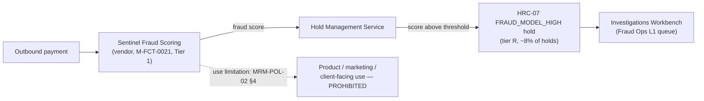

## Overview

Sentinel Fraud Scoring is a **vendor-supplied** payment fraud-scoring model
operated by Financial Crimes Technology (FCT) at Crestline National Bank. It
is one of three systems that make up the **Payment Risk & Screening Platform
(PRSP)**, alongside the [Hold Management Service (HMS)](hold-management-service.md)
and **SanctionScreen** (OFAC and other sanctions-list screening). Sentinel's
sole function described in the source corpus is to produce a fraud-risk score
for outbound payments; that score is the trigger behind one specific Hold
Reason Code in HMS, and the score itself is registered and governed as a
named model in the bank's Model Risk Management inventory.

Sentinel is registered in Model Risk Management as **M-FCT-0021** ("Sentinel
payment fraud score (vendor)"), **Tier 1**, owned by **Victor Petrov**
(Director, FCT), **validated 2025-12**. Because it is Tier 1, it requires
full independent validation and annual review under
[MRM-POL-02](../policies/mrm-pol-02.md); its next review falls due on
roughly that annual cadence after the 2025-12 validation date.

*Sentinel scores a payment; an above-threshold score becomes an HRC-07 hold
worked by Fraud Ops through IWB. The same score output may never be
repurposed for a product, marketing, or client-facing surface.*

## Role within PRSP and HMS

PRSP's design of record, [`PRSP-HMS-3.4`](../documents/prsp-hms-3.4.md),
names Sentinel Fraud Scoring explicitly as one of the platform's three
constituent systems, but its own internal design (model architecture,
features, scoring logic) is not documented in the estate: as a vendor model,
that detail is held by the vendor, not by FCT engineering. What the estate
does document precisely is Sentinel's **one integration point** with HMS:

- HMS's twelve-code hold reason taxonomy includes **`HRC-07
  FRAUD_MODEL_HIGH`** — "Sentinel fraud score above threshold" — classified
  **disclosure tier R (restricted)**, accounting for roughly **8%** of all
  holds, with a median time-to-disposition of about **1 hour 35 minutes** in
  the Fraud Ops L1 queue.
- HMS's free-text `description` field is populated from a rule template that
  embeds the raw Sentinel score for analyst casework, e.g. `"FRAUD_MODEL_HIGH
  sc=9xx L1 queue"`. This field, and `analystNotes`, are classified
  Restricted and are consumed only by Investigations Workbench (IWB)
  analysts — never by a client-facing system — per
  [ADR-PAY-021](../decisions/adr-pay-021.md).
- Tier R holds, including HRC-07, must be presented to any client
  **indistinguishably** from a generic "being reviewed" message; no
  Sentinel-derived score, reason, or timing information may ever reach a
  channel for an HRC-07 hold. See
  [Hold Reason Taxonomy (HRC) and Disclosure Tiers](../concepts/hold-reason-taxonomy-disclosure-tiers.md)
  for the full disclosure mapping.

Sentinel itself exposes no interface documented in the estate; all
consumption of its output happens inside HMS and the downstream casework
tooling described on [HMS Hold API & Hold Events](../interfaces/hms-hold-api.md).
There is no client-facing interface anywhere in this chain, and the one
proposal that would have added a client-safe hold-status facade
(**FCT-1893**) remains deprioritized and unbuilt.

## Model governance under MRM-POL-02

Sentinel's score is a governed **model** output, not just an engineering
signal, and [MRM-POL-02](../policies/mrm-pol-02.md) (the Model Risk
Management Policy, v7.0) imposes two separate, independently important
constraints on it:

1. **Tiering and validation.** Financial-crimes detection models are Tier 1
   by definition, which requires full independent validation before use and
   **annual review** thereafter — the strictest validation and review regime
   in the policy's four-tier scheme (Tier 1/2/3/EUA). M-FCT-0021 was last
   validated in 2025-12.
2. **Use limitation (absolute).** Tier 1 financial-crimes model outputs —
   explicitly including "Sentinel fraud scores (M-FCT-0021)" — **may not be
   used for product, marketing, or client-facing purposes.** This
   prohibition is unconditional: it is not relaxed by client consent,
   anonymization, or aggregation, and it extends to the model's registered
   inputs/features as well as its raw score output. The same policy section
   names a second Tier 1 financial-crimes model owned by the same person,
   **M-FCT-0034** (beneficiary mule-risk features), under the identical
   prohibition.

Because Sentinel is a **vendor** model, MRM-POL-02's vendor-model provision
also applies: where the vendor cannot or will not provide sufficient
information about the model's internals (a common constraint for licensed
fraud-scoring products), the bank substitutes **compensating controls and
outcome monitoring** for the full-transparency validation evidence that an
internally built Tier 1 model would otherwise be expected to produce. This
is a materially different validation posture from an in-house Tier 1 model:
FCT and Model Risk Management rely on observed outcomes (hold-disposition
rates, false-positive/negative tracking) rather than on inspecting Sentinel's
internal logic.

## Ownership and accountability

Victor Petrov (Director, Financial Crimes Technology) is the named
accountable **model owner** of M-FCT-0021 in the MRM-POL-02 inventory, the
same role he holds for M-FCT-0034. Operationally, Sentinel sits inside the
same FCT/PRSP engineering scope as HMS and SanctionScreen, with Grace Mensah
as the accountable technical owner across all three PRSP systems. See
[Victor Petrov](../people/victor-petrov.md) for the full accountability
picture, including his separate role approving the HMS design document.

Jonathan Price, Head of Model Risk Management, owns MRM-POL-02 itself and
the tiering/validation regime Sentinel is subject to; Sophie Laurent
(Validation Lead, Treasury & Operations models) runs the Tier 2 validation
queue referenced on [MRM-POL-02](../policies/mrm-pol-02.md), though as a
Tier 1 model Sentinel's validation and annual review do not sit in that
Tier 2 queue.

## Known gaps and failure modes

- **Vendor opacity is a standing, policy-acknowledged risk, not a gap to be
  "fixed."** Because the model developer may withhold internal details,
  ordinary Tier 1 validation evidence (e.g., full methodology review) may be
  unavailable; FCT and Model Risk Management treat compensating controls and
  outcome monitoring as the permanent substitute, not an interim measure.
- **Score-text leak path via the legacy PPH v1 sync.** HMS's hold
  `description` field — which routinely embeds the raw Sentinel score (e.g.
  `"FRAUD_MODEL_HIGH sc=9xx L1 queue"`) — is synchronized into legacy PPH
  v1's `holdReasonDesc` field by a pre-[ADR-PAY-021](../decisions/adr-pay-021.md)
  backward-compatibility exception, tracked as open risk **FCT-2004**. This
  is the one documented path by which Sentinel-derived score text could
  reach a downstream consumer of PPH v1 (e.g. the CBO Wire Center's
  `WC_HOLD_TOOLTIP`) rather than remaining confined to FCT/IWB casework
  tooling; it does not affect PPH v2, which carries only hold presence and
  `holdId`. It is expected to be closed by remediation or by the PPH v1
  sunset (2027-03-31).
- **No client-facing exposure exists today**, and none is planned in the
  near term: FCT-1893 (the only proposal for a client-safe hold-status
  facade) is deprioritized backlog with no committed channel consumer, and
  even if built it is explicitly scoped to return only disclosure tier,
  approved copy key, and permitted actions — never a Sentinel score or HRC
  mnemonic.
- **Use-limitation violations would be a policy breach, not merely a
  product decision.** Any proposal to reuse Sentinel's score (or its inputs)
  for a marketing segment, product eligibility rule, or client-facing risk
  indicator would conflict directly with MRM-POL-02 §4 and is not something
  engineering or product teams can authorize locally.

## Relationships

- **[Hold Management Service](hold-management-service.md)** is the only
  documented consumer of Sentinel's score; HMS turns an above-threshold score
  into an `HRC-07 FRAUD_MODEL_HIGH` hold and is the confidentiality boundary
  that keeps the score and related detail out of client-facing systems.
- **[MRM-POL-02](../policies/mrm-pol-02.md)** governs Sentinel as Tier 1
  model `M-FCT-0021`: full independent validation, annual review, the
  vendor-model compensating-controls provision, and the absolute
  product/marketing/client-facing use prohibition.
- **[ADR-PAY-021](../decisions/adr-pay-021.md)** establishes the
  architectural rule that hold reason codes, descriptions, scores, and
  analyst notes — including Sentinel's score — must never be exposed to PPH
  v2, channels, or data platforms, with the PPH v1 legacy sync (FCT-2004) as
  its one time-boxed exception.
- **[HMS Hold API & Hold Events](../interfaces/hms-hold-api.md)** documents
  the only interfaces through which Sentinel-derived hold detail is ever
  read (`EP-HMS-01`, consumed by IWB and PPH's legacy sync) or acted on
  (`EP-HMS-02`), and confirms no client-facing interface exists.
- **[Victor Petrov](../people/victor-petrov.md)** is the accountable model
  owner of M-FCT-0021 in the MRM-POL-02 inventory.
- **[Beneficiary Behavior Profile](../datasets/beneficiary-behavior-profile.md)**
  documents the sibling Tier 1 financial-crimes model, M-FCT-0034, which is
  subject to the identical use prohibition and owned by the same person.
