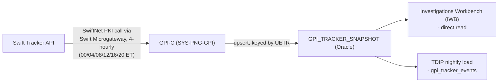
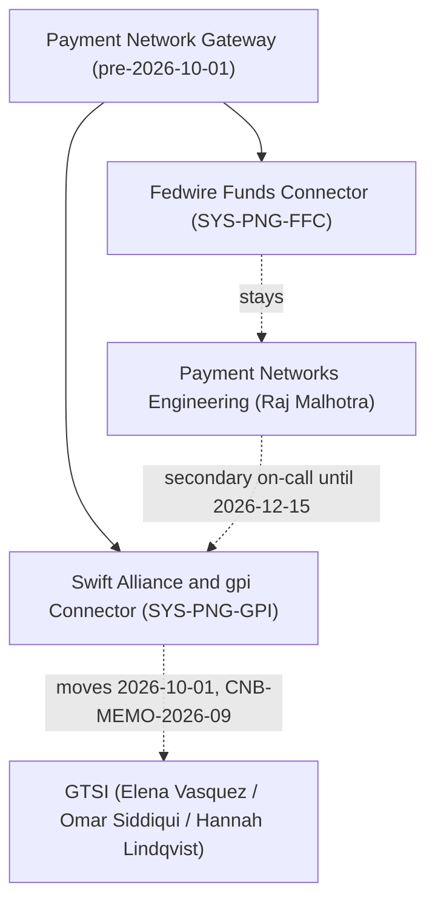

## Overview

The **Swift Alliance & gpi Connector (GPI-C, system id `SYS-PNG-GPI`)** is the Swift/international-
rail module of the **Payment Network Gateway (PNG)**. It is responsible for two things: sending and
acknowledging Swift CBPR+ ISO 20022 `pacs.008` customer credit transfers, and retrieving Swift gpi
Tracker status for those payments. GPI-C's sibling module, the **Fedwire Funds Connector
(FFC, `SYS-PNG-FFC`)**, handles the domestic Fedwire rail; the two were historically designed and
documented together as the two halves of PNG (PNG-TDD-6.0) but have been organizationally separate
since 2026-10-01 — see [Fedwire Funds Connector](fedwire-funds-connector.md) for the module that did
**not** move.

As of this writing, GPI-C is owned by **Global Transaction Services Integration (GTSI)**: Director
Elena Vasquez, EM Omar Siddiqui, Tech Lead Hannah Lindqvist. Ownership moved from **Payment Networks
Engineering (PNE)**, under Director Raj Malhotra, effective **2026-10-01**, per
**CNB-MEMO-2026-09** ("Realignment of Cross-Border Network Integration"). See
[Ownership transfer](#ownership-transfer-pne--gtsi-effective-2026-10-01) below for the full detail,
and [Swift gpi & CBPR+](../concepts/swift-gpi-cbpr.md) for the rail concepts GPI-C implements.

## Responsibilities

- **CBPR+ ISO 20022 messaging.** GPI-C sends CBPR+ `pacs.008` customer credit transfers, mandatory
  since Swift's **2025-11-22** end of MT/MX coexistence; CNB does not use the MT103 contingency
  conversion path. PRISM Payments Hub (PPH) assigns the **UETR** (UUID v4) at release and carries it
  in the outbound `pacs.008`; GPI-C maps the resulting Swift ACK/NAK back to PPH.
- **gpi Tracker retrieval.** GPI-C is the only system at CNB that calls the Swift Tracker API. It
  does so as a scheduled batch job (not a live lookup path — see below) and is the sole writer of the
  Oracle table [GPI_TRACKER_SNAPSHOT](../datasets/gpi-tracker-snapshot.md).
- **Exceptions and investigations migration (pending).** Swift's exceptions/investigations flow is
  moving from legacy mechanisms to `camt.110`/`camt.111` on Swift's published timeline of
  **November 2026**; GPI-C has not yet implemented this as of this writing.

GPI-C does **not** provide any internal API or real-time lookup for gpi status — see
[Why the integration is batch, not real-time](#why-the-integration-is-batch-not-real-time).

## Connectivity

GPI-C reaches Swift through the **Swift Microgateway** (the Swift API gateway), authenticating with
**SwiftNet PKI** credentials bound to the GPI-C service account. Business continuity for Swift
connectivity is provided by **Swift Alliance Lite2** standby. These credentials and the Microgateway
itself are shared plumbing used by any Swift-dependent integration, not only gpi, which is why their
ownership moved to GTSI as a capability distinct from the gpi Tracker integration itself (see below).

## The gpi batch data path

GPI-C's gpi Tracker integration is a fixed-schedule batch pull, not an event-driven or on-demand
integration. Every 4 hours — **00:00, 04:00, 08:00, 12:00, 16:00, 20:00 ET** — GPI-C requests changed
payment transactions for outbound UETRs released in the last 30 days from the Swift Tracker API (via
the Swift Microgateway, SwiftNet PKI-authenticated), and **upserts** the results, keyed by UETR, into
the Oracle table `GPI_TRACKER_SNAPSHOT`. Downstream, the snapshot feeds Payment Operations'
Investigations Workbench (IWB) directly, and the Treasury Data & Insights Platform (TDIP) nightly
load, which produces the event-oriented dataset `gpi_tracker_events`.

Each upsert populates `LAST_STATUS`/`LAST_REASON` (gpi `ACSP`/`ACCC`/`RJCT` and `G000`-`G004` or ISO
reject reason), `ROUTE_JSON` (ordered agent chain), `DEDUCTED_CHARGES_JSON` (per-agent deducted
charges when reported), `CONFIRMED_AMOUNT`/`CREDIT_TS` (populated on terminal `ACCC`), and
`SNAPSHOT_TS` (capture time, not event time). Full column and status/reason semantics are documented
in [GPI_TRACKER_SNAPSHOT](../datasets/gpi-tracker-snapshot.md); the pull/upsert mechanics and
observed Q3-2025 outcome distribution (88% `ACCC`, 8% `ACSP`/`G001`, 2.5% pending >24h, 1.5% `RJCT`,
median release-to-`ACCC` 2h 41min) are in
[gpi Tracker Batch Feed](../interfaces/gpi-tracker-batch-feed.md).

**There is no internal API for gpi status.** `GPI_TRACKER_SNAPSHOT` must not be exposed directly to
client channels; a client-facing capability would require a dedicated service with its own SLA,
entitlement checks, and quota management, not a direct read of this batch-fed table.

## Why the integration is batch, not real-time

The batch design is a direct consequence of the Swift Tracker API's contracted call quota, not an
arbitrary implementation choice. The contract permits **250,000 calls per month** (renewal due
2027-01-31); at the time of the PNG-1544 review, usage from the existing 4-hourly batch pulls plus
Operations' ad-hoc manual lookups already stood at roughly **61%** of that quota. Per-payment status
lookups driven directly from client channels were separately estimated at **~1.9 million calls/month**
(based on ~2,900 outbound international wires/day with repeated client views over a payment's
lifetime) — roughly **7x** the contracted monthly quota. Any real-time or near-real-time gpi design
must therefore be built as a **change-feed with internal fan-out** rather than per-payment calls to
Swift, because per-payment, on-demand lookups from channels cannot scale within the contract at any
plausible batch cadence.

This constraint was tested directly by **PNG-1544** (Addendum A to PNG-TDD-6.0, 2026-03-03): a
request to double the batch frequency from 4 hours to 2 hours, aimed at shrinking the staleness
window around gpi milestones, was **declined** because projected Tracker API usage would still
exceed quota and would not address the underlying client-facing demand that motivated the request.
The addendum's recommendation — a change-feed-based internal service — was carried forward as
[GTSI-0107, gpi Tracker Real-Time Service](../projects/gtsi-0107-gpi-real-time-service.md), which is
not funded for 2026 (discovery planned 2027-Q2, subject to the 2027 portfolio review). See
[PNG-1544](../decisions/png-1544.md) for the full decision record. As a direct result, GPI-C's batch
pull continues to run unchanged at its original 4-hour cadence.

## Ownership transfer: PNE → GTSI, effective 2026-10-01

Per **CNB-MEMO-2026-09** ("Realignment of Cross-Border Network Integration," issued 2026-09-02 by
Gregory Hall, MD CIO Payments & Treasury Technology), ownership of GPI-C and its gpi Tracker
integration moved:

| Capability | From | To | Accountable |
|---|---|---|---|
| Swift Alliance Gateway, gpi Connector (`SYS-PNG-GPI`) and gpi Tracker integration | Payment Networks Engineering (Raj Malhotra) | Global Transaction Services Integration (Elena Vasquez) | Omar Siddiqui (EM); Hannah Lindqvist (Tech Lead) |
| Swift API gateway (Microgateway), SwiftNet PKI service accounts | Payment Networks Engineering | GTSI | Hannah Lindqvist |
| International wire tracking roadmap (incl. any client-facing gpi capability) | Payment Networks Engineering | GTSI | Elena Vasquez; business sponsor Laura Kim |

The same memo explicitly keeps the **Fedwire Funds Connector (`SYS-PNG-FFC`)**, including its
`net.fedwire.ack.v1` and `net.fedwire.inbound.v1` topics, with PNE under Raj Malhotra (EM Brian
Walsh); Raj Malhotra separately gains ownership of the FedNow and RTP connectors from 2026-11-01.

People and transition details:

- **Tomasz Nowak** (Senior Engineer, gpi Connector; prior document owner of the gpi sections of
  PNG-TDD-6.0) transfers from PNE to GTSI and now reports to Omar Siddiqui.
- **PNE on-call remains secondary support** for `SYS-PNG-GPI` until **2026-12-15**, the target
  completion date for knowledge transfer under
  [GTSI-0112](../projects/gtsi-0112-gpi-knowledge-transfer.md). Until then, incident response for
  GPI-C has a dual-team dependency: GTSI as primary owner, PNE as secondary/fallback.
- From 2026-10-01, new requests for gpi data, Swift Tracker usage, or international wire status
  capabilities must be raised in Jira project **GTSI**, not **PNG**; tickets already logged against
  PNG for gpi topics are triaged by GTSI during the knowledge-transfer window rather than reopened.
- GTSI also inherits the Swift Tracker API contract renewal (tracked as GTSI-0115, due 2027-01-31)
  and the `gpi Tracker Real-Time Service` initiative (GTSI-0107).

This is an ownership and operational-support realignment, not a system rewrite: GPI-C's design,
batch schedule, and quota constraints are unchanged by the transfer itself.

## Operations

- **Monitoring**: Splunk dashboards `PNG-GPI-*`, alongside `PNG-FFC-*` for the sibling FFC module.
- **Change windows**: Saturday 22:00-02:00 ET, shared with the rest of PNG.
- **Business continuity**: Swift Alliance Lite2 standby.
- **Support**: GTSI is now the primary operational owner; PNE on-call remains secondary support
  through 2026-12-15 per the GTSI-0112 knowledge-transfer timeline.

## Relationships

- owned by: [GTSI](../teams/gtsi.md) (since 2026-10-01, per CNB-MEMO-2026-09); previously
  [Payment Networks Engineering](../teams/payment-networks-engineering.md) under Raj Malhotra.
- sibling module of: [Fedwire Funds Connector](fedwire-funds-connector.md) (`SYS-PNG-FFC`), which
  remained with PNE.
- produces: [GPI_TRACKER_SNAPSHOT](../datasets/gpi-tracker-snapshot.md), via the
  [gpi Tracker Batch Feed](../interfaces/gpi-tracker-batch-feed.md).
- consumed by (downstream of the snapshot): Investigations Workbench (IWB) and the TDIP nightly
  `gpi_tracker_events` load.
- constrained by: the Swift Tracker API's 250,000-call monthly quota, per
  [PNG-1544](../decisions/png-1544.md).
- targeted by: [GTSI-0107, gpi Tracker Real-Time Service](../projects/gtsi-0107-gpi-real-time-service.md)
  (not funded for 2026) as the planned successor pattern for real-time gpi status.
- transition tracked by: [GTSI-0112, gpi Connector & Swift API Gateway Knowledge Transfer](../projects/gtsi-0112-gpi-knowledge-transfer.md).

## Related pages

- [Swift gpi & CBPR+](../concepts/swift-gpi-cbpr.md) — the rail concepts (CBPR+, UETR, gpi status
  vocabulary) GPI-C implements.
- [GPI_TRACKER_SNAPSHOT](../datasets/gpi-tracker-snapshot.md) — the Oracle table GPI-C writes.
- [gpi Tracker Batch Feed](../interfaces/gpi-tracker-batch-feed.md) — full batch pull/upsert
  interface reference.
- [PNG-1544](../decisions/png-1544.md) — the decision declining a faster batch cadence and
  recommending a change-feed design.
- [GTSI-0107](../projects/gtsi-0107-gpi-real-time-service.md) — the planned real-time successor
  service.
- [GTSI-0112](../projects/gtsi-0112-gpi-knowledge-transfer.md) — the ownership knowledge-transfer
  epic.
- [Fedwire Funds Connector](fedwire-funds-connector.md) — the sibling PNG module that did not move.
- [GTSI](../teams/gtsi.md) — the current owning team.
