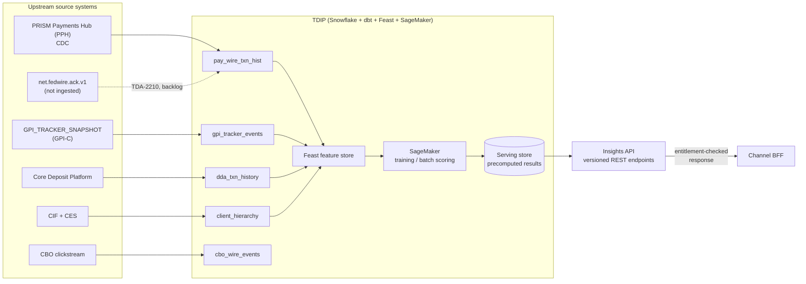
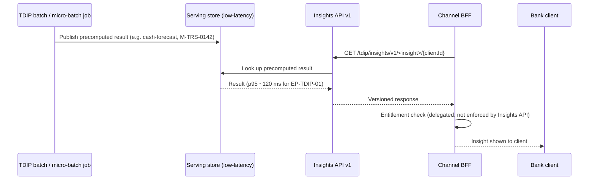

## Overview

The Treasury Data & Insights Platform (TDIP, system id **SYS-TDIP**) is
Crestline National Bank's curated analytics and modeling platform for the
Payments domain. It runs on Snowflake (Enterprise, US-East) with dbt for
transformations, a Feast feature store, Amazon SageMaker for model training
and batch scoring, and a separate low-latency serving store that backs the
client-facing **Insights API**. TDIP is owned by Carlos Mendes (EM, Treasury
Data Platform) and Dr. Aisha Rahman (Lead Data Scientist), under Wei Zhang
(Director, Treasury Data & Analytics), with Ethan Brooks (Data Governance) as
an approver of its data catalog.

TDIP has two distinct responsibilities that this page treats together
because they share the same pipeline and the same freshness ceiling:

1. **Curating payments and deposit datasets and feature tables** — ingesting
   source-system feeds, modeling them in dbt, and materializing feature
   tables in Feast for use by Payment Operations dashboards, financial-crimes
   models, and prototypes.
2. **Serving client-facing analytics** through the **Insights API**, the
   *only* sanctioned path (per [ADR-PAY-026](../decisions/adr-pay-026.md))
   from which a prediction, typical-time statistic, or other analytical
   output computed in TDIP may reach a client; channel backends-for-frontend
   (BFFs) must call this API rather than compute analytics themselves.

The authoritative source for TDIP's dataset inventory, classifications, and
Insights API endpoint list is the published data catalog extract,
[TDIP-CAT-2026.2](../documents/tdip-cat-2026.2.md); that document is
"uncontrolled when printed," so Collibra (the catalog of record) and the
Insights API's own endpoint registry take precedence over any stale copy.
Access governance for every dataset runs through Collibra, and any dataset
classified Restricted requires Privacy Office approval under a
15-business-day SLA, per [DUS-07](../policies/dus-07.md).

*TDIP ingests payments and deposit feeds, models them through
Snowflake/dbt/Feast/SageMaker, and publishes results to a serving store that
the Insights API exposes to channels.*

## Payments-domain datasets

TDIP's data catalog lists six payments-domain datasets, each with a named
source system, refresh cadence, retained history, DUS-07 classification, and
data owner/steward. See [TDIP-CAT-2026.2](../documents/tdip-cat-2026.2.md)
for the full table and governance notes; the individual dataset pages carry
the deepest detail:

| Dataset | Source | Refresh | History | Classification |
|---|---|---|---|---|
| [`pay_wire_txn_hist`](../datasets/pay-wire-txn-hist.md) | PPH (CDC) | Hourly | 7 yrs | Confidential - Client |
| [`gpi_tracker_events`](../datasets/gpi-tracker-events.md) | GPI_TRACKER_SNAPSHOT (GPI-C) | Nightly 05:00 ET (hourly after TDA-2188, targeted 2026-11) | Since 2025-03-01 | Confidential - Client |
| [`fed_ack_events`](../datasets/fed-ack-events.md) | `net.fedwire.ack.v1` | **Not ingested** (TDA-2210) | - | - |
| [`dda_txn_history`](../datasets/dda-txn-history.md) | Core Deposit Platform | Daily | 7 yrs | Restricted - Client Confidential |
| [`client_hierarchy`](../datasets/client-hierarchy.md) | CIF + CES | Daily | Current + 2 yrs | Confidential - Client |
| [`cbo_wire_events`](../datasets/cbo-wire-events.md) | CBO clickstream | Hourly | 13 months | Internal |

`pay_wire_txn_hist` is the dataset every wire-derived TDIP asset traces back
to: it is populated by hourly change-data-capture replication out of
[PRISM Payments Hub (PPH)](../systems/prism-payments-hub.md), reflecting
PPH's own processing/state-transition timestamps rather than an externally
authoritative Fed or Swift settlement timestamp. Its `uetr` column is
populated for Swift wires since 2018 but only for Fedwire wires since
2025-10, per [ADR-PAY-023](../decisions/adr-pay-023.md); any cross-rail
correlation or completion-time feature spanning Fedwire history before
2025-10 cannot rely on UETR-based joins.

`gpi_tracker_events` mirrors the Oracle table `GPI_TRACKER_SNAPSHOT`,
populated by the Swift Alliance & gpi Connector (GPI-C) polling the Swift
Tracker API every 4 hours; TDIP currently loads it into Snowflake nightly at
05:00 ET, so a gpi status change can already be several hours stale before
GPI-C captures it and is then subject to TDIP's own load lag on top. TDA-2188
(targeted 2026-11) moves TDIP's load to hourly but does not change GPI-C's
4-hour polling cadence, which remains the lower bound on end-to-end
freshness.

`fed_ack_events` — the dataset that would carry Federal Reserve
acceptance/OMAD acknowledgement timestamps from the `net.fedwire.ack.v1`
Kafka topic — is **not ingested at all**, tracked as backlog item TDA-2210.
Without it, TDIP cannot compute domestic (Fedwire) settlement-time analytics
comparable to what `gpi_tracker_events` already supports for outbound Swift
wires (same-day ACCC rate, median hours to ACCC).

## Feature tables

Three Payments-domain feature tables are built in Feast from the raw
datasets above, each inheriting classification and permitted-purpose
restrictions from its inputs under DUS-07's "most restrictive input wins"
rule:

| Feature table | Grain | Derived from | Classification / permitted purpose | MRM link |
|---|---|---|---|---|
| [`wire_corridor_stats_daily`](../datasets/wire-corridor-stats-daily.md) (TDA-2140) | currency × destination country × day | `pay_wire_txn_hist` + `gpi_tracker_events`, all originating clients | Internal — built for Payment Ops dashboards; wire counts, distinct originating clients, same-day ACCC rate, median hours to ACCC; **no suppression flag** | None (descriptive / EUA) |
| [`beneficiary_behavior_profile`](../datasets/beneficiary-behavior-profile.md) | on-us beneficiary account × day | `dda_txn_history` + `pay_wire_txn_hist` (incoming wires to CNB accounts) | Restricted - Client Confidential; permitted purpose is FCT fraud / mule-detection only | Input to M-FCT-0034 |
| [`client_wire_history_features`](../datasets/client-wire-history-features.md) | originating client × beneficiary key | `pay_wire_txn_hist` + `gpi_tracker_events` | Confidential - Client; **prototype, not productionized**: count, median release-to-ACCC, p90, last_seen | Not registered |

Two governance consequences follow directly from this table:

- `beneficiary_behavior_profile` feeds model M-FCT-0034 and, per
  [MRM-POL-02](../policies/mrm-pol-02.md)'s flat ban on repurposing
  financial-crimes model outputs, can never back a product or client-facing
  surface regardless of how useful its mule-risk signals might be for a
  wire-prediction feature.
- `wire_corridor_stats_daily` is Internal with **no suppression flag**, yet
  its own rolling-90-day corridor sample contains thin corridors (e.g.
  MXN/MX: 2,950 wires, 88 clients, largest client 21% of volume; NGN/NG: 140
  wires, 11 clients, largest client 38% of volume) that fail DUS-07's
  aggregated-cohort-disclosure thresholds (≥500 transactions, ≥20 distinct
  clients, no client over 15% of volume). Any future client-facing use of
  corridor statistics for thin corridors needs an explicit suppression
  mechanism before it can satisfy DUS-07.
- `client_wire_history_features` is the only wire-history feature table
  shaped for a client-facing use case (per-beneficiary wire-timing
  statistics), but it remains an unregistered prototype: it has no MRM
  classification, no confirmed Privacy Office data-use approval, and no
  Insights API endpoint.

## Insights API: the only path to clients

TDIP's client-facing outputs are served exclusively through the **Insights
API**, the serving pattern mandated by
[ADR-PAY-026](../decisions/adr-pay-026.md) (accepted 2026-05-12). Results are
computed inside TDIP — batch or micro-batch jobs reading from
Snowflake/dbt/Feast/SageMaker outputs — published to the low-latency serving
store, and exposed through versioned, entitlement-aware HTTP endpoints; see
[TDIP Insights API](../interfaces/tdip-insights-api.md) for the interface
contract. Entitlement/authorization checks are delegated to the calling
channel BFF, which may display and briefly cache a result but must not
compute analytics itself.

| ID | Endpoint | Status | Notes |
|---|---|---|---|
| EP-TDIP-01 | `GET /tdip/insights/v1/cash-forecast/{clientId}` | GA (2025-09) | Backed by model M-TRS-0142; p95 120 ms; treated as the reference implementation |
| - | Wire history / corridor insights | **Not available** | No endpoints exist; `client_wire_history_features` is only a prototype |

### Onboarding a new insight

Adding a new Insights API endpoint requires four steps, each owned by a
different control:

1. **MRM inventory registration**, per [MRM-POL-02](../policies/mrm-pol-02.md)
   — classify the candidate as a Model (Tier 2 minimum for any customer-facing
   estimate, 10–14 weeks independent validation) or an End-User Analytic
   (registration plus business-owner attestation, ~2 weeks) before its output
   may reach a client.
2. **Data access approvals**, per [DUS-07](../policies/dus-07.md) — Privacy
   Office sign-off for any Restricted input and confirmation of
   purpose-limitation and, for cross-client statistics, aggregation-threshold
   rules.
3. **Serving endpoint build** — typically sized at ~13–21 story points.
4. **Disclosure Review Committee (DRC) approval** of client-facing wording
   and disclaimers.

Because EP-TDIP-01 is both GA and explicitly called the reference
implementation, any new wire-insights endpoint is expected to follow this
same sequence rather than skip governance steps for speed.

## Known data-freshness and ingestion gaps

The data catalog records three gaps that together bound what TDIP — and
therefore the Insights API — can deliver today, and that specifically rule
out any real-time or settlement-aware wire-prediction feature:

- **Fed acceptance timestamps are not ingested** (`fed_ack_events`,
  TDA-2210). TDIP cannot compute Fedwire settlement-time analytics
  comparable to what it already computes for Swift/gpi traffic, so any
  domestic-wire completion-time prediction is blocked until this backlog item
  ships.
- **gpi data refreshes only nightly** until TDA-2188 completes (targeted
  2026-11), and even after that change the end-to-end freshness floor is
  GPI-C's 4-hour Swift Tracker polling cadence, not TDIP's own load interval.
  gpi-derived features (e.g. in `wire_corridor_stats_daily`) cannot reflect
  same-day gpi status changes until both the TDIP load and the upstream
  polling cadence improve.
- **No real-time (sub-minute) serving exists for wire data anywhere in
  TDIP**; hourly (the `pay_wire_txn_hist` CDC cadence) is the minimum
  achievable freshness for any wire-derived dataset or feature table in the
  current architecture.

Combined, these gaps mean that no wire-prediction feature served through the
Insights API today can promise sub-hour freshness, same-day Fedwire
settlement accuracy, or a completion-time estimate for domestic wires with
the same confidence as the existing Swift/gpi-based corridor statistics.

## Relationships

- **[TDIP-CAT-2026.2](../documents/tdip-cat-2026.2.md)**: the published data
  catalog extract that is the primary source for this page's dataset
  inventory, feature-table list, and Insights API endpoint status.
- **[TDIP Insights API](../interfaces/tdip-insights-api.md)**: the serving
  interface TDIP exposes to channels; governed by
  [ADR-PAY-026](../decisions/adr-pay-026.md).
- **[`pay_wire_txn_hist`](../datasets/pay-wire-txn-hist.md)** and
  **[`gpi_tracker_events`](../datasets/gpi-tracker-events.md)**: the two
  wire-history datasets behind every Payments-domain feature table, fed from
  [PRISM Payments Hub (PPH)](../systems/prism-payments-hub.md) and the Swift
  Alliance & gpi Connector respectively.
- **[DUS-07](../policies/dus-07.md)**: governs dataset/feature-table
  classification, purpose limitation, Restricted-dataset approval SLAs, and
  the aggregated-cohort-disclosure thresholds that `wire_corridor_stats_daily`
  does not yet enforce via a suppression flag.
- **[MRM-POL-02](../policies/mrm-pol-02.md)**: governs Model/EUA registration
  and tiering for anything backing an Insights API endpoint and bars
  financial-crimes model outputs (e.g. `beneficiary_behavior_profile`'s
  contribution to M-FCT-0034) from product or client-facing use.
