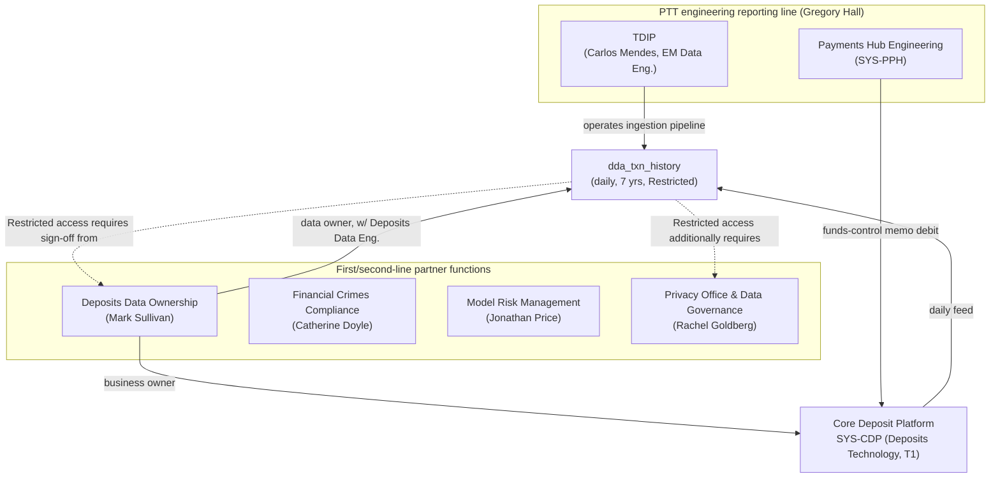

## Overview

**Deposits Data Ownership** is a first/second-line partner function named in
Crestline National Bank's Payments & Treasury Technology (PTT) organization,
system ownership, and engagement directory. It is accountable to **Mark
Sullivan** and is scoped specifically to "Core Deposit Platform datasets
(Restricted)" — the data-governance function that holds sign-off authority
over any PTT or Treasury Data & Insights Platform (TDIP) access to, or
consumption of, deposit-account data sourced from the
[Core Deposit Platform](../systems/core-deposit-platform.md) (`SYS-CDP`).

Deposits Data Ownership is not an engineering team: it does not appear in
§3 of the PTT directory alongside CBO Wire Center squad, CBO Platform &
Entitlements, Payments Hub Engineering, Payment Networks Engineering (PNE),
Global Transaction Services Integration (GTSI), Financial Crimes Technology
(FCT), Enterprise Notification Platform, or TDIP. It is instead listed in
§3.1, "Partner functions (first and second line)," alongside Financial
Crimes Compliance (Catherine Doyle), Model Risk Management (Jonathan Price),
Payment Operations (Denise Carter), Commercial Service Center (Kim Nguyen),
Legal - Treasury & Payments (Andrew Feldman), Information Security - Digital
Channels (Farah Ali), and Privacy Office & Data Governance (Rachel
Goldberg) — functions the directory describes as holding "mandatory review
or sign-off authority over specific classes of PTT change" rather than
delivering PTT engineering roadmap work themselves.

## Scope of accountability

Deposits Data Ownership's accountability is evidenced concretely in two
places in the reviewed estate, both resolving to Mark Sullivan:

| Asset | Role of Deposits Data Ownership / Mark Sullivan | Classification |
|---|---|---|
| [Core Deposit Platform](../systems/core-deposit-platform.md) (`SYS-CDP`) | Business owner (system ownership register, §4) | System: Tier 1 (24x7 critical) |
| [`dda_txn_history`](../datasets/dda-txn-history.md) dataset (TDIP payments-domain catalog) | Data owner / steward, jointly with Deposits Data Engineering | Data: **Restricted - Client Confidential** |

`SYS-CDP` is CNB's system of record for demand deposit accounts (DDAs). It
appears in the PTT system ownership register only because PRISM Payments Hub
(PPH) depends on it for funds-control checks during wire processing; its
owning engineering team is recorded only as "Deposits Technology," with no
individually named technical owner or Jira/Slack channel — unlike every
other Tier 1 system in the register. `dda_txn_history` is CDP's daily
transaction-history feed into TDIP and is the single most restrictively
classified dataset among the six payments-domain datasets in the TDIP
catalog; every other listed dataset is Confidential - Client or Internal.

Deposits Technology, the engineering team that owns `SYS-CDP` day to day,
sits outside the PTT organization entirely; Deposits Data Ownership is the
named governance counterpart that PTT and TDIP teams engage instead of a
PTT-internal engineering owner.

## Relationship to TDIP's ingestion pipeline

TDIP (led by Wei Zhang, with Carlos Mendes as EM of Data Engineering) runs
the Snowflake/dbt pipeline that ingests `dda_txn_history` from the Core
Deposit Platform daily and stores it alongside the other payments-domain
datasets. TDIP's operation of that pipeline does not make it the data owner:
the catalog entry pairs Mark Sullivan / Deposits Data Engineering as data
owner / steward, a pattern that differs from every other TDIP-ingested
payments dataset, which instead pairs a PTT business data owner (Laura Kim
or Marcus Chen) with Carlos Mendes. Decisions about who may access
`dda_txn_history`, what new consumers or feature tables may be built on it,
and whether any proposed use is within its approved purpose rest with
Deposits Data Ownership, not with TDIP engineering — even though TDIP
operates the pipeline mechanics.

The only documented downstream consumer of `dda_txn_history` is the
[`beneficiary_behavior_profile`](../datasets/beneficiary-behavior-profile.md)
feature table (Financial Crimes Technology), which joins it with
`pay_wire_txn_hist` to produce mule-risk features feeding the Tier 1 model
`M-FCT-0034` under MRM-POL-02. No other feature table or Insights API
endpoint in the current TDIP catalog reads from `dda_txn_history`, and it has
no documented path into any client-facing dashboard or analytic surface.

## Access governance

`dda_txn_history`'s **Restricted - Client Confidential** classification
under [DUS-07](../policies/dus-07.md) (CNB's Data Use & Client
Confidentiality Standard) places it in DUS-07's narrowest, most sensitive
tier — covering "account-level activity in deposit systems; financial-crimes
features; data about one client's accounts used for risk purposes" — a
stricter category than the "Confidential - Client" tier applied to
wire-payment datasets such as `pay_wire_txn_hist`. Two consequences follow
directly for any team that wants to use Core Deposit Platform data:

- **Dual sign-off for access.** Per DUS-07 §7 and the TDIP platform
  overview, access to Restricted datasets requires both data-owner sign-off
  (Deposits Data Ownership / Mark Sullivan) and Privacy Office approval,
  obtained through a Collibra Data Access Request with a published SLA of
  **15 business days** — longer than the standard Collibra-governed access
  path for Confidential or Internal datasets.
- **Purpose limitation carries forward to derived data.** DUS-07 §3's rule
  that "feature tables inherit the permitted purpose of their most
  restrictive input" means any feature table or analytic product built on
  `dda_txn_history` inherits both the Restricted classification and the
  narrow permitted purpose approved for the underlying deposit data, rather
  than being averaged down. This is why `beneficiary_behavior_profile` is
  scoped exclusively to the Financial Crimes Technology model `M-FCT-0034`
  and is barred from product or client-facing use.

Any new proposal to use Core Deposit Platform data (directly or via a
derived feature) for a client-facing or product purpose would additionally
require a Privacy Impact Assessment (~4 weeks, per the PTT directory's
governance-forums section) and, per DUS-07 §7, uses of financial-crimes-scoped
data outside FCC purposes are generally not approved.

## Engagement and escalation

Because Core Deposit Platform and `dda_txn_history` sit outside the PTT
engineering organization chart, requests to change ingestion, add new
consumers, or expand access to Core Deposit Platform data should be routed
to Deposits Data Ownership / Mark Sullivan (and Deposits Data Engineering
for pipeline/schema questions) rather than to TDIP (Carlos Mendes) or any
PTT engineering team, even though TDIP operates the ingestion pipeline.

Notably, the PTT directory's Section 6 engagement-routes and planning-factor
table — which gives first-pass sizing factors and documented intake routes
for every engineering team and for several partner functions (Model Risk
Management, FCC Policy & Advisory, Information Security, Payment
Operations, Commercial Service Center) — does **not** include an entry for
Deposits Data Ownership, nor for Legal - Treasury & Payments or Privacy
Office & Data Governance. No planning factor (hours per request, intake
system, or SLA) is documented for engaging Deposits Data Ownership directly;
only the downstream Collibra DAR / Privacy Office SLA (15 business days for
Restricted-dataset access) and the ~4-week Privacy Impact Assessment timeline
are documented as the governing lead times for work that touches Core
Deposit Platform data. Teams sizing cross-team dependencies against Deposits
Data Ownership should treat this as a gap to confirm directly with Mark
Sullivan rather than infer a planning factor from the other partner-function
entries.

Per the PTT directory's general escalation path, dependency conflicts
between engineering managers escalate to their Directors and then to the
PTT Leadership Team (weekly, Mondays); compliance or policy-interpretation
questions are explicitly routed to FCC Policy & Advisory (Jordan Ellis) or
the Privacy Office (Ethan Brooks) rather than decided by engineering teams.
For Restricted deposit data specifically, Mark Sullivan's data-owner sign-off
is additive to — not a substitute for — the standing Privacy Office approval
required for any Restricted-dataset access.

## What this page does not cover

The reviewed PTT directory and TDIP catalog extract name Mark Sullivan as
the accountable leader of Deposits Data Ownership and record its scope
("Core Deposit Platform datasets (Restricted)"), but do not document the
function's internal staffing, its relationship to "Deposits Data
Engineering" (the co-steward of `dda_txn_history`, which may or may not be
part of the same function), a formal intake system or planning factor for
requests, or any system other than `SYS-CDP` and dataset other than
`dda_txn_history` within its remit. These should be treated as open
questions for Mark Sullivan / Deposits Data Engineering rather than inferred
from the Payments-side team pages in this wiki.

## Related pages

- [Mark Sullivan](../people/mark-sullivan.md) — accountable leader of Deposits Data Ownership
- [Core Deposit Platform](../systems/core-deposit-platform.md) — `SYS-CDP`, the Tier 1 system this function owns
- [`dda_txn_history` dataset](../datasets/dda-txn-history.md) — the Restricted-classified feed this function stewards
- [DUS-07 Data Use & Client Confidentiality Standard](../policies/dus-07.md) — the policy governing Restricted-dataset access and purpose limitation
- [`beneficiary_behavior_profile` feature table](../datasets/beneficiary-behavior-profile.md) — sole documented downstream consumer of `dda_txn_history`
- [Treasury Data & Insights Platform](../systems/treasury-data-insights-platform.md) — operates the ingestion pipeline for `dda_txn_history` without holding data-owner authority over it
