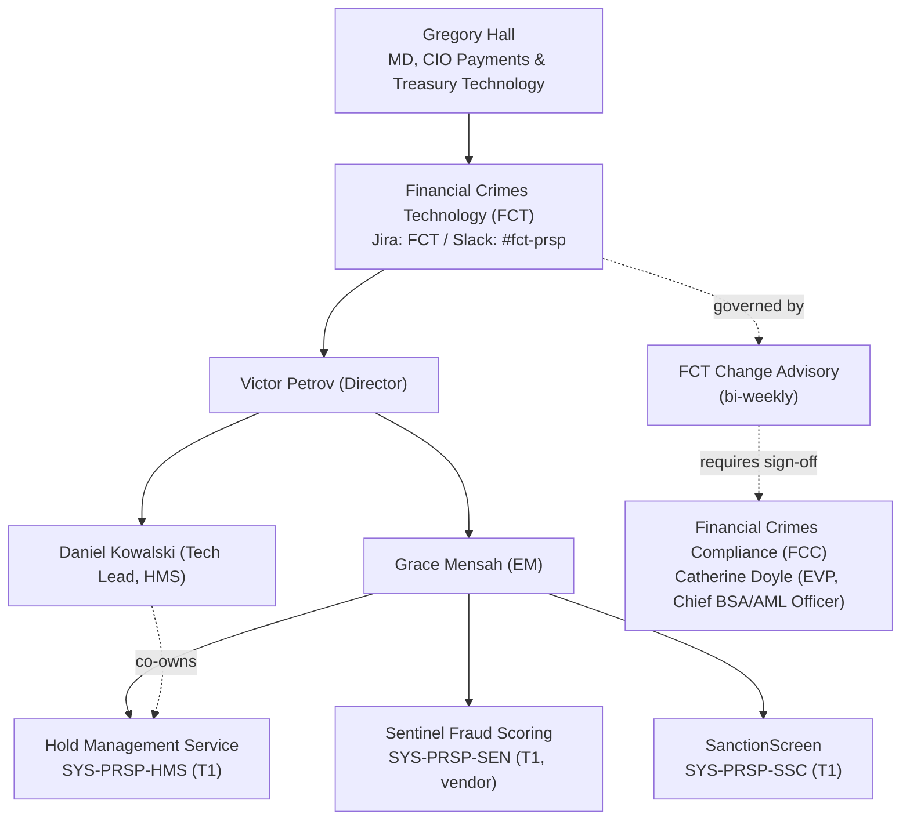

## Overview

Financial Crimes Technology (FCT) is the engineering team, internally
tracked under the Jira project `FCT` and Slack channel `#fct-prsp`, that
owns the **Payment Risk & Screening Platform (PRSP)**. FCT sits inside
Payments & Treasury Technology (PTT), the engineering organization led by
Gregory Hall (MD, CIO Payments & Treasury Technology), alongside sibling
teams such as Payments Hub Engineering, Payment Networks Engineering (PNE),
and the CBO Wire Center squad. FCT is distinguished from those other PTT
teams by the nature of what it ships: controls that place, classify, and
release holds on outbound payments for fraud, sanctions, and funds-control
reasons, rather than payment processing or channel features themselves.

FCT's leadership and reporting line:

- **Victor Petrov** — Director, Financial Crimes Technology; accountable
  for the team as a whole and the named approver of the HMS design of
  record, [PRSP-HMS-3.4](../people/victor-petrov.md).
- **Grace Mensah** — Engineering Manager; the named technical owner for all
  three PRSP systems in the PTT system ownership register (HMS, Sentinel,
  SanctionScreen).
- **Daniel Kowalski** — Tech Lead, Hold Management Service; co-owner of
  HMS specifically and document owner of PRSP-HMS-3.4 alongside Mensah.

*FCT's place in the PTT org chart, its three owned systems, and the Change
Advisory / FCC governance loop that gates changes to holds and screening.*

## Systems owned: the Payment Risk & Screening Platform (PRSP)

FCT owns all three components of PRSP, each registered as a Tier 1
(T1 — 24x7 critical) system in the PTT system ownership register:

| System ID | System | Business owner | Notes |
|---|---|---|---|
| `SYS-PRSP-HMS` | [Hold Management Service (HMS)](../systems/hold-management-service.md) | Rebecca Stone (FIU) | System of record for payment holds; twelve-code HRC reason taxonomy and four disclosure tiers (P/C/G/R) |
| `SYS-PRSP-SEN` | Sentinel Fraud Scoring | Fraud Strategy (FCC) | Vendor fraud-scoring model, MRM inventory ID `M-FCT-0021`, Tier 1 under MRM-POL-02; model owner Victor Petrov |
| `SYS-PRSP-SSC` | SanctionScreen | Michael Tran (OFAC) | OFAC and other sanctions-list screening |

HMS is the system FCT has documented in the most depth: it is the system of
record for holds placed on outbound payments by screening, fraud,
funds-control, and operational controls, and it surfaces work queues to
Payment Operations and the FIU through the Investigations Workbench (IWB).
See [Hold Management Service (HMS)](../systems/hold-management-service.md)
for the full hold lifecycle, hold reason taxonomy, data-handling rules, and
controls (CTRL-PAY-012/018/031/040). Sentinel and SanctionScreen feed hold
reasons into HMS (`HRC-07 FRAUD_MODEL_HIGH` and `HRC-09 SANCTIONS_REVIEW`
respectively) but are themselves distinct systems that FCT also owns
end-to-end, including Sentinel's vendor-model governance obligations under
MRM-POL-02.

FCT's technical and business ownership is split deliberately: the
**technical owner** (Grace Mensah, with Daniel Kowalski specifically for
HMS) is accountable for how the systems are built and run; the
**business owner** for each system sits in a partner function (FIU, FCC
Fraud Strategy, OFAC) and is accountable for the policy and investigative
outcomes the system supports. Victor Petrov, as Director, is the named
model owner of record for Sentinel (`M-FCT-0021`) and a related
beneficiary mule-risk model (`M-FCT-0034`) in the MRM model inventory, even
though Grace Mensah is the system's technical owner — a reminder that model
ownership under MRM-POL-02 and system ownership under the PTT register are
tracked separately and can name different accountable individuals.

## Governance: FCT Change Advisory, FCC sign-off, and the year-end freeze

Because PRSP enforces regulatory and fraud controls, FCT does not operate
under the same lightweight demand-board process as other PTT teams. Instead,
changes to hold or screening behavior go through a dedicated forum:

- **FCT Change Advisory** meets **bi-weekly** and requires **5 business
  days'** submission lead time.
- **FCC (Financial Crimes Compliance) sign-off is mandatory** for any change
  to hold or screening behavior — this is a hard gate, not a review that can
  be bypassed by engineering alone. FCC is accountable to Catherine Doyle
  (EVP, Chief BSA/AML Officer), with Jordan Ellis (FCC Policy & Advisory)
  as the day-to-day contact for design reviews; Jordan Ellis also reviewed
  and approved PRSP-HMS-3.4 itself.
- A **year-end freeze runs from December 15 through January 5**, during
  which FCT does not deploy hold- or screening-affecting changes, reflecting
  the elevated operational risk of changing financial-crimes controls around
  the holiday period.

This governance model has direct planning consequences: FCT's own planning
factor is **1 story point ≈ 8 engineering hours, plus a 20% allowance for
independent compliance testing** on top of normal engineering effort — the
only team in the PTT directory with an explicit compliance-testing loading
factor. Cross-team work that touches HMS, Sentinel, or SanctionScreen must
be routed through **FCT Change Advisory and FCC sign-off**, not through a
generic Jira intake, and should be planned around both the bi-weekly
Change Advisory cadence and the December 15–January 5 freeze window. As of
PI 27.1 capacity reporting, FCT was reported at roughly 80% committed.

Beyond Change Advisory, FCT's work can also require engagement with other
second-line and architecture forums depending on the change:

- **Model Risk Management (MRM)** — any new or materially changed
  model (e.g., a Sentinel model update) must be registered in the MRM model
  inventory (Archer) before development begins; Tier 2 validation takes
  10–14 weeks plus queue time.
- **Privacy Impact Assessment (PIA)** — required for new uses of client data
  in client-facing features, relevant to any future client-facing hold
  interfaces FCT might build.
- **Payments Architecture Review Board (ARB)** — required for new
  client-facing integrations to payment systems generally, chaired by
  Nikhil Bose (Chief Architect, Payments & Treasury).

Escalations that cannot be resolved between engineering managers go to the
Director (Victor Petrov) and then to the PTT Leadership Team. Questions of
compliance or policy interpretation — as opposed to engineering
implementation — are explicitly not decided by FCT engineering and instead
route to FCC Policy & Advisory (Jordan Ellis).

## Relationships

- Reports into **Payments & Treasury Technology (PTT)** under Gregory Hall
  (MD, CIO).
- Partners with **Financial Crimes Compliance (FCC)**, accountable to
  Catherine Doyle, for all hold/screening policy and mandatory sign-off.
- Partners with **Model Risk Management (MRM)**, accountable to Jonathan
  Price, for Sentinel's model governance under MRM-POL-02.
- Integrates with **Payment Operations** and the **FIU** via the
  Investigations Workbench (IWB), the sole channel through which holds are
  worked and dispositioned.
- Integrates with **PRISM Payments Hub (PPH)**, owned by Payments Hub
  Engineering, which transitions payments into and out of the `HELD` state
  based on HMS hold creation and disposition.
- See [Daniel Kowalski](../people/daniel-kowalski.md), [Grace Mensah](../people/grace-mensah.md),
  and [Victor Petrov](../people/victor-petrov.md) for individual role detail,
  and [Hold Management Service](../systems/hold-management-service.md) for
  the HMS system design.
