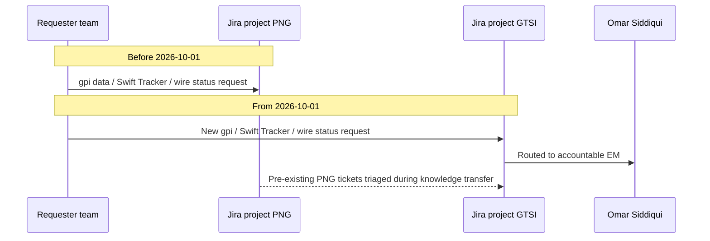

## Overview

**Global Transaction Services Integration (GTSI)** is an engineering team within
Payments & Treasury Technology (PTT) at Crestline National Bank (CNB), led by
Director **Elena Vasquez**. Before October 2026, GTSI's established scope was
the CHIPS connector and nostro reconciliation integration. Effective
**2026-10-01**, GTSI absorbed a substantial new cross-border remit —
previously owned by Payment Networks Engineering (PNE) — making it CNB's
consolidated owner of Swift-facing payment network integration and
international wire tracking. The change was announced by Gregory Hall (MD,
CIO Payments & Treasury Technology) in **CNB-MEMO-2026-09**, "Realignment of
Cross-Border Network Integration," issued 2026-09-02.

GTSI reports into the PTT CIO line under Gregory Hall, alongside sibling
engineering teams such as PNE (Raj Malhotra), Payments Hub Engineering, and
the CBO Wire Center squad. GTSI's core leadership trio is:

| Role | Person |
|---|---|
| Director | Elena Vasquez |
| Engineering Manager (EM) | Omar Siddiqui |
| Tech Lead | Hannah Lindqvist |

See [Elena Vasquez](../people/elena-vasquez.md), [Omar Siddiqui](../people/omar-siddiqui.md),
and [Hannah Lindqvist](../people/hannah-lindqvist.md) for role-specific detail.

## Why the reorganization happened

The memo frames the realignment as a response to growing cross-border volumes
and Swift's continuing ISO 20022 roadmap beyond the end of MT/MX coexistence
(2025-11-22): rather than leaving Swift-dependent integration split across
PNE and other teams, CNB consolidated cross-border network capabilities under
a single accountable leader, Elena Vasquez.

## What moved to GTSI (effective 2026-10-01)

| Capability | Previous owner | Accountable leader(s) at GTSI |
|---|---|---|
| Swift Alliance Gateway, gpi Connector (`SYS-PNG-GPI`), and gpi Tracker integration | Payment Networks Engineering (Raj Malhotra) | Omar Siddiqui (EM); Hannah Lindqvist (Tech Lead) |
| Swift API gateway (Microgateway), SwiftNet PKI service accounts | Payment Networks Engineering | Hannah Lindqvist (sole accountable leader) |
| International wire tracking roadmap (including any client-facing gpi capability) | Payment Networks Engineering | Elena Vasquez; business sponsor Laura Kim (Director, Payments Platform Product) |

<!-- openwiki: mermaid parse failed and this diagram was converted to a text fence so it does not break rendering. Fix the diagram source and restore the mermaid fence. Parser error: Heuristic: an unescaped angle bracket inside a label breaks rendering; rephrase the label. -->
```text
flowchart TD
  GH["Gregory Hall<br/>MD, CIO PTT"] --> EV["Elena Vasquez<br/>Director, GTSI"]
  GH --> RM["Raj Malhotra<br/>Director, PNE"]
  EV --> OS["Omar Siddiqui<br/>EM, GTSI"]
  EV --> HL["Hannah Lindqvist<br/>Tech Lead, GTSI"]
  OS --> GPI["Swift Alliance Gateway / gpi Connector<br/>SYS-PNG-GPI, gpi Tracker integration"]
  HL --> GPI
  HL --> MGW["Swift API gateway, Microgateway<br/>and SwiftNet PKI service accounts"]
  EV --> WIRE["International wire tracking roadmap"]
  LK["Laura Kim<br/>business sponsor"] -.-> WIRE
  RM --> FFC["Fedwire Funds Connector<br/>SYS-PNG-FFC - stays with PNE"]
  RM -.->|transferred 2026-10-01| GPI
```
*Reporting and capability ownership after the 2026-10-01 cross-border realignment (CNB-MEMO-2026-09).*

GTSI's pre-existing scope, documented in the PTT Organization & Ownership
Directory (`CNB-ORG-PTT-2026-06`, published 2026-06-15), continues alongside
the newly transferred capabilities: the **CHIPS connector** and **nostro
reconciliation integration**, with Hannah Lindqvist named as Tech Lead
contact for both.

## What explicitly did not move

- The **Fedwire Funds Connector (`SYS-PNG-FFC`)**, including the
  `net.fedwire.ack.v1` and `net.fedwire.inbound.v1` Kafka topics, remains
  with PNE under Raj Malhotra (EM Brian Walsh). It is out of scope for GTSI.
- Raj Malhotra separately assumed ownership of the **FedNow** and **RTP**
  connectors from 2026-11-01 — an unrelated change bundled into the same
  memo but not part of the GTSI hand-off; PNE's remit realigns toward
  domestic instant/wire rails at the same time GTSI absorbs cross-border/
  Swift scope.

## Systems owned

- **[Swift gpi Connector](../systems/swift-gpi-connector.md) (SYS-PNG-GPI)** —
  the Swift Alliance Gateway/gpi Connector module of the Payment Network
  Gateway. It sends/acknowledges Swift CBPR+ ISO 20022 `pacs.008` transfers
  and is the sole caller of the Swift Tracker API, running a 4-hourly batch
  pull (00:00/04:00/08:00/12:00/16:00/20:00 ET) of changed outbound UETRs
  from the last 30 days, upserted into the Oracle table
  `GPI_TRACKER_SNAPSHOT`. This table feeds Payment Operations' Investigations
  Workbench directly and TDIP's nightly `gpi_tracker_events` load. There is
  no internal API exposing gpi status today, and `GPI_TRACKER_SNAPSHOT` must
  not be exposed directly to client channels. On the PTT system ownership
  register, `SYS-PNG-GPI` is Tier 1 (24x7 critical support), with business
  owner Laura Kim.
- **Swift API gateway (Microgateway) and SwiftNet PKI service accounts** —
  shared Swift connectivity/credential plumbing used by any Swift-dependent
  integration, not only gpi, which is why GTSI inherits both the gpi-specific
  connector and the underlying gateway/credential layer as a distinct
  capability (sole accountability: Hannah Lindqvist).
- **CHIPS connector** and **nostro reconciliation integration** — pre-existing
  GTSI scope, unaffected by the October 2026 realignment.

GPI-C's design, including its batch cadence and quota constraints, is
documented in full on the [Swift gpi Connector](../systems/swift-gpi-connector.md)
page; GTSI did not change that design by taking it over — this was an
ownership and people realignment, not a rewrite.

## Roadmap items owned by GTSI

- **GTSI-0107 — gpi Tracker Real-Time Service (GTRS).** A planned
  change-feed-based internal REST + event API over the Swift gpi Tracker,
  intended to let internal consumers (eventually including channels such as
  Crestline Business Online) obtain gpi status without each issuing its own
  quota-metered Swift Tracker API call. It is **not funded for 2026**;
  discovery is planned for **2027-Q2**, subject to the 2027 portfolio review.
  GTRS carries forward the recommendation of PNE's declined **PNG-1544**
  batch-frequency change, and the Payments ARB has explicitly not approved
  any interim direct exposure of `GPI_TRACKER_SNAPSHOT` to channels as a
  stopgap. Owner: Elena Vasquez. See
  [GTSI-0107: gpi Tracker Real-Time Service](../projects/gtsi-0107-gpi-real-time-service.md).
- **GTSI-0112 — gpi Connector & Swift API Gateway Knowledge Transfer.** The
  in-progress Jira epic (owner Omar Siddiqui, target **2026-12-15**) that
  executes the operational hand-off mandated by CNB-MEMO-2026-09:
  documentation, on-call readiness, and the transfer of Tomasz Nowak (Senior
  Engineer, gpi Connector), who now reports to Omar Siddiqui. Until
  completion, PNE on-call remains secondary support for `SYS-PNG-GPI`. See
  [GTSI-0112: gpi Connector & Swift API Gateway Knowledge Transfer](../projects/gtsi-0112-gpi-knowledge-transfer.md).
- **GTSI-0115 — Swift gpi Tracker API contract renewal.** GTSI is responsible
  for renewing the Swift Tracker API contract, due **2027-01-31**, which caps
  usage at 250,000 calls/month. That quota is a hard external constraint
  already shared by GPI-C's batch pulls and Operations' ad-hoc lookups, and
  is a binding design input for any future real-time or client-facing gpi
  capability GTSI takes on (including GTSI-0107).

<!-- openwiki: mermaid parse failed and this diagram was converted to a text fence so it does not break rendering. Fix the diagram source and restore the mermaid fence. Parser error: Heuristic: an unescaped angle bracket inside a label breaks rendering; rephrase the label. -->
```text
flowchart LR
  swift["Swift Tracker API<br/>250,000 calls/month quota"] -->|"quota-metered batch pull"| gpic["GPI-C, SYS-PNG-GPI"]
  gpic -->|upsert| snap[("GPI_TRACKER_SNAPSHOT")]
  snap --> iwb["Investigations Workbench"]
  snap --> tdip["TDIP nightly load"]
  snap -.->|not approved for direct exposure| channels["Channel consumers, e.g. CBO"]
  gpic -.->|"planned change feed"| gtrs["GTSI-0107 GTRS"]
  gtrs -.-> channels
  contract["GTSI-0115 contract renewal<br/>due 2027-01-31"] -.-> swift
```
*GTSI's gpi data path today (solid lines) and the planned real-time service it is responsible for building (dashed lines), bounded by the Swift Tracker API quota that GTSI-0115 renews.*

## People changes from the transfer

- **Tomasz Nowak** (Senior Engineer, gpi Connector), previously at PNE and
  named gpi-section owner of PNE's technical design (PNG-TDD-6.0), transferred
  to GTSI and now reports to Omar Siddiqui. He is the primary technical
  knowledge source being transferred under GTSI-0112.
- **PNE on-call remains secondary support** for `SYS-PNG-GPI` until
  **2026-12-15**, when GTSI-0112 is targeted to complete; until then,
  incident response for `SYS-PNG-GPI` has a dual-team dependency.

## Engagement and intake

From **2026-10-01**, all new requests for gpi data, Swift Tracker usage, or
international wire status capabilities must be raised as Jira issues in
project **GTSI** and directed to **Omar Siddiqui**, rather than opened
against PNE's legacy **PNG** project. Requests already logged against PNG for
gpi topics are triaged by GTSI during the knowledge-transfer window; new PNG
tickets for gpi topics should not be opened.


*Intake routing for gpi, Swift Tracker, and international wire status requests shifted from Jira project PNG to project GTSI on 2026-10-01.*

General team engagement details, per the PTT Organization & Ownership
Directory (as of its 2026-06-15 publication, pre-dating the October
realignment):

| Attribute | Value |
|---|---|
| Jira project | GTSI |
| Slack channel | `#gtsi-crossborder` |
| Planning factor | ~1 story point ≈ 7 engineering hours |
| Intake cadence | Quarterly roadmap intake |
| PI 27.1 capacity note | ~75% committed |

## Timeline

| Date | Event |
|---|---|
| 2026-09-02 | CNB-MEMO-2026-09 issued by Gregory Hall, announcing the realignment |
| 2026-10-01 | Effective date: Swift Alliance Gateway/gpi Connector, Microgateway, SwiftNet PKI service accounts, and international wire tracking roadmap transfer from PNE to GTSI |
| 2026-10-01 | GTSI becomes the Jira intake point for gpi/Swift Tracker/wire status requests |
| 2026-11-01 | Raj Malhotra (PNE) separately assumes FedNow and RTP connector ownership (unrelated to the GTSI transfer) |
| 2026-12-15 | Target completion of GTSI-0112 knowledge transfer; PNE secondary on-call support for `SYS-PNG-GPI` ends |
| 2027-01-31 | Swift gpi Tracker API contract renewal due (GTSI-0115) |
| 2027-Q2 | Planned discovery start for GTSI-0107 (GTRS), subject to 2027 portfolio review |

## Documentation precedence note

CNB-MEMO-2026-09 pre-dates the PTT Organization & Ownership Directory
(`CNB-ORG-PTT-2026-06`, version 2026.2, published 2026-06-15), which still
lists `SYS-PNG-GPI` under PNE (technical owner Raj Malhotra / Tomasz Nowak)
and does not yet show the Microgateway or SwiftNet PKI service accounts under
GTSI. The directory is refreshed quarterly and organizational announcements
issued between refreshes take precedence; the directory's Q4 2026 refresh is
expected to incorporate this realignment. Until that refresh, CNB-MEMO-2026-09
is the authoritative source for GTSI's expanded scope.

## Related pages

- [Elena Vasquez](../people/elena-vasquez.md) — Director, GTSI
- [Omar Siddiqui](../people/omar-siddiqui.md) — Engineering Manager, GTSI
- [Hannah Lindqvist](../people/hannah-lindqvist.md) — Tech Lead, GTSI
- [Swift gpi Connector](../systems/swift-gpi-connector.md) — SYS-PNG-GPI system design
- [GTSI-0107: gpi Tracker Real-Time Service](../projects/gtsi-0107-gpi-real-time-service.md)
- [GTSI-0112: gpi Connector & Swift API Gateway Knowledge Transfer](../projects/gtsi-0112-gpi-knowledge-transfer.md)
