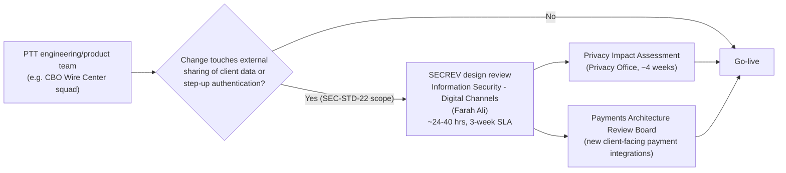

## Overview

**Information Security - Digital Channels** is a first/second-line partner
function to Payments & Treasury Technology (PTT), accountable to **Farah
Ali**. Unlike the PTT engineering teams, it does not own a system in the PTT
system ownership register; instead it is a control function whose
engagement surface is **SECREV**, a mandatory design review for digital
channel changes that touch security-sensitive areas - most notably
**external sharing of client data** and **step-up authentication**. SECREV
is invoked whenever a design falls under **SEC-STD-22**, the "Digital
Channel External Sharing & Step-Up Standard."

See [Farah Ali](../people/farah-ali.md) for the accountable-leader
profile and [CBO Wire Center](../systems/cbo-wire-center.md) for the system
whose current-state architecture explicitly documents where SECREV applies.

## Why SECREV exists: the SEC-STD-22 trigger

The Wire Center current-state architecture (CBO-ARCH-WC-4.1 §6, "Security
and entitlements") is explicit about the boundary that invokes this
function:

- **External sharing is not currently supported.** Wire Center provides no
  capability to share client transaction data - links or documents - with
  non-users. Any such capability, if built, **requires an InfoSec design
  review under SEC-STD-22** in addition to a Privacy Impact Assessment
  (PIA).
- **Step-up authentication is already a reviewed control.** Wire release
  requires step-up authentication (`POST /cbo/auth/v2/step-up`, EP-AUTH-01)
  on top of client-configured dual approval above client thresholds. That
  endpoint is explicitly cataloged as a **reusable asset** intended for
  other high-risk client actions - which means any team that extends
  step-up to a new action is extending a mechanism that originally fell,
  and will again fall, under SEC-STD-22 design-review scope. See
  [CBO Auth Step-Up API](../interfaces/cbo-auth-step-up-api.md) for how that
  control is wired today.

In other words, SECREV is not a generic "security review everything" gate
for PTT: per the source architecture, its documented trigger conditions are
specifically (1) any new or changed external-sharing capability for client
transaction data, and (2) step-up authentication design or reuse. Teams
should read these as the concrete signals for when a digital-channel change
needs to route through Farah Ali's function, as distinct from other
governance gates such as the Payments Architecture Review Board (ARB) or
the Disclosure Review Committee (DRC), which apply to different kinds of
changes.

## Engagement model and planning factors

SECREV is listed among the PTT engagement routes and planning factors used
for first-pass sizing of cross-team dependencies (CNB-ORG-PTT-2026-06 §6):

| Factor | Value |
|---|---|
| Design review effort | ~24-40 engineering/security hours |
| Lead time / SLA | 3 weeks |
| Intake / contact | Farah Ali, Information Security - Digital Channels |

Teams planning a change that touches external sharing of client data or
step-up authentication should budget both the review effort and the 3-week
SLA into their delivery timeline. Because such changes frequently also
touch client-facing data use, a SECREV design review commonly runs
alongside - not instead of - a **Privacy Impact Assessment** (PIA, ~4 weeks
via OneTrust, owned by the Privacy Office under Rachel Goldberg) and, for
new client-facing integrations into payment systems, Payments **Architecture
Review Board** sign-off (monthly, 10 business days submission lead time,
chaired by Chief Architect Nikhil Bose). Client-facing copy or disclaimer
changes that accompany an external-sharing feature may separately need
**Disclosure Review Committee** (DRC) approval. None of these governance
forums substitute for one another; a feature that spans their respective
triggers needs all of the applicable reviews.

*SECREV sits alongside, not in place of, other PTT governance gates; a
change can require several in parallel depending on its scope.*

## Relationship to Wire Center and other PTT systems

- **CBO Wire Center** (SYS-CBO, owned by the CBO Wire Center squad under
  Anjali Deshpande's [Digital Treasury Channels](../organizations/digital-treasury-channels.md)
  organization) is the concrete system whose architecture record names
  SECREV's trigger conditions. Any Wire Center enhancement that would add
  external sharing of transaction data (e.g., a shareable link to a wire
  confirmation) or that extends step-up authentication to a new action
  (e.g., attesting a held wire) would need to route through this function
  before go-live.
- **CBO Auth** owns the step-up mechanism itself
  (`POST /cbo/auth/v2/step-up`, EP-AUTH-01); Information Security - Digital
  Channels does not operate that endpoint but is the design-review gate for
  changes to how and where it is used.
- **Peer partner functions** in the same PTT directory section include
  Financial Crimes Compliance (Catherine Doyle), Model Risk Management
  (Jonathan Price), Payment Operations (Denise Carter), Commercial Service
  Center (Kim Nguyen), Legal - Treasury & Payments (Andrew Feldman), and
  Privacy Office & Data Governance (Rachel Goldberg). Each has its own
  distinct trigger and intake route; SECREV's is external sharing and
  step-up authentication specifically.

## Governance source and currency

This function and its planning factors are documented in the **PTT
Organization, System Ownership & Engagement Directory**
(CNB-ORG-PTT-2026-06, v2026.2, published 2026-06-15, next refresh 2026-12),
maintained by the PTT Business Management Office and approved by Gregory
Hall (MD, CIO Payments & Treasury Technology); the SEC-STD-22 trigger
conditions are documented in **CBO-ARCH-WC-4.1** (v4.1, Approved, last
reviewed 2026-08-20). The directory explicitly notes that organizational
announcements issued between quarterly refreshes take precedence over its
contents, so teams relying on this page for active delivery planning should
reconfirm current contact details, SLA, and effort estimates directly with
Information Security before committing a schedule.
