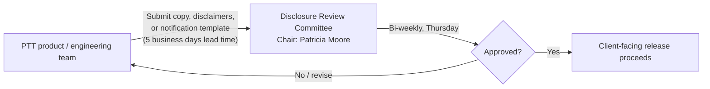

## Overview

**Legal - Treasury & Payments** is a first- and second-line partner function
in Crestline National Bank's (CNB) Payments & Treasury Technology (PTT)
organization. Like Financial Crimes Compliance (FCC), Model Risk Management
(MRM), and the Privacy Office, it is listed in the PTT organization
directory's "Partner functions (first and second line)" table rather than in
the engineering team directory or the system ownership register: Legal owns
no system of record and employs no engineering staff. Instead, it is the
accountable legal function that every PTT engineering or product team must
route client-facing wording through for review and sign-off before a change
ships.
[Partner functions (first and second line)](repo://sources/estate/cnb-org-ptt-2026-06-ptt-organization-system-ownership-engagement-directory.md#L65-L77)

| Field | Value |
|---|---|
| Function | Legal - Treasury & Payments |
| Accountable | Andrew Feldman |
| Line | First/second-line legal partner |
| Contact for product/design reviews | Patricia Moore (Chair, Disclosure Review Committee) |
| Engagement route | Disclosure Review Committee (DRC) |
| Appears in engineering team directory (Sec. 3)? | No |
| Appears in system ownership register (Sec. 4)? | No |

## Accountable leadership and named contacts

**Andrew Feldman** is named in the PTT engagement directory's
partner-function table as the accountable owner of Legal - Treasury &
Payments. Day-to-day engagement for product and design reviews is delegated
to **Patricia Moore**, who chairs the Disclosure Review Committee (DRC) and
is the specific point of contact engineering and product teams should reach
for reviews of client-facing language, rather than Feldman directly. See
[Andrew Feldman](../people/andrew-feldman.md) and
[Patricia Moore](../people/patricia-moore.md) for full role detail.
[Partner functions (first and second line)](repo://sources/estate/cnb-org-ptt-2026-06-ptt-organization-system-ownership-engagement-directory.md#L73)

Legal - Treasury & Payments sits in the same partner-function tier as FCC,
MRM, Payment Operations, the Commercial Service Center, Information
Security - Digital Channels, the Privacy Office & Data Governance, and
Deposits Data Ownership: accountable second-line (or legal/compliance)
partners that engineering teams must engage through defined routes rather
than owning systems themselves.
[Partner functions (first and second line)](repo://sources/estate/cnb-org-ptt-2026-06-ptt-organization-system-ownership-engagement-directory.md#L65-L77)

## Why this function exists: the Disclosure Review Committee

The function's reason for existence in the payments stack is a single
governance forum: the **Disclosure Review Committee (DRC)**, chaired by
Patricia Moore. The DRC approves all client-facing copy, disclaimers, and
notification templates produced by teams across PTT, with these operating
parameters as listed in the PTT governance-forums register:

| Attribute | Value |
|---|---|
| Cadence | Bi-weekly, Thursdays |
| Submission lead time | 5 business days before the session |
| Scope | Client-facing copy, disclaimers, notification templates |

[Governance forums](repo://sources/estate/cnb-org-ptt-2026-06-ptt-organization-system-ownership-engagement-directory.md#L114-L116)

Because the DRC meets only bi-weekly and requires 5 business days' lead
time, missing a submission window pushes review to the next cycle, adding
roughly two weeks of delay to any client-facing launch. Teams typically plan
DRC submission alongside other sign-offs such as the Payments Architecture
Review Board or FCT Change Advisory.

### DRC as a mandatory gate in concrete workflows

The directory and related policies document at least two concrete points
where the DRC is a hard dependency, not an optional review:

- **Enterprise Notification Service (ENS) event onboarding** — any new ENS
  event type requires draft templates per channel to be submitted to the
  DRC as a required step in the event-onboarding workflow before production
  enablement. The onboarding SLA is 6 weeks from complete submission to
  production, including DRC review, intaken via the ServiceNow "ENS Event
  Onboarding" process.
  [Engagement routes and planning factors](repo://sources/estate/cnb-org-ptt-2026-06-ptt-organization-system-ownership-engagement-directory.md#L132)
- **Aggregated cohort statistics shown to clients** — under the Privacy
  Office's Data Use & Client Confidentiality Standard
  ([DUS-07](../policies/dus-07.md)), the wording and disclaimer accompanying
  any cohort statistic must be DRC-approved as one of the mandatory
  conditions before the statistic may be displayed to a client.
- **Predictive/estimate statements about payment status** — under
  [POL-FCC-014](../policies/pol-fcc-014.md), any client-facing
  predictive or estimated-delivery statement is conditioned jointly on Model
  Risk Management registration and a DRC-approved disclaimer; ENS templates
  in particular must be DRC-approved and must never carry a prohibited term
  or Restricted-tier hold detail.

## Relationship to policy and compliance escalation

The DRC's approval authority is limited to review and sign-off of disclosure
content itself — it is a wording and format gate, not a policy-interpretation
body. Compliance or policy interpretation questions (for example, how a
disclaimer should reflect obligations under POL-FCC-014 or DUS-07) are not
decided by the DRC or by engineering teams; they route instead to FCC Policy
& Advisory (Jordan Ellis) or the Privacy Office (Ethan Brooks). Legal -
Treasury & Payments' disclosure-review role therefore operates downstream of,
and in coordination with, those policy-owning second-line functions rather
than substituting for them.
[Escalation](repo://sources/estate/cnb-org-ptt-2026-06-ptt-organization-system-ownership-engagement-directory.md#L148-L150)

## Relationships

- **Andrew Feldman** — accountable leader of the function; engaged for
  Legal questions outside the scope of disclosure review.
- **Patricia Moore** — Chair of the DRC; the named, day-to-day contact for
  product and design reviews of client-facing language.
- **Peer partner-function leaders** in the same directory tier: Catherine
  Doyle (Financial Crimes Compliance), Jonathan Price (Model Risk
  Management), Denise Carter (Payment Operations), Kim Nguyen (Commercial
  Service Center), Farah Ali (Information Security - Digital Channels),
  Rachel Goldberg (Privacy Office & Data Governance), and Mark Sullivan
  (Deposits Data Ownership).
- **Enterprise Notification Platform** — submits per-channel notification
  templates for new ENS event types to the DRC as part of event onboarding.
  See [Enterprise Notification Platform](enterprise-notification-platform.md).
- **Financial Crimes Compliance** — owns POL-FCC-014's disclosure-tier and
  predictive-statement rules that DRC-approved copy must comply with. See
  [Financial Crimes Compliance](financial-crimes-compliance.md).

## How to engage

Teams needing DRC sign-off on client-facing copy, disclaimers, or
notification templates should submit the material at least 5 business days
ahead of the next bi-weekly Thursday session, routing through Patricia
Moore. For broader Legal - Treasury & Payments questions outside the scope
of disclosure review, engage Andrew Feldman's function directly rather than
treating the DRC as a general-purpose legal intake.

## Related pages

- [Andrew Feldman](../people/andrew-feldman.md)
- [Patricia Moore](../people/patricia-moore.md)
- [POL-FCC-014](../policies/pol-fcc-014.md)
- [DUS-07](../policies/dus-07.md)
- [Financial Crimes Compliance](financial-crimes-compliance.md)
- [Enterprise Notification Platform](enterprise-notification-platform.md)
