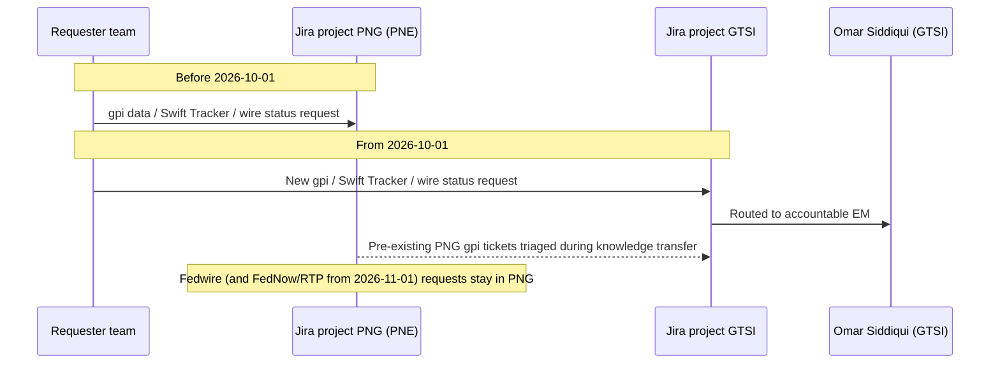

## Overview

**Payment Networks Engineering (PNE)** is an engineering team within Payments & Treasury
Technology (PTT) at Crestline National Bank (CNB), led by Director **Raj Malhotra**. PNE builds
and operates the bank's payment-network gateway connectivity — historically both modules of the
**Payment Network Gateway (PNG)**: the **Fedwire Funds Connector** (`SYS-PNG-FFC`) and the **Swift
Alliance Gateway & gpi Connector** (`SYS-PNG-GPI`). Effective **2026-10-01**, a cross-border
re-org (**CNB-MEMO-2026-09**, "Realignment of Cross-Border Network Integration," issued
2026-09-02 by Gregory Hall, MD — CIO Payments & Treasury Technology) moved the Swift/gpi side of
PNE's portfolio to [Global Transaction Services Integration (GTSI)](gtsi.md), while the Fedwire
side stayed with PNE. A month later, effective **2026-11-01**, PNE's domestic scope grew again
when Raj Malhotra assumed ownership of the FedNow and RTP connectors. PNE reports into Gregory
Hall's PTT engineering line alongside sibling teams such as Payments Hub Engineering and GTSI.

PNE's core named contacts, per the PTT Organization & Ownership Directory
(**CNB-ORG-PTT-2026-06**, v2026.2, published 2026-06-15):

| Role | Person |
|---|---|
| Director | Raj Malhotra |
| Engineering Manager (EM), Fedwire | Brian Walsh |
| Tech Lead (TL), Fedwire | Chen Wei |
| Senior Engineer, gpi Connector (transferred to GTSI 2026-10-01) | Tomasz Nowak |

See [Raj Malhotra](../people/raj-malhotra.md) for role-specific detail on the director and the two
memo-driven scope changes he is accountable for.

<!-- openwiki: mermaid parse failed and this diagram was converted to a text fence so it does not break rendering. Fix the diagram source and restore the mermaid fence. Parser error: Heuristic: an unescaped angle bracket inside a label breaks rendering; rephrase the label. -->
```text
flowchart TD
  GH["Gregory Hall<br/>MD, CIO Payments & Treasury Technology"] --> RM["Raj Malhotra<br/>Director, PNE"]
  RM --> BW["Brian Walsh<br/>EM, Fedwire"]
  RM --> CW["Chen Wei<br/>Tech Lead, Fedwire"]
  BW --> FFC["Fedwire Funds Connector<br/>SYS-PNG-FFC (Tier 1)"]
  CW --> FFC
  RM -.->|"assumes 2026-11-01"| FEDNOW["FedNow connector"]
  RM -.->|"assumes 2026-11-01"| RTP["RTP connector"]
  RM -.->|"transferred 2026-10-01"| GPI["Swift Alliance Gateway / gpi Connector<br/>SYS-PNG-GPI"]
  GPI --> GTSI["GTSI (Elena Vasquez / Omar Siddiqui)"]
  LK["Laura Kim<br/>Business Owner, payment datasets"] -.-> FFC
```
*PNE's reporting line and system ownership as of the 2026-11-01 FedNow/RTP addition.*

## What PNE owns today

### Fedwire Funds Connector (SYS-PNG-FFC)

PNE's flagship and now sole legacy PNG system is the **[Fedwire Funds Connector](../systems/fedwire-funds-connector.md)**
(FFC, `SYS-PNG-FFC`), the Fedwire-facing module that connects CNB to the Federal Reserve's
Fedwire Funds Service over FedLine Direct (dual MQ channels: Columbus primary, Charlotte
contingency; FedLine Advantage as business-continuity standby). FFC builds and transmits
outbound ISO 20022 value messages (`pacs.008`, `pacs.009`, `pacs.004`, `camt.056`, `camt.110`),
receives inbound value messages, and publishes Fed acknowledgments and inbound traffic to the two
Kafka topics it owns: `net.fedwire.ack.v1` and `net.fedwire.inbound.v1`. PNE is the Kafka ACL
owner for both topics; PRISM Payments Hub (PPH) is their only authorized consumer. On the PTT
system ownership register, `SYS-PNG-FFC` is Tier 1 (24x7 critical support), with Brian Walsh and
Chen Wei as technical owners and Laura Kim (Director, Payments Platform Product) as business
owner. PNE is also the owner of record for **PNG-TDD-6.0**, the technical design document that
originally described both PNG modules together; see
[PNG-TDD-6.0](../documents/png-tdd-6.0.md) and
[Fedwire Funds Connector](../systems/fedwire-funds-connector.md) for full design and operational
detail.

### FedNow and RTP connectors (from 2026-11-01)

CNB-MEMO-2026-09 separately states that Raj Malhotra **additionally assumes ownership of the
FedNow and RTP connectors from 2026-11-01** — an expansion of PNE's domestic real-time-rail scope
bundled into the same memo as the cross-border hand-off but organizationally unrelated to it. As
of the sources reviewed here, the memo does not name an engineering manager, tech lead, or system
ID for either connector, and CNB-ORG-PTT-2026-06's last published refresh (2026-06-15, predating
both the 2026-10-01 and 2026-11-01 effective dates) still lists only `SYS-PNG-FFC` and
`SYS-PNG-GPI` under PNE. Readers should treat PNE's FedNow/RTP ownership as confirmed by the memo
but not yet reflected in the quarterly ownership directory or system register pending the
directory's Q4 2026 refresh.

## What moved to GTSI on 2026-10-01

Three capability areas that PNE previously owned and operated transferred to
[GTSI](gtsi.md), per CNB-MEMO-2026-09:

| Capability | Previous PNE owner | New GTSI accountable leader(s) |
|---|---|---|
| Swift Alliance Gateway, gpi Connector (`SYS-PNG-GPI`), and gpi Tracker integration | Raj Malhotra | Omar Siddiqui (EM); Hannah Lindqvist (Tech Lead) |
| Swift API gateway (Microgateway), SwiftNet PKI service accounts | PNE | Hannah Lindqvist |
| International wire tracking roadmap (incl. any client-facing gpi capability) | PNE | Elena Vasquez; business sponsor Laura Kim |

The memo frames this as a consolidation of cross-border Swift capability under a single
accountable leader (Elena Vasquez, Director, GTSI) in response to growing cross-border volumes
and Swift's ISO 20022 roadmap continuing beyond the end of MT/MX coexistence. PNE's
**Fedwire Funds Connector was explicitly carved out and did not move**, because it is a purely
domestic-rail system with no Swift/gpi dependency; the re-org targeted only the Swift/CBPR+ and
gpi Tracker surfaces of the former PNG. For the receiving team's full scope, roadmap, and
knowledge-transfer tracking, see [GTSI](gtsi.md); for the system itself, see
[Swift gpi Connector](../systems/swift-gpi-connector.md).

### People and on-call transition

- **Tomasz Nowak** (Senior Engineer, gpi Connector) transferred from PNE to GTSI, now reporting to
  Omar Siddiqui. FFC's engineering staffing (Brian Walsh, Chen Wei) was not affected.
- **PNE on-call remains secondary support** for `SYS-PNG-GPI` only, until **2026-12-15**, when the
  knowledge-transfer initiative **GTSI-0112** is targeted to complete; see
  [GTSI-0112: gpi Connector & Swift API Gateway Knowledge Transfer](../projects/gtsi-0112-gpi-knowledge-transfer.md).
  After that date PNE has no residual operational role in the gpi connector. This transitional
  secondary-support arrangement does not extend to FFC, for which PNE remains primary and sole
  support throughout.
- From 2026-10-01, new requests for gpi data, Swift Tracker usage, or international wire status
  capabilities must be raised in Jira project **GTSI**, directed to Omar Siddiqui, rather than
  PNE's **PNG** project. Tickets already logged against PNG for gpi topics are triaged by GTSI
  during the knowledge-transfer window; PNE asks that no new PNG tickets be opened for gpi topics
  in the interim. Requests for Fedwire-specific (and, from 2026-11-01, FedNow/RTP) work continue
  to go through PNE via the PNG project unaffected.


*Jira intake routing split on 2026-10-01: gpi/Swift Tracker/wire-status demand moves to GTSI,
while Fedwire (and later FedNow/RTP) demand stays with PNE's PNG project.*

## Engagement and intake

Per the PTT Organization & Ownership Directory (CNB-ORG-PTT-2026-06, as published 2026-06-15,
which predates the October realignment but remains accurate for PNE's core Fedwire-facing
engagement model):

| Attribute | Value |
|---|---|
| Jira project | PNG |
| Slack channel | `#payment-networks` |
| Planning factor | ~1 story point ≈ 8 engineering hours |
| Change windows | Saturday 22:00–02:00 ET |
| PI 27.1 capacity note | ~80% committed |

New engineering demand for PNE-owned systems (Fedwire, and from 2026-11-01 FedNow/RTP) is raised
through Jira project **PNG** and the **#payment-networks** Slack channel. PNE's standing change
windows run Saturdays 22:00–02:00 ET — shared, pre-re-org, by both PNG modules, and still the
window FFC uses today. As of the PI 27.1 planning cycle (dependency asks due 2026-11-06, PI
planning 2026-11-17/18), PNE's reported capacity was roughly 80% committed, comparable to GTSI's
~75% and higher than the Payments Hub Engineering's ~90% (driven by FedNow outbound and address
enforcement work in that team). The directory's planning factors and capacity notes are refreshed
quarterly; it is scheduled for a Q4 2026 refresh that is expected to incorporate the 2026-10-01
and 2026-11-01 changes, which organizational announcements such as CNB-MEMO-2026-09 take
precedence over in the interim.

## Timeline

| Date | Event |
|---|---|
| 2025-11-14 (v6.0) / 2026-03-03 (Addendum A) | PNG-TDD-6.0 approved, describing both PNG modules (Fedwire and gpi) as jointly owned and operated by PNE |
| 2026-06-15 | CNB-ORG-PTT-2026-06 (v2026.2) published, listing PNE as owner of both `SYS-PNG-FFC` and `SYS-PNG-GPI`, with Raj Malhotra / Tomasz Nowak as technical owners of the latter |
| 2026-09-02 | CNB-MEMO-2026-09 issued by Gregory Hall, announcing the realignment |
| 2026-10-01 | Effective date: Swift Alliance Gateway/gpi Connector, Microgateway, SwiftNet PKI service accounts, and international wire tracking roadmap transfer from PNE to GTSI; GTSI becomes the Jira intake point for gpi/Swift Tracker/wire-status requests |
| 2026-11-01 | Raj Malhotra (PNE) separately assumes FedNow and RTP connector ownership |
| 2026-12-15 | Target completion of GTSI-0112 knowledge transfer; PNE's secondary on-call support for `SYS-PNG-GPI` ends |
| 2026-12 (Q4) | Planned refresh of CNB-ORG-PTT-2026-06 to reflect the realignment |

## Relationships and invariants

- **PNE is the single accountable engineering owner of `SYS-PNG-FFC`**, including sole Kafka ACL
  ownership of its two topics; this did not change in the 2026-10-01 re-org and is unaffected by
  anything happening at GTSI.
- **PNE and GTSI are organizationally decoupled** for Swift/gpi matters since 2026-10-01: Swift
  Tracker API quota, the gpi Tracker Real-Time Service roadmap (GTSI-0107), and the Swift Tracker
  API contract renewal (GTSI-0115) are GTSI's responsibilities, not PNE's, despite PNE having
  originally built and documented the gpi connector (PNG-TDD-6.0 section 3).
- **The FedNow/RTP addition and the Swift/gpi removal are independent changes** bundled into one
  memo: PNE's net scope trajectory is a swap of cross-border Swift responsibility for domestic
  instant-payments responsibility, not a simple contraction.
- **PNG-TDD-6.0 is now split in currency**: its Fedwire content (section 2) remains an accurate
  description of a PNE-owned system, while its gpi content (section 3) describes a system now
  owned by GTSI, pending the directory's Q4 refresh — a distinction readers of the design document
  need to track explicitly rather than infer from the document's own "jointly owned by PNE"
  framing.

## Related pages

- [Fedwire Funds Connector](../systems/fedwire-funds-connector.md) — the Tier 1 system PNE
  continues to build and operate.
- [Raj Malhotra](../people/raj-malhotra.md) — Director, PNE; accountable leader for both the
  2026-10-01 and 2026-11-01 scope changes.
- [GTSI](gtsi.md) — the team that absorbed PNE's former Swift/gpi cross-border scope.
- [PNG-TDD-6.0](../documents/png-tdd-6.0.md) — PNE's technical design document covering Fedwire
  (still current) and gpi (now describing a GTSI-owned system).
- [CNB-MEMO-2026-09](../documents/cnb-memo-2026-09.md) — the memo establishing the 2026-10-01 and
  2026-11-01 changes.
- [CNB-ORG-PTT-2026-06](../documents/cnb-org-ptt-2026-06.md) — the quarterly directory describing
  PNE's engagement model and planning factors, predating the realignment.
