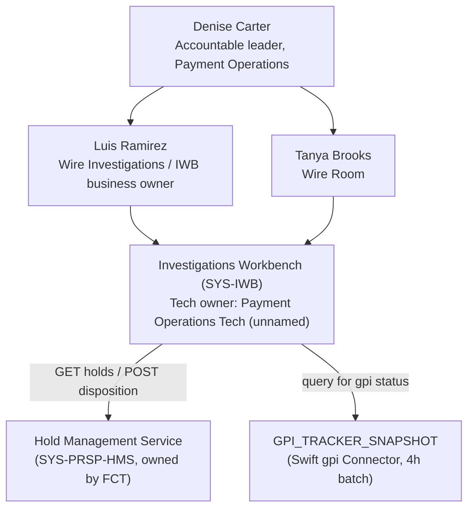
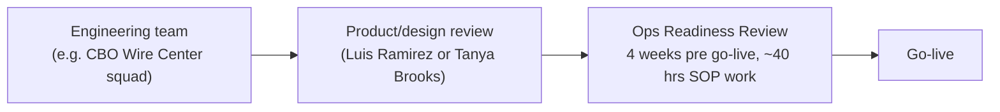

## Overview

**Payment Operations** is a first-line (and, for some queues, second-line)
partner function in the Payments & Treasury Technology (PTT) organization at
Crestline National Bank, accountable to **Denise Carter**. It is listed
alongside Financial Crimes Compliance, Model Risk Management, the
Commercial Service Center, Legal, Information Security, and the Privacy
Office in the PTT directory's partner-functions table — distinct from the
PTT engineering teams (CBO Wire Center squad, Payments Hub Engineering,
Payment Networks Engineering, GTSI, Financial Crimes Technology, Enterprise
Notification Platform) that build and run the systems Payment Operations
depends on.
[Partner functions (first and second line)](repo://sources/estate/cnb-org-ptt-2026-06-ptt-organization-system-ownership-engagement-directory.md#L65-L77)

Operationally, Payment Operations is the human layer behind every held,
repair-queued, or investigation-flagged outbound payment at CNB: Wire Room
staff release or repair wires, Fraud Ops and Sanctions L1/L2 analysts
triage fraud- and sanctions-related holds, and the Financial Intelligence
Unit (FIU) works escalated AML reviews — all through the same casework
tool, the **Investigations Workbench (IWB)**.

| Field | Value |
|---|---|
| Function | Payment Operations |
| Accountable leader | Denise Carter |
| Named contacts (product/design reviews) | Luis Ramirez — Wire Investigations; Tanya Brooks — Wire Room |
| Primary tooling | Investigations Workbench (`SYS-IWB`) |
| Upstream system of record for holds | Hold Management Service (`SYS-PRSP-HMS`), owned by Financial Crimes Technology |
| Engagement route | Ops Readiness Review, 4 weeks pre go-live |
| Planning factor | ~40 hours per new client-facing workflow (SOPs) |

## Leadership and contacts

Denise Carter is the directory's accountable owner for the Payment
Operations partner function. Two named contacts handle product and design
reviews that touch her organization, reflecting two adjacent but distinct
casework surfaces:

- **Luis Ramirez — Wire Investigations.** Handles investigative casework
  (duplicate suspects, fraud-model holds, sanctions and AML review
  escalations) and is also the registered **business owner** of the
  Investigations Workbench (`SYS-IWB`) in the PTT system ownership
  register, where the technical owner is recorded only as "(Ops Tech)" —
  a technology team (Payment Operations Tech) distinct from Carter's
  first-line organization.
- **Tanya Brooks — Wire Room.** Handles routine wire release and repair
  work: wires that cannot complete straight-through in PRISM Payments Hub
  (PPH) and land in PPH's `REPAIR` state, plus high-value/high-risk hold
  releases that require Wire Room sign-off even where digital self-service
  exists.

[Engineering team directory](repo://sources/estate/cnb-org-ptt-2026-06-ptt-organization-system-ownership-engagement-directory.md#L41-L63)
[System ownership register](repo://sources/estate/cnb-org-ptt-2026-06-ptt-organization-system-ownership-engagement-directory.md#L78-L97)

*Payment Operations' leadership and the two named contacts, both of whom work through
the Investigations Workbench to touch holds (via HMS) and international wire tracking
(via the gpi Tracker snapshot).*

## Queues and casework

Payment Operations analysts work four distinct queues, all surfaced through
IWB, which is the Hold Management Service's (HMS) only authorized caller
for hold lookups and dispositions:

- **Wire Room** — manual release/repair of wires in PPH's `REPAIR` state,
  and release sign-off for high-value holds (notably: wires over
  $5,000,000 always require Wire Room release, per `CTRL-PAY-031`,
  regardless of any client self-attestation outcome).
- **Fraud Ops** — works `HRC-07 FRAUD_MODEL_HIGH` holds (Sentinel fraud
  score above threshold) and `HRC-08 ATO_SUSPECT` (session/device anomaly)
  holds, both Restricted-tier (`R`) reason codes.
- **Sanctions L1/L2** — works `HRC-09 SANCTIONS_REVIEW` holds raised by
  SanctionScreen, escalating confirmed or ambiguous matches from L1 to L2.
- **Financial Intelligence Unit (FIU)** — works `HRC-10 AML_REVIEW` holds
  and escalated sanctions cases; FIU (Rebecca Stone) is also the named
  business owner of HMS itself in the PTT system ownership register.

HMS's twelve-code hold reason taxonomy (HRC-01 through HRC-12) assigns each
reason a disclosure tier under `POL-FCC-014` — public (`P`), client-actionable
(`C`), generic review (`G`), or restricted (`R`) — which governs what, if
anything, a client may ever be told about a given hold. Restricted- and
generic-tier reasons (fraud, ATO, sanctions, AML, legal hold, and
large-value manual review) must be presented to clients, if at all, as an
undifferentiated "being reviewed" status with no timing estimate
(`CTRL-PAY-040`); only Payment Operations analysts working IWB see the real
`hrcCode`, `description`, and `analystNotes` behind a hold.
[Hold reason taxonomy](repo://sources/estate/prsp-hms-3.4-hold-management-service-design-and-reason-taxonomy-restricted.md#L40-L69)

At roughly 410 holds per business day (2.6% of outbound wires), median
time-to-disposition ranges from under an hour for straightforward
duplicate-suspect holds (`HRC-01`, ~47 minutes) up to one to five business
days for AML reviews (`HRC-10`), reflecting the escalation path from
first-line Wire Room/Fraud Ops/Sanctions L1 work to FIU-level investigation.
[Hold lifecycle and volumes](repo://sources/estate/prsp-hms-3.4-hold-management-service-design-and-reason-taxonomy-restricted.md#L28-L70)

### Controls Payment Operations analysts operate under

- **`CTRL-PAY-012`** — release/reject dispositions require maker-checker by
  a user holding the `HOLD_RELEASER` role, enforced by IWB's
  `POST /prsp/hms/v1/holds/{holdId}/disposition` endpoint (`EP-HMS-02`),
  which is IWB-only.
- **`CTRL-PAY-018`** — callback verification for `HRC-02 CALLBACK_REQUIRED`
  holds must be completed by phone to a contact on file obtained
  independently of the payment instruction or the originating session;
  confirmations received back through the initiating channel do not
  satisfy the control.
- **`CTRL-PAY-031`** (updated 2026-06 following pilot `FCT-1951`) — allows
  client self-attestation (with step-up authentication) to resolve
  `HRC-01` duplicate-suspect holds through a digital channel, but amounts
  above $5,000,000 still require Wire Room release regardless of
  attestation; the control applies to `HRC-01` only.
- **`CTRL-PAY-040`** — no client-facing estimate of release time may be
  given for holds in disclosure tiers `G` or `R`.

Sanctions-specific dispositions carry additional regulatory obligations:
where a payment is blocked or rejected for sanctions reasons, Sanctions
Operations (within Payment Operations) notifies the client in writing per
the Sanctions Operations Procedure, and the bank reports to OFAC — blocked
funds within 10 business days (31 CFR 501.603), rejected payments per 31
CFR 501.604. Channels themselves must never communicate screening outcomes
directly.
[Controls and sanctions handling](repo://sources/estate/prsp-hms-3.4-hold-management-service-design-and-reason-taxonomy-restricted.md#L90-L101)

## The Investigations Workbench as primary tooling

Payment Operations' work is mediated almost entirely through the
**Investigations Workbench (IWB, `SYS-IWB`)**, a Tier 2 (business hours
plus on-call) system in the PTT register, technically owned by Payment
Operations Tech and business-owned by Luis Ramirez. IWB is:

- the **only authorized caller** of HMS's two operational endpoints —
  `GET /prsp/hms/v1/holds?paymentId=` (full hold detail, including
  Restricted-tier fields) and `POST /prsp/hms/v1/holds/{holdId}/disposition`
  (the sole interface that changes hold state); and
- one of only **two consumers** of the Swift gpi Tracker snapshot
  (`GPI_TRACKER_SNAPSHOT`), refreshed every four hours by the Swift gpi
  Connector, giving Payment Operations the only internal view of
  international wire routing, per-agent deducted charges, and terminal
  outcome — detail no client-facing channel exposes.

Because no client-safe facade exists for either hold detail or gpi status —
the proposed `FCT-1893` Client-Safe Hold Status Facade was deprioritized in
2025-Q3 and does not exist, and `CBO-4480` (client gpi visibility) remains
an unbuilt discovery spike — Payment Operations is, structurally, the only
path for resolving a client's question about a held or in-flight
international wire beyond "payment is held." This makes the function a hard
dependency for any channel team (e.g., CBO Wire Center) considering
client-facing status or hold-explanation features; see
[Investigations Workbench](../systems/investigations-workbench.md) for the
full data-flow and gap analysis.

A prior attempt to bypass this human layer — the 2024 "Wire Status Lite"
pilot, which polled PPH's v1 status API directly from the browser — was
terminated after it drove excess load that delayed wire releases
(`INC-2024-1182`); Denise Carter was one of three accountable-leader
approvers of the resulting post-implementation review (PIR-2024-07), which
also found that Treasury Support could not explain held wires to clients
without FCC guidance and that a third of surveyed users misunderstood
status terminology — both findings landing in Payment Operations' and
Commercial Service Center's domain rather than engineering's. See
[Denise Carter](../people/denise-carter.md) for the full PIR narrative.

## Ops Readiness Review: engagement route and planning factor

Payment Operations is engaged by engineering teams through the **Ops
Readiness Review**, not a Jira/Slack intake route like the PTT engineering
squads (consistent with its status as a first-line partner function rather
than an engineering team). The PTT directory's planning factors list:

- **Planning factor**: ~40 engineering/ops hours per new client-facing
  workflow, covering the standard operating procedures (SOPs) Payment
  Operations staff need to support it.
- **Intake route / lead time**: Ops Readiness Review, required **4 weeks
  before go-live**.

[Engagement routes and planning factors](repo://sources/estate/cnb-org-ptt-2026-06-ptt-organization-system-ownership-engagement-directory.md#L120-L138)

This makes Payment Operations a required, time-boxed gate for any new or
materially changed client-facing payments workflow — alongside, but
separate from, the Commercial Service Center's three-week readiness
checklist for phone-agent scripts and training, and the Disclosure Review
Committee's review of client-facing copy. Teams proposing a change that
touches wire hold behavior, repair-queue triggers, or hold-release UX
(for example, CBO Wire Center's hold-reason tooltip work, or any future
self-service release flow) must route both the design review (to Ramirez
or Brooks, depending on whether the change touches investigations or the
Wire Room) and the pre-launch readiness review through Payment Operations
with enough lead time to build SOPs before launch.

*Engagement sequence for a new client-facing payments workflow that touches Payment
Operations: design review with the relevant named contact, then the Ops Readiness
Review gate ahead of launch.*

## Governance and escalation

Compliance or hold-policy interpretation questions (for example, whether a
specific hold may be released, or whether a client qualifies for digital
attestation) are not decided by Payment Operations or engineering directly;
they route to FCC Policy & Advisory (Jordan Ellis) per the standard PTT
escalation path. Changes to hold or screening behavior that Payment
Operations' queues depend on go through **FCT Change Advisory** (bi-weekly,
5 business days' submission lead time) with mandatory FCC sign-off,
including a year-end freeze from December 15 through January 5 during which
such changes do not ship.
[Governance forums](repo://sources/estate/cnb-org-ptt-2026-06-ptt-organization-system-ownership-engagement-directory.md#L98-L119)
[Escalation](repo://sources/estate/cnb-org-ptt-2026-06-ptt-organization-system-ownership-engagement-directory.md#L148-L150)

Denise Carter separately holds a Model Risk Management obligation
unrelated to the Ops Readiness Review: she is the registered business owner
of **EUA-TRS-0007**, an End-User Analytic "ops corridor completion
dashboard" in the MRM inventory, which she must attest remains a
descriptive-only internal metric and does not cross into client-facing
predictive territory. See [Denise Carter](../people/denise-carter.md) for
details.

## Relationships

- **Denise Carter** — accountable leader for Payment Operations; approver
  of PIR-2024-07; business owner of EUA-TRS-0007.
- **Luis Ramirez** — Wire Investigations contact; business owner of the
  Investigations Workbench (`SYS-IWB`).
- **Tanya Brooks** — Wire Room contact; handles wire release/repair and
  high-value hold sign-off.
- **Financial Crimes Technology (FCT)** — owns the Hold Management Service
  and the rest of PRSP that generates the holds Payment Operations works;
  gates hold/screening behavior changes through FCT Change Advisory and
  mandatory FCC sign-off.
- **Financial Crimes Compliance (FCC)** — Catherine Doyle (accountable),
  Jordan Ellis (Policy & Advisory), Rebecca Stone (FIU) and Michael Tran
  (OFAC); owns the hold disclosure-tier policy (`POL-FCC-014`) and the
  escalation path for compliance interpretation questions.
- **Commercial Service Center** — Kim Nguyen's first-line Treasury Support
  function, which depends on Payment Operations' status/hold explanations
  for phone-agent scripts and shares the same client-facing-workflow
  readiness-gate pattern (three-week checklist vs. Payment Operations'
  four-week review).
- **CBO Wire Center squad** — the client-facing engineering team most often
  gated by the Ops Readiness Review when shipping wire-status or hold-UX
  features.

## Related pages

- [Denise Carter](../people/denise-carter.md)
- [Luis Ramirez](../people/luis-ramirez.md)
- [Tanya Brooks](../people/tanya-brooks.md)
- [Investigations Workbench](../systems/investigations-workbench.md)
- [Hold Management Service](../systems/hold-management-service.md)
- [Financial Crimes Technology](financial-crimes-technology.md)
- [Commercial Service Center](commercial-service-center.md)
