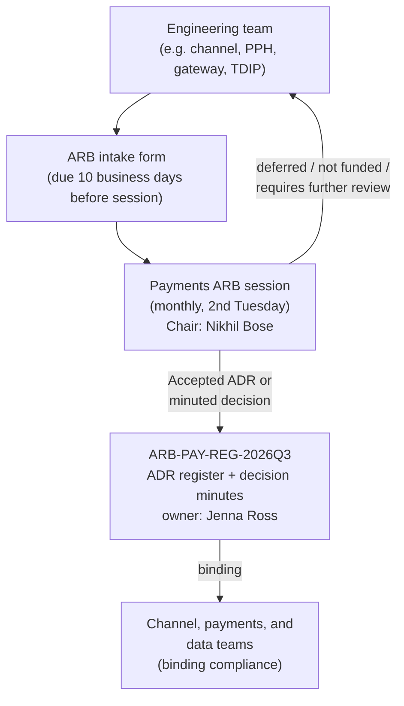

## Summary

The Payments Architecture Review Board (ARB) is the architecture-governance
forum within Payments & Treasury Technology (PTT) at Crestline National Bank.
It issues **architecture decision records (ADRs)** that are binding on
channel, payments, and data teams, and it is the **required gate for any new
client-facing integration to payment systems**. The board is chaired by
**Nikhil Bose** (Chief Architect, Payments & Treasury) and run day-to-day by
**Jenna Ross**, the ARB Secretariat, who owns the published ADR register and
decision minutes as a versioned governance artifact.

| Field | Value |
|---|---|
| Chair | [Nikhil Bose](../people/nikhil-bose.md), Chief Architect — Payments & Treasury |
| Secretariat | [Jenna Ross](../people/jenna-ross.md) |
| Cadence | Monthly, 2nd Tuesday |
| Submission lead time | 10 business days, via the ARB intake form |
| Scope | Required for new client-facing integrations to payment systems; decisions binding on channel, payments, and data teams |
| Published record | [ARB-PAY-REG-2026Q3](../documents/arb-pay-reg-2026q3.md) (2026-Q3 register extract, published 2026-09-12) |
| Upcoming sessions (as of 2026-Q3) | 2026-11-10, 2026-12-08 |

## Role in the organization

The ARB sits above individual engineering teams as the cross-cutting
architecture authority for payments. It is distinct from product-prioritization
forums (such as the Payments Platform Demand Board, which sequences the PRISM
Payments Hub (PPH) roadmap) and from compliance-control forums (such as FCT
Change Advisory, which requires FCC sign-off for hold/screening changes): the
ARB's remit is specifically architecture decisions and the gating of new
client-facing payment integrations, not funding prioritization or compliance
sign-off in their own right, though its decisions frequently intersect with
both.

*How a proposal moves from intake through the ARB into the binding register.*

## Leadership and secretariat

- **Nikhil Bose**, Chief Architect, Payments & Treasury, chairs the board and
  is the **approver of record** for the published ADR register and minutes.
  As Chair he also co-approves cross-team architecture documents with
  ARB-level significance, such as the Wire Center current-state architecture
  (CBO-ARCH-WC-4.1) and the Payment Network Gateway technical design
  (PNG-TDD-6.0). See [Nikhil Bose](../people/nikhil-bose.md).
- **Jenna Ross** holds the ARB Secretariat function: she is the **document
  owner** of the ADR register and minutes, accountable for its accuracy,
  versioning, and publication, and for running the board's intake and
  scheduling process — not for the substance of the architecture decisions
  themselves, which are authored and approved by the board and its Chair. See
  [Jenna Ross](../people/jenna-ross.md).

This separation — Chair approves, Secretariat owns the document — mirrors how
the published register itself records authorship: Bose is listed as
Approver, Ross as Document owner, on [ARB-PAY-REG-2026Q3](../documents/arb-pay-reg-2026q3.md).

## Cadence and submission process

The ARB meets **monthly, on the second Tuesday**. Teams must submit proposed
decisions or integration reviews at least **10 business days** before a
session, via the ARB intake form. As of the 2026-Q3 register extract, the
next two scheduled sessions are **2026-11-10** and **2026-12-08**.

The board is explicitly named, in the PTT organization directory
(CNB-ORG-PTT-2026-06), as **required for new client-facing integrations to
payment systems** — distinguishing it from forums with a lighter, advisory
touch. Teams planning such an integration are expected to budget ARB review
lead time into their rollout schedule alongside other governance gates (for
example, MRM Tier 2 model validation at 10–14 weeks plus queue, or Privacy
Impact Assessment at roughly 4 weeks), rather than treating ARB sign-off as
incidental.

## The ADR register

The board's primary binding output is the **Payments ADR register**, a list
of architecture decisions accepted by the board and binding on channel,
payments, and data teams. As published in the 2026-Q3 extract
([ARB-PAY-REG-2026Q3](../documents/arb-pay-reg-2026q3.md)), five ADRs are
currently Accepted:

| ADR | Title | Date | Applies to |
|---|---|---|---|
| [ADR-PAY-017](../decisions/adr-pay-017.md) | Kafka (Confluent) is the integration backbone for payment lifecycle events | 2023-11-07 | All payment systems |
| [ADR-PAY-019](../decisions/adr-pay-019.md) | Channel status integrations must be event-driven; no polling of PPH | 2024-06-11 | All channels |
| [ADR-PAY-021](../decisions/adr-pay-021.md) | Hold reason details never leave the financial-crimes trust boundary | 2025-04-08 | PPH v2, channels, data |
| [ADR-PAY-023](../decisions/adr-pay-023.md) | UETR is the canonical end-to-end correlation id for all outbound wires | 2025-09-09 | PPH, gateways, channels, TDIP |
| [ADR-PAY-026](../decisions/adr-pay-026.md) | Client-facing analytical outputs are served via the TDIP Insights API | 2026-05-12 | Channels, TDIP |

These decisions span the full breadth of the board's remit: integration
mechanics (Kafka as the event backbone, no polling), trust and confidentiality
boundaries (hold reason detail staying inside financial-crimes technology),
identifier design (UETR as a rail-agnostic correlation id), and the governed
boundary between channel presentation and model-risk-controlled analytics
(TDIP Insights API). Several later ADRs explicitly build on earlier ones — for
example, ADR-PAY-019, -021, and -023 all rely on the Kafka backbone
established by ADR-PAY-017 — so the register is best read as a cumulative,
cross-referencing body of decisions rather than independent rulings.

## Acting beyond formal ADRs: the 2026-09-08 minutes

Not every ARB decision becomes a numbered ADR. The board also records
**decision minutes** for each session, which can fund, defer, reaffirm, or
decline proposals without issuing a new ADR. The 2026-09-08 session, captured
in the same ARB-PAY-REG-2026Q3 extract, recorded four such items:

- **PPH v1 sunset** — Volaris 9.6 removes the PPH v1 adapter; the board
  decided **no extension beyond 2027-03-31**, requiring remaining v1
  consumers to present migration plans at the 2026-11-10 session (owner:
  Kevin O'Brien). This decision time-boxes exceptions carved out elsewhere,
  such as ADR-PAY-021's legacy `holdReasonDesc` field and ADR-PAY-023's
  permanent absence of UETR for v1 consumers.
- **gpi real-time service** — a proposed real-time Swift gpi tracking
  service (GTRS, GTSI-0107) was **not funded for 2026**; the board
  acknowledged client demand but explicitly declined to approve interim
  direct exposure of the `GPI_TRACKER_SNAPSHOT` dataset to channels, noting
  that even a read-only, quota-isolated service for that purpose would
  require a fresh ARB review (owner: Elena Vasquez).
- **Status projection reuse** — the board reaffirmed the CBO Status
  Projection Service (SPS) pattern (Kafka consumer → Postgres read model →
  REST API), established under ADR-PAY-019, as the reference architecture
  for client-facing status of **any** payment type, not only wires (owner:
  Arjun Mehta).
- **Structured address enforcement** — PPH and payment gateway enforcement of
  structured address fields remains on track for November 2026, with an
  expected increase in repair-hold volume (owner: Raymond Ortiz).

This shows the board acting in several distinct modes within one session: a
sunset/deprecation authority (PPH v1), a funding gate (gpi real-time
service), and a pattern-reuse arbiter (SPS) — not merely a document sign-off
body.

## Audience and relationship to other governance forums

The ARB's decisions are binding on **channel, payments, and data teams**
across Payments & Treasury Technology, including the CBO Wire Center squad,
CBO Platform & Entitlements, Payments Hub Engineering, Payment Networks
Engineering (PNE), Global Transaction Services Integration (GTSI), Financial
Crimes Technology (FCT), and Treasury Data & Insights Platform (TDIP) teams.
It operates alongside, but distinct from, other PTT governance forums
documented in the PTT organization directory:

| Forum | Cadence | Submission lead time | Distinction from the ARB |
|---|---|---|---|
| Payments Architecture Review Board (ARB) | Monthly, 2nd Tuesday | 10 business days | Architecture decisions; required for new client-facing payment integrations |
| Payments Platform Demand Board | Monthly | Request by prior month-end | Prioritizes the PPH roadmap; a funding/sequencing forum, not an architecture gate |
| FCT Change Advisory | Bi-weekly | 5 business days | FCC sign-off for hold/screening changes; observes a year-end freeze (Dec-15–Jan-05) |
| Disclosure Review Committee (DRC) | Bi-weekly, Thursday | 5 business days | Approves client-facing copy, disclaimers, and notification templates |
| MRM Model Inventory & Validation | Continuous (Archer) | Register before development | Tier 2 validation takes 10–14 weeks plus queue |
| Privacy Impact Assessment (PIA) | Continuous (OneTrust) | ~4 weeks | Required for new uses of client data in client-facing features |

A single client-facing payments initiative can require clearing several of
these in sequence or in parallel — for instance, a new client-facing hold
explanation feature would need both ARB architecture approval and FCC/DRC
sign-off on the disclosure copy, since the ARB governs *where and how* data
moves architecturally but does not itself approve compliance-sensitive
content or communications.

## Escalation

The ARB is not the first stop for unresolved cross-team dependency conflicts;
per the PTT organization directory, those escalate between engineering
managers, then to their respective Directors, and finally to the PTT
Leadership Team (weekly, Mondays) if still unresolved. Compliance or
policy-interpretation questions are routed to FCC Policy & Advisory or the
Privacy Office rather than decided by engineering teams or the ARB itself.
The ARB's own escalation path is upward through its Chair, Nikhil Bose, who
reports architecture-governance outcomes within the PTT leadership structure
alongside the MD/CIO (Gregory Hall) and the business-side product leaders.

## Related

- [ARB-PAY-REG-2026Q3](../documents/arb-pay-reg-2026q3.md) — the published
  2026-Q3 ADR register and decision minutes this page summarizes.
- [Nikhil Bose](../people/nikhil-bose.md) — ARB Chair.
- [Jenna Ross](../people/jenna-ross.md) — ARB Secretariat and document owner.
- [ADR-PAY-017](../decisions/adr-pay-017.md), [ADR-PAY-019](../decisions/adr-pay-019.md),
  [ADR-PAY-021](../decisions/adr-pay-021.md), [ADR-PAY-023](../decisions/adr-pay-023.md),
  [ADR-PAY-026](../decisions/adr-pay-026.md) — the currently binding Payments ADRs
  approved by the board.
</content>
