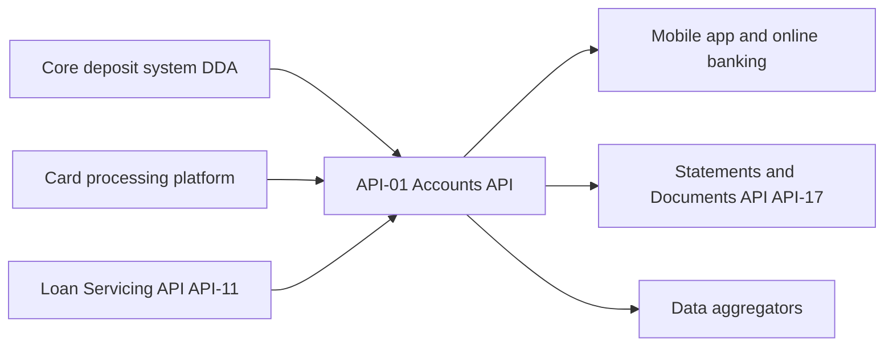

# API-01 Accounts API

The Accounts API returns deposit, card and loan account details, balances and account holders for an authenticated customer or corporate client. It is the source of truth for the account balances shown in the mobile app and online banking. It is part of the developer platform ([Developer Platform Overview](./developer-platform-overview.md)) and is owned by [Digital Platforms Engineering](../teams/digital-platforms-engineering.md).

## Summary

| Attribute | Value |
| --- | --- |
| API ID | API-01 |
| Version | v3.4 |
| Base path | `/accounts/v3` |
| Business domain | Retail & Commercial Banking |
| Owning team | Digital Platforms Engineering |
| Intended consumers | Internal apps, corporate clients, licensed data aggregators |
| Data classification | Confidential - Client Data |
| OAuth scopes | `accounts:read`, `accounts.balances:read`, `accounts.holders:read` |
| Rate limits | 1,200 requests/minute per client; burst 200/second |
| Service-level objective | 99.95% monthly availability; p95 latency 180 ms |

## Endpoints

All paths are relative to the base path `/accounts/v3`. All four endpoints are read-only `GET` operations.

| Method | Path | Description |
| --- | --- | --- |
| GET | `/accounts` | List accounts the caller is entitled to view, with pagination. |
| GET | `/accounts/{accountId}` | Retrieve account details: type, status, open date, product code. |
| GET | `/accounts/{accountId}/balances` | Current, available and ledger balances, with an as-of timestamp. |
| GET | `/accounts/{accountId}/holders` | Account holders and authorised signers, with masked PII. |

Behavior worth knowing:

- The list endpoint returns only accounts the caller is entitled to view, and paginates using cursors (introduced in v3.2).
- The holders endpoint masks PII in its response.
- The balances response carries `current`, `available` and `ledger` values, an `asOf` timestamp and a `currency`. Since v3.4 it also carries a `holds` field.

## Authentication and scopes

Requests carry an OAuth bearer token in the `Authorization` header. The documented scopes are `accounts:read`, `accounts.balances:read` and `accounts.holders:read`. The source does not state a per-endpoint scope mapping. The names suggest `accounts.balances:read` for balances and `accounts.holders:read` for holders, but confirm this before depending on it. The data is classified Confidential - Client Data.

## Example

Request:

```http
GET /accounts/v3/accounts/DDA-0044718823/balances
Authorization: Bearer <token>
```

Response (200):

```json
{
  "accountId": "DDA-0044718823",
  "currency": "USD",
  "asOf": "2026-06-30T23:59:59Z",
  "balances": {
    "current": 18452.17,
    "available": 17902.17,
    "ledger": 18452.17
  },
  "holds": 550
}
```

In this example `available` (17902.17) equals `current` minus `holds` (550). The source does not state this as a rule, only that the response includes both.

## Consumers

Intended consumers are internal apps, corporate clients and licensed data aggregators. The mobile app and online banking read balances from this API.

## Data lineage

| Upstream sources | Downstream consumers |
| --- | --- |
| Core deposit system (DDA) | Mobile app and online banking |
| Card processing platform | Statements & Documents API (API-17) |
| Loan Servicing API (API-11) | Data aggregators |

The API aggregates deposit data from the core deposit system, card data from the card processing platform and loan data from the Loan Servicing API (API-11). It feeds the mobile app and online banking, the Statements & Documents API (API-17) and data aggregators.



## Operational expectations

- Availability SLO: 99.95% monthly.
- Latency SLO: p95 of 180 ms.
- Rate limit: 1,200 requests per minute per client, with bursts up to 200 per second. Clients should handle throttling and back off.

## Changelog

- v3.4 (2026-03): added the `holds` field to the balances response.
- v3.2 (2025-07): cursor-based pagination.
- v2 was sunset on 2025-12-31. Clients must use v3 (`/accounts/v3`).

## Source

Derived from `sources/api_docs/apis/api-01-accounts-api.md`, which was converted from the MHFC Developer Platform API Reference.
