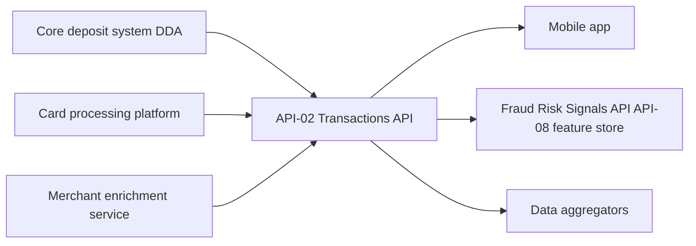

# API-02 Transactions API

The Transactions API provides posted and pending transactions for deposit and card accounts. Each transaction carries merchant enrichment (category, merchant name and location). History goes back up to 24 months. It is one of the APIs on the Meridian Harbor Developer Platform; see the [Developer Platform overview](developer-platform-overview.md) for the platform-wide conventions that apply to it.

## At a glance

| Attribute | Value |
| --- | --- |
| API ID | API-02 |
| Current version | v3.1 |
| Base path | `/transactions/v3` |
| Business domain | Retail & Commercial Banking |
| Owning team | [Digital Platforms Engineering](../teams/digital-platforms-engineering.md) |
| Data classification | Confidential - Client Data |
| OAuth scopes | `transactions:read`, `transactions.enriched:read` |
| Rate limit | 1,000 requests/minute per client |
| SLO | 99.95% availability; p95 latency 250 ms |
| Intended consumers | Internal apps, corporate clients, data aggregators, Fraud Strategy |

The data classification is Confidential - Client Data, so access is governed by the OAuth scopes listed above. The source API page does not say which scope guards which endpoint or field. In particular, it does not say whether `transactions.enriched:read` is required to see the `merchant` block. Check the portal or the gateway configuration before assuming a mapping.

## Endpoints

All paths are relative to `/transactions/v3`.

| Method | Path | Purpose |
| --- | --- | --- |
| GET | `/accounts/{accountId}/transactions` | List transactions for an account, with date range, status and amount filters. |
| GET | `/transactions/{transactionId}` | Retrieve a single transaction with enrichment. |
| POST | `/transactions/search` | Full-text and structured search across a customer's accounts. |

Example request, which lists posted transactions for a card account from a start date:

```
GET /transactions/v3/accounts/CARD-5501/transactions?from=2026-06-01&status=posted&limit=2
```

Example 200 response:

```json
{
  "data": [
    {
      "transactionId": "T-8812",
      "postedDate": "2026-06-02",
      "amount": -42.18,
      "merchant": { "name": "Harbor Coffee Co.", "category": "Dining" },
      "status": "posted"
    }
  ],
  "nextCursor": "eyJvZmZzZXQiOjJ9"
}
```

The example shows a `data` array and a `nextCursor` value. It shows a debit as a negative `amount`. It uses `status` values such as `posted`, with `pending` as the other state the API covers.

## Platform conventions that apply

The platform-wide reference defines the following behaviours for every API, and they apply here:

- **Authentication.** OAuth 2.0. Server-to-server clients use the client-credentials grant with mutual TLS. Customer-facing integrations, such as aggregators acting on a customer's behalf, use authorization code with PKCE and customer consent. Access tokens are JWTs valid for 15 minutes, and least-privilege scopes are enforced.
- **Pagination.** List endpoints use cursor-based pagination with the `limit` and `cursor` query parameters. Responses include `nextCursor`, as in the example above.
- **Rate limiting.** Limits are applied per client and per API. Responses carry `X-RateLimit-Limit` and `X-RateLimit-Remaining`. HTTP 429 (`rate_limited`) includes `Retry-After`.
- **Idempotency.** The `Idempotency-Key` requirement applies to POST operations that move money or create resources. `POST /transactions/search` is a read-style search. The source does not state whether it needs the header.
- **Errors.** A JSON `error` object carries `code`, `message` and `requestId`. The relevant codes are 400 `invalid_request`, 401 `unauthorized`, 403 `insufficient_scope`, 404 `not_found` (which also covers resources not visible to the caller), 429 `rate_limited`, 500 `internal_error` and 503 `service_unavailable`.
- **Versioning.** The major version is in the path (`/v3`). Minor versions are additive and backward compatible. A major version is supported for at least 12 months after its successor reaches general availability, and deprecation is announced through the `Sunset` header and the developer portal.
- **Format.** Timestamps are ISO 8601 UTC. Amounts are decimal numbers in the stated currency.

## Data lineage



- **Upstream sources:** the core deposit system (DDA), the card processing platform and the merchant enrichment service. Deposit and card transactions come from the first two. Merchant name, category and location come from the enrichment service.
- **Downstream consumers:** the mobile app, the feature store of the Fraud Risk Signals API (API-08), and data aggregators. API-08's own lineage lists "Transactions API (API-02) feature store" as an upstream source. Fraud Strategy is also named as an intended consumer.
- API-02 is not registered as an upstream feed to any of the Tier 1 models (MDL-ALM-014, MDL-CR-007, MDL-CAP-003) in the API-to-model lineage matrix.

## Usage and operations

The Q2 2026 earnings supplement reports the following for API-02:

| Metric | Value |
| --- | --- |
| Monthly calls | 1,320 million |
| Year-on-year growth | 22% |
| Availability | 99.98% |

That is above the 99.95% availability SLO. Key consumers named there are the mobile app, aggregators and Fraud. It is the highest-volume API listed in that table, ahead of API-01 Accounts at 1,140 million.

## Changelog

- **v3.1 (2026-01):** added `merchant.location`.
- **v3.0 (2025-04):** merchant enrichment reached general availability.

## Notes for integrators

- Use the `nextCursor` value to page through results. Do not build offsets yourself.
- Consumers do not all need enrichment. Request only the scopes you need.
- Stay under 1,000 requests/minute per client. Back off using `Retry-After` on 429.
- `merchant.location` exists only from v3.1. Clients written against v3.0 should tolerate its absence or presence, since minor versions are additive.
