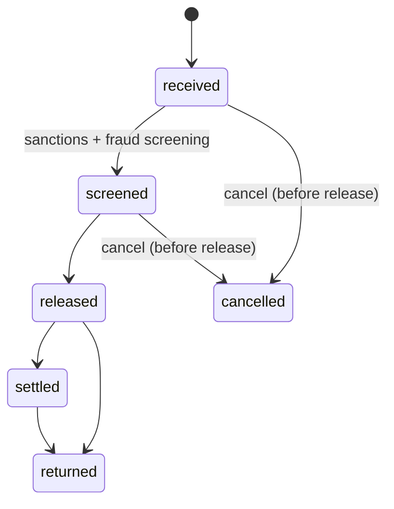

# API-03 Payments Initiation API

API-03 initiates ACH, book transfer and check payments, either one at a time or as bulk files, and supports ISO 20022 structured remittance. Every payment is screened by sanctions screening and the Fraud Risk Signals API (API-08) before it is released. The API belongs to the Payments business domain of the [Developer Platform](./developer-platform-overview.md) and is owned by [Global Payments Technology](../teams/global-payments-technology.md).

## Profile

| Attribute | Value |
| --- | --- |
| API ID / version | API-03 / v3.2 |
| Base path | `/payments/v3` |
| Intended consumers | Corporate clients, ERP connectors, internal treasury applications |
| Data classification | Restricted - Financial Transaction |
| OAuth scopes | `payments:write`, `payments:read`, `payments.bulk:write` |
| Rate limits | 300 requests/minute per client; bulk files up to 50,000 items |
| SLO | 99.98% availability; p95 latency 400 ms |

## Endpoints

| Method | Path | Purpose |
| --- | --- | --- |
| POST | `/payments` | Create a single payment. Requires an `Idempotency-Key` header. |
| POST | `/payment-files` | Upload a bulk payment file in ISO 20022 `pain.001` or CSV format. |
| GET | `/payments/{paymentId}` | Retrieve payment status. |
| POST | `/payments/{paymentId}/cancel` | Cancel a payment before release. |

The scope names suggest this split: `payments:write` for creating and cancelling payments, `payments:read` for status lookups, and `payments.bulk:write` for file uploads. The source lists the scopes but does not map them to endpoints, so confirm the mapping before relying on it.

## Payment lifecycle

A payment's status is one of `received`, `screened`, `released`, `settled` or `returned`. Cancellation is only possible before release.

The source gives the status vocabulary and the "cancel before release" rule. The transition order above follows the listed order, and the point where `returned` can occur is inferred. Neither is specified in the source, and the source does not name a cancelled status.

## Request and response

A single payment is created with `POST /payments/v3/payments`. The example request carries:

- `debtorAccount`, for example `DDA-7700112`.
- `creditor`, with `name`, `routing` and a masked `account`.
- `amount`, with `value` and `currency`.
- `rail`, for example `ACH_SAME_DAY`.
- `remittance`, for example an `invoice` reference.

The example 200 response returns `paymentId`, an initial `status` of `received`, a `fraudScore` and an `expectedSettlement` date. A fraud score is therefore available at creation time, while the status is still `received`.

## Data flow

- **Upstream:** the Accounts API (API-01) for the funds check, sanctions screening, and the Fraud Risk Signals API (API-08).
- **Downstream:** the ACH operator, the Webhooks & Event Notifications API (API-18), and the general ledger.

## Operational notes

- Retries of `POST /payments` must reuse the same `Idempotency-Key`. The header is required, and the source does not describe the replay semantics in more detail.
- Bulk files are capped at 50,000 items. The 300 requests/minute per-client limit applies separately.
- The data is classified as Restricted - Financial Transaction. Account numbers appear masked in the example.
- Status changes are most likely delivered through API-18. Check that API for the event catalogue.

## Changelog

- **v3.2 (2026-05):** ISO 20022 structured remittance.
- **v3.1 (2025-10):** same-day ACH rail (`ACH_SAME_DAY`).
