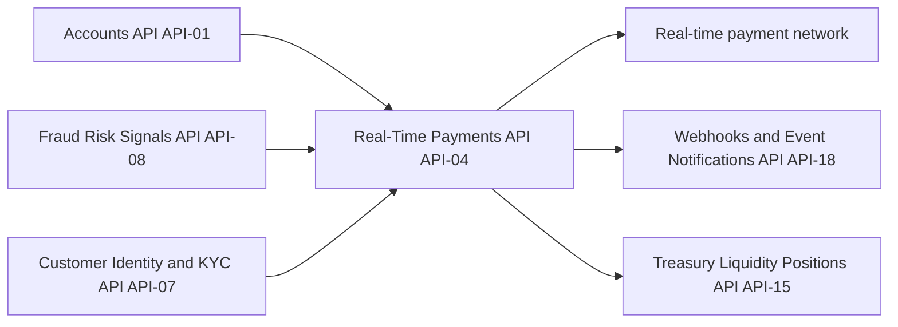

# API-04 Real-Time Payments API

API-04 sends and receives instant, irrevocable account-to-account payments around the clock (24x7x365) over real-time payment networks. It also sends request-for-payment messages. The source reports that volumes grew 64% year-on-year in 2Q26. The API belongs to the Payments business domain of the [Developer Platform](./developer-platform-overview.md) and is owned by [Global Payments Technology](../teams/global-payments-technology.md).

A sibling API, [API-03 Payments Initiation](./api-03-payments-initiation-api.md), covers batch-oriented rails such as ACH. API-04 is the instant-settlement counterpart.

## Profile

| Attribute | Value |
| --- | --- |
| API ID / version | API-04 / v2.3 |
| Base path | `/rtp/v2` |
| Intended consumers | Corporate and small-business clients, the consumer app (P2P) |
| Data classification | Restricted - Financial Transaction |
| OAuth scopes | `rtp:send`, `rtp:read`, `rtp.rfp:write` |
| Rate limits | 600 requests/minute per client; maximum $1,000,000 per payment |
| SLO | 99.99% availability; p95 end-to-end 4 s |

## Endpoints

| Method | Path | Purpose |
| --- | --- | --- |
| POST | `/credit-transfers` | Send an instant credit transfer. |
| POST | `/requests-for-payment` | Send a request for payment to a payer. |
| GET | `/credit-transfers/{id}` | Retrieve status (`accepted`, `rejected`, `pending-review`). |
| GET | `/participants/{routing}` | Check whether a receiving bank is reachable on the network. |

The scope names suggest this split: `rtp:send` for credit transfers, `rtp:read` for status and participant lookups, and `rtp.rfp:write` for requests for payment. The source lists the scopes but does not map them to endpoints, so confirm the mapping before relying on it.

## Request and response

An instant transfer is sent with `POST /rtp/v2/credit-transfers`. The example request carries an `Idempotency-Key` header (a UUID) and these body fields:

- `debtorAccount`, for example `DDA-7700112`.
- `creditorRouting`, for example `026009593`.
- `creditorAccount`, masked in the example (`****2291`).
- `amount`, given as the plain number `2500`. The example has no currency field.
- `purpose`, a purpose code such as `SUPP`.

The example 200 response returns `id` (for example `RTP-9a1c`), `status` of `accepted`, and `settledAt` as a UTC timestamp. The transfer is reported as accepted and settled in the same synchronous response, which fits the instant, irrevocable nature of the rail.

## Status values and lifecycle

`GET /credit-transfers/{id}` reports one of three statuses: `accepted`, `rejected` or `pending-review`. The source does not define a transition model. Because payments are irrevocable, there is no cancel endpoint, and the source describes none. Corrections presumably need a separate process, such as a return or a new transfer, but the source does not say.

Use `GET /participants/{routing}` before sending to check whether the receiving bank is reachable on the network. The source does not say whether a transfer to an unreachable participant is rejected automatically.

## Data flow

- **Upstream:** the Accounts API (API-01), the Fraud Risk Signals API (API-08) and the Customer Identity & KYC API (API-07).
- **Downstream:** the real-time payment network itself, the Webhooks & Event Notifications API (API-18), and the Treasury Liquidity Positions API (API-15), which uses these payments for intraday cash.

## Operational notes

- **Idempotency.** The example transfer request includes an `Idempotency-Key`. Reuse the same key when retrying so a payment is not sent twice. The source does not say whether the header is mandatory or how replays behave. Its presence in the example, and the finality of the rail, make it the safe default.
- **Limits.** Each client may make 600 requests/minute, and each payment is capped at $1,000,000. Larger movements must be handled outside this API. The source does not name another rail.
- **Latency and availability.** The SLO is 99.99% availability with p95 end-to-end latency of 4 s. That is far looser than API-03's p95 of 400 ms, because it covers the round trip across the external network.
- **Security.** Data is classified Restricted - Financial Transaction. Creditor account numbers are masked in the example.
- **Events.** Status changes are most likely delivered through API-18. Check that API for the event catalogue.

## Changelog

- **v2.3 (2026-02):** request-for-payment (`/requests-for-payment`, scope `rtp.rfp:write`) became generally available.
- **v2.2 (2025-09):** opened to middle-market clients.
