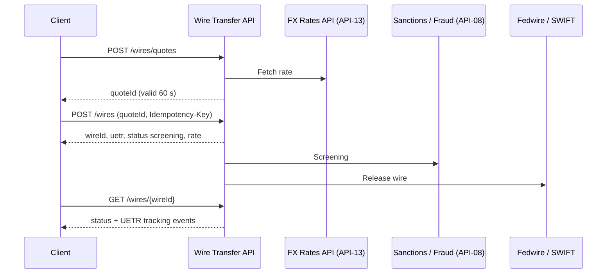

# API-05 Wire Transfer API

API-05 initiates domestic wires over Fedwire and cross-border wires over SWIFT, using either MT or ISO 20022 MX messages. Cross-currency wires are converted using rates from the FX Rates API (API-13). Each wire can be tracked with its UETR, the end-to-end transaction reference. The API belongs to the Payments business domain of the [Developer Platform](./developer-platform-overview.md) and is owned by [Global Payments Technology](../teams/global-payments-technology.md).

## Profile

| Attribute | Value |
| --- | --- |
| API ID / version | API-05 / v2.0 |
| Base path | `/wires/v2` |
| Business domain | Payments |
| Intended consumers | CIB corporate and institutional clients |
| Data classification | Restricted - Financial Transaction |
| OAuth scopes | `wires:write`, `wires:read` |
| Rate limit | 120 requests/minute per client |
| SLO | 99.99% availability during operating hours |

Compared with the sibling [Payments Initiation API](./api-03-payments-initiation-api.md), the wire API has a lower rate limit (120 against 300 requests/minute) and a stricter availability target (99.99% against 99.98%). The source states the SLO applies during operating hours, and it does not define those hours.

## Endpoints

| Method | Path | Purpose |
| --- | --- | --- |
| POST | `/wires` | Create a domestic or international wire. |
| GET | `/wires/{wireId}` | Return the wire's status and UETR tracking events. |
| POST | `/wires/quotes` | Get an FX quote, valid for 60 seconds, for a cross-currency wire. |

The scope names suggest that `wires:write` covers `POST /wires` and `POST /wires/quotes`, and that `wires:read` covers `GET /wires/{wireId}`. The source lists the scopes but does not map them to endpoints. Whether quotes need `wires:write` or `wires:read` is therefore unconfirmed.

## Cross-currency flow

The source gives the quote validity, the `quoteId` field on the wire request, and the upstream and downstream systems. The order of calls inside the service and the exact point of release are inferred from the data lineage, not stated.

## Request and response

`POST /wires/v2/wires` is shown with an `Idempotency-Key` header. The example body carries:

- `debtorAccount`, for example `DDA-9100044`.
- `beneficiary`, with `name` and a masked `iban`.
- `amount` and `currency`. The example is `250000` EUR.
- `quoteId`, referencing a quote obtained earlier from `POST /wires/quotes`.

The example 200 response returns:

- `wireId`.
- `uetr`, the tracking identifier.
- `status`. The example shows `screening`, so a wire is created before screening finishes.
- `rate`. The example shows `0.9214`, the FX rate applied.

The source does not publish a full status vocabulary, the structure of the tracking events, or the error responses.

## Data lineage

- **Upstream:** the FX Rates API (API-13) for rates, sanctions screening, and the Fraud Risk Signals API (API-08).
- **Downstream:** Fedwire and SWIFT as the settlement networks, the general ledger, and the Treasury Liquidity Positions API (API-15).

Screening sits upstream of the wire networks, which is consistent with the initial `screening` status. The source does not say what happens to a wire that fails screening.

## Operational notes

- Send an `Idempotency-Key` on `POST /wires`. The source does not describe replay semantics, nor whether the header is mandatory, so confirm both before relying on them for retries.
- A quote lasts only 60 seconds. Request it close to the time of the wire request and treat an expired `quoteId` as a case that needs a new quote. The source does not define the error returned for an expired quote.
- The 120 requests/minute limit is per client. Status polling on `GET /wires/{wireId}` and quote requests probably share that budget, although the source does not say so.
- The data is Restricted - Financial Transaction. Account and IBAN values appear masked in the examples.

## Changelog

- v2.0 (2025-11): ISO 20022 MX migration complete.
