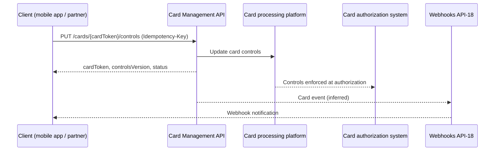

# API-06 Card Management API

API-06 manages the lifecycle of debit and credit cards: issuance, activation, lock/unlock, spend controls, digital wallet provisioning and replacement. Card numbers (PANs) are tokenized, and the API never returns a raw card number. Callers refer to a card by an opaque `cardToken`, for example `tok_card_83jd`. The API belongs to the Card Services domain of the [Developer Platform](./developer-platform-overview.md) and is owned by [Card Technology](../teams/card-technology.md).

## Profile

| Attribute | Value |
| --- | --- |
| API ID / version | API-06 / v2.6 |
| Base path | `/cards/v2` |
| Business domain | Card Services |
| Owning team | Card Technology |
| Intended consumers | Mobile app, fintech and co-brand partners |
| Data classification | Restricted - PCI |
| OAuth scopes | `cards:read`, `cards:write`, `cards.controls:write` |
| Rate limit | 800 requests/minute per client |
| SLO | 99.97% availability; p95 latency 220 ms |

Within the neighbouring payments APIs, the card API has the highest rate limit (800 requests/minute, against 300 for [Payments Initiation](./api-03-payments-initiation-api.md) and 120 for [Wire Transfer](./api-05-wire-transfer-api.md)). Its availability SLO is slightly lower than those APIs (99.97% against 99.98% and 99.99%). The Q2 2026 earnings supplement reports about 260 million calls per month for API-06, up 15% year on year, at 99.97% availability. It names the mobile app and fintech partners as the key consumers.

## Endpoints

| Method | Path (under `/cards/v2`) | Purpose |
| --- | --- | --- |
| GET | `/cards/{cardToken}` | Return card status, product and expiry, all tokenized. |
| POST | `/cards/{cardToken}/lock` | Temporarily lock a card. |
| PUT | `/cards/{cardToken}/controls` | Set merchant-category, geography and amount controls. |
| POST | `/cards/{cardToken}/wallet-provisioning` | Provision the card to a digital wallet. |

The full URL therefore has a doubled `cards` segment, for example `/cards/v2/cards/{cardToken}/lock`.

The overview mentions issuance, activation, unlock and replacement, but the source documents no endpoint for them. Those operations either live outside the four documented paths or are not yet published. The scope names suggest `cards:read` for the GET, `cards:write` for lock and wallet provisioning, and `cards.controls:write` for the controls PUT. The source lists the scopes without mapping them to endpoints, so treat that mapping as unconfirmed.

## Spend controls

The `PUT .../controls` endpoint accepts three kinds of control. The example payload shows each:

- **Merchant category:** `blockedCategories`, for example `["GAMBLING"]`.
- **Amount:** `dailyLimit`, for example `1500`.
- **Geography:** `allowedCountries`, for example `["US","CA"]`. Geography controls were added in v2.6 (2026-04).

The example response returns the `cardToken`, a `controlsVersion` (the example shows `7`) and `status` (`active`). `controlsVersion` looks like a counter that increases with each control change. The source does not say whether it supports optimistic concurrency, so clients should not depend on that.

A caution on the source example: the documented sample request is labelled `POST /cards/v2/cards/{cardToken}/lock`, yet its body is a `controls` object and its response carries `controlsVersion`. That content matches the controls operation, not a lock. The source probably mislabelled the example, but this cannot be confirmed from the source alone. The lock request body and response shape are not otherwise documented.

## Request flow

The source gives the upstream and downstream systems but not the internal call order. The diagram is inferred from the data lineage. In particular, emitting card events through the Webhooks API is implied by API-18 listing the Card Management API as an upstream source.

## Cross-cutting platform rules that apply

These come from the platform-wide conventions of the [Developer Platform](./developer-platform-overview.md).

- **Authentication:** OAuth 2.0. Server-to-server clients use the client-credentials grant with mutual TLS. Customer-facing integrations, such as the mobile app, use the authorization-code grant with PKCE and customer consent. Access tokens are JWTs valid for 15 minutes, and least-privilege scopes are enforced.
- **Idempotency:** POST operations that create resources or move money require an `Idempotency-Key` UUID header, retained for 24 hours. Reusing a key with a different payload returns 409 `conflict`. The documented example sends the header on the lock call.
- **Rate limiting:** 800 requests/minute per client. An excess returns 429 `rate_limited` with `Retry-After`, and responses carry `X-RateLimit-Limit` and `X-RateLimit-Remaining`.
- **Errors:** a standard `error` object with `code`, `message` and `requestId`. A 403 `insufficient_scope` means the token lacks the needed scope, and a 404 means the card does not exist or is not visible to the caller.
- **Versioning:** the major version is in the path (`/cards/v2`). Minor versions are additive.

## Data lineage

| Upstream sources | Downstream consumers |
| --- | --- |
| Card processing platform; [Customer Identity & KYC API](./api-07-customer-identity-kyc-api.md) (API-07) | Card authorization system; digital wallets; Webhooks & Event Notifications API (API-18) |

- The card processing platform is the system of record for card data. The API exposes only its tokenized view.
- API-07 is an upstream feed. The KYC API's own lineage lists the Card Management API as a consumer. The source does not say how KYC data is used, for example whether it gates issuance.
- Controls set here are consumed by the card authorization system, which is why they affect live purchases. Wallet provisioning pushes the card to digital wallets.
- API-18 delivers card events to client systems.

## Security and compliance

- Data classification is Restricted - PCI. Tokenization keeps raw PANs out of responses, so partner and mobile clients can handle cards without holding card numbers.
- The `cards.controls:write` scope is separate from `cards:write`. A client can therefore be allowed to change spend limits without being allowed to lock cards or provision wallets, assuming the scope mapping above holds.
- Co-brand partner scopes were added in v2.5 (2025-08), which let co-brand partners call the API with scoped access.

## Changelog

- **v2.6 (2026-04):** geography controls.
- **v2.5 (2025-08):** co-brand partner scopes.

## Gaps in the source

The source does not document the following:

- Endpoints for issuance, activation, unlock and replacement.
- The card status vocabulary beyond `active`.
- Error cases specific to cards, such as locking an already locked card.
- Wallet provisioning request fields and the supported wallets.
- Whether control changes take effect immediately at authorization.
