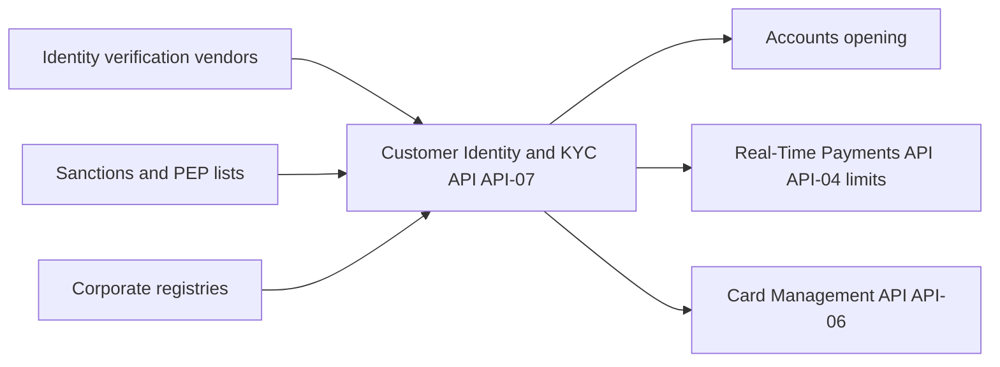

# API-07 Customer Identity & KYC API

API-07 performs identity verification, customer due diligence and beneficial-ownership checks. It returns a KYC status and an AML risk rating. Other systems use those results to gate account opening and payment limits. It belongs to the Client Onboarding business domain of the [Developer Platform](./developer-platform-overview.md) and is owned by the Know-Your-Customer Platform team (see [KYC Platform](../teams/kyc-platform.md)).

## Profile

| Attribute | Value |
| --- | --- |
| API ID / version | API-07 / v1.9 |
| Base path | `/kyc/v1` |
| Business domain | Client Onboarding |
| Intended consumers | Onboarding applications, Payments, Card Services |
| Data classification | Restricted - PII |
| OAuth scopes | `kyc:verify`, `kyc:read` |
| Rate limit | 200 requests/minute per client |
| SLO | 99.9% availability; p95 latency 1.2 s (verification) |

## Endpoints

| Method | Path | Purpose |
| --- | --- | --- |
| POST | `/verifications` | Start an individual or entity verification. |
| GET | `/verifications/{id}` | Retrieve the result: `verified`, `review` or `rejected`, with reason codes. |
| GET | `/customers/{customerId}/risk-rating` | Retrieve the customer's current AML risk rating: `low`, `medium` or `high`. |

The scope names suggest `kyc:verify` for starting verifications and `kyc:read` for result and rating lookups. The source lists the scopes but does not map them to endpoints, so confirm the mapping before relying on it.

## Request and response

A verification is started with `POST /kyc/v1/verifications`. The example request carries an `Idempotency-Key` header (a UUID) and a body with:

- `type`: `individual` in the example. The endpoint description says entities are also supported.
- `name`: for example `Jordan Ellis`.
- `dob`: a date of birth in ISO format, for example `1988-04-12`.
- `documentToken`: an opaque reference to an identity document, for example `doc_44ab`. The caller sends a token rather than raw document data. The source does not say how the token is obtained.

The example 200 response returns:

- `id`, for example `KYC-1189`.
- `status`, `verified` in the example.
- `riskRating`, `low` in the example.
- `checks`, the list of checks performed: `id`, `sanctions` and `pep`.

The example shows a result in the synchronous response. The status endpoint's `review` value implies that some verifications do not resolve immediately and must be polled with `GET /verifications/{id}`. The source does not describe asynchronous behaviour, callbacks or the request body for entities.

## Status values and lifecycle

A verification ends in one of three results:

| Status | Meaning |
| --- | --- |
| `verified` | Checks passed. |
| `review` | The outcome is not automatic. The name suggests manual review. |
| `rejected` | Verification failed. Reason codes explain why. |

`GET /verifications/{id}` returns reason codes alongside the status. The source does not list the codes or the transitions between states, for example how a `review` result resolves.

The risk rating (`low`, `medium`, `high`) is a property of the customer, read from `/customers/{customerId}/risk-rating`. It is separate from the verification record, although the verification response also carries `riskRating`. The source does not say when or how often the rating is recalculated.

## How consumers use it

Per the source, the status and rating gate account opening and payment limits. In the platform's lineage tables, API-07 is listed as an upstream source of:

- Account opening.
- The [Real-Time Payments API (API-04)](./api-04-real-time-payments-api.md), where the KYC result informs limits.
- The Card Management API (API-06).
- The Credit Decisioning API (API-09).

- **Upstream sources:** identity verification vendors, sanctions and PEP lists, and corporate registries. These match the `id`, `sanctions` and `pep` checks in the example response. Registries are the natural source for entity and beneficial-ownership checks.
- **Downstream consumers:** account opening, API-04 limits and API-06. The API-09 page also lists API-07 as an upstream input to credit decisioning.

## Operational notes

- **Idempotency.** The example verification request includes an `Idempotency-Key`. Reuse the same key when retrying so a verification, and its vendor cost, is not duplicated. The source does not say whether the header is mandatory or how replays behave.
- **Latency.** The p95 target of 1.2 s applies to verification. Callers should allow for vendor round trips and design for the `review` outcome rather than assuming an instant decision.
- **Rate limit.** Each client may make 200 requests/minute, lower than payment APIs such as API-04 (600/minute). Batch onboarding jobs need throttling.
- **Security.** Data is classified Restricted - PII. The example sends a document token rather than the document itself, and callers should keep names and dates of birth out of logs.
- **Availability.** The SLO is 99.9%. Consumers that gate on KYC, such as payments and cards, should decide how to behave when the API is unavailable. The source does not prescribe a fallback.

## Change history

- **v1.9 (2026-01):** added beneficial-ownership checks for entities. This is the only changelog entry in the source.

## Gaps in the source

The reference is short. It does not specify the entity request schema, the reason-code catalogue, error responses, webhook or event delivery for status changes (see the Webhooks & Event Notifications API, API-18), or the risk-rating methodology. Check with the [KYC Platform](../teams/kyc-platform.md) team before relying on these.
