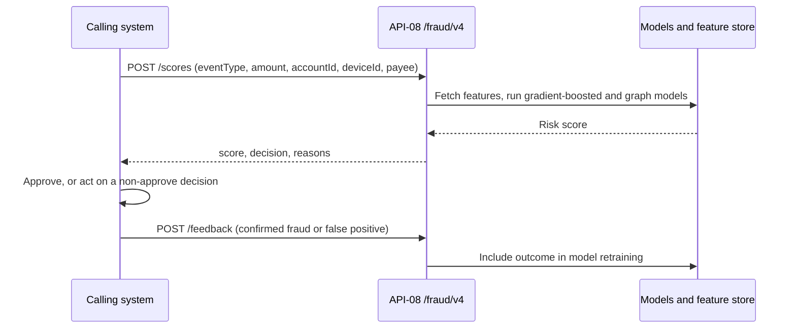
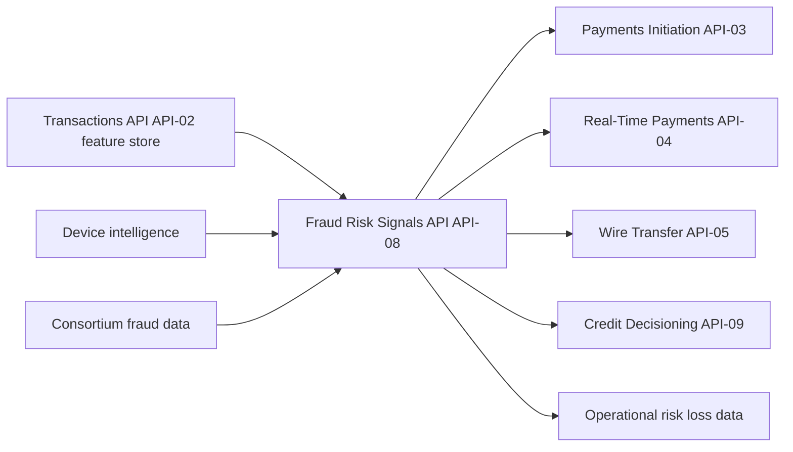

# API-08 Fraud & Risk Signals API

API-08 returns a real-time fraud score between 0 and 1, plus a decision and reason codes, for card authorizations, payments and account events. The source says the scores come from gradient-boosted and graph-based models, with average decision latency under 35 ms. It sits in the Fraud & Financial Crimes domain of the [Developer Platform](./developer-platform-overview.md) and is owned by [Fraud Strategy Engineering](../teams/fraud-strategy-engineering.md).

Unlike most platform APIs, it is **internal only**. Its consumers are other bank systems that call it inline before releasing money or approving an event.

## Profile

| Attribute | Value |
| --- | --- |
| API ID / version | API-08 / v4.0 |
| Base path | `/fraud/v4` |
| Business domain | Fraud & Financial Crimes |
| Intended consumers | Card authorization, Payments, RTP, Wires, Credit Decisioning (internal only) |
| Data classification | Restricted - Internal |
| OAuth scopes | `fraud:score` |
| Rate limits | 50,000 requests/second aggregate; internal callers only |
| SLO | 99.99% availability; p99 latency 60 ms |

The rate limit is stated as one aggregate figure, not a per-client figure like the quotas on client-facing APIs such as [API-04 Real-Time Payments](./api-04-real-time-payments-api.md). The source does not say how the aggregate is divided among callers.

The latency figures are of two kinds: an average under 35 ms, and a p99 SLO of 60 ms. They are a budget that callers can rely on when scoring inline in an authorization or payment path.

## Endpoints

| Method | Path | Purpose |
| --- | --- | --- |
| POST | `/scores` | Score an event: authorization, payment, login or account change. |
| POST | `/feedback` | Report confirmed fraud or a false positive, for model retraining. |
| GET | `/reason-codes` | Reference list of reason codes. |

The source lists only one OAuth scope, `fraud:score`. It does not say which endpoints that scope covers, so whether `/feedback` and `/reason-codes` need the same scope is unconfirmed.

## Scoring request and response

An event is scored with `POST /fraud/v4/scores`. The example request carries an `Idempotency-Key` header (a UUID) and a body of event attributes:

- `eventType`, for example `rtp_send`.
- `amount`, given as the plain number `2500`.
- `accountId`, for example `DDA-7700112`.
- `deviceId`, for example `dv-118`.
- `payee`, for example `new`.

The example 200 response contains:

- `score`, for example `0.07`.
- `decision`, for example `approve`.
- `reasons`, an array of reason codes, for example `NEW_PAYEE_LOW_RISK`.

The source gives only the `approve` value of `decision`. It does not list the other decision values, the score thresholds that produce them, or whether the caller must enforce the decision itself. Callers should treat the decision vocabulary as something to confirm with the owning team. The `reasons` strings are intended to come from the `/reason-codes` reference list. Fetch that list rather than hard-coding values, since v4.0 added new reason codes.

## Feedback loop

`POST /feedback` closes the loop between decisions and model quality. Consumers report confirmed fraud or a false positive, and the source says this feeds model retraining. The source does not define the feedback payload. It probably needs to identify the earlier scored event, but that is not documented.

The model-access and retraining steps in the diagram are inferred from the source descriptions of the models, the data lineage and the feedback endpoint. The source does not describe the internal pipeline.

## Data lineage and relationships

**Upstream sources:**

- The feature store built from the Transactions API ([API-02](./api-02-transactions-api.md)). API-02 lists this feature store as one of its downstream consumers.
- Device intelligence.
- Consortium fraud data.

**Downstream consumers:**

- [Payments Initiation API (API-03)](./api-03-payments-initiation-api.md), which uses fraud scoring as an upstream check.
- [Real-Time Payments API (API-04)](./api-04-real-time-payments-api.md).
- [Wire Transfer API (API-05)](./api-05-wire-transfer-api.md).
- Credit Decisioning API (API-09), which combines bureau data, behavior scores and fraud signals.
- Operational risk loss data. The 2025 Pillar 3 disclosures list this as the downstream use of API-08's real-time fraud scores.

## Operational notes

- **Position in the critical path.** Corporate reporting says fraud scoring is applied to every card authorization, real-time payment and wire, and that each payment is screened by API-08 before release. An outage or latency spike here therefore affects several payment and card flows at once, which explains the 99.99% availability target and the 60 ms p99.
- **Volume.** The 2Q26 earnings supplement reports about 690 million calls per month, up 24% year-on-year, at 99.99% availability, mainly from authorizations, RTP and wires.
- **Idempotency.** The example scoring call sends an `Idempotency-Key`. Reuse the same key when retrying the same event so one event is not scored twice. The source does not say whether the header is mandatory or what a replay returns.
- **Failure behavior.** The source does not say what callers should do if the API times out or is unavailable (fail open or fail closed). Each consuming team needs to define that policy.
- **Security.** Data is classified Restricted - Internal. Access is limited to internal callers with the `fraud:score` scope.
- **Outcomes.** Fraud losses as a percentage of card sales fell to 7.9 basis points in the 2025 annual report, which attributes real-time scoring as one control. The source does not credit API-08 alone for this.

## Changelog

- **v4.0 (2025-12):** added graph features and new reason codes.
