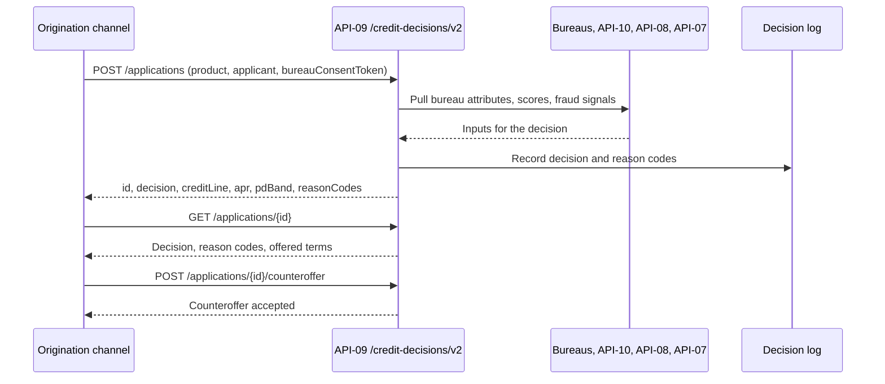
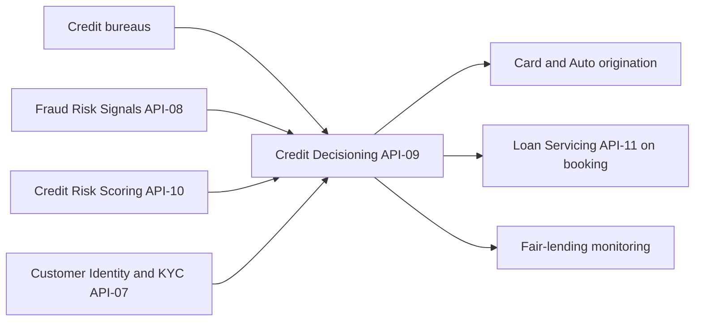

# API-09 Credit Decisioning API

API-09 is the automated underwriting decision service for consumer and small-business credit applications. A caller submits an application and gets back an `approve`, `decline` or `refer` decision, plus a credit line and pricing tier. The decision combines credit bureau attributes, internal behaviour scores and fraud signals. Every decision is logged so the bank can run fair-lending monitoring and produce adverse-action notices.

It belongs to the Credit Origination business domain and is owned by [Credit Platforms Engineering](../teams/credit-platforms-engineering.md). Corporate disclosures describe it as the delivery channel for the automated scorecards behind consumer credit decisions. Wholesale credit decisions are not made here: the Pillar 3 disclosures say credit officers with delegated authority make them.

## Profile

| Attribute | Value |
| --- | --- |
| API ID / version | API-09 / v2.2 |
| Base path | `/credit-decisions/v2` |
| Business domain | Credit Origination |
| Owning team | Credit Platforms Engineering |
| Intended consumers | Card, Auto and small-business origination channels; point-of-sale partners (sandbox only) |
| Data classification | Restricted - Credit |
| OAuth scopes | `credit.decisions:write`, `credit.decisions:read` |
| Rate limit | 400 requests/minute per channel |
| SLO | 99.95% availability; p95 latency 900 ms |

The rate limit applies per origination *channel*, not per end user or application. A busy channel such as card origination is limited independently of the others. The p95 latency target of 900 ms is far looser than the inline fraud-scoring budget of [API-08](./api-08-fraud-risk-signals-api.md). The decision path therefore has room for several upstream lookups (bureau, scoring, fraud, identity).

The source lists the two scopes but does not map them to endpoints. The natural reading is that `write` covers the two POST endpoints and `read` covers `GET /applications/{id}`. That reading is an inference.

## Endpoints

| Method | Path | Purpose |
| --- | --- | --- |
| POST | `/applications` | Submit an application and receive a decision. |
| GET | `/applications/{id}` | Retrieve the decision, reason codes and offered terms. |
| POST | `/applications/{id}/counteroffer` | Accept a counteroffer. |

## Request and response

An application is submitted with `POST /credit-decisions/v2/applications`. The example request carries an `Idempotency-Key` header (a UUID) and a body with:

- `product`, for example `CARD_REWARDS`.
- `applicant`, an object with attributes such as `income` (`92000`) and `housing` (`rent`).
- `bureauConsentToken`, for example `bc_19`. This is a token for the applicant's consent to a bureau pull. The application carries the consent token rather than a bureau report, so the service obtains bureau attributes itself.

The example 200 response contains:

- `id`, the application identifier (`APP-7781`), which is used in later GET and counteroffer calls.
- `decision`, here `approve`.
- `creditLine`, here `8500`.
- `apr`, here `0.2349`, written as a decimal fraction (23.49%).
- `pdBand`, here `"0.50-2.50%"`, a probability-of-default band.
- `reasonCodes`, here an empty array.

The example is an approval, so `reasonCodes` is empty. Declines and refers are the cases where reason codes carry content, because the adverse-action notice needs them. `GET /applications/{id}` is documented as returning "decision, reason codes and offered terms", so it serves as the read path for that data.

### What the source does not specify

- The full set of reason codes, their format, and whether a reference endpoint exists. API-08 has a `/reason-codes` endpoint, but API-09 does not.
- What `refer` means operationally, for example manual underwriting, and how a referred application is later resolved. No endpoint for resolving a referral is documented.
- The counteroffer request body, how a counteroffer is presented (presumably in the terms returned by `GET /applications/{id}`), and the response.
- Whether `Idempotency-Key` is mandatory and what a replay returns. Callers should reuse the same key when retrying the same submission, so one application does not produce two decisions or two bureau pulls.
- Timeout and fail-open or fail-closed behaviour. A credit decision should not be defaulted to approve on failure, but each channel needs to agree its policy with the owning team.

## Lifecycle

The calls to upstream services and the log write in the diagram are inferred from the description and data lineage. The source does not describe the internal sequence or ordering.

<!-- openwiki: broken internal link [./api-10-credit-risk-scoring-api.md#data-lineage-and-relationships] heading anchor "data-lineage-and-relationships" does not exist in "./api-10-credit-risk-scoring-api.md". Fix the href or restore the target, then delete this comment. -->
A submitted application gets an `id` and a decision. The visible states are `approve`, `decline` and `refer`. Where a decision comes with different terms from those the applicant asked for, the applicant can accept the counteroffer through `POST /applications/{id}/counteroffer`. The source does not publish a state machine, so what happens to a referred application, or what is stored when a counteroffer is accepted, is not documented here. The lineage notes that API-09 feeds [Loan Servicing (API-11)](./api-10-credit-risk-scoring-api.md#data-lineage-and-relationships) "on booking", so booking happens after the decision and counteroffer, and it is the point where an approved account reaches servicing.

## Data lineage and relationships

**Upstream sources:**

- Credit bureaus, the source of bureau attributes, accessed under the consent token.
- [Fraud Risk Signals API (API-08)](./api-08-fraud-risk-signals-api.md). API-08 lists Credit Decisioning among its downstream consumers.
- [Credit Risk Scoring API (API-10)](./api-10-credit-risk-scoring-api.md). API-10 also lists API-09 as a downstream consumer.
- [Customer Identity & KYC API (API-07)](./api-07-customer-identity-kyc-api.md).

**Downstream consumers:**

- Card and Auto origination systems.
- Loan Servicing API (API-11), on booking. API-11's lineage lists "Credit Decisioning API (API-09) bookings" as an input.
- Fair-lending monitoring, which reads the logged decisions.

### Relationship with API-10

API-10 serves pool-level and obligor-level PD, LGD and EAD parameters, with separate point-in-time and through-the-cycle endpoints. It is rate-limited to 60 requests/minute and owned by a different team (Risk Analytics Engineering). API-09 is both a consumer of those parameters and a returner of a `pdBand` per decision. The source does not say how the band is derived from API-10 parameters. Because API-10 is limited to 60 requests/minute, live per-application calls to it at API-09's 400 requests/minute per-channel limit would not fit unless the data is cached or batch-refreshed. That arithmetic is an observation and not documented behaviour.

### Where it shows up in reporting

- The 2025 annual report describes credit decisions for consumer products as made by automated scorecards exposed through API-09, combining bureau data, internal behaviour scores and API-08 fraud signals.
- The 2Q26 earnings supplement says new card account decisions go through API-09, and expected lifetime losses on the resulting balances are reserved through the CECL model as the loans are booked.
- The Pillar 3 data-lineage table (BCBS 239) lists API-09 as providing "origination decisions and scorecard outputs" for credit monitoring, indirect to the CECL model MDL-CR-007, and supports disclosure Section 6. It is not a direct feed to the CECL model, unlike API-10 and API-11.

## Operational notes

- **Compliance logging.** Logging of decisions, reason codes and offered terms exists to support fair-lending monitoring and adverse-action notices. Changes to the decision flow, such as new inputs or a new product, should keep the log complete.
- **Security.** Data is classified Restricted - Credit. It contains applicant income, housing status and bureau-derived data, so access should be limited to the origination channels with the right scopes.
- **Sandbox.** Point-of-sale partners are intended consumers through the sandbox only, from v2.2. The source does not say whether production access for them is planned.
- **Capacity.** The limit is per channel, so a channel that bursts (for example a promotion) would hit its own 400 requests/minute ceiling without affecting other channels.

## Changelog

- **v2.2 (2026-05):** point-of-sale sandbox.
- **v2.1 (2025-09):** small-business applications.
