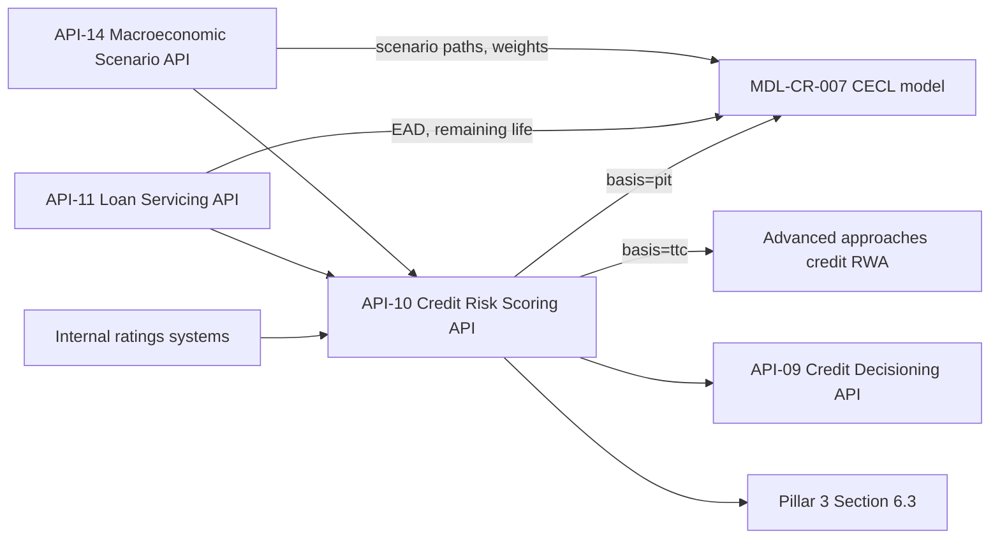

# API-10 Credit Risk Scoring API

API-10 is the Meridian Harbor Developer Platform service that publishes credit risk parameters (probability of default, loss given default and exposure at default) from the Firm's internal ratings systems. It is a **critical data service**: it feeds a Tier 1 model (the [CECL allowance model](../models/cecl-allowance-model.md), MDL-CR-007) and regulatory disclosures. Under the Firm's BCBS 239 program such services carry named data owners, documented data-quality rules and enhanced change management. They are also registered in the model inventory, so a breaking change automatically triggers a model change review by Model Risk Governance & Review (MRGR).

The service is owned by [Risk Analytics Engineering](../teams/risk-analytics-engineering.md) (business domain: Credit Risk).

## Identity and contract

| Attribute | Value |
| --- | --- |
| API ID / version | API-10, v3.0 |
| Base path | `/credit-risk/v3` |
| Environment | Internal (risk & finance) base URL `https://internal.api.mhfc.example`, private network only |
| Owning team | Risk Analytics Engineering |
| Intended consumers | Internal only: CECL model (MDL-CR-007), regulatory capital calculators, portfolio monitoring |
| Data classification | Restricted - Risk Model Data |
| OAuth scope | `risk.params:read` |
| Rate limit | 60 requests/minute; batch extracts go through async jobs |
| SLO | 99.95% availability; quarterly refresh within T+3 business days |

Platform-wide conventions also apply: OAuth 2.0 client-credentials with mutual TLS for server-to-server clients, 15-minute JWT access tokens, the standard error envelope (`error.code`, `message`, `requestId`), and `Retry-After` on HTTP 429.

## Endpoints

| Method | Path | Purpose |
| --- | --- | --- |
| GET | `/pools` | List portfolio pools (e.g. Credit Card, Residential Mortgage, CRE, C&I). |
| GET | `/pools/{poolId}/parameters?basis=pit` | Point-in-time PD, LGD, remaining life and macro elasticities used by CECL. |
| GET | `/pools/{poolId}/parameters?basis=ttc` | Through-the-cycle PD/LGD with regulatory floors. |
| POST | `/extracts` | Start an asynchronous full-portfolio extract; returns a `jobId`. |

The `basis` query parameter selects the parameter family, and `asOf` selects the reference date. The source summary also describes the service as covering obligor-level parameters and EAD. However, the endpoint table lists only pool-level parameter reads, and the documented example response has no EAD field. Treat obligor-level and EAD access as not evidenced by the documented endpoints.

### Example (PIT, Credit Card pool)

`GET /credit-risk/v3/pools/CARD/parameters?basis=pit&asOf=2025-12-31` returns:

```json
{
  "poolId": "CARD",
  "asOf": "2025-12-31",
  "basis": "pit",
  "basePdAnnual": 0.0374,
  "lgd": 0.88,
  "remainingLifeYears": 1.7,
  "pdElasticityPerPpUnemployment": 0.165,
  "modelVersion": "PD-CARD-5.2"
}
```

These values match the Credit Card row on the CECL model's `Segment_Inputs` sheet: base annual PD 0.0374, base LGD 0.8800, remaining life 1.70 years and PD elasticity 0.1650 per 1 pp of unemployment.

## Two parameter bases

The key design choice in v3.0 is that PIT and TTC parameters are served by separate `basis` values rather than one blended payload.

- **PIT (`basis=pit`)** is scenario-conditional and is consumed by CECL. It carries `basePdAnnual`, `lgd`, `remainingLifeYears` and the PD macro elasticity. The CECL model applies the elasticity against scenario unemployment from the [Macroeconomic Scenario API](api-14-macroeconomic-scenario-api.md).
- **TTC (`basis=ttc`)** carries through-the-cycle PD/LGD with regulatory floors, for Advanced approaches capital. The Pillar 3 disclosure states that regulatory capital parameters are TTC with floors, whereas CECL parameters are PIT and conditioned on macroeconomic scenarios.

The source does not document a TTC response schema.

## How CECL uses it



The CECL model's README lists "PD and LGD parameters from API-10 Credit Risk Scoring API (pool-level, refreshed quarterly)" as one of three key inputs. The others are loan balances (EAD) and remaining life from API-11, and scenario paths and weights from API-14. The model combines API-10's parameters as follows (see [CECL lifetime PD](../models/components/cecl-lifetime-pd.md)):

1. Scenario PD = base annual PD × (1 + elasticity × (scenario peak unemployment − baseline unemployment) × 100), floored at 0.
2. Lifetime PD = 1 − (1 − scenario PD) ^ remaining life (years).
3. Scenario LGD = base LGD × (1 − LGD sensitivity × collateral price change), capped at 100%.
4. Scenario ECL = EAD × lifetime PD × scenario LGD, and the modeled allowance is the sum of scenario weight × ECL.

API-10 therefore supplies base PD, base LGD and the PD elasticity. Scenario shocks, weights and the overlay come from elsewhere. Because the PD elasticity is part of the API-10 payload, a change to its calibration changes allowance sensitivity directly, which is why it was added with MRGR-relevant change control in v3.0.

## Lineage and consumers

- **Upstream:** internal ratings systems, [Loan Servicing API (API-11)](api-11-loan-servicing-api.md) and [Macroeconomic Scenario API (API-14)](api-14-macroeconomic-scenario-api.md).
- **Downstream:** MDL-CR-007 CECL model (`CECL_Allowance_Model.xlsx`), Advanced approaches credit RWA, [Credit Decisioning API (API-09)](api-09-credit-decisioning-api.md) and Pillar 3 Section 6.3.
- The Pillar 3 API lineage table maps API-10 to MDL-CR-007 and Advanced credit RWA, and to disclosure Sections 4 and 6. The 2025 Pillar 3 notes that internal Card PD and LGD estimates delivered by API-10 contributed to lower Advanced RWA growth than Standardized.
- The Q2 2026 earnings supplement says pool-level PD and LGD estimates were refreshed in June 2026 and reflected in the quarter-end allowance.

## Operations and failure expectations

- **Refresh cadence:** parameters refresh quarterly, with an SLO of T+3 business days after quarter end. CECL runs therefore depend on that refresh having landed. Check `asOf` and `modelVersion` (e.g. `PD-CARD-5.2`) in the response to confirm a run used the intended vintage.
- **Volume and availability:** the Q2 2026 supplement reports 12 million monthly calls (+6% YoY) at 99.95% availability, with key consumers named as the CECL model, capital and monitoring. Given the 60 requests/minute limit, full-portfolio pulls should use `POST /extracts` and the returned `jobId` rather than looping over pools.
- **Escalation:** critical data services, including API-10, escalate to the Data and Technology Risk Committee, with 24x7 coverage during quarter close.
- **Errors:** standard platform codes apply: 401 `unauthorized`, 403 `insufficient_scope` (token lacks `risk.params:read`), 404 `not_found`, 429 `rate_limited` and 503 `service_unavailable`.
- **Change management:** breaking changes to payload shape or semantics require a model change review by MRGR, because MDL-CR-007 (last validated 2025-11-04) is registered as consuming this API.

## Version history

- **v3.0 (2025-10):** separate PIT and TTC endpoints, and macro elasticities added for use by MDL-CR-007.

## Relationships

- owned by: [Risk Analytics Engineering](../teams/risk-analytics-engineering.md)
- feeds (PD/LGD inputs): [CECL allowance model (MDL-CR-007)](../models/cecl-allowance-model.md)
- feeds (PD calculation): [CECL lifetime PD](../models/components/cecl-lifetime-pd.md)
- consumes: [API-11 Loan Servicing API](api-11-loan-servicing-api.md)
- consumes: [API-14 Macroeconomic Scenario API](api-14-macroeconomic-scenario-api.md)
- feeds: [API-09 Credit Decisioning API](api-09-credit-decisioning-api.md)
