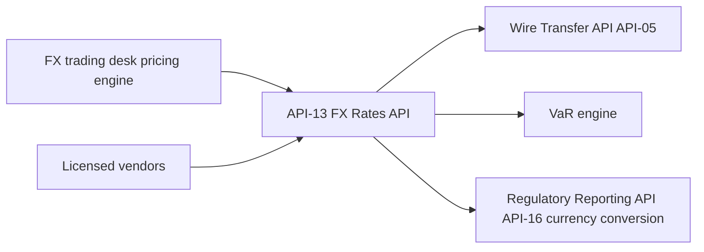

# API-13 FX Rates API

The FX Rates API (API-13) is the platform's source of foreign-exchange rates. Its documented scope is spot, forward and end-of-day reference rates for 150+ currency pairs, plus executable quotes for client payments. It belongs to the Markets & Treasury domain and is owned by the Market Data Services team (see [Market Data Services](../teams/market-data-services.md)). It is a sibling of the [Market Data API (API-12)](api-12-market-data-api.md), which carries prices, curves and volatility surfaces; API-13 carries FX rates.

Source: `sources/api_docs/apis/api-13-fx-rates-api.md`, which is derived from the MHFC Developer Platform API Reference.

## Contract at a glance

| Attribute | Value |
| --- | --- |
| API ID / version | API-13 / v2.4 |
| Base path | `/fx/v2` |
| Owning team | Market Data Services |
| Intended consumers | Wires, card cross-border pricing, risk aggregation, finance |
| Data classification | Internal - Licensed Data |
| OAuth scopes | `fx:read`, `fx.quotes:write` |
| Rate limit | 3,000 requests/minute |
| SLO | 99.99% availability; quote validity 60 s |

The 3,000 requests/minute limit is lower than API-12's 5,000 requests/minute. Unlike API-12, API-13 documents no WebSocket streaming.

## Endpoints

| Method | Path | Purpose |
| --- | --- | --- |
| GET | `/rates/spot` | Spot mid rates for the currency pairs requested. |
| GET | `/rates/eod/{date}` | End-of-day reference rates used for financial reporting. |
| POST | `/quotes` | Executable quote for a client conversion. |

The scope names suggest two access tiers. `fx:read` is the read scope for the rate lookups. `fx.quotes:write` is the scope for quote creation. The source does not map scopes to endpoints explicitly, so treat that mapping as an inference.

### Spot rates

A request lists pairs in a `pairs` query parameter, for example `GET /fx/v2/rates/spot?pairs=EURUSD,GBPUSD`. The response carries an `asOf` UTC timestamp and a `rates` object keyed by pair code:

```json
{
  "asOf": "2026-06-30T15:00:00Z",
  "rates": { "EURUSD": 1.0853, "GBPUSD": 1.2711 }
}
```

These are mid rates. They are reference values, not rates a client can transact at.

### End-of-day reference rates

`/rates/eod/{date}` returns the reference rates used for financial reporting. It was added in v2.4 (2025-11) for the finance consumer. Use it, not spot, when a figure must be reproducible for a reporting date.

### Executable quotes

`POST /quotes` returns an executable quote for a client conversion. The SLO states a quote validity of 60 seconds. Consumers must therefore treat a quote as expiring and must not cache it or reuse it after that window. The wire API has its own `/wires/quotes` endpoint, documented as an FX quote valid for 60 seconds for a cross-currency wire. See [API-05 Wire Transfer API](api-05-wire-transfer-api.md). The sources do not say how that endpoint relates to `POST /fx/v2/quotes`. The wire API's description does say it converts using rates from API-13.

## Data lineage



- **Upstream:** the FX trading desk pricing engine and licensed market-data vendors. The vendor input is why the data is classified "Internal - Licensed Data".
- **Downstream:** the Wire Transfer API (API-05) for cross-border conversion, the VaR engine, and currency conversion in the Regulatory Reporting API (API-16).

The bank's annual report and Pillar 3 disclosures describe API-13 as supplying the FX rates used to value trading positions daily and to convert non-USD exposures. They say API-12 and API-13 are both designated critical data elements under the BCBS 239 program. Pillar 3 says their inputs are validated independently by the Valuation Control Group. Changes to this API therefore carry regulatory-data governance weight. The Pillar 3 summary lists its use in VaR and non-USD exposure conversion.

## Operational notes

- Availability target is 99.99%, which is high because wires, card pricing and risk all depend on it synchronously or daily.
- Quote validity is 60 s, so callers should request a quote close to the moment of execution and handle expiry by requesting a new one.
- Rate limiting at 3,000 requests/minute applies across consumers; batch pairs into one `pairs` list instead of issuing a request per pair.
- Licensed-data classification restricts redistribution of the rates. Do not expose them outside the intended consumers without a licence check.

## Documented gaps and cautions

- The overview mentions forward rates, but no forward-rate endpoint is listed in v2.4. Treat forwards as not exposed through the documented endpoints.
- The source gives no request schema for `POST /quotes`, no error model, and no explicit scope-to-endpoint mapping.
- The source states no EOD publication time. API-12 does state one (19:00 ET), but that cannot be assumed to apply here.

## Changelog

- v2.4 (2025-11): added the EOD reference endpoint for finance.

## Related pages

- [API-12 Market Data API](api-12-market-data-api.md)
- [API-05 Wire Transfer API](api-05-wire-transfer-api.md)
- [Market Data Services](../teams/market-data-services.md)
