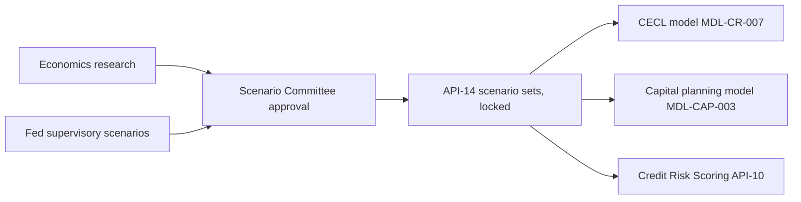

# API-14 Macroeconomic Scenario API

API-14 is the Meridian Harbor Developer Platform service that distributes **approved macroeconomic scenario sets**. Each set contains scenario paths for unemployment, GDP, house prices, CRE prices, interest rates and credit spreads, plus the probability weight of each scenario. It is the single governed source from which loss and capital models obtain their economic assumptions. That keeps those models from carrying hand-keyed copies of scenario data.

The service is owned by [Risk Analytics Engineering](../teams/risk-analytics-engineering.md) in the Risk & Finance business domain.

## Identity and contract

| Attribute | Value |
| --- | --- |
| API ID / version | API-14, v1.6 |
| Base path | `/scenarios/v1` |
| Owning team | Risk Analytics Engineering |
| Intended consumers | Internal only: CECL, capital planning, stress testing, ALM |
| Data classification | Restricted - Internal |
| OAuth scopes | `scenarios:read`, `scenarios:approve` |
| Rate limit | 30 requests/minute |
| SLO | 99.9% availability; a new set is published within 1 business day of approval |

The platform-wide authentication rules apply: OAuth 2.0, with the client-credentials grant plus mutual TLS for server-to-server clients, 15-minute JWT access tokens, and least-privilege scopes enforced.

## Endpoints

All three documented endpoints are read-only `GET` calls.

| Method | Path | Purpose |
| --- | --- | --- |
| GET | `/scenario-sets` | List scenario sets, for example `MSC-2025Q4` and `SA-2025-INT`. |
| GET | `/scenario-sets/{setId}` | Scenarios, weights and approval metadata for one set. |
| GET | `/scenario-sets/{setId}/paths/{variable}` | Quarterly path of one variable in each scenario of the set. |

The reference documents no write endpoint. The `scenarios:approve` scope exists, but how it is used is not described in the reference. Treat approval as an upstream governance step. The API publishes only the result.

### Example

`GET /scenarios/v1/scenario-sets/MSC-2025Q4` returns the set identifier, the approval date (`2025-12-15`) and one summary object per scenario:

| Scenario | `weight` | `peakUnemployment` | `realGdp2026` | `hpiChange` | `creChange` |
| --- | --- | --- | --- | --- | --- |
| Upside | 0.2 | 0.038 | 0.026 | 0.045 | 0.03 |
| Baseline | 0.5 | 0.044 | 0.017 | 0.022 | -0.01 |
| Downside | 0.3 | 0.068 | -0.012 | -0.085 | -0.14 |

The set-level response carries summary metrics only. Full quarterly trajectories come from the `/paths/{variable}` endpoint.

## How it is used

- **Upstream:** economics research, Federal Reserve supervisory scenarios and Scenario Committee approvals.
- **Downstream:**
  - The [CECL allowance model](../models/cecl-allowance-model.md) (MDL-CR-007) takes scenario weights, unemployment, HPI and CRE paths. Its Scenarios sheet is labelled as sourced from API-14 set `MSC-2025Q4`, with the same three scenarios and weights as the example above.
  - The [capital planning model](../models/capital-planning-model.md) (MDL-CAP-003) uses the scenarios for its baseline and severely adverse projections.
  - The Credit Risk Scoring API (API-10) is also listed as a downstream consumer.
- The set itself is documented on the [MSC-2025Q4 scenario page](../scenarios/macro-scenarios-msc-2025q4.md).

## Lifecycle and invariants

- **Versioned and locked.** Scenario sets are versioned and locked after Scenario Committee approval. Consumers can therefore pin a `setId` and expect it to be stable for an entire reporting cycle. A change in assumptions arrives as a new set, not an edit to an existing one.
- **Publication timing.** The SLO targets publication within one business day of approval.
- **Weights.** Scenario probability weights are expected to sum to 100%. The CECL model enforces this with a check cell on its Scenarios sheet, which flags `WEIGHTS MUST SUM TO 100%` when the sum differs from 1 by 0.0001 or more. The example set uses 0.2, 0.5 and 0.3. Consumers should not assume the API alone guarantees this, and should validate on load.
- **Rate limit.** At 30 requests/minute, consumers should fetch a set once per cycle and cache it. They should not call per loan or per calculation.

## Operations and history

- **Platform migration.** The service moved to the strategic data platform in 2Q26 (v1.6, released 2026-05). Load time dropped from about six hours to under forty minutes.
- **v1.5 (2025-10).** Added the internal severely adverse set, which is why a set such as `SA-2025-INT` appears alongside the committee sets.
- **Access.** The data is Restricted - Internal and available only to internal consumers. Callers need the `scenarios:read` scope.

## Safe-change notes

- Because CECL, capital planning and API-10 depend on the response shape, renaming summary fields (`peakUnemployment`, `realGdp2026`, `hpiChange`, `creChange`) or changing weight semantics would be a breaking change for model consumers.
- Changes to the approved-set workflow, such as how `scenarios:approve` is used, should be coordinated with the Scenario Committee process and with the model owners.
