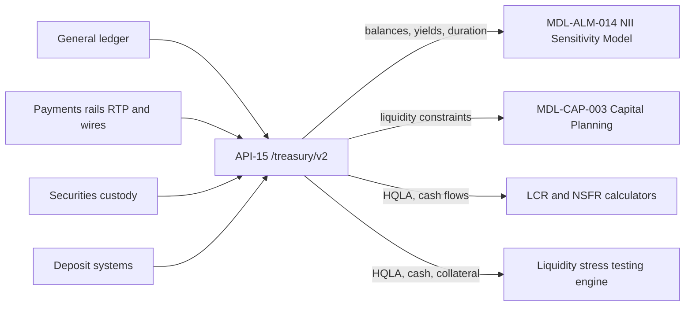

# API-15 Treasury Liquidity Positions API

API-15 aggregates **intraday and end-of-day cash, collateral, HQLA and rate-sensitive balance sheet positions by legal entity**, including yields and costs by product line. It is the Treasury-domain source that liquidity calculators and asset-liability management (ALM) models read, so that they do not carry their own copies of position data. It is one of the platform's critical data services (see [Governance and operations](#governance-and-operations)).

## Identity and contract

| Attribute | Value |
| --- | --- |
| API ID | API-15 |
| Version | v2.1 |
| Base path | `/treasury/v2` |
| Business domain | Treasury |
| Owning team | [Treasury Technology](../teams/treasury-technology.md) |
| Intended consumers | Internal only: Treasury/CIO, liquidity risk, ALM and capital models |
| Data classification | Restricted - Internal |
| OAuth scopes | `treasury.positions:read`, `treasury.hqla:read` |
| Rate limit | 120 requests/minute |
| SLO | 99.95% availability; EOD positions by 21:00 ET |

Platform-wide rules from the [Developer Platform overview](developer-platform-overview.md) apply. API-15 is served only from the private-network host `https://internal.api.mhfc.example`, together with the other restricted risk and finance APIs (API-10, API-14, API-15, API-16). Callers use OAuth 2.0 client credentials with mutual TLS and 15-minute JWT access tokens, and least-privilege scopes are enforced.

The reference does not say which of the two scopes guards which endpoint. A reasonable reading is that `treasury.hqla:read` is for `/hqla/{asOf}` and `treasury.positions:read` is for the other two endpoints, but that mapping is not stated. Verify it before relying on it when provisioning a client.

## Endpoints

All three documented endpoints are read-only `GET` calls. The reference lists no write endpoint.

| Method | Path | Description |
| --- | --- | --- |
| GET | `/positions/balance-sheet/{asOf}` | Rate-sensitive positions with balance, yield/cost and duration by line. |
| GET | `/hqla/{asOf}` | HQLA by level and legal entity. |
| GET | `/cash/intraday` | Intraday cash position by currency and entity. |

`/positions/balance-sheet/{asOf}` and `/hqla/{asOf}` are point-in-time reads keyed by an as-of date. `/cash/intraday` takes no date and returns the current intraday view.

### Example

`GET /treasury/v2/positions/balance-sheet/2025-12-31?line=CONSUMER_IB_DEPOSITS` returns one line:

```json
{
  "line": "Consumer interest-bearing deposits",
  "balance": 402000,
  "units": "USD millions",
  "cost": 0.0205,
  "modifiedDuration": 2.8
}
```

Points a consumer should note:

- Amounts are stated in the payload (`"units": "USD millions"`), in line with the platform convention for risk and finance APIs.
- Rates are decimals: a `cost` of `0.0205` is 2.05%.
- `modifiedDuration` is in years. It was added in **v2.1 (2026-01)** "for EVE" (economic value of equity). Consumers that still ignore it lose the EVE input.
- The `line` query parameter filters to a single product line. Only `CONSUMER_IB_DEPOSITS` is shown in the reference.
- The same values (402,000 balance, 0.0205 cost, 2.80 duration) appear in the NII model's Balance_Sheet row 15, so the example is the figure the model actually uses.

The reference gives no example payloads for `/hqla/{asOf}` or `/cash/intraday`.

## Data lineage

| Upstream sources | Downstream consumers |
| --- | --- |
| General ledger; Payments rails (RTP, wires); Securities custody; Deposit systems | MDL-ALM-014 NII Sensitivity Model (balances, yields); MDL-CAP-003 (liquidity constraints); LCR and NSFR calculators; Liquidity stress testing engine |

The payments upstream is also documented from the payment side. The [Real-Time Payments API](api-04-real-time-payments-api.md) (API-04) and the [Wire Transfer API](api-05-wire-transfer-api.md) (API-05) each list API-15 among their downstream consumers, API-04 specifically for intraday cash.



### What each consumer takes

- **[NII Sensitivity Model](../models/nii-sensitivity-model.md) (MDL-ALM-014):** the model's first key input is "Balances and yields from API-15 Treasury Liquidity Positions API (month-end snapshot)." On its Balance_Sheet sheet, the rows whose Feed column is `API-15` are deposits with banks and fed funds sold, investment securities (AFS + HTM), trading assets, consumer and wholesale interest-bearing deposits, noninterest-bearing deposits, repo and short-term borrowings and long-term debt. The loan lines come from API-11 (Loan Servicing). The same sheet carries a modified duration column that drives the EVE calculation, which is the field v2.1 added. Balances are as of 2025-12-31 (the example above is row 15 of that sheet). The model's other inputs are API-11 repricing profiles and API-12 yield curves, so API-15 supplies the balance and rate side only.
- **[Capital Planning model](../models/capital-planning-model.md) (MDL-CAP-003):** "Liquidity constraints on distributions cross-checked against API-15." This is a cross-check on the distribution plan. Starting CET1 and RWA come from API-16, and scenario paths from API-14.
- **LCR and NSFR calculators:** these use HQLA by level and legal entity, plus cash flows and encumbrance. See [Metrics fed](#metrics-and-models-fed).
- **Liquidity stress testing engine:** per the Annual Report, API-15 "publishes intraday cash, collateral and high-quality liquid asset (HQLA) positions" to it.

## Metrics and models fed

| Output | Role of API-15 | Page |
| --- | --- | --- |
| NII sensitivity and EVE (MDL-ALM-014) | Month-end balances, yields/costs and modified duration for the lines it feeds | [NII Sensitivity Model](../models/nii-sensitivity-model.md) |
| Capital planning (MDL-CAP-003) | Liquidity constraints used to cross-check the distribution plan | [Capital Planning model](../models/capital-planning-model.md) |
| LCR | HQLA and cash flow projections for the numerator and outflow/inflow inputs | [Liquidity Coverage Ratio](../metrics/liquidity-coverage-ratio.md) |
| NSFR | Balance-sheet and HQLA positions for the LCR and NSFR calculators | [Net Stable Funding Ratio](../metrics/net-stable-funding-ratio.md) |

The disclosures describe the feed this way:

- The 2025 Annual Report (Liquidity Risk Management) says liquidity positions across all legal entities are aggregated daily through API-15 and that "the same feed supplies balance sheet positions to the Net Interest Income Sensitivity Model."
- The 2025 Pillar 3 disclosures (section 12) say API-15 provides "legal-entity-level views of HQLA, encumbrance and contractual cash flows" to the stress testing engine, the LCR and NSFR calculators and the ALM models. Its BCBS 239 mapping table lists API-15 as providing "HQLA, cash flows, balance sheet positions", supporting MDL-ALM-014, MDL-CAP-003 and LCR/NSFR, in disclosure sections 11 and 12.
- The Q2 2026 Earnings Supplement says HQLA and cash flow projections behind the LCR detail are "compiled daily from the Treasury Liquidity Positions API (API-15)". That detail shows average 2Q26 HQLA of 292,300 million and an LCR of 115%.
- The Annual Report reports an average Q4 2025 LCR of 116%, an NSFR of 128% and Q4 average HQLA of 286,000 million.

These are outcomes of the calculators and disclosures that consume the API. API-15 supplies position data and does not itself return LCR or NSFR values. The reference lists no ratio endpoint.

## Governance and operations

- **Critical data service.** APIs that feed Tier 1 models or regulatory disclosures are classified as critical data services under the Firm's BCBS 239 program. This applies to API-15 because it feeds Tier 1 models. They carry named data owners, documented data-quality rules and enhanced change management. A breaking change automatically triggers a model change review by Model Risk Governance & Review (MRGR). See [BCBS 239](../concepts/bcbs-239.md) and [Model risk (SR 11-7)](../concepts/model-risk-sr-11-7.md).
- **Escalation.** Incidents on critical data services, including API-15, escalate to the Data and Technology Risk Committee, with 24x7 coverage during quarter close.
- **Freshness.** The SLO promises end-of-day positions by 21:00 ET, which is the earliest point at which daily consumers can assume the day's position set is complete. Intraday cash is available through the separate `/cash/intraday` endpoint.
- **Rate limit.** At 120 requests/minute per client, consumers should pull a snapshot per as-of date, for example one month-end balance sheet for the NII model, and cache it. They should not poll per line. Responses to over-limit calls are HTTP 429 `rate_limited` with a `Retry-After` header, per the platform error format.
- **Versioning.** The major version is in the path (`/treasury/v2`). Minor versions are additive and backward compatible, as v2.1 was when it added `modifiedDuration`. A major version is supported for at least 12 months after its successor reaches general availability.

### Safe-change notes

- Renaming or changing the units or semantics of `balance`, `cost` or `modifiedDuration` would break MDL-ALM-014, a Tier 1 model, and would trigger an MRGR review.
- Changes to HQLA levels or legal-entity breakdowns affect the LCR and NSFR calculators and the Pillar 3 liquidity disclosures that depend on them.
- Upstream changes in the general ledger, deposit systems, custody or payments rails are the main source of data-quality risk for API-15, so ownership of those feeds should be coordinated with Treasury Technology.

## Changelog

- **v2.1 (2026-01):** `modifiedDuration` field added for EVE.

## Relationships

- owned-by: [Treasury Technology](../teams/treasury-technology.md)
- feeds: [NII Sensitivity Model (MDL-ALM-014)](../models/nii-sensitivity-model.md) with balances, yields and modified duration
- feeds: [Capital Planning & Stress Projection Model (MDL-CAP-003)](../models/capital-planning-model.md) with liquidity constraints
- feeds: [Liquidity Coverage Ratio](../metrics/liquidity-coverage-ratio.md) calculator inputs (HQLA and cash flows)
- feeds: [Net Stable Funding Ratio](../metrics/net-stable-funding-ratio.md) calculator inputs
- consumes: [Real-Time Payments API (API-04)](api-04-real-time-payments-api.md) and [Wire Transfer API (API-05)](api-05-wire-transfer-api.md) payment flows for intraday cash, as listed in their lineage tables
- related: [API-16 Regulatory Reporting API](api-16-regulatory-reporting-api.md), the other upstream feed for MDL-CAP-003
- related: [Developer Platform overview](developer-platform-overview.md)
- related: [API to model to report lineage](../workflows/api-to-model-to-report-lineage.md)
