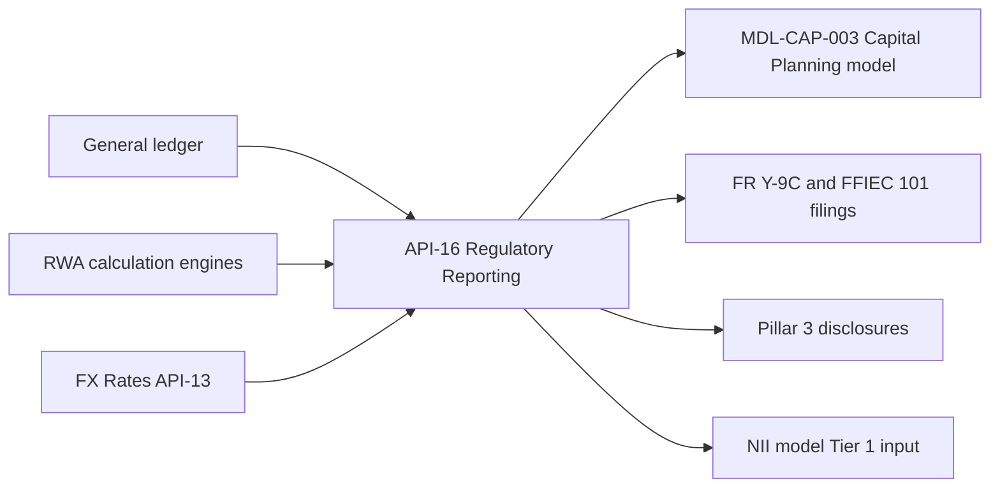

# API-16 Regulatory Reporting API

API-16 provides governed regulatory capital, risk-weighted assets (RWA), leverage exposure and report line items for FR Y-9C, FFIEC 101 and FR Y-15. The data is reconciled to the general ledger at legal-entity level. It is described as the **golden source for Pillar 3** and is one of the Developer Platform's internal-only, restricted risk and finance APIs.

## Contract at a glance

| Attribute | Value |
| --- | --- |
| API ID / version | API-16 / v1.8 |
| Base path | `/regulatory/v1` |
| Business domain | Finance & Regulatory |
| Owning team | [Finance Technology](../teams/finance-technology.md) (the catalog lists it as the sole owner) |
| Intended consumers | Internal only: Regulatory Reporting, Capital Management, Disclosure Committee |
| Data classification | Restricted - Internal |
| OAuth scope | `regulatory:read` |
| Rate limit | 20 requests/minute |
| SLO | 99.9% availability; quarter-end data locked by day 25 |
| Environment | Internal (risk & finance) host `https://internal.api.mhfc.example`, private network only (shared with API-10, API-14 and API-15) |

Platform-wide conventions come from the [Developer Platform overview](developer-platform-overview.md). Calls use OAuth 2.0 client-credentials with mutual TLS and 15-minute JWTs. Major versions appear in the path, which is why this API is under `/regulatory/v1`. Risk and finance payloads state their units, normally USD millions. Rate-limit rejections return HTTP 429 with `Retry-After`. The common error envelope has `code`, `message` and `requestId`.

## Endpoints

All four endpoints are read-only `GET` operations. `{asOf}` is a reporting date.

| Method | Path | Returns |
| --- | --- | --- |
| GET | `/capital/{asOf}` | CET1, Tier 1, Total capital and deductions |
| GET | `/rwa/{asOf}?approach=standardized` | RWA by exposure type and approach |
| GET | `/leverage/{asOf}` | Total leverage exposure components and SLR |
| GET | `/reports/{reportId}/{asOf}` | Line items for a regulatory report schedule |

Example from the reference: `GET /regulatory/v1/capital/2026-06-30` returns

```json
{
  "asOf": "2026-06-30",
  "cet1": 101200,
  "standardizedRwa": 668400,
  "cet1Ratio": 0.1514,
  "units": "USD millions",
  "status": "locked"
}
```

Two fields in this example matter operationally. `status` shows whether the period's data is locked. The SLO says quarter-end data is locked by day 25. `units` is `USD millions`. The CET1 ratio is the ratio of the two returned amounts (101,200 / 668,400 ≈ 15.14%).

The source documents only this one sample payload. It does not specify the response shapes for the other three endpoints, the valid `reportId` values, or any `approach` values other than `standardized`.

## Data lineage



Upstream feeds into API-16, and its governed outputs flow downstream to models and filings.

- **Upstream:** the general ledger, the RWA calculation engines and the [FX Rates API (API-13)](api-13-fx-rates-api.md). API-13's own lineage lists API-16 currency conversion as a consumer.
- **Downstream:**
  - **MDL-CAP-003** takes starting CET1 and RWA. See the [Capital Planning & Stress Projection Model](../models/capital-planning-model.md).
  - **FR Y-9C and FFIEC 101 filings** are prepared from API-16 data. The Q2 2026 earnings supplement says its estimated ratios are subject to finalization in the FR Y-9C, prepared from data delivered by API-16.
  - **Pillar 3 disclosures** use the same governed data. See [Pillar 3 Disclosures 2025](../reports/pillar3-disclosures-2025.md).
  - **The NII sensitivity model** takes Tier 1 capital as an input. Its YE2025 value is 110,620 $mm, which is the denominator for the EVE limit expressed as a percentage of Tier 1.

The end-to-end path from API to model to report is covered in [API to model to report lineage](../workflows/api-to-model-to-report-lineage.md).

### How MDL-CAP-003 uses it

MDL-CAP-003 starts from the Q2 2026 position from API-16. That is CET1 of 101,200 $mm and standardized RWA of 668,400 $mm, taken from the FR Y-9C / FFIEC 101 extract. It then projects CET1, RWA and ratios over nine quarters. Scenario paths come from API-14, and liquidity constraints on distributions are cross-checked against [API-15](api-15-treasury-liquidity-positions-api.md). API-16 is the only one of the three feeds that supplies the capital starting point. The model's key outputs are the CET1 ratio path, the minimum stressed CET1 and an indicative stress capital buffer.

## Reports and metrics supported

| Area | What API-16 supplies | Notes |
| --- | --- | --- |
| Pillar 3 | Regulatory capital, RWA and leverage exposure | The Pillar 3 report's BCBS 239 mapping ties API-16 to disclosure sections 3, 4, 5 and 13. See [Basel III Pillar 3](../concepts/basel-iii-pillar-3.md). |
| Capital | CET1, Tier 1 and Total capital, plus deductions | Backs the [CET1 ratio](../metrics/cet1-ratio.md). Reported Standardized CET1 was 15.1% at Q2 2026. |
| RWA | RWA by exposure type and approach | Backs [risk-weighted assets](../metrics/risk-weighted-assets.md). The documented approach parameter value is `standardized`. |
| Leverage | Leverage exposure components and SLR | Backs the [supplementary leverage ratio](../metrics/supplementary-leverage-ratio.md). The Q2 2026 supplement reports SLR of 6.1%. |
| Regulatory filings | Schedule line items via `/reports/{reportId}/{asOf}` | FR Y-9C, FFIEC 101 and FR Y-15. |
| Liquidity | **Not supplied by API-16** | The liquidity coverage and net stable funding ratios (LCR and NSFR) are fed by [API-15](api-15-treasury-liquidity-positions-api.md) (HQLA, cash flows, balance sheet positions). API-16 touches liquidity only through MDL-CAP-003, which pairs its capital starting point with API-15 liquidity checks. |

## Governance and operations

- **Critical data service.** API-16 feeds Tier 1 models and regulatory disclosures, so it is classified under the [BCBS 239](../concepts/bcbs-239.md) program. That means named data owners, documented data-quality rules, enhanced change management and model-inventory registration. A breaking change automatically triggers a model change review by Model Risk Governance & Review (MRGR).
- **Escalation.** Critical data services, API-16 included, escalate through the Data and Technology Risk Committee, 24x7 during quarter close. Production P1/P2 incidents use the API operations hotline.
- **Data-quality reporting.** Data-quality exceptions on critical data elements are reported monthly to the Data and Technology Risk Committee. The 2025 Pillar 3 report states that no exception with a material impact on reported capital ratios occurred during 2025.
- **Usage.** Q2 2026 usage was about 0.4 million calls a month, up 3% year on year, at 99.90% availability. The key consumers were the capital model, FR Y-9C and Pillar 3.
- **Change guidance.** Because MDL-CAP-003 and the NII model consume it, any change to field meaning, units or lock behavior needs coordination with their owners and MRGR. Additive minor versions stay backward compatible. A new major version would sit on a new path such as `/regulatory/v2`.

## Version history

- **v1.8 (2026-03):** added a GL reconciliation status flag.
- **v1.7 (2025-09):** strategic platform migration. The 2025 Pillar 3 report says the migration to the strategic data platform was completed in 2025 and that automated reconciliation between API-16 outputs and the general ledger at legal-entity level was introduced.

## Relationships

- **Owned by:** [Finance Technology](../teams/finance-technology.md)
- **Depends on (upstream):** [FX Rates API (API-13)](api-13-fx-rates-api.md)
- **Feeds (model):** [Capital Planning & Stress Projection Model (MDL-CAP-003)](../models/capital-planning-model.md)
- **Feeds (report):** [Pillar 3 Disclosures 2025](../reports/pillar3-disclosures-2025.md)
- **Complements (sibling feed):** [API-15 Treasury Liquidity Positions API](api-15-treasury-liquidity-positions-api.md)
- **Governed by:** [BCBS 239](../concepts/bcbs-239.md)
- **Disclosed under:** [Basel III Pillar 3](../concepts/basel-iii-pillar-3.md)
- **Part of workflow:** [API to model to report lineage](../workflows/api-to-model-to-report-lineage.md)
- **Supports metrics:** [CET1 ratio](../metrics/cet1-ratio.md), [Risk-weighted assets](../metrics/risk-weighted-assets.md), [Supplementary leverage ratio](../metrics/supplementary-leverage-ratio.md)
