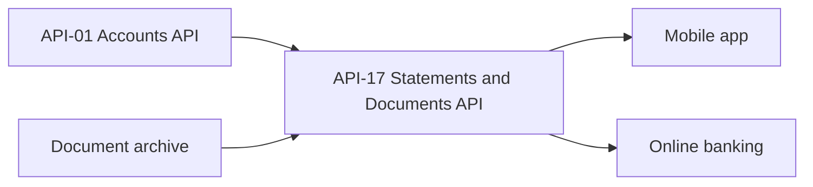

# API-17 Statements & Documents API

The Statements & Documents API lists and retrieves account statements, tax forms and notices as PDF, and lets a client set e-delivery (paperless) preferences. It belongs to the Client Servicing business domain and is owned by [Digital Platforms Engineering](../teams/digital-platforms-engineering.md). Account context comes from the [Accounts API (API-01)](./api-01-accounts-api.md).

## Summary

| Attribute | Value |
| --- | --- |
| API ID | API-17 |
| Version | v1.4 |
| Base path | `/documents/v1` |
| Business domain | Client Servicing |
| Owning team | Digital Platforms Engineering |
| Intended consumers | Mobile app, online banking, corporate clients |
| Data classification | Confidential - Client Data |
| OAuth scopes | `documents:read`, `documents.preferences:write` |
| Rate limits | 300 requests/minute |
| Service-level objective | 99.9% availability |

## Endpoints

Paths are relative to `/documents/v1`.

| Method | Path | Description |
| --- | --- | --- |
| GET | `/accounts/{accountId}/statements` | List statements by period. |
| GET | `/documents/{documentId}` | Download a document as `application/pdf`. |
| PUT | `/preferences` | Set paperless preferences. |

The API has a two-step retrieval model. A client first lists the documents for an account, which returns metadata (`documentId`, `period`, `type`). It then fetches the binary PDF by `documentId` from the separate document endpoint. Note that the download path does not include an account ID, and the source does not describe how access to a given `documentId` is authorised.

## Authentication and scopes

Two scopes are documented: `documents:read` and `documents.preferences:write`. The names suggest that the read scope covers the two `GET` endpoints and the preferences scope covers `PUT /preferences`. The source does not give a per-endpoint mapping, so confirm it before relying on it. The data is classified Confidential - Client Data.

## Example

Request:

```http
GET /documents/v1/accounts/DDA-0044718823/statements?year=2026
```

Response (200):

```json
{
  "data": [
    {
      "documentId": "STM-2026-05",
      "period": "2026-05",
      "type": "statement"
    }
  ]
}
```

The example shows the `year` query parameter filtering the listing. The source documents only this parameter. The returned `documentId` (`STM-2026-05`) is the identifier to pass to `GET /documents/{documentId}`. The `type` field distinguishes document kinds; `statement` is the only value shown, although the API also covers tax forms and notices.

## Data lineage

| Upstream sources | Downstream consumers |
| --- | --- |
| Accounts API (API-01), Document archive | Mobile app, Online banking |



Account data comes from API-01, which lists API-17 as one of its downstream consumers. The documents themselves come from a document archive. The source does not say how the two are joined. A reasonable reading is that API-01 supplies account identity and entitlements and the archive supplies the stored PDFs, but this is not stated.

## Operational expectations

- Availability SLO: 99.9%. The source gives no latency target.
- Rate limit: 300 requests per minute. This is much lower than API-01's 1,200 per minute, so clients that fetch many PDFs should paginate their downloads and back off when throttled rather than bulk-fetch.
- Preferences are written with `PUT`, so a call is expected to set the full preference state. The request body schema is not documented in the source.

## Changelog

- v1.4 (2025-12): added tax forms.

## Gaps in the source

The source does not document the following, so do not assume them: the `PUT /preferences` request body, pagination, other filter parameters beyond `year`, error responses, document retention, or per-endpoint scope mapping.

## Source

Derived from `sources/api_docs/apis/api-17-statements-documents-api.md`, which was converted from the MHFC Developer Platform API Reference.
r Platform API Reference.
