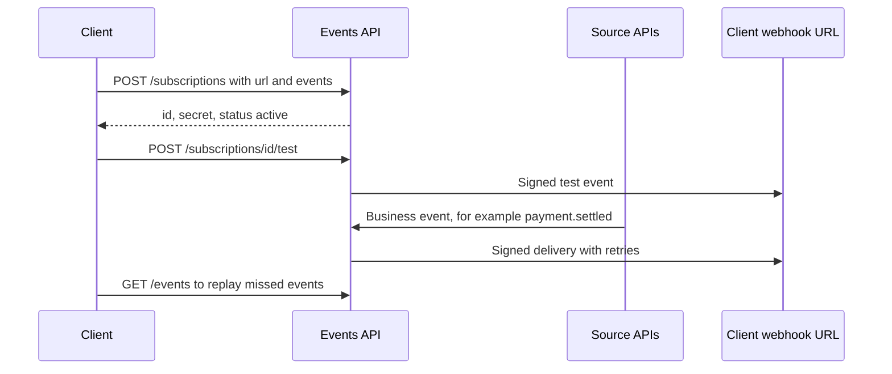
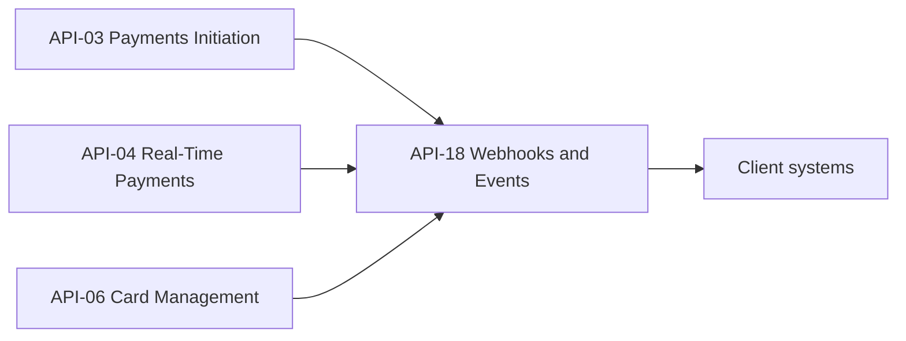

# API-18 Webhooks & Event Notifications API

API-18 is the push-notification channel of the Meridian Harbor Developer Platform. A client registers an HTTPS URL and a list of event types. The platform then delivers signed event notifications to that URL, for example payment status changes, card controls updated and statement available. The API description also states that delivery includes retries and replay. It is in the Platform business domain and is owned by Developer Platform Engineering (see the [team page](../teams/developer-platform-engineering.md) and the [Developer Platform overview](./developer-platform-overview.md)).

The API is mostly a **fan-out layer**. It does not originate business data. The events come from the payment and card APIs, and clients receive them instead of polling those APIs.

## Summary

| Attribute | Value |
| --- | --- |
| API ID | API-18 |
| Version | v1.3 |
| Base path | `/events/v1` |
| Business domain | Platform |
| Owning team | Developer Platform Engineering |
| Intended consumers | All external API consumers |
| Data classification | Confidential |
| OAuth scopes | `events:subscribe`, `events:read` |
| Rate limits | 100 subscription changes/hour; delivery up to 10,000 events/second |
| Service-level objective | 99.95% delivery within 60 s |

The two limits cover different things. The 100/hour limit applies to client-initiated subscription changes. The 10,000 events/second figure is a delivery throughput ceiling. The source does not say whether that ceiling is per client or platform-wide.

## Endpoints

Paths are relative to `/events/v1`.

| Method | Path | Description |
| --- | --- | --- |
| POST | `/subscriptions` | Create a webhook subscription for event types. |
| GET | `/events` | List recent events for replay. |
| POST | `/subscriptions/{id}/test` | Send a test event. |

The scope names suggest that `events:subscribe` governs the two subscription-oriented `POST` calls and `events:read` governs `GET /events`. The source lists the two scopes without a per-endpoint mapping, so confirm the mapping before relying on it. The platform-wide rules are that scopes are least-privilege and that all APIs use OAuth 2.0.

## Subscription lifecycle

Caption: Subscription creation, test, delivery and replay as described for API-18. The retry schedule and the signing scheme are not specified in the source.

1. **Create.** The client sends `POST /events/v1/subscriptions` with the destination `url` and an `events` array. The documented example subscribes to `payment.settled` and `payment.returned`.
2. **Receive credentials.** The 200 response returns the subscription `id` (for example `SUB-221`), a `secret` (shown masked as `whsec_****`) and `status` (`active`). The `whsec_` prefix and the word "signed" in the API summary indicate that the secret is the shared key for verifying webhook signatures. The source does not name the signature algorithm or header. The source also does not say whether the secret can be retrieved again after creation, so treat the creation response as the place to store it.
3. **Test.** `POST /subscriptions/{id}/test` sends a test event to the subscription so the client can check its endpoint and signature verification before real events arrive.
4. **Delivery.** When an upstream API emits a matching event, the platform delivers it by HTTPS to the registered URL. The stated service level is 99.95% delivery within 60 seconds. Failed deliveries are retried.
5. **Replay.** `GET /events` lists recent events. A client that was offline or lost events can use it to reconcile. Replay was added in v1.3 (2026-02).

The create call carries an `Idempotency-Key` header (a UUID) in the example. The platform rule is that POST operations that create resources require this header, and keys are retained for 24 hours. A retried create with the same key therefore should not produce a second subscription. The platform's `409 conflict` applies when a key is reused with a different payload.

## Event sources and lineage

| Upstream sources | Downstream consumers |
| --- | --- |
| [Payments Initiation API (API-03)](./api-03-payments-initiation-api.md), [Real-Time Payments API (API-04)](./api-04-real-time-payments-api.md), [Card Management API (API-06)](./api-06-card-management-api.md) | Client systems |

Caption: Data lineage of API-18. Three upstream APIs feed events and clients receive them over webhooks.

The same relationship is recorded from the other direction. API-03, API-04 and API-06 each list API-18 among their downstream consumers. The event families named in the API summary map onto these sources:

- Payment status changes, such as `payment.settled` and `payment.returned`, come from the payment APIs (API-03 and API-04).
- Card controls updated comes from Card Management (API-06).
- Statement available is named in the summary. API-17 is not listed as an upstream in the lineage table, so the origin of that event is unclear.

## Working with the API

**Receiver design.** The source documents the delivery model but not the payload schema, so consumers should design around these points:

- Verify the signature using the subscription `secret` before trusting any payload.
- Respond quickly with a 2xx status. The retry policy is not documented, so assume an event can be delivered more than once and make handlers idempotent.
- Do not assume ordering across events. The source gives no ordering guarantee.
- Use `GET /events` to reconcile after downtime instead of relying on retries alone.

**Platform conventions that apply.**

- Authentication is OAuth 2.0 with short-lived (15 minute) JWT access tokens. Server-to-server clients use client credentials with mutual TLS.
- Errors use the platform error envelope (`error.code`, `message`, `requestId`), for example `403 insufficient_scope` and `429 rate_limited` with `Retry-After`. Exceeding 100 subscription changes per hour is a rate-limit case.
- List endpoints such as `GET /events` follow the platform pagination convention (`limit` and `cursor` parameters, with `nextCursor` in the response). The source for this API does not list filter parameters.
- Timestamps are ISO 8601 UTC.
- Subscription receivers must be HTTPS endpoints. The example URL is `https://client.example/hooks`.

**Data handling.** The API is classified Confidential. Event payloads may carry payment or card information, so receivers should protect stored events and the signing secret accordingly.

## Change history

- v1.3 (2026-02): replay endpoint (`GET /events`) added.

## Gaps in the source

The source for this API is a short reference entry. It does not specify:

- the signature algorithm or header name,
- the retry count, backoff or the point at which a subscription is disabled,
- the event catalog beyond the two types in the example and the three categories in the summary,
- the `GET /events` retention window and filters,
- endpoints for listing, updating or deleting subscriptions (only create and test are documented),
- the meaning of subscription statuses other than `active`.

Check with Developer Platform Engineering before building on any of these.
