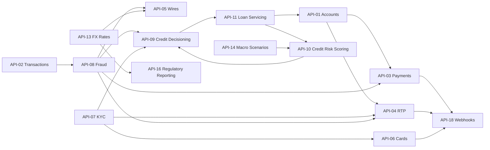

# Developer Platform API Reference Overview

The Meridian Harbor Developer Platform exposes the Firm's banking, payments, risk and finance capabilities as **18 versioned REST APIs** (API-01 to API-18). The reference document is version 3.6 (July 2026) and is owned by Developer Platform Engineering (see [Developer Platform Engineering](../teams/developer-platform-engineering.md)). Meridian Harbor is a fictional institution and the source is a synthetic proof-of-concept document.

The same APIs serve three audiences:

1. **Internal applications**: the mobile app, online banking and servicing tools.
2. **External clients and partners**: corporate treasurers, fintechs and data aggregators.
3. **Internal risk and finance processes**: including Tier 1 risk models and regulatory reporting.

This page is the entry point. It covers conventions that apply to every API and indexes the per-API pages. Behaviour that is specific to one API (endpoints, example payloads, changelog) is on that API's page.

## Environments

| Environment | Base URL | Purpose |
| --- | --- | --- |
| Sandbox | `https://sandbox.api.meridianharbor.example` | Synthetic data, self-service onboarding, no SLA |
| Certification | `https://cert.api.meridianharbor.example` | Pre-production testing with masked data |
| Production | `https://api.meridianharbor.example` | Live traffic, SLAs apply |
| Internal (risk and finance) | `https://internal.api.mhfc.example` | Restricted APIs API-10, API-14, API-15 and API-16, reachable only on the private network |

Only four APIs are explicitly assigned to the internal host. [API-08](./api-08-fraud-risk-signals-api.md) is also described as "internal callers only", but through its rate-limit and consumer attributes rather than the environment table. [API-11](./api-11-loan-servicing-api.md) and [API-12](./api-12-market-data-api.md) are critical data services that Tier 1 models consume, yet they are not on the internal host.

## Authentication and authorization

- All APIs use **OAuth 2.0**.
- **Server-to-server** clients use the client-credentials grant with mutual TLS, which gives certificate-bound access tokens.
- **Customer-facing** integrations use the authorization-code grant with PKCE and customer consent.
- Access tokens are **JWTs valid for 15 minutes**.
- Scopes are defined per API and least-privilege scopes are enforced. A token without the required scope gets `403 insufficient_scope`.

Tokens are requested from `POST /oauth2/token` with `application/x-www-form-urlencoded` content, for example `grant_type=client_credentials&scope=accounts:read%20accounts.balances:read`.

## Versioning and deprecation

- The **major version is in the path**, for example `/accounts/v3`. Each API page lists its base path.
- Minor versions are additive and backward compatible.
- A major version is supported for **at least 12 months after its successor reaches general availability**.
- Deprecation is announced through the `Sunset` header and the developer portal.

## Rate limiting, idempotency and pagination

- Rate limits are applied **per client and per API**. Responses carry `X-RateLimit-Limit` and `X-RateLimit-Remaining`. A `429` also carries `Retry-After`.
- Every **POST that moves money or creates resources requires an `Idempotency-Key` header** (a UUID). Keys are retained for 24 hours. Reusing a key with a different payload returns `409 conflict`.
- List endpoints use **cursor pagination** with `limit` and `cursor` query parameters, and responses return `nextCursor`.
- Timestamps are ISO 8601 UTC. Monetary amounts are decimals in the stated currency. Risk and finance APIs state units in the payload, typically USD millions.

### Error format

Errors share one envelope: `{"error": {"code", "message", "requestId"}}`.

| HTTP | Code | Meaning |
| --- | --- | --- |
| 400 | `invalid_request` | Malformed body, missing field or invalid parameter |
| 401 | `unauthorized` | Missing, expired or invalid access token |
| 403 | `insufficient_scope` | Token lacks the required scope |
| 404 | `not_found` | Resource does not exist or is not visible to the caller |
| 409 | `conflict` | Idempotency key reused with a different payload, or a state conflict |
| 429 | `rate_limited` | Limit exceeded, retry after `Retry-After` seconds |
| 500 | `internal_error` | Unexpected error, safe to retry idempotent requests with backoff |
| 503 | `service_unavailable` | Planned maintenance or dependency outage, see the status page |

## Critical data services and BCBS 239

APIs that feed Tier 1 models or regulatory disclosures are classified as **critical data services** under the Firm's BCBS 239 program (see [BCBS 239](../concepts/bcbs-239.md)). They carry:

- named data owners,
- documented data-quality rules,
- enhanced change management,
- registration in the model inventory.

Registration means any **breaking change automatically triggers a model change review by Model Risk Governance & Review (MRGR)**. See [Model Risk (SR 11-7)](../concepts/model-risk-sr-11-7.md).

The six APIs named as critical data services in the support appendix are [API-10](./api-10-credit-risk-scoring-api.md), [API-11](./api-11-loan-servicing-api.md), [API-12](./api-12-market-data-api.md), [API-14](./api-14-macroeconomic-scenario-api.md), [API-15](./api-15-treasury-liquidity-positions-api.md) and [API-16](./api-16-regulatory-reporting-api.md). Their escalation path is the Data and Technology Risk Committee, staffed 24x7 during quarter close. Other support channels:

- Developer onboarding goes through the developer-portal onboarding queue on business days, 8:00-18:00 ET.
- P1/P2 production incidents go to the API operations hotline and the 24x7 status page.
- Security vulnerabilities go to the responsible disclosure program.

## API index

Each row links to the per-API page. Scopes, endpoints and lineage are documented there.

| ID | API | Version | Base path | Domain | Owning team | Intended consumers |
| --- | --- | --- | --- | --- | --- | --- |
| API-01 | [Accounts API](./api-01-accounts-api.md) | v3.4 | `/accounts/v3` | Retail & Commercial Banking | Digital Platforms Engineering | Internal apps, corporate clients, licensed data aggregators |
| API-02 | [Transactions API](./api-02-transactions-api.md) | v3.1 | `/transactions/v3` | Retail & Commercial Banking | Digital Platforms Engineering | Internal apps, corporate clients, data aggregators, Fraud Strategy |
| API-03 | [Payments Initiation API](./api-03-payments-initiation-api.md) | v3.2 | `/payments/v3` | Payments | Global Payments Technology | Corporate clients, ERP connectors, internal treasury applications |
| API-04 | [Real-Time Payments API](./api-04-real-time-payments-api.md) | v2.3 | `/rtp/v2` | Payments | Global Payments Technology | Corporate and small-business clients, consumer app (P2P) |
| API-05 | [Wire Transfer API](./api-05-wire-transfer-api.md) | v2.0 | `/wires/v2` | Payments | Global Payments Technology | CIB corporate and institutional clients |
| API-06 | [Card Management API](./api-06-card-management-api.md) | v2.6 | `/cards/v2` | Card Services | Card Technology | Mobile app, fintech and co-brand partners |
| API-07 | [Customer Identity & KYC API](./api-07-customer-identity-kyc-api.md) | v1.9 | `/kyc/v1` | Client Onboarding | Know-Your-Customer Platform | Onboarding applications, Payments, Card Services |
| API-08 | [Fraud Risk Signals API](./api-08-fraud-risk-signals-api.md) | v4.0 | `/fraud/v4` | Fraud & Financial Crimes | Fraud Strategy Engineering | Card authorization, Payments, RTP, Wires, Credit Decisioning (internal only) |
| API-09 | [Credit Decisioning API](./api-09-credit-decisioning-api.md) | v2.2 | `/credit-decisions/v2` | Credit Origination | Credit Platforms Engineering | Card, Auto and small-business origination channels, point-of-sale partners (sandbox) |
| API-10 | [Credit Risk Scoring API](./api-10-credit-risk-scoring-api.md) | v3.0 | `/credit-risk/v3` | Credit Risk | Risk Analytics Engineering | Internal only: CECL model, regulatory capital calculators, portfolio monitoring |
| API-11 | [Loan Servicing API](./api-11-loan-servicing-api.md) | v2.8 | `/loans/v2` | Lending Operations | Lending Platforms Engineering | Servicing applications, CECL and ALM models, customer channels |
| API-12 | [Market Data API](./api-12-market-data-api.md) | v5.1 | `/market-data/v5` | Markets & Treasury | Market Data Services | Trading, risk, valuation control, Treasury/CIO models |
| API-13 | [FX Rates API](./api-13-fx-rates-api.md) | v2.4 | `/fx/v2` | Markets & Treasury | Market Data Services | Wires, card cross-border pricing, risk aggregation, finance |
| API-14 | [Macroeconomic Scenario API](./api-14-macroeconomic-scenario-api.md) | v1.6 | `/scenarios/v1` | Risk & Finance | Risk Analytics Engineering | Internal only: CECL, capital planning, stress testing, ALM |
| API-15 | [Treasury Liquidity Positions API](./api-15-treasury-liquidity-positions-api.md) | v2.1 | `/treasury/v2` | Treasury | Treasury Technology | Internal only: Treasury/CIO, liquidity risk, ALM and capital models |
| API-16 | [Regulatory Reporting API](./api-16-regulatory-reporting-api.md) | v1.8 | `/regulatory/v1` | Finance & Regulatory | Finance Technology | Internal only: Regulatory Reporting, Capital Management, Disclosure Committee |
| API-17 | [Statements & Documents API](./api-17-statements-documents-api.md) | v1.4 | `/documents/v1` | Client Servicing | Digital Platforms Engineering | Mobile app, online banking, corporate clients |
| API-18 | [Webhooks & Event Notifications API](./api-18-webhooks-event-notifications-api.md) | v1.3 | `/events/v1` | Platform | Developer Platform Engineering | All external API consumers |

### Grouping by consumer model

- **Client-facing, external and internal channels**: API-01, 02, 03, 04, 05, 06, 07, 09, 17 and 18. These are the APIs that corporate clients, fintechs, aggregators and the mobile and online apps call. API-18 pushes signed webhook events back to client systems.
- **Internal decisioning services**: [API-08](./api-08-fraud-risk-signals-api.md) is called only by internal channels (card authorization, Payments, RTP, Wires, Credit Decisioning). [API-07](./api-07-customer-identity-kyc-api.md) is consumed by onboarding applications and by payments and cards for limits and gating.
- **Markets and servicing data**: API-11, 12 and 13 serve servicing applications, trading, risk and finance. API-11 and API-12 are also critical data services that feed Tier 1 models.
- **Internal risk and finance (restricted)**: API-10, 14, 15 and 16 are internal-only, are served from `internal.api.mhfc.example` and are critical data services.

### Owner concentration

| Owning team | APIs |
| --- | --- |
| Digital Platforms Engineering | API-01, API-02, API-17 |
| Global Payments Technology | API-03, API-04, API-05 |
| Market Data Services | API-12, API-13 |
| Risk Analytics Engineering | API-10, API-14 |
| Card Technology | API-06 |
| Know-Your-Customer Platform | API-07 |
| Fraud Strategy Engineering | API-08 |
| Credit Platforms Engineering | API-09 |
| Lending Platforms Engineering | API-11 |
| Treasury Technology | API-15 |
| Finance Technology | API-16 |
| Developer Platform Engineering | API-18 |

Developer Platform Engineering owns the reference document and API-18 itself, but not the other 17 APIs.

## Rate limits and service-level objectives

The limits and SLOs vary by API, and they reflect each API's purpose. Fraud scoring is sized for the highest throughput and tightest latency. Regulatory and scenario APIs are low-volume and have freshness objectives instead of latency ones.

| API | Rate limit | Service-level objective |
| --- | --- | --- |
| API-01 Accounts | 1,200 req/min per client, burst 200/s | 99.95% monthly availability, p95 180 ms |
| API-02 Transactions | 1,000 req/min per client | 99.95%, p95 250 ms |
| API-03 Payments Initiation | 300 req/min per client, bulk files up to 50,000 items | 99.98%, p95 400 ms |
| API-04 Real-Time Payments | 600 req/min per client, max $1,000,000 per payment | 99.99%, p95 end-to-end 4 s |
| API-05 Wire Transfer | 120 req/min per client | 99.99% during operating hours |
| API-06 Card Management | 800 req/min per client | 99.97%, p95 220 ms |
| API-07 Customer Identity & KYC | 200 req/min per client | 99.9%, p95 1.2 s for verification |
| API-08 Fraud Risk Signals | 50,000 req/s aggregate, internal callers only | 99.99%, p99 60 ms |
| API-09 Credit Decisioning | 400 req/min per channel | 99.95%, p95 900 ms |
| API-10 Credit Risk Scoring | 60 req/min, batch extracts via async jobs | 99.95%, quarterly refresh within T+3 business days |
| API-11 Loan Servicing | 900 req/min, portfolio snapshots via async extract | 99.95% |
| API-12 Market Data | 5,000 req/min, WebSocket streaming | 99.99%, EOD snapshot by 19:00 ET |
| API-13 FX Rates | 3,000 req/min | 99.99%, quote validity 60 s |
| API-14 Macroeconomic Scenario | 30 req/min | 99.9%, new set published within 1 business day of approval |
| API-15 Treasury Liquidity Positions | 120 req/min | 99.95%, EOD positions by 21:00 ET |
| API-16 Regulatory Reporting | 20 req/min | 99.9%, quarter-end data locked by day 25 |
| API-17 Statements & Documents | 300 req/min | 99.9% |
| API-18 Webhooks & Events | 100 subscription changes/hour, delivery up to 10,000 events/s | 99.95% delivery within 60 s |

The Sandbox environment carries no SLA. Availability targets apply to production.

## Inter-API dependencies

The APIs depend on each other, so a change in one can ripple through the others. These edges come from each API's data-lineage table:

- Payment-type APIs (API-03, API-04, API-05) call the Fraud Risk Signals API before release. API-03 and API-04 also check funds or balances through the Accounts API, API-04 uses KYC limits, and API-05 prices cross-currency wires from the FX Rates API.
- The Fraud Risk Signals API uses a Transactions API feature store as input.
- Credit Decisioning combines Fraud Risk Signals, Credit Risk Scoring and KYC data, and its bookings flow to Loan Servicing.
- Credit Risk Scoring takes inputs from Loan Servicing and the Macroeconomic Scenario API.
- The Regulatory Reporting API uses the FX Rates API for currency conversion.
- The Webhooks API fans out events from API-03, API-04 and API-06 to client systems.

Caption: selected API-to-API data feeds, drawn from the lineage tables. An arrow means the source API supplies data to the target API.

## Feeding Tier 1 models

Appendix A of the reference registers which APIs are upstream data feeds of the three Tier 1 models. Only six APIs are registered feeds, and they are exactly the six critical data services identified above (API-10, 11, 12, 14, 15 and 16).

| Model | Registered upstream APIs |
| --- | --- |
| [MDL-ALM-014 NII Sensitivity Model](../models/nii-sensitivity-model.md) | [API-11](./api-11-loan-servicing-api.md), [API-12](./api-12-market-data-api.md), [API-15](./api-15-treasury-liquidity-positions-api.md) |
| [MDL-CR-007 CECL Allowance Model](../models/cecl-allowance-model.md) | [API-10](./api-10-credit-risk-scoring-api.md), [API-11](./api-11-loan-servicing-api.md), [API-14](./api-14-macroeconomic-scenario-api.md) |
| [MDL-CAP-003 Capital Planning Model](../models/capital-planning-model.md) | [API-14](./api-14-macroeconomic-scenario-api.md), [API-15](./api-15-treasury-liquidity-positions-api.md), [API-16](./api-16-regulatory-reporting-api.md) |

API-11, API-14 and API-15 each feed two models, so a breaking change to them reviews more than one model. API-01 to API-09, API-13, API-17 and API-18 are not registered as feeds of these three models. API-13 does feed [API-16](./api-16-regulatory-reporting-api.md), which does feed a model, so FX conversion still reaches Tier 1 indirectly.

API-16 is described as the golden source for Pillar 3, and API-10 and API-12 also feed disclosed figures such as Pillar 3 and fair value. The full chain from API to model to disclosed report is traced in [API to model to report lineage](../workflows/api-to-model-to-report-lineage.md).

## Working with the platform

- **Onboarding**: develop against Sandbox with synthetic data, test in Certification with masked data, then go to Production. Internal risk and finance APIs are available only on the private network.
- **Handling failures**: retry `500` responses with backoff only for idempotent requests, always send an `Idempotency-Key` on money-moving or creating POSTs, and honor `Retry-After` on `429`.
- **Planning changes**: for any of the critical data services, expect an MRGR model change review on a breaking change, and expect major-version changes to run alongside the old version for at least 12 months.
- **Data classification** varies by API, from Internal - Licensed Data (API-12, API-13) through Confidential - Client Data (API-01, 02, 11, 17) to Restricted classes such as PCI (API-06), PII (API-07), Credit (API-09), Risk Model Data (API-10) and Financial Transaction (API-03, 04, 05).

## Relationships

- owned by: [Developer Platform Engineering](../teams/developer-platform-engineering.md)
- traced end to end in: [API to model to report lineage](../workflows/api-to-model-to-report-lineage.md)
- governed by: [BCBS 239](../concepts/bcbs-239.md), [Model Risk (SR 11-7)](../concepts/model-risk-sr-11-7.md)
- feeds: [MDL-ALM-014](../models/nii-sensitivity-model.md), [MDL-CR-007](../models/cecl-allowance-model.md), [MDL-CAP-003](../models/capital-planning-model.md)
-planning-model.md)
