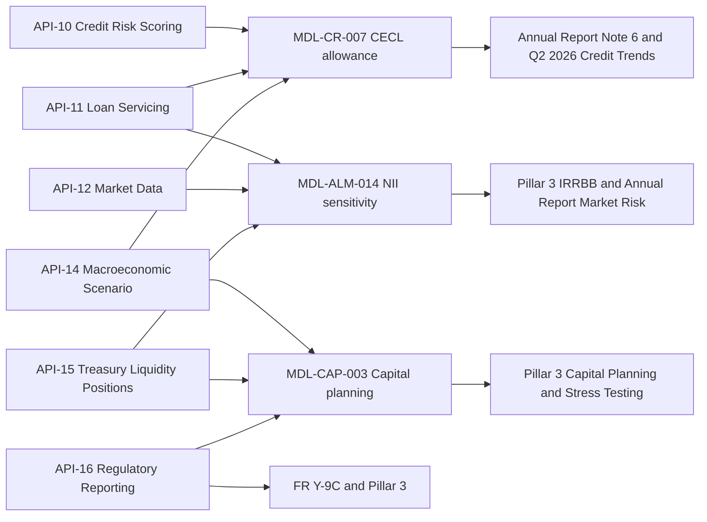
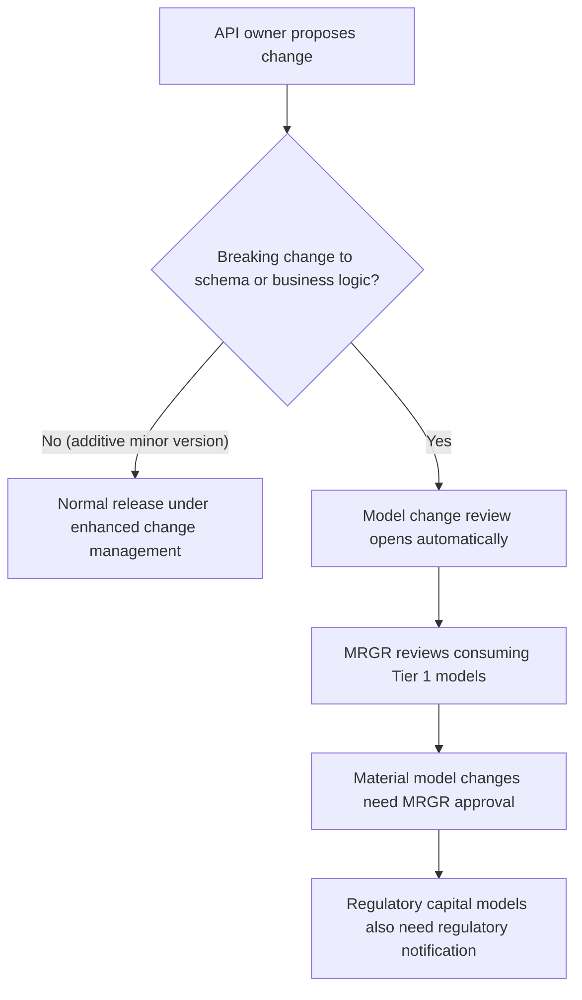

# BCBS 239

BCBS 239 is the set of principles for effective risk data aggregation and risk reporting. Meridian Harbor Financial Corp. (MHFC, a fictional bank) states that it complies with these principles. The corpus does not enumerate the individual principles. What it documents is how MHFC *implements* the program: risk and regulatory data are delivered through governed APIs on the Developer Platform, and the APIs that feed Tier 1 models or regulatory disclosures are classified as **critical data services**.

In practice the concept ties together three things: the [Developer Platform](../apis/developer-platform-overview.md) (where data is served), the Tier 1 models and disclosures (where data is consumed), and the model inventory and change process (where the link between the two is enforced). It is closely related to [Basel III Pillar 3](basel-iii-pillar-3.md), whose Section 15 holds the lineage table, and to [Model risk (SR 11-7)](model-risk-sr-11-7.md).

## What "critical data service" means

The API Reference (Section 1, Platform Overview) defines the classification: APIs that feed Tier 1 models or regulatory disclosures are critical data services under the BCBS 239 program. They carry:

- **Named data owners.** Each API has an owning team in the catalog (see below).
- **Documented data-quality rules.** The Pillar 3 report also adds a documented schema and service-level objectives to the per-API controls.
- **Enhanced change management.**
- **Registration in the model inventory.** The Pillar 3 report says each upstream API is registered as a critical data source in the model inventory.

The enforcement mechanism is the last item. Because each API is registered against the models that consume it, **a breaking change to an API's schema or business logic automatically opens a model change review** by Model Risk Governance & Review (MRGR). A producer team therefore cannot change field semantics, units or identifiers without triggering model-risk governance on the consuming Tier 1 models.

Evidence: repo://sources/api_docs/mhfc-developer-platform-api-reference.md#L16-L18, repo://sources/reports/mhfc-2025-pillar3-disclosures.md#L472-L474, repo://sources/reports/mhfc-2025-pillar3-disclosures.md#L521-L523

## Which APIs are in scope

The sources are not perfectly uniform about the membership, so the page distinguishes the labels they use.

| Label in the sources | APIs | Source |
|---|---|---|
| "Critical data services" (Annual Report, p. 20) | Credit Risk Scoring (API-10), Loan Servicing (API-11), Market Data (API-12), Macroeconomic Scenario (API-14), Treasury Liquidity Positions (API-15), Regulatory Reporting (API-16) | Annual Report, Technology and the Developer Platform |
| Same six, with 24x7 escalation during quarter close through the Data and Technology Risk Committee | API-10, API-11, API-12, API-14, API-15, API-16 | API Reference, Appendix C |
| "Critical data elements" under the BCBS 239 program | API-12 Market Data and API-13 FX Rates | Annual Report, p. 18 (valuation of trading positions) |
| Listed in the Pillar 3 lineage table but not in the Annual Report's critical list | API-13, API-09 Credit Decisioning (indirect), API-08 Fraud Risk Signals | Pillar 3, Section 15 |

So API-13 is explicitly a critical data element, and the Pillar 3 lineage table also includes API-08 and API-09, but the Annual Report's list of critical data *services* and the escalation contact list name the six APIs that feed Tier 1 models directly. Treat the six as the core set. Treat API-13, API-09 and API-08 as inside the lineage perimeter with lighter or indirect roles.

Evidence: repo://sources/reports/mhfc-2025-annual-report.md#L397, repo://sources/reports/mhfc-2025-annual-report.md#L457, repo://sources/api_docs/mhfc-developer-platform-api-reference.md#L1423, repo://sources/reports/mhfc-2025-pillar3-disclosures.md#L525-L535

## Data lineage: API to model to disclosure

Pillar 3 Section 15 ("Risk Data Aggregation and API Data Lineage", p. 21) maps each feeding API to the data it provides, the models or calculations that consume it, and the Pillar 3 sections it supports.

| API | Data provided | Consumers | Pillar 3 sections |
|---|---|---|---|
| API-10 Credit Risk Scoring | Pool-level PD/LGD (point-in-time and TTC) | MDL-CR-007, Advanced credit RWA | 4, 6 |
| API-11 Loan Servicing | Balances, delinquency, remaining life, repricing | MDL-CR-007, MDL-ALM-014 | 6, 11 |
| API-12 Market Data | Prices, curves, volatilities | MDL-ALM-014, VaR, collateral valuation | 6, 9, 11 |
| API-13 FX Rates | Spot and forward FX rates | VaR, non-USD exposure conversion | 6, 9 |
| API-14 Macroeconomic Scenario | Scenario paths and weights | MDL-CR-007, MDL-CAP-003 | 6, 13 |
| API-15 Treasury Liquidity Positions | HQLA, cash flows, balance sheet positions | MDL-ALM-014, MDL-CAP-003, LCR/NSFR | 11, 12 |
| API-16 Regulatory Reporting | Regulatory capital, RWA, leverage exposure | MDL-CAP-003, FR Y-9C, Pillar 3 | 3, 4, 5, 13 |
| API-09 Credit Decisioning | Origination decisions and scorecard outputs | Credit monitoring (indirect to MDL-CR-007) | 6 |
| API-08 Fraud Risk Signals | Real-time fraud scores | Operational risk loss data | 10 |

The three Tier 1 models and their upstream critical APIs, as registered in the model inventory (Pillar 3 Section 14) and the API Reference Appendix A/B:

Caption: Upstream critical data services feeding the three Tier 1 models and their downstream disclosures. API-13 and the lineage-only APIs (API-08, API-09) are not registered as Tier 1 model feeds in Appendix A.

Notes on the lineage:

- The API Reference's Appendix A matrix marks "Upstream feed" only for the pairs shown in the diagram. API-13 has no Tier 1 model feed there. It reaches reported figures through VaR and exposure conversion. See [Credit Risk Scoring API](../apis/api-10-credit-risk-scoring-api.md), [Loan Servicing API](../apis/api-11-loan-servicing-api.md), [Market Data API](../apis/api-12-market-data-api.md), [FX Rates API](../apis/api-13-fx-rates-api.md) and [Macroeconomic Scenario API](../apis/api-14-macroeconomic-scenario-api.md).
- API-09 reaches MDL-CR-007 only indirectly, through credit monitoring, and is not a Matrix feed.
- API-16 is described as the golden source for Pillar 3, and its data lineage lists the general ledger, RWA calculation engines and API-13 upstream. Its downstream consumers are MDL-CAP-003 (starting CET1 and RWA), the FR Y-9C and FFIEC 101 filings, Pillar 3 and the NII model's Tier 1 capital input. See [Regulatory Reporting API](../apis/api-16-regulatory-reporting-api.md).

Evidence: repo://sources/reports/mhfc-2025-pillar3-disclosures.md#L472-L500, repo://sources/reports/mhfc-2025-pillar3-disclosures.md#L525-L535, repo://sources/api_docs/mhfc-developer-platform-api-reference.md#L1357-L1415, repo://sources/api_docs/apis/api-16-regulatory-reporting-api.md#L4-L54

## Controls and governance

- **Oversight.** The Data and Technology Risk Committee oversees critical data elements, API change management and BCBS 239 compliance. It is one of the Firm's governance committees listed in Pillar 3 Section 2.
- **Monthly exception reporting.** Data-quality exceptions on critical data elements are reported monthly to that committee. For 2025 the Firm reported no exceptions with a material impact on reported capital ratios.
- **Escalation.** Critical data services (API-10, API-11, API-12, API-14, API-15, API-16) have a 24x7 escalation path via the Data and Technology Risk Committee during quarter close.
- **Independent validation of inputs.** The Pillar 3 report says the Valuation Control Group independently validates the inputs for API-12 and API-13.
- **Reconciliation to the ledger.** In 2025 the Firm introduced automated reconciliation between API-16 outputs and the general ledger at the legal-entity level. API-16 v1.8 (2026-03) added a GL reconciliation status flag. Its responses carry a `status` such as `locked`, and its SLO states that quarter-end data is locked by day 25.
- **Platform migration.** In 2025 the Regulatory Reporting API and the Macroeconomic Scenario API were migrated to the strategic data platform. API-16's changelog records this as v1.7 (2025-09).
- **Restricted access.** API-10, API-14, API-15 and API-16 are restricted APIs on the internal risk-and-finance base URL, reachable on the private network only. API-16 is classified Restricted - Internal, uses the `regulatory:read` scope and is limited to 20 requests per minute.

Evidence: repo://sources/reports/mhfc-2025-pillar3-disclosures.md#L91, repo://sources/reports/mhfc-2025-pillar3-disclosures.md#L537, repo://sources/api_docs/mhfc-developer-platform-api-reference.md#L27, repo://sources/api_docs/mhfc-developer-platform-api-reference.md#L1423, repo://sources/api_docs/apis/api-16-regulatory-reporting-api.md#L4-L59

## Change lifecycle

Caption: How a critical data service change interacts with model risk governance, per the model inventory rules.

The platform's versioning rules supply the first branch: major versions appear in the path (for example `/credit-risk/v3`), minor versions are additive and backward compatible, and a major version is supported for at least 12 months after its successor reaches general availability. Pillar 3 Section 14 supplies the second: material model changes need MRGR approval and, for regulatory capital models, regulatory notification. Tier 1 models also undergo annual independent validation and quarterly monitoring. Each API page for a critical data service repeats the practical rule: any change to the semantics of fields that feed a model, such as balances, remaining life, repricing buckets, curve identifiers or units, should be treated as potentially breaking.

Evidence: repo://sources/api_docs/mhfc-developer-platform-api-reference.md#L39-L41, repo://sources/reports/mhfc-2025-pillar3-disclosures.md#L472-L474, repo://sources/api_docs/apis/api-10-credit-risk-scoring-api.md

## Practical guidance

- To find the data behind a disclosed number, start at Pillar 3 Section 15 or the API Reference Appendix A, then follow to the API's own "Data lineage" table.
- Before changing a critical data service, identify its consuming Tier 1 models in the lineage above. Expect a model change review for any breaking change, and expect the change to be visible to the Data and Technology Risk Committee.
- If adding a new feed to a Tier 1 model, the sources imply it must be registered as a critical data source in the model inventory and carry a named owner, data-quality rules, SLOs and enhanced change management. The sources do not describe a step-by-step onboarding procedure.

## Relationships

- governs: [Developer Platform Overview](../apis/developer-platform-overview.md) (critical data service classification)
- governs: [API-16 Regulatory Reporting API](../apis/api-16-regulatory-reporting-api.md)
- governs: [API-10 Credit Risk Scoring API](../apis/api-10-credit-risk-scoring-api.md), [API-11 Loan Servicing API](../apis/api-11-loan-servicing-api.md), [API-12 Market Data API](../apis/api-12-market-data-api.md), [API-13 FX Rates API](../apis/api-13-fx-rates-api.md), [API-14 Macroeconomic Scenario API](../apis/api-14-macroeconomic-scenario-api.md)
- governs (lineage perimeter): [API-09 Credit Decisioning API](../apis/api-09-credit-decisioning-api.md), [API-08 Fraud Risk Signals API](../apis/api-08-fraud-risk-signals-api.md)
- feeds, via the governed APIs: [CECL Allowance Model](../models/cecl-allowance-model.md), [NII Sensitivity Model](../models/nii-sensitivity-model.md), [Capital Planning Model](../models/capital-planning-model.md)
- disclosed in: [Pillar 3 Disclosures 2025](../reports/pillar3-disclosures-2025.md) (Section 15), [Basel III Pillar 3](basel-iii-pillar-3.md)
- related: [Model risk (SR 11-7)](model-risk-sr-11-7.md)
