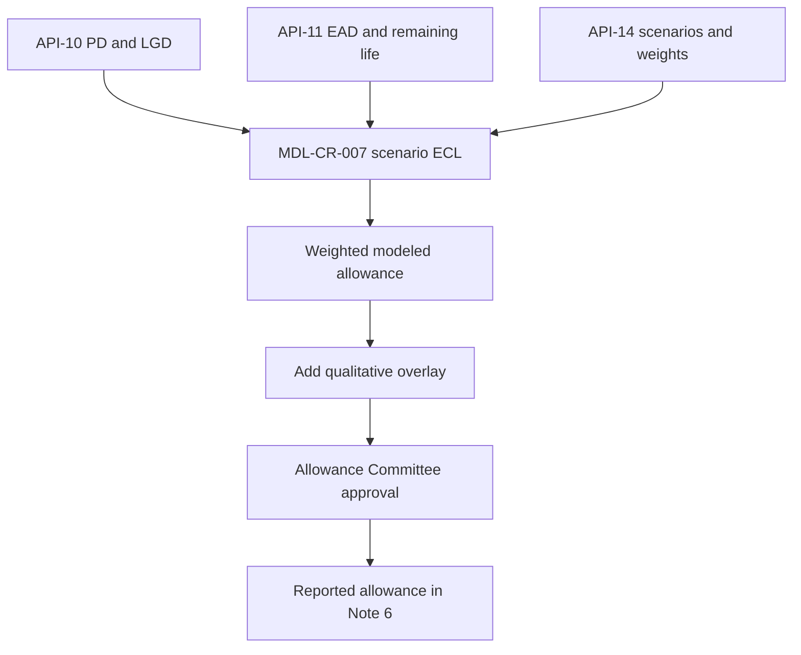

# CECL

CECL (Current Expected Credit Losses, ASC 326) is the accounting standard under which Meridian Harbor Financial Corp. (MHFC, a fictional bank) reserves for credit losses. The 2025 Annual Report glossary defines it as a standard "requiring lifetime expected loss estimates at origination". The allowance for credit losses is "management's estimate of expected credit losses over the remaining expected life" of the Firm's loans, "in accordance with ASC 326".

This page explains the concept and how MHFC applies it. The numbers are in [Allowance for Credit Losses](../metrics/allowance-for-credit-losses.md). The calculation is in the [CECL Allowance Model (MDL-CR-007)](../models/cecl-allowance-model.md). The quarterly sequence is in [CECL Allowance Calculation Flow](../workflows/cecl-allowance-calculation-flow.md).

Evidence: repo://sources/reports/mhfc-2025-annual-report.md#L363-L367, repo://sources/reports/mhfc-2025-annual-report.md#L648-L651

## What CECL governs at MHFC

CECL is the rule set. The model is the tool that applies it.

- **Allowance balance.** The allowance for loan losses was $15,920 million at Dec 31, 2025, which is 2.14% of $742,300 million of loans. It was $16,380 million (2.15% of period-end loans) at Jun 30, 2026.
- **Provision for credit losses.** The provision equals net charge-offs plus the net change in the allowance. In 2025 it was $6,840 million: $6,100 million of net charge-offs plus a $740 million net reserve build. The build was "primarily in Card". It was driven by Card loan growth and a modest increase in the weight on the downside scenario, partly offset by better multifamily CRE valuations. In Q2 2026 the provision was $1,920 million: $1,650 million of net charge-offs plus a $270 million build, also primarily in Card.
- **Disclosure.** Annual Report Note 6 and the Q2 2026 Earnings Supplement "Credit Trends" section carry the model's outputs.
- **Regulatory capital.** The allowance is not only an accounting item. Under the Standardized approach, $6,380 million of the allowance qualifies as Tier 2 capital, within the 1.25% of credit RWA limit, according to Pillar 3 Section 6.4.

Evidence: repo://sources/reports/mhfc-2025-annual-report.md#L144-L146, repo://sources/reports/mhfc-2025-annual-report.md#L594-L608, repo://sources/reports/mhfc-q2-2026-earnings-supplement.md#L47, repo://sources/reports/mhfc-q2-2026-earnings-supplement.md#L263-L270, repo://sources/reports/mhfc-2025-pillar3-disclosures.md#L297

## How the standard is applied

### Measurement basis and horizon

- **Pool vs individual.** Note 2 says the allowance is measured on a *collective (pool)* basis where loans share risk characteristics. It is measured on an *individual* basis for collateral-dependent and restructured wholesale loans.
- **Forecast horizon.** The "reasonable and supportable" forecast period is two years. After that, loss rates revert to historical averages over 12 months.
- **Expected life.** Remaining life per pool comes from the servicing platform. Losses are recognised when loans are booked. The Q2 2026 supplement says the expected lifetime losses on new Card balances "are reserved through the CECL model as the loans are booked".

Evidence: repo://sources/reports/mhfc-2025-annual-report.md#L574-L576, repo://sources/reports/mhfc-q2-2026-earnings-supplement.md#L169

### Loss formula and scenario weighting

For each portfolio segment, MDL-CR-007 estimates lifetime loss as exposure at default (EAD) × lifetime probability of default (PD) × loss given default (LGD). It does this once under each of three macroeconomic scenarios from the [Macroeconomic Scenario API (API-14)](../apis/api-14-macroeconomic-scenario-api.md). The scenario results are then weighted by probabilities approved by the Firm's Scenario Committee. The model workbook documents these steps:

1. Scenario PD = base annual PD × (1 + elasticity × (scenario peak unemployment − baseline unemployment) × 100), floored at 0.
2. Lifetime PD = 1 − (1 − scenario PD) ^ remaining life in years.
3. Scenario LGD = base LGD × (1 − LGD sensitivity × collateral price change), capped at 100%. Mortgage uses house prices and CRE uses commercial property prices.
4. Scenario ECL = EAD × lifetime PD × scenario LGD. The modeled allowance is the sum of scenario weight × scenario ECL.
5. Total allowance = modeled allowance + qualitative overlay.

| Scenario (Dec 31, 2025) | Weight | Peak unemployment | Real GDP 2026 | House prices | CRE prices |
|---|---|---|---|---|---|
| Upside | 20% | 3.8% | 2.6% | 4.5% | 3.0% |
| Baseline | 50% | 4.4% | 1.7% | 2.2% | (1.0%) |
| Downside | 30% | 6.8% | (1.2%) | (8.5%) | (14.0%) |

The weights were unchanged at Jun 30, 2026 (20/50/30). The baseline then assumed US unemployment peaking at 4.5% in Q1 2027, up from 4.4% at year end. See [Macro Scenarios MSC-2025Q4](../scenarios/macro-scenarios-msc-2025q4.md) and the component pages [Scenario Weighting](../models/components/cecl-scenario-weighting.md), [Lifetime PD](../models/components/cecl-lifetime-pd.md) and [LGD and EAD](../models/components/cecl-lgd-and-ead.md).

Evidence: repo://sources/reports/mhfc-2025-annual-report.md#L365-L373, repo://sources/models/cecl-allowance-model.md#L146-L152, repo://sources/reports/mhfc-q2-2026-earnings-supplement.md#L270

Caption: Data and approval path from the three upstream APIs through the model to the reported allowance.

### Qualitative overlay

After modeling, management applies qualitative adjustments "for risks not fully captured by the models". At Dec 31, 2025 the overlay was $681 million (4.47% of the modeled $15,239 million). It was positive in most segments and negative in Auto at $(34) million.

| Segment | Modeled | Overlay | Total | Coverage |
|---|---|---|---|---|
| Credit Card | 8,383 | 257 | 8,640 | 6.24% |
| Residential Mortgage | 765 | 55 | 820 | 0.38% |
| Auto | 724 | (34) | 690 | 1.06% |
| Commercial Real Estate | 2,244 | 226 | 2,470 | 2.52% |
| Commercial & Industrial | 2,609 | 151 | 2,760 | 1.60% |
| Other Consumer & Wholesale | 514 | 26 | 540 | 1.09% |
| **Total** | **15,239** | **681** | **15,920** | **2.14%** |

The model enforces a control that each segment's overlay must be within ±15% of its modeled allowance. The `Allowance_Summary` sheet returns "OK" or "REVIEW". The workbook's own note says overlays must be documented. See [Qualitative Overlay](../models/components/cecl-qualitative-overlay.md).

Evidence: repo://sources/reports/mhfc-2025-annual-report.md#L367, repo://sources/reports/mhfc-2025-annual-report.md#L377-L385, repo://sources/models/cecl-allowance-model.md#L22, repo://sources/models/cecl-allowance-model.md#L105, repo://sources/models/cecl-allowance-model.md#L166-L171

### Sensitivity to scenario weights

Scenario weighting is the largest judgmental lever in the model. At year end 2025:

- A 100% downside weight would give about $20.2 billion, or $4.2 billion higher than reported.
- A 100% baseline weight would reduce the allowance by about $1.4 billion.

Both figures hold the overlay constant and are not management's loss expectation. They reconcile to the model's scenario totals: downside $19,478 million plus the $681 million overlay is about $20,159 million, and baseline $13,817 million plus the overlay is about $14,498 million.

Evidence: repo://sources/reports/mhfc-2025-annual-report.md#L389, repo://sources/models/cecl-allowance-model.md#L94-L96

## Governance and controls

| Control | Detail |
|---|---|
| Model owner | Consumer & Wholesale Credit Risk - Allowance Methodology |
| Risk tier | Tier 1 (High), requiring annual independent validation and approval by the Firmwide Model Risk Committee |
| Independent validator | Model Risk Governance & Review (MRGR). Last validated 2025-11-04, next due 2026-11-30 |
| Scenario probabilities | Approved by the Scenario Committee |
| Quarterly approval | The Allowance Committee approves scenario weights, CECL model outputs and qualitative overlays each quarter |
| Upstream change control | The upstream APIs are registered as critical data sources. A breaking change to an API's schema or business logic automatically opens a model change review |

- **Findings.** MRGR's 2025 validation raised one medium-severity finding: no explicit model for unfunded commitments. It was remediated through an interim overlay. It also raised one low-severity finding on documentation of the Card PD elasticity.
- **Policy basis.** Models are subject to the Model Risk Policy, which is aligned with SR 11-7. See [Model Risk (SR 11-7)](model-risk-sr-11-7.md).

Evidence: repo://sources/reports/mhfc-2025-annual-report.md#L437-L449, repo://sources/reports/mhfc-2025-pillar3-disclosures.md#L87, repo://sources/reports/mhfc-2025-pillar3-disclosures.md#L472-L474, repo://sources/reports/mhfc-2025-pillar3-disclosures.md#L489-L517

## Data lineage

Three APIs feed the model, and the model feeds the disclosures.

- **[API-10 Credit Risk Scoring API](../apis/api-10-credit-risk-scoring-api.md).** Supplies pool-level PD and LGD. The CECL basis is *point-in-time* and scenario-conditional, from `GET /pools/{poolId}/parameters?basis=pit`. Regulatory capital uses a separate *through-the-cycle* parameter set. The two must not be conflated.
- **[API-11 Loan Servicing API](../apis/api-11-loan-servicing-api.md).** Supplies loan balances (EAD) and remaining life. A remaining-life field for CECL was added in API v2.6 (2025-06).
- **[API-14 Macroeconomic Scenario API](../apis/api-14-macroeconomic-scenario-api.md).** Supplies scenario paths and weights. Its migration to the strategic data platform cut the scenario load for the CECL and capital planning models from six hours to under forty minutes (Q2 2026 supplement).
- **Indirect.** The Credit Decisioning API (API-09) is classed as indirect to MDL-CR-007. Its origination decisions affect balances, which reach the model through servicing data. Pillar 3 Section 15 lists it that way.
- **Criticality.** Credit Risk Scoring, Loan Servicing and Macroeconomic Scenario are critical data services with enhanced change management. See [BCBS 239](bcbs-239.md).

Evidence: repo://sources/reports/mhfc-2025-pillar3-disclosures.md#L283, repo://sources/reports/mhfc-2025-pillar3-disclosures.md#L521-L537, repo://sources/api_docs/apis/api-10-credit-risk-scoring-api.md#L24, repo://sources/api_docs/apis/api-11-loan-servicing-api.md#L67, repo://sources/reports/mhfc-q2-2026-earnings-supplement.md#L426, repo://sources/reports/mhfc-2025-annual-report.md#L457

## Lifecycle and quarterly rhythm

1. Parameters and scenarios are refreshed. For example, Card PD and LGD pool estimates were refreshed in June 2026 and are reflected in the quarter-end allowance.
2. The model produces upside, baseline and downside ECL per segment, then the weighted result.
3. The Allowance Committee approves weights, outputs and overlays.
4. The provision is booked and the allowance is rolled forward: beginning balance, minus net charge-offs, plus provision, equals ending balance.
5. The result is disclosed. Note 6 gives the annual roll-forward by segment, and the supplement gives the quarterly roll-forward.

Roll-forwards:

- **2025.** $15,180 million opening, $(6,100) million net charge-offs, $6,840 million provision, $15,920 million ending.
- **1Q26.** $15,920 million, $(1,590) million, $1,780 million, $16,110 million.
- **2Q26.** $16,110 million, $(1,650) million, $1,920 million, $16,380 million.

Evidence: repo://sources/reports/mhfc-2025-annual-report.md#L594-L608, repo://sources/reports/mhfc-q2-2026-earnings-supplement.md#L263-L270, repo://sources/reports/mhfc-q2-2026-earnings-supplement.md#L351

## Invariants, limitations and failure modes

- **Weights sum to 100%.** The model has a check cell on the `Scenarios` sheet.
- **Reconciliation.** The `Allowance_Summary` sheet reconciles the model total to the reported allowance. The 2025 difference is 0 for every segment.
- **Simplified pool approach.** The workbook is described as a simplified pool-level demonstration, and the production model is said to use loan-level cash flows.
- **Unfunded commitments.** The workbook excludes off-balance-sheet commitments, hence the MRGR finding and the interim overlay.
- **Judgment risk.** The allowance moves with scenario weights and overlays. Forward-looking statements list the effectiveness of allowance models among the material risks.
- **Upstream risk.** A breaking change to an upstream API feed (PD/LGD, remaining life, scenarios) triggers a model change review.

Evidence: repo://sources/models/cecl-allowance-model.md#L100-L105, repo://sources/models/cecl-allowance-model.md#L166-L171, repo://sources/reports/mhfc-2025-pillar3-disclosures.md#L517, repo://sources/reports/mhfc-2025-annual-report.md#L673

## Relationships

- governs: [Allowance for Credit Losses](../metrics/allowance-for-credit-losses.md)
- applied by: [CECL Allowance Model (MDL-CR-007)](../models/cecl-allowance-model.md)
- executed through: [CECL Allowance Calculation Flow](../workflows/cecl-allowance-calculation-flow.md)
- consumes data from: [API-10](../apis/api-10-credit-risk-scoring-api.md), [API-11](../apis/api-11-loan-servicing-api.md), [API-14](../apis/api-14-macroeconomic-scenario-api.md)
- uses scenarios: [Macro Scenarios MSC-2025Q4](../scenarios/macro-scenarios-msc-2025q4.md)
- overseen under: [Model Risk (SR 11-7)](model-risk-sr-11-7.md), [BCBS 239](bcbs-239.md)
- disclosed in: [Annual Report 2025](../reports/annual-report-2025.md), [Q2 2026 Earnings Supplement](../reports/q2-2026-earnings-supplement.md), [Pillar 3 Disclosures 2025](../reports/pillar3-disclosures-2025.md)
- see also: [Basel III Pillar 3](basel-iii-pillar-3.md)
