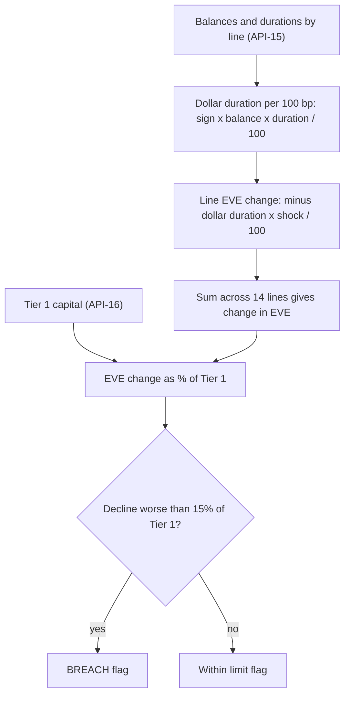

# Economic Value of Equity (EVE)

Economic value of equity (EVE) is the present value of assets less the present value of liabilities. The MHFC glossary gives this definition and says EVE is "used to measure IRRBB" (see [IRRBB](irrbb.md)). It is the value-based counterpart to the earnings-based net interest income (NII) measure. EVE shows how a change in interest rates changes the economic worth of the existing balance sheet. NII shows how it changes reported earnings over the next 12 months.

Meridian Harbor Financial Corp. (MHFC) is a fictional institution, and its source documents are labelled synthetic proof-of-concept material. All figures below are as of 2025-12-31.

## Where EVE is computed

EVE is not produced by a standalone model. It is one sheet (`EVE`) inside the Net Interest Income Sensitivity Model, **MDL-ALM-014**. The workbook's stated purpose is to project 12-month NII under parallel rate shocks and EVE sensitivity "for IRRBB reporting".

- **Tier and ownership.** MDL-ALM-014 is a Tier 1 (High) model. Corporate Treasury (Asset & Liability Management) owns it, and Model Risk Governance & Review (MRGR) validates it independently. The last validation was 2025-09-18 and the next is due 2026-09-30.
- **Inputs.** Balances, yields and durations come from the Treasury Liquidity Positions API (API-15), which added a "duration field for EVE" in v2.1 (2026-01). Loan repricing profiles come from the Loan Servicing API (API-11). The yield curve and policy rate come from the Market Data API (API-12). Tier 1 capital ($110,620 mm at YE2025) comes from the Regulatory Reporting API (API-16).
- **Consumers.** The `Summary` sheet feeds the Annual Report (Market Risk Management) and Pillar 3 (Interest Rate Risk in the Banking Book, see [Basel III Pillar 3](basel-iii-pillar-3.md)). It also produces limit-utilisation flags for ALCO reporting. ALCO reviews the model outputs monthly.

## How the model approximates EVE

The model does not discount cash flows under shifted curves. It uses a first-order modified-duration approximation. The component mechanics are covered in [EVE modified duration](../models/components/eve-modified-duration.md). The key steps are:

1. For each of 14 rate-sensitive balance-sheet lines, compute a signed dollar duration per 100 bp. The formula is `sign × balance × modified duration / 100`. The sign is +1 for assets and -1 for liabilities, and the balance stands in for present value.
2. For each scenario, line-level EVE change is `-dollar duration × shock(bp) / 100`.
3. Change in EVE is the sum across lines. The model's documented form is: ΔEVE ≈ -(Σ asset value × duration − Σ liability value × duration) × shock.
4. EVE change is divided by Tier 1 capital to give "EVE % of Tier 1".

*Calculation chain on the `EVE` and `Summary` sheets of MDL-ALM-014.*

### Duration assumptions that drive the result

The duration inputs differ from the repricing assumptions used for NII. The longest modified durations are:

| Line | Side | Balance ($mm) | Modified duration (yrs) |
|---|---|---|---|
| Residential mortgage loans | Asset | 218,600 | 5.8 |
| Investment securities (AFS + HTM) | Asset | 170,900 | 4.6 |
| Long-term debt | Liability | 86,700 | 4.9 |
| Noninterest-bearing deposits | Liability | 272,000 | 3.5 |
| Consumer interest-bearing deposits | Liability | 402,000 | 2.8 |

Pillar 3 states that noninterest-bearing deposits carry a *behavioral* duration of 3.5 years and consumer interest-bearing deposits 2.8 years. These long deposit durations are an assumption, not contractual maturity, so EVE is sensitive to deposit behaviour assumptions. Short-dated lines such as deposits with banks (0.1), repo and short-term borrowings (0.1), C&I loans (0.6) and wholesale deposits (0.6) contribute little.

In the base data, total asset dollar duration is about $28,504 mm per 100 bp and total liability dollar duration is about $27,136 mm per 100 bp. The net gap of about $1,369 mm per 100 bp is the whole sensitivity. Assets have slightly more duration than liabilities, so EVE rises when rates fall and falls when rates rise.

## Reported sensitivities (YE2025)

| Scenario | Shock (bp) | Change in EVE ($mm) | EVE % of Tier 1 | Limit status |
|---|---|---|---|---|
| Down 200 | -200 | +2,737.40 | +2.47% | Within limit |
| Down 100 | -100 | +1,368.70 | +1.24% | Within limit |
| Base | 0 | 0 | 0% | Within limit |
| Up 100 | +100 | -1,368.70 | -1.24% | Within limit |
| Up 200 | +200 | -2,737.40 | -2.47% | Within limit |

The Annual Report and Pillar 3 show the same results rounded: ±$1,369 mm and ±1.2% for 100 bp, ±$2,737 mm and ±2.5% for 200 bp. The Annual Report explains the rising-rate decline as the duration of fixed-rate mortgages and investment securities exceeding that of the Firm's modeled deposit liabilities. The same period's NII sensitivity points the other way, because the Firm is asset-sensitive on earnings: +100 bp adds about $1,508 mm of 12-month NII. Under the model, rising rates therefore help earnings and hurt EVE.

Because the approximation is linear in the shock, the up and down results are exactly symmetric and the 200 bp result is exactly double the 100 bp result. The model captures no convexity.

## Limit and risk appetite

- **Board limit.** The decline in EVE must be no greater than **15.0% of Tier 1 capital**. The Board Risk Committee approved it in 2025-03. The workbook holds it as an assumption, `Assumptions!B12`.
- **Check logic.** The `Summary` sheet flags `BREACH` when "EVE % of Tier 1" is below the negative of the limit. Only declines can breach, and the check is applied to every scenario row. The limit is stored as a fraction and Tier 1 capital is a single constant for all scenarios.
- **Risk appetite disclosure.** Pillar 3 lists "EVE decline under +200 bp shock (% Tier 1)" against the 15.0% threshold. The reported value is 2.5%, with status "Within". That is roughly one-sixth of the limit.
- **Related NII limit.** The separate NII limit is a decline of no more than 7.0% of base NII in any parallel shock. The worst case reported is -6.0% under -200 bp. NII is not covered by this page.

## Limitations and compensating controls

- Only instantaneous parallel shocks of ±100 and ±200 bp are run. Non-parallel (twist) moves and basis risk are not captured.
- The balance sheet is static, with no growth or mix change. Management actions are not reflected.
- Modified duration is a linear approximation. Pillar 3 notes that the model does not capture optionality in mortgage prepayments beyond the static profile, or deposit-beta convexity at very low rates.
- Deposit durations are behavioural assumptions, and betas are held constant across shock sizes.
- **Compensating control.** A dynamic balance-sheet simulation runs quarterly in the ALM engine. ALCO reviews supplemental scenario analysis.

## Operating notes

- The model is a spreadsheet. Blue cells are inputs, black are formulas and green are cross-sheet links. Durations on `Balance_Sheet` (column K) are the lever for EVE results, and each line's repricing-share row has a `Share check` that must read `OK`. That check applies to NII, but the EVE sheet reads the same `Balance_Sheet` rows.
- Changes to durations, deposit behaviour assumptions or the shock grid alter disclosed figures. Because MDL-ALM-014 is Tier 1, material changes need MRGR approval under the model risk policy (aligned with SR 11-7).
- The Q2 2026 earnings supplement only says that Treasury/CIO keeps interest rate risk within Board-approved limits as measured by MDL-ALM-014. It reports no EVE figures.
