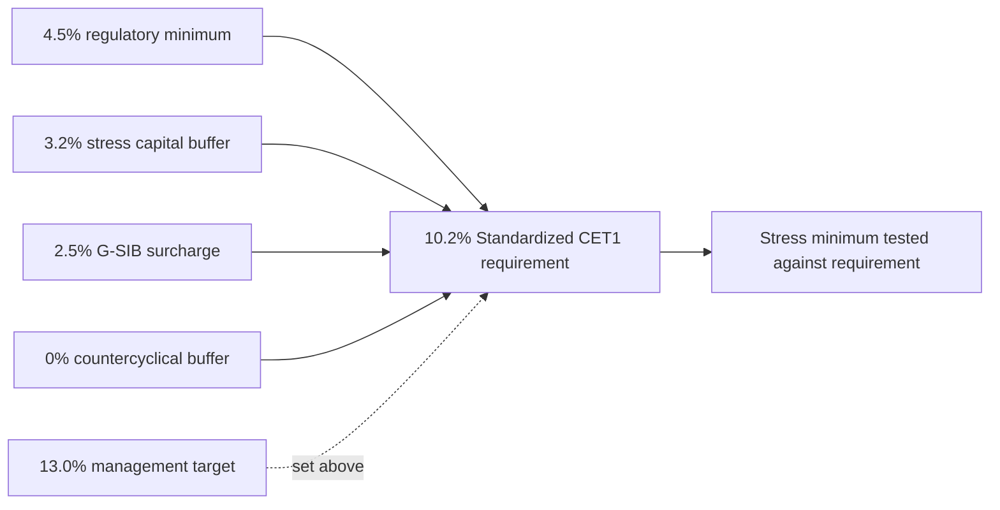

# G-SIB Surcharge

The **G-SIB surcharge** is defined in the Annual Report glossary as an "additional CET1 buffer applied to global systemically important banks" (Annual Report 2025, glossary, p. 27). MHFC is a G-SIB, and the surcharge is disclosed as **2.5%** in every report and model that mentions it. The sources give no derivation of that figure beyond the label "Method 2" in the capital planning model's assumptions. They do not describe how the surcharge is calculated or reassessed, so this page does not either.

## How it feeds the CET1 requirement

The surcharge is one additive layer in the Standardized CET1 requirement:

| Component | Value | Notes |
|---|---|---|
| Regulatory minimum | 4.5% | |
| Stress capital buffer (SCB) | 3.2% | Effective October 1, 2025 |
| G-SIB surcharge | 2.5% | |
| Countercyclical buffer | 0.0% | U.S. buffer currently zero |
| **Total CET1 requirement** | **10.2%** | |
| Management target | 13.0% | Not part of the requirement |

- The Annual Report states this composition in "Capital requirements" (p. 13).
- The Q2 2026 earnings supplement repeats it as the "CET1 requirement stack" for 2Q26 in "Capital and Capital Planning" (p. 12).
- The capital planning model computes it as `=B18+B19+B20` on its Assumptions sheet (minimum + SCB + G-SIB surcharge = 0.1020).

The surcharge is a fixed input, not a modelled output. The [Capital Planning Model](../models/capital-planning-model.md) takes the 2.5% as an assumption and adds it to the SCB and the 4.5% minimum. That sum is the hurdle against which the severely adverse minimum CET1 (12.90%) is tested, and the summary sheet reports "Stress minimum above requirement? YES".

The surcharge does not enter the SCB calculation. The indicative SCB is the peak-to-trough CET1 decline plus four quarters of planned dividends over starting RWA, floored at 2.5% (Annual Report, "Capital planning and stress testing", p. 13). The two buffers are therefore independent layers that sum in the requirement. See [Stress Capital Buffer](stress-capital-buffer.md).

## Capital conservation buffer (Pillar 3)

Pillar 3 disclosures (section 4.2, "Capital ratios and buffers", p. 9) define the buffer requirement in terms of the surcharge:

- **Standardized approach:** the capital conservation buffer requirement equals the SCB (3.2%) plus the G-SIB surcharge (2.5%) plus the countercyclical buffer (currently 0%). This is the 5.7% "required" figure.
- **Advanced approaches:** the buffer is 2.5% plus the G-SIB surcharge and the countercyclical buffer.
- **Result at December 31, 2025:** the Standardized buffer was 10.58%, well above the 5.7% required. The Firm was not subject to limitations on distributions or discretionary bonus payments, and eligible retained income was $23.9 billion.

The same table lists the regulatory requirements as 10.2% for CET1, 11.7% for Tier 1 and 13.7% for Total capital. The reported Standardized ratios are 15.08%, 16.95% and 19.75%.

## Role in capital planning and risk appetite

- **Management target.** The 13.0% CET1 target sits above the 10.2% requirement. The Annual Report describes it as a buffer for macroeconomic uncertainty and pending regulatory changes, including proposed revisions to the U.S. capital framework.
- **Risk appetite.** The Pillar 3 risk appetite table (p. 5) sets a baseline Standardized CET1 floor of at least 13.0% and an internal severely adverse minimum stressed CET1 of at least 10.2%, which matches the requirement including the surcharge. Dec 31, 2025 values were 15.08% and 12.6%, both "Within".
- **Latest position.** The Q2 2026 supplement reports CET1 of 15.14% ($101.2 billion CET1 capital over $668.4 billion Standardized RWA). The capital plan projects a severely adverse minimum of 12.90%.
- **Segment capital allocation.** Capital is allocated to segments on their standalone risk profile, including Standardized requirements, the SCB and the G-SIB surcharge (Annual Report, "Business Segment Results", p. 9).

## Leverage

Because it is a G-SIB, the Firm is also subject to a 3.0% minimum supplementary leverage ratio plus a 2.0% enhanced SLR buffer, for an effective requirement of 5.0% (Pillar 3, section 5, "Leverage", p. 10). The Pillar 3 risk appetite table sets an internal SLR limit of at least 5.5%, against a Dec 31, 2025 value of 6.1%.

## Invariants and limits of the sources

- The 2.5% surcharge is the same in the Annual Report, the Pillar 3 disclosures, the Q2 2026 supplement and the planning model, so the 10.2% requirement does not differ between them.
- The only moving layer of the stack that the reports discuss is the SCB. It is 3.2% for October 1, 2025 through September 30, 2026, and the model's indicative SCB is 3.18%. The indicative-SCB requirement is 10.18%, against 10.20% for the current SCB. The surcharge is held at 2.5% in both.
- The reports do not say when the surcharge changes. Treat any value other than 2.5% as unsupported by the current sources.

## Relationships

- [Stress Capital Buffer](stress-capital-buffer.md): the other additive buffer in the CET1 requirement; independent of the surcharge in its calculation.
- [CET1 Ratio](../metrics/cet1-ratio.md): the ratio measured against the 10.2% requirement and the 13.0% target.
- [Risk-Weighted Assets](../metrics/risk-weighted-assets.md): the denominator for the CET1 ratio and for the SCB dividend add-on.
- [Capital Planning Model](../models/capital-planning-model.md): holds the surcharge as a flat 2.5% assumption and tests stressed CET1 against the requirement.
- [Meridian Harbor Financial Corp.](../organizations/meridian-harbor-financial-corp.md): the G-SIB subject to the surcharge.
- [Annual Report 2025](../reports/annual-report-2025.md): states the requirement composition and the glossary definition.
- [Pillar 3 Disclosures 2025](../reports/pillar3-disclosures-2025.md): defines the buffer requirement and the SLR in terms of the surcharge.
