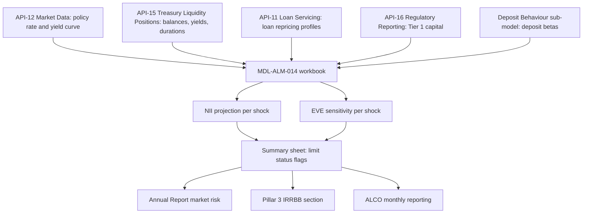

# IRRBB (Interest Rate Risk in the Banking Book)

IRRBB is the risk that changes in interest rates reduce earnings or economic value through the Firm's traditional banking activities: lending, deposit-taking and debt issuance. The Annual Report calls this "structural interest rate risk". It is distinct from trading-book market risk, which is measured separately with VaR on positions valued daily from the Market Data and FX Rates APIs. Meridian Harbor Financial Corp. (MHFC) is a fictional institution, and all source documents are labelled synthetic proof-of-concept material. Figures below are as of 2025-12-31 unless noted.

## How MHFC measures it

MHFC measures IRRBB with two complementary lenses, both produced by one Tier 1 model, **MDL-ALM-014** (the Net Interest Income Sensitivity Model):

| Lens | Question answered | Metric | Page |
|---|---|---|---|
| Earnings | How much does 12-month net interest income (NII) move? | Change in NII as % of base NII | [NII Sensitivity Model](../models/nii-sensitivity-model.md), [Net Interest Income](../metrics/net-interest-income.md) |
| Economic value | How much does the present value of assets less liabilities move? | Change in EVE as % of Tier 1 capital | [Economic Value of Equity](economic-value-of-equity.md) |

The Pillar 3 disclosure states that IRRBB is measured "using both earnings-based (NII) and value-based (EVE) metrics", with the NII model as the primary earnings measure. The workbook's stated purpose is to project 12-month NII under parallel rate shocks and EVE sensitivity "for IRRBB reporting". The Annual Report describes the NII side as "earnings-at-risk". The shock set is described in [Parallel Rate Shocks](../scenarios/parallel-rate-shocks.md).

## Ownership and governance

- **Risk management.** Treasury/CIO (in the Corporate segment) manages structural interest rate risk through the investment securities portfolio and interest rate derivatives, within limits approved by the Board Risk Committee. It is first line of defence under the Firm's three-lines model.
- **Model owner.** Corporate Treasury - Asset & Liability Management owns MDL-ALM-014 (see [Corporate Treasury - ALM](../teams/corporate-treasury-alm.md)). It is Tier 1 (High) and independently validated by Model Risk Governance & Review (MRGR; see [Model Risk (SR 11-7)](model-risk-sr-11-7.md)). The last validation was 2025-09-18 and the next is due 2026-09-30.
- **Validation finding.** Pillar 3 records one medium-severity finding from MRGR's 2025 validation: deposit betas are held constant across shock sizes. The compensating control is the quarterly dynamic simulation.
- **Oversight.** ALCO oversees liquidity, interest rate and capital risk and reviews the model's outputs monthly. The workbook produces limit-utilisation flags for ALCO reporting.
- **Model risk policy.** Tier 1 models require annual independent validation, quarterly performance monitoring and Firmwide Model Risk Committee approval. Upstream API feeds are registered in the model inventory, and a schema or business-logic change in an upstream API triggers a model change review.

## Mechanics

Data flow from governed feeds through the model to limit checks and disclosures. See also [Capital Projection and Rate Sensitivity Flows](../workflows/capital-and-rate-sensitivity-flow.md).

### Earnings view (NII)

The model applies instantaneous parallel shocks of -200, -100, 0, +100 and +200 bp to a static year-end balance sheet (no growth or mix change). The base NII is the sum of balance times yield on 14 rate-sensitive lines, assets less liabilities, which was $50,237 mm. For each line, a repricing factor is built from the repricing profile. Positions in the 0-3 month bucket reprice at month 1.5 and the 3-12 month bucket at month 7.5, so the factor is `share0-3 × (12-1.5)/12 + share3-12 × (12-7.5)/12`. Positions repricing after 12 months do not affect 12-month NII. Asset rates move one-for-one with the shock, while liability rates move by shock times a beta. The change in NII is the asset effect minus the liability effect. Mechanics are detailed in [NII Rate Shock Projection](../models/components/nii-rate-shock-projection.md).

Betas come from the Deposit Behaviour sub-model's annual calibration (MRGR approved): 0.45 for consumer interest-bearing deposits, 0.75 for wholesale interest-bearing deposits and 0.00 for noninterest-bearing deposits. In the workbook, repo/short-term borrowings and long-term debt carry a beta of 1.0. Betas are held constant across shock sizes. The Q2 2026 earnings supplement says the 0.45 and 0.75 betas were re-calibrated in the first quarter of 2026 and remained unchanged.

### Value view (EVE)

EVE is approximated with modified duration rather than full revaluation of cash flows. Change in EVE is approximately `-(Σ asset value × duration − Σ liability value × duration) × shock`, divided by Tier 1 capital. Noninterest-bearing deposits are assigned a behavioural duration of 3.5 years and consumer interest-bearing deposits 2.8 years, which makes them long-duration liabilities. See [Economic Value of Equity](economic-value-of-equity.md) and [EVE Modified Duration](../models/components/eve-modified-duration.md) for detail.

## Limits and status

The Board Risk Committee approved two limits in March 2025:

| Limit | Threshold | Test in the `Summary` sheet |
|---|---|---|
| NII | Decline no greater than 7.0% of base NII in any parallel shock | `BREACH` if change in NII % is below -7.0%, otherwise `Within limit` |
| EVE | Decline no greater than 15.0% of Tier 1 capital | `BREACH` if EVE % of Tier 1 is below -15.0%, otherwise `Within limit` |

Both tests are one-sided: they flag only declines. Increases are never flagged, whatever their size. Limit values and Tier 1 capital ($110,620 mm, from API-16) are inputs on the `Assumptions` sheet, so changing them flows into every status flag.

The Pillar 3 risk appetite table repeats the limits in specific scenario terms: "NII decline under -200 bp shock" at <= 7.0% (actual 6.0%, Within) and "EVE decline under +200 bp shock (% Tier 1)" at <= 15.0% (actual 2.5%, Within). The workbook itself tests every shock in the grid against both limits.

## FY2025 results

As of 2025-12-31, base-case 12-month NII is $50,237 mm (Pillar 3) and the shock results are:

| Shock | Change in NII ($mm) | % of base NII | Change in EVE ($mm) | EVE % of Tier 1 |
|---|---|---|---|---|
| -200 bp | (3,017) | (6.0%) | 2,737 | 2.5% |
| -100 bp | (1,508) | (3.0%) | 1,369 | 1.2% |
| +100 bp | 1,508 | 3.0% | (1,369) | (1.2%) |
| +200 bp | 3,017 | 6.0% | (2,737) | (2.5%) |

The workbook `Summary` sheet, the Annual Report market-risk table and the Pillar 3 Section 11 table carry the same results; the reports round the workbook's unrounded values (for example -3,016.89 and 2,737.40 in the workbook, -6.01% and +2.47% before rounding). The Annual Report also gives projected NII per scenario (47,220 / 48,728 / 50,237 / 51,745 / 53,254), and the Q2 2026 earnings supplement reproduces the YE2025 NII table.

All scenarios were within limit. The Firm is asset-sensitive: NII rises with rates and falls when rates fall, with the worst NII outcome (-6.0% at -200 bp) inside the 7.0% limit. EVE moves the opposite way, falling modestly when rates rise, because the duration of fixed-rate mortgages and investment securities exceeds that of the modelled deposit liabilities. The worst EVE outcome (-2.5% of Tier 1) is far from the 15.0% limit. The NII and EVE results are exactly symmetric by construction, since both calculations are linear in the shock.

Later and related figures:

- **June 30, 2026.** The Q2 2026 earnings supplement says sensitivity was "directionally similar" and the Firm "remains modestly asset-sensitive", with a +100 bp shock increasing 12-month NII by approximately $1.4 billion (versus $1,508 mm at YE2025). It gives no full table for that date. See [Q2 2026 Earnings Supplement](../reports/q2-2026-earnings-supplement.md).
- **Reported versus modelled NII.** The model's static-balance-sheet base NII ($50,237 mm) is not the reported 2025 net interest income ($48,620 mm); the sources do not reconcile the two. The Annual Report's 2026 NII outlook of about $50.2 billion is described as "consistent with the base-case output" of MDL-ALM-014.

## Limitations and compensating controls

Known limitations as documented:

- Parallel shocks only: no twists or other non-parallel curve movements.
- Static balance sheet: no growth, mix shift or management actions.
- Betas constant across shock sizes (the subject of the medium-severity validation finding above). The workbook notes no rate floors on deposit costs below zero, and the Pillar 3 disclosure notes it does not capture the convexity of deposit betas at very low rates.
- No basis risk, and no mortgage prepayment optionality beyond the static repricing profile.
- EVE uses a first-order duration approximation, so convexity is not captured.

The compensating control is a dynamic balance-sheet simulation run quarterly in the ALM engine, plus supplemental scenario analysis reviewed by ALCO. Readers should treat the headline table as a linear, static-balance-sheet screen and not as a forecast.

## Operations and change points

- **Inputs.** The registered upstream feeds are API-15, API-11 and API-12 in the workbook README, Annual Report model inventory and Pillar 3: balances and yields from a month-end snapshot of the Treasury Liquidity Positions API (API-15), loan repricing profiles from the Loan Servicing API (API-11), and the policy rate (`POLICY.FEDFUNDS.UB`, 3.75%) and curve from the Market Data API (API-12). Tier 1 capital for the EVE denominator and limit tests is a separate input from the Regulatory Reporting API (API-16) on the `Assumptions` sheet. The workbook also carries a per-line `Share check` that flags `CHECK` if a line's repricing shares do not sum to 100%.
- **Extension points.** Shock sizes are scenario levers on the `Assumptions` sheet. Adding non-parallel shapes or dynamic behaviour would go beyond the current model and is currently covered by the quarterly dynamic simulation.
- **Disclosure.** The `Summary` sheet is cited as the source for the Annual Report table and the Pillar 3 section (see [Basel III Pillar 3](basel-iii-pillar-3.md), [Annual Report 2025](../reports/annual-report-2025.md) and [Pillar 3 Disclosures 2025](../reports/pillar3-disclosures-2025.md)). The feeding APIs are governed data pipes for risk models, a theme of the Firm's data-governance programme (see [BCBS 239](bcbs-239.md)). Treasury/CIO's Q2 2026 earnings commentary also states that rate-risk positioning stays within Board-approved limits measured with MDL-ALM-014.

## Relationships

- **Governs / is governed by:**
  - Governed by the Board Risk Committee (limits: NII decline <= 7.0% of base NII; EVE decline <= 15.0% of Tier 1), ALCO (monthly review of outputs) and the Firmwide Model Risk Committee (Tier 1 approval).
  - Managed by Treasury/CIO; owned as a model by [Corporate Treasury - ALM](../teams/corporate-treasury-alm.md); independently validated by [MRGR](../teams/model-risk-governance-review.md).
- **Measured by:**
  - [NII Sensitivity Model](../models/nii-sensitivity-model.md) (MDL-ALM-014), through [NII Rate Shock Projection](../models/components/nii-rate-shock-projection.md) and [EVE Modified Duration](../models/components/eve-modified-duration.md).
  - [Net Interest Income](../metrics/net-interest-income.md) (earnings lens) and [Economic Value of Equity](economic-value-of-equity.md) (value lens).
- **Uses scenario:** [Parallel Rate Shocks](../scenarios/parallel-rate-shocks.md) (-200, -100, 0, +100, +200 bp). It does not use the macroeconomic stress paths of the capital planning model.
- **Reported in:** [Annual Report 2025](../reports/annual-report-2025.md) (Market Risk Management), [Pillar 3 Disclosures 2025](../reports/pillar3-disclosures-2025.md) (Section 11) and the [Q2 2026 Earnings Supplement](../reports/q2-2026-earnings-supplement.md).
