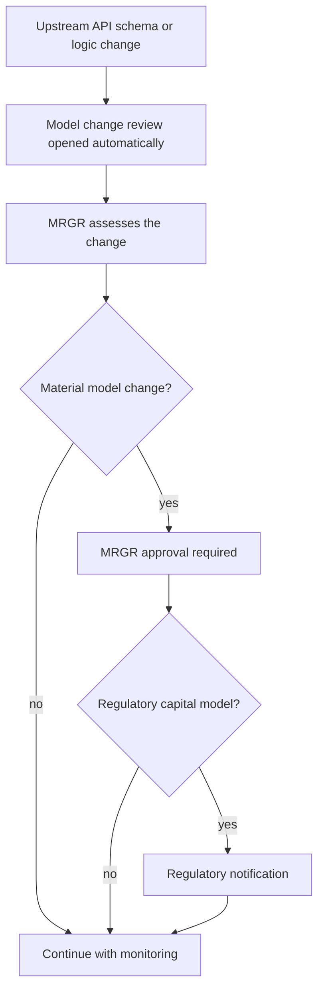

# Model Risk (SR 11-7)

## What it is

The 2025 Annual Report defines model risk as "the potential for adverse consequences from decisions based on incorrect or misused model outputs". The firm uses models to value exposures, measure risk, estimate credit losses, determine capital and make business decisions. Model risk is governed by a **Model Risk Policy that aligns with supervisory guidance SR 11-7**. The **Model Risk Governance & Review (MRGR)** function oversees it. MRGR is the independent model validation function and reports to the Chief Risk Officer ([Annual Report, Model Risk Management](../../sources/reports/mhfc-2025-annual-report.md)).

This page covers the shared governance framework. Each model's mechanics are on its own page:

- [Net Interest Income Sensitivity Model](../models/nii-sensitivity-model.md) (MDL-ALM-014)
- [CECL Allowance Model](../models/cecl-allowance-model.md) (MDL-CR-007)
- [Capital Planning Model](../models/capital-planning-model.md) (MDL-CAP-003)
- [Model Risk Governance & Review](../teams/model-risk-governance-review.md), the team that performs validation.

## Framework

| Element | Rule | Source |
|---|---|---|
| Inventory | About 2,900 models. Three Tier 1 models directly drive the amounts and metrics in the 2025 Annual Report. | Annual Report |
| Tiering | Each model gets a risk tier based on materiality and complexity. | Annual Report, Pillar 3 §14 |
| Tier 1 validation | Annual independent validation by MRGR. | Annual Report, Pillar 3 §14 |
| Tier 1 monitoring | Documented ongoing performance monitoring. Pillar 3 specifies quarterly monitoring and an annual attestation by model owners. | Annual Report, Pillar 3 §14 |
| Tier 1 approval | The Firmwide Model Risk Committee approves Tier 1 models before use. It also approves model risk appetite. | Annual Report, Pillar 3 |
| Material changes | These require MRGR approval. Regulatory capital models also require regulatory notification. | Pillar 3 §14 |
| Upstream data | Each model's upstream data feeds are registered in the model inventory. | Annual Report |

The three lines of defense apply. The business owners of the models (Treasury and the credit and allowance teams) sit in the first line. Independent Risk Management, including MRGR, is the second line. Internal Audit is the third line ([Pillar 3 disclosures](../../sources/reports/mhfc-2025-pillar3-disclosures.md)).

## The three Tier 1 models

Each model has a README sheet in its workbook that records the tier and validation details. All three are labelled **Tier 1 (High)**, name MRGR as independent validator, and list their upstream APIs and downstream disclosures.

| Model | ID | Owner | Last validated | Next due | Upstream APIs |
|---|---|---|---|---|---|
| Net Interest Income Sensitivity | MDL-ALM-014 | Corporate Treasury - Asset & Liability Management | 2025-09-18 | 2026-09-30 | API-12, API-15, API-11 |
| CECL Lifetime Expected Credit Loss | MDL-CR-007 | Consumer & Wholesale Credit Risk - Allowance Methodology | 2025-11-04 | 2026-11-30 | API-10, API-11, API-14 |
| Capital Planning & Stress Projection | MDL-CAP-003 | Corporate Treasury - Capital Management | 2026-02-27 | 2027-02-28 | API-16, API-14, API-15 |

Sources: the README sheets of [NII_Sensitivity_Model](../../sources/models/nii-sensitivity-model.md), [CECL_Allowance_Model](../../sources/models/cecl-allowance-model.md) and [Capital_Planning_Model](../../sources/models/capital-planning-model.md).

Each model feeds specific disclosures:

- **MDL-ALM-014** projects 12-month NII under parallel shocks and EVE sensitivity for IRRBB. It feeds Annual Report Market Risk Management and Pillar 3 IRRBB.
- **MDL-CR-007** estimates the ASC 326 allowance as probability-weighted PD x LGD x EAD. It feeds Annual Report Note 6 and the earnings supplement credit trends.
- **MDL-CAP-003** projects CET1, RWA and ratios over nine quarters under baseline and severely adverse scenarios. It feeds Annual Report Capital Risk Management and Pillar 3 capital planning and stress testing.

### Validation cadence

Each model's next due date falls about a year after its last validation, which is consistent with annual Tier 1 validation. The three validations are staggered across the year (September, November and February). MDL-ALM-014's next validation (2026-09-30) is the earliest due.

### 2025 validation findings

The Pillar 3 report (§14) records the outcomes of MRGR's most recent validations:

- **MDL-CR-007:** one medium-severity finding, that there is no explicit model for unfunded commitments. It was remediated through an interim overlay. One low-severity finding covers documentation of the Card PD elasticity.
- **MDL-ALM-014:** one medium-severity finding, that deposit betas are held constant across shock sizes. The compensating control is the quarterly dynamic balance-sheet simulation.
- **MDL-CAP-003:** validated in February 2026 with no findings above low severity.

## How model risk is controlled in practice

### Known limitations are documented in the model and compensated

Each README has a "Limits, controls and known limitations" section. Findings and limitations map to compensating controls:

- NII model: only parallel shocks, a static balance sheet, and constant deposit betas. The compensating control is the quarterly dynamic simulation in the ALM engine. Pillar 3 lists this simulation, together with supplemental scenario analysis reviewed by ALCO, as the way to address these gaps. The deposit betas (0.45 consumer, 0.75 wholesale) come from a Deposit Behaviour sub-model with annual, MRGR-approved calibration.
- CECL model: the workbook is a simplified pool-level version, and unfunded commitments are excluded. This is the same gap as the medium validation finding above.
- Capital model: no AOCI volatility modelling and no deferred-tax-asset threshold deductions. Stress losses are top-down inputs from the enterprise stress testing program.

### Hard-coded workbook checks

The workbooks embed controls that enforce policy limits:

- **CECL overlay cap:** qualitative overlays must be documented and fall within +/-15% of the modeled allowance per segment. A check cell returns `OK` or `REVIEW`, and it returns `OK` at year-end 2025. The overlays are approved by the Allowance Committee (December 2025).
- **CECL scenario weights:** weights must sum to 100%. A check cell returns `OK` or `WEIGHTS MUST SUM TO 100%`. The weights are 20% Upside, 50% Baseline and 30% Downside.
- **CECL reconciliation:** the total allowance is reconciled to the reported allowance. The difference is zero at $15,920 million.
- **NII Board limits:** NII may not decline more than 7.0% of base NII in any parallel shock, and EVE may not decline more than 15.0% of Tier 1 capital. Status cells return `BREACH` or `Within limit`. The largest NII decline in the grid (-200 bp) is -6.0%.
- **Capital checks:** a stress-minimum check returns `YES` or `NO - capital action required` against the regulatory CET1 requirement of 10.2%. The minimum stressed CET1 is 12.9%. The indicative stress capital buffer is floored at 2.5%.

These checks are model-internal controls. They do not replace MRGR validation.

### Upstream data governance and change review

Model inputs come from governed Developer Platform APIs. APIs that feed Tier 1 models or regulatory disclosures (Credit Risk Scoring, Loan Servicing, Market Data, Macroeconomic Scenario, Treasury Liquidity Positions and Regulatory Reporting) are classified as **critical data services** with enhanced change management and data-quality controls, under the BCBS 239 program. They are registered in the model inventory. A breaking change to an API's schema or business logic automatically opens a model change review by MRGR ([Developer Platform API reference](../../sources/api_docs/mhfc-developer-platform-api-reference.md), Pillar 3 §14).

The consumption map (Pillar 3 §15) shows the dependency footprint a change can reach:

| API | Consuming Tier 1 models |
|---|---|
| API-10 Credit Risk Scoring | MDL-CR-007 |
| API-11 Loan Servicing | MDL-CR-007, MDL-ALM-014 |
| API-12 Market Data | MDL-ALM-014 |
| API-14 Macroeconomic Scenario | MDL-CR-007, MDL-CAP-003 |
| API-15 Treasury Liquidity Positions | MDL-ALM-014, MDL-CAP-003 |
| API-16 Regulatory Reporting | MDL-CAP-003 |

API-11, API-14 and API-15 are each shared by two models, so a breaking change to any of them opens review of two models. API-09 Credit Decisioning is only an indirect input to MDL-CR-007.

Caption: change-review path for a Tier 1 model dependency, combining the API-trigger rule and the material-change rule. The routing from review to the materiality decision is a synthesis of the two stated rules, not a documented workflow.

## Ownership and governance bodies

- **Model owners (first line)** run and attest to their models. Treasury/CIO owns the NII and capital models. Consumer & Wholesale Credit Risk owns the CECL model.
- **MRGR** validates independently, approves material changes and approves the deposit beta calibration.
- **Firmwide Model Risk Committee** approves Tier 1 models and model risk appetite.
- **Business committees** approve outputs. ALCO reviews NII model output monthly, the Capital Governance Committee owns the capital model's outputs, and the Allowance Committee approves scenario weights, CECL outputs and overlays each quarter. These committees use the models but do not validate them.

## Operational notes

- When changing an upstream API or a model workbook, first check which Tier 1 models consume it. Do this before changing a schema or business logic, because the change will open a review.
- A Tier 1 model that is past its "next validation due" date would break the annual validation requirement. Track the due dates in the table above.
- Disclosed figures cite the model workbook as their source (for example, `NII_Sensitivity_Model.xlsx`, `Capital_Planning_Model.xlsx`). A model change can therefore move disclosed numbers. The Annual Report 2026 NII outlook of about $50.2 billion is stated to be consistent with the NII model's base case, which is $50,237 million.
- All documents in this corpus are labelled synthetic. Meridian Harbor is a fictional institution.

## Gaps in the sources

The sources do not describe MRGR's validation procedures in detail, such as test types or finding-closure workflow. They also do not specify severity definitions. The Pillar 3 report says Tier 1 models get quarterly monitoring, while the Annual Report only says "documented ongoing performance monitoring". Treat the Pillar 3 text as the more specific statement.
